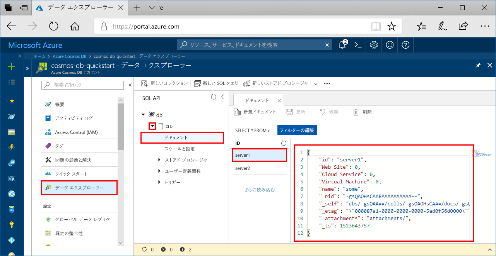

# <a name="azure-cosmos-db-build-a-sql-api-app-with-python-and-the-azure-portal"></a>Azure Cosmos DB: Python と Azure Portal による SQL API アプリの構築

> [!div class="op_single_selector"]
> * [.NET](create-sql-api-dotnet.md)
> * [Java](create-sql-api-java.md)
> * [Node.js](create-sql-api-nodejs.md)
> * [Python](create-sql-api-python.md)
> * [Xamarin](create-sql-api-xamarin-dotnet.md)
>  

Azure Cosmos DB は、Microsoft のグローバルに配布されるマルチモデル データベース サービスです。 Azure Cosmos DB の中核をなすグローバル配布と水平方向のスケール機能を活用して、ドキュメント、キー/値、およびグラフ データベースをすばやく作成および照会できます。 

このクイック スタートでは、Azure Portal を使用して、Azure Cosmos DB [SQL API](sql-api-introduction.md) アカウント、ドキュメント データベース、コレクションを作成する方法を説明します。 さらに、[SQL Python API](sql-api-sdk-python.md) に基づいたコンソール アプリを構築して実行します。

[!INCLUDE [quickstarts-free-trial-note](../../includes/quickstarts-free-trial-note.md)] [!INCLUDE [cosmos-db-emulator-docdb-api](../../includes/cosmos-db-emulator-docdb-api.md)]

## <a name="prerequisites"></a>前提条件

* [Python 3.6](https://www.python.org/downloads/) (\<インストールの場所\>\Python36 と \<インストールの場所>\Python36\Scripts を PATH に追加)。 
* [Visual Studio Code](https://code.visualstudio.com/)
* [Visual Studio Code 用の Python 拡張機能](https://marketplace.visualstudio.com/items?itemName=ms-python.python#overview)

## <a name="create-a-database-account"></a>データベース アカウントの作成

[!INCLUDE [cosmos-db-create-dbaccount](../../includes/cosmos-db-create-dbaccount.md)]

## <a name="add-a-collection"></a>コレクションの追加

[!INCLUDE [cosmos-db-create-collection](../../includes/cosmos-db-create-collection.md)]

## <a name="add-sample-data"></a>サンプル データの追加

[!INCLUDE [cosmos-db-create-sql-api-add-sample-data](../../includes/cosmos-db-create-sql-api-add-sample-data.md)]

## <a name="query-your-data"></a>データのクエリ

[!INCLUDE [cosmos-db-create-sql-api-query-data](../../includes/cosmos-db-create-sql-api-query-data.md)]

## <a name="clone-the-sample-application"></a>サンプル アプリケーションの複製

ここで、GitHub から SQL API アプリの複製を作成し、接続文字列を設定して実行します。 プログラムでデータを処理することが非常に簡単であることがわかります。 

1. コマンド プロンプトを開いて git-samples という名前の新しいフォルダーを作成し、コマンド プロンプトを閉じます。

    ```bash
    md "C:\git-samples"
    ```

2. git bash などの git ターミナル ウィンドウを開いて、`cd` コマンドを使用して、サンプル アプリをインストールする新しいフォルダーに変更します。

    ```bash
    cd "C:\git-samples"
    ```

3. 次のコマンドを実行して、サンプル レポジトリを複製します。 このコマンドは、コンピューター上にサンプル アプリのコピーを作成します。 

    ```bash
    git clone https://github.com/Azure-Samples/azure-cosmos-db-documentdb-python-getting-started.git
    ```  
    
## <a name="review-the-code"></a>コードの確認

この手順は省略可能です。 コード内のデータベース リソースの作成方法に関心がある場合は、次のスニペットを確認できます。 関心がない場合は、「[接続文字列の更新](#update-your-connection-string)」に進んでください。 

以下のスニペットは、いずれも DocumentDBGetStarted.py ファイルからの引用です。

* DocumentClient が初期化されます。

    ```python
    # Initialize the Python client
    client = document_client.DocumentClient(config['ENDPOINT'], {'masterKey': config['MASTERKEY']})
    ```

* 新しいデータベースが作成されます。

    ```python
    # Create a database
    db = client.CreateDatabase({ 'id': config['SQL_DATABASE'] })
    ```

* 新しいコレクションが作成されます。

    ```python
    # Create collection options
    options = {
        'offerEnableRUPerMinuteThroughput': True,
        'offerVersion': "V2",
        'offerThroughput': 400
    }

    # Create a collection
    collection = client.CreateCollection(db['_self'], { 'id': config['SQL_COLLECTION'] }, options)
    ```

* いくつかのドキュメントが作成されます。

    ```python
    # Create some documents
    document1 = client.CreateDocument(collection['_self'],
        { 
            'id': 'server1',
            'Web Site': 0,
            'Cloud Service': 0,
            'Virtual Machine': 0,
            'name': 'some' 
        })
    ```

* SQL を使用して、クエリが実行されます

    ```python
    # Query them in SQL
    query = { 'query': 'SELECT * FROM server s' }    
            
    options = {} 
    options['enableCrossPartitionQuery'] = True
    options['maxItemCount'] = 2

    result_iterable = client.QueryDocuments(collection['_self'], query, options)
    results = list(result_iterable);

    print(results)
    ```

## <a name="update-your-connection-string"></a>接続文字列を更新する

ここで Azure Portal に戻り、接続文字列情報を取得し、アプリにコピーします。

1. [Azure Portal](http://portal.azure.com/) で Azure Cosmos DB アカウントにアクセスし、左側のナビゲーションにある **[キー]** をクリックします。 次の手順では、画面の右側のコピー ボタンを使用して、**URI** と**主キー**を DocumentDBGetStarted.py ファイルにコピーします。

    ![Azure Portal の [キー] ブレードでアクセス キーを表示およびコピーする](./media/create-sql-api-dotnet/keys.png)

2. Visual Studio Code で C:\git-samples\azure-cosmos-db-documentdb-python-getting-startedDocumentDBGetStarted.py ファイルを開きます。 

3. ポータルから (コピー ボタンを使用して) **URI** 値をコピーし、DocumentDBGetStarted.py の **endpoint** キーの値に設定します。 

    `'ENDPOINT': 'https://FILLME.documents.azure.com',`

4. 次に、ポータルから **PRIMARY KEY** 値をコピーし、DocumentDBGetStarted.py の **config.MASTERKEY** の値に設定します。 これで、Azure Cosmos DB と通信するために必要なすべての情報でアプリを更新しました。 

    `'MASTERKEY': 'FILLME',`

5. DocumentDBGetStarted.py ファイルを保存します。
    
## <a name="run-the-app"></a>アプリの実行

1. Visual Studio Code で、**[ビュー]**>**[コマンド パレット]** の順に選択します。 

2. プロンプトで「**Python: Select Interpreter**」と入力し、使用する Python のバージョンを選択します。

    Visual Studio Code のフッターが、選択されているインタープリターを示すように更新されます。 

3. **[表示]** > **[統合ターミナル]** の順に選択し、Visual Studio Code 統合ターミナルを開きます。

4. 統合ターミナル ウィンドウで、azure-cosmos-db-documentdb-python-getting-started フォルダーにいることを確認します。 そうでない場合は、次のコマンドを実行して、サンプル フォルダーに切り替えます。 

    ```
    cd "C:\git-samples\azure-cosmos-db-documentdb-python-getting-started"`
    ```

5. 次のコマンドを実行して、pydocumentdb パッケージをインストールします。 

    ```
    pip3 install pydocumentdb
    ```

    pydocumentdb をインストールしようとしたときにアクセスが拒否されたというエラーが表示される場合は、[管理者として VS Code を実行する](https://stackoverflow.com/questions/37700536/visual-studio-code-terminal-how-to-run-a-command-with-administrator-rights)必要があります。

6. 次のコマンドを実行してサンプルを実行し、新しいドキュメントを作成して Azure Cosmos dB に保存します。

    ```
    python DocumentDBGetStarted.py
    ```

7. 新しいドキュメントが作成および保存されたことを確認するために、Azure Portal で **データ エクスプローラー**を選択し、**[coll]**、**[ドキュメント]** の順に展開して、**server1** ドキュメントを選択します。 server1 ドキュメントの内容は、統合ターミナル ウィンドウで返される内容と一致します。 

    

## <a name="review-slas-in-the-azure-portal"></a>Azure Portal での SLA の確認

[!INCLUDE [cosmosdb-tutorial-review-slas](../../includes/cosmos-db-tutorial-review-slas.md)]

## <a name="clean-up-resources"></a>リソースのクリーンアップ

[!INCLUDE [cosmosdb-delete-resource-group](../../includes/cosmos-db-delete-resource-group.md)]

## <a name="next-steps"></a>次の手順

このクイック スタートでは、Azure Cosmos DB アカウントを作成し、データ エクスプローラーを使用してコレクションを作成し、アプリを実行する方法を説明しました。 これで、Cosmos DB アカウントに追加のデータをインポートできます。 

> [!div class="nextstepaction"]
> [SQL API 用に Azure Cosmos DB にデータをインポートする](import-data.md)


