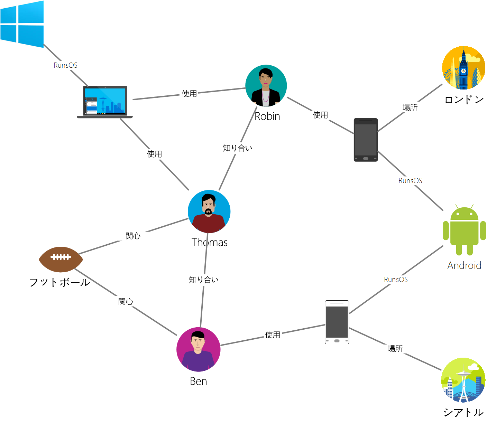

# <a name="azure-cosmos-db-gremlin-graph-support"></a>Azure Cosmos DB での Gremlin グラフのサポート
Azure Cosmos DB では、[Apache Tinkerpop](http://tinkerpop.apache.org) のグラフ トラバーサル言語である [Gremlin](http://tinkerpop.apache.org/docs/current/reference/#graph-traversal-steps) をサポートしています。これは、グラフ エンティティを作成し、グラフ クエリ操作を実行するための Graph API です。 Gremlin 言語を使用して、グラフ エンティティ (頂点と辺) の作成、エンティティ内のプロパティの変更、クエリとトラバーサルの実行、エンティティの削除を行うことができます。 

Azure Cosmos DB は、グラフ データベースにエンタープライズ対応の機能を提供します。 これには、グローバル配布、ストレージとスループットの個別スケーリング、1 桁ミリ秒の予測可能な待機時間、自動インデックス作成、SLA、2 つ以上の Azure リージョンにまたがるデータベース アカウントの読み取り可用性などがあります。 Azure Cosmos DB は TinkerPop/Gremlin をサポートしているため、コードを変更しなくても、別のグラフ データベースを使用して作成されたアプリケーションを簡単に移行できます。 さらに、Gremlin のサポートにより、Azure Cosmos DB は [Apache Spark GraphX](http://spark.apache.org/graphx/) などの TinkerPop 対応分析フレームワークとシームレスに統合されます。 

この記事では、Gremlin の簡単なチュートリアルを提供し、Graph API でサポートされている Gremlin の機能とステップを紹介します。

## <a name="gremlin-by-example"></a>Gremlin の例
サンプル グラフを使用して、Gremlin でクエリを表現する方法を理解しましょう。 次の図は、ユーザー、関心事、デバイスに関するデータを管理するビジネス アプリケーションをグラフの形で示しています。  

 

このグラフには、次の頂点の種類 (Gremlin では "ラベル" と呼ばれます) が含まれています。

- People: グラフには、Robin、Thomas、Ben の 3 人のユーザーが含まれています。
- Interests: 各ユーザーの関心事。この例では、フットボールの試合です。
- Devices: ユーザーが使用しているデバイス。
- Operating Systems: デバイスが実行されているオペレーティング システム。

次の辺の種類/ラベルによって、これらのエンティティの関係を表しています。

- Knows: たとえば、"Thomas は Robin を知っている" ことを示しています。
- Interested: このグラフの各ユーザーの関心事を表します。たとえば、"Ben はフットボールに関心がある" ことを示しています。
- RunsOS: ノート PC で Windows OS を実行しています。
- Uses: ユーザーが使用しているデバイスを表します。 たとえば、Robin はシリアル番号が 77 の Motorola Phone を使用しています。

[Gremlin コンソール](http://tinkerpop.apache.org/docs/current/reference/#gremlin-console)を使用して、このグラフに対していくつかの操作を実行しましょう。 これらの操作は、任意のプラットフォーム (Java、Node.js、Python、または .NET) で Gremlin ドライバーを使用して実行することもできます。  Azure Cosmos DB でサポートされているものを確認する前に、構文に慣れるために例をいくつか見てみましょう。

まず、CRUD を見てみます。 次の Gremlin ステートメントでは、グラフに "Thomas" 頂点を挿入します。

```
:> g.addV('person').property('id', 'thomas.1').property('firstName', 'Thomas').property('lastName', 'Andersen').property('age', 44)
```

次の Gremlin ステートメントでは、Thomas と Robin の間に "knows" 辺を挿入します。

```
:> g.V('thomas.1').addE('knows').to(g.V('robin.1'))
```

次のクエリは、ユーザーの姓の降順で "person" 頂点を返します。
```
:> g.V().hasLabel('person').order().by('firstName', decr)
```

グラフが強調表示されている場合、"Thomas の友人が使用しているオペレーティング システムは何か" というような質問に答える必要があります。 次の簡単な Gremlin トラバーサルを実行することで、グラフからこの情報を取得できます。

```
:> g.V('thomas.1').out('knows').out('uses').out('runsos').group().by('name').by(count())
```
次に、Azure Cosmos DB が Gremlin 開発者に提供するものを見ていきましょう。

## <a name="gremlin-features"></a>Gremlin の機能
TinkerPop は、さまざまなグラフ テクノロジに対応する標準です。 そのため、グラフ プロバイダーによって提供される機能を説明する標準的な用語があります。 Azure Cosmos DB は、複数のサーバーまたはクラスター間でパーティション分割できる、永続的で同時実行性の高い書き込み可能なグラフ データベースを提供します。 

次の表に、Azure Cosmos DB で実装されている TinkerPop の機能を示します。 

| カテゴリ | Azure Cosmos DB 実装 |  メモ | 
| --- | --- | --- |
| グラフ機能 | 永続化と同時アクセスが提供されます。 トランザクションをサポートするように設計されています。 | コンピューターのメソッドは、Spark コネクタを介して実装できます。 |
| 変数機能 | ブール値、整数、Byte、Double、Float、Long、文字列をサポートしています。 | プリミティブ型をサポートしています。データ モデルを介して複雑な型と互換性があります。 |
| 頂点機能 | RemoveVertices、MetaProperties、AddVertices、MultiProperties、StringIds、UserSuppliedIds、AddProperty、RemoveProperty をサポートしています。  | 頂点の作成、変更、削除をサポートしています。 |
| 頂点プロパティ機能 | StringIds、UserSuppliedIds、AddProperty、RemoveProperty、BooleanValues、ByteValues、DoubleValues、FloatValues、IntegerValues、LongValues、StringValues | 頂点プロパティの作成、変更、削除をサポートしています。 |
| 辺機能 | AddEges、RemoveEdges、StringIds、UserSuppliedIds、AddProperty、RemoveProperty | 辺の作成、変更、削除をサポートしています。 |
| 辺プロパティ機能 | Properties、BooleanValues、ByteValues、DoubleValues、FloatValues、IntegerValues、LongValues、StringValues | 辺プロパティの作成、変更、削除をサポートしています。 |

## <a name="gremlin-wire-format-graphson"></a>Gremlin のワイヤ形式: GraphSON

Azure Cosmos DB では、Gremlin の操作から結果を返すときに [GraphSON 形式](https://github.com/thinkaurelius/faunus/wiki/GraphSON-Format)を使用します。 GraphSON は、JSON を使用して頂点、辺、プロパティ (単一値および複数値プロパティ) を表すための Gremlin の標準形式です。 

たとえば、次のスニペットは、Azure Cosmos DB から "*クライアントに返される*" GraphSON による頂点の表現を示しています。 

```json
  {
    "id": "a7111ba7-0ea1-43c9-b6b2-efc5e3aea4c0",
    "label": "person",
    "type": "vertex",
    "outE": {
      "knows": [
        {
          "id": "3ee53a60-c561-4c5e-9a9f-9c7924bc9aef",
          "inV": "04779300-1c8e-489d-9493-50fd1325a658"
        },
        {
          "id": "21984248-ee9e-43a8-a7f6-30642bc14609",
          "inV": "a8e3e741-2ef7-4c01-b7c8-199f8e43e3bc"
        }
      ]
    },
    "properties": {
      "firstName": [
        {
          "value": "Thomas"
        }
      ],
      "lastName": [
        {
          "value": "Andersen"
        }
      ],
      "age": [
        {
          "value": 45
        }
      ]
    }
  }
```

GraphSON で使用される頂点のプロパティは次のとおりです。

| プロパティ | [説明] |
| --- | --- |
| id | 頂点の ID。 一意である必要があります (該当する場合は、_partition の値との組み合わせにおいて一意である必要があります)。 |
| label | 頂点のラベル。 これは省略可能です。エンティティの種類を示すために使用します。 |
| 型 | 頂点とグラフ以外のドキュメントを区別するために使用します。 |
| プロパティ | 頂点に関連付けられているユーザー定義プロパティのバッグ。 各プロパティには複数の値を指定できます。 |
| _partition (構成可能) | 頂点のパーティション キー。 パーティション キーを使用して、グラフを複数のサーバーにスケールアウトできます。 |
| outE | これには、頂点からの外向きの辺のリストが含まれます。 頂点と共に隣接情報を格納することで、トラバーサルの高速実行が可能になります。 辺はラベルに基づいてグループ化されます。 |

辺には、グラフの他の部分へのナビゲーションに役立つ次の情報が含まれています。

| プロパティ | [説明] |
| --- | --- |
| id | 辺の ID。 一意である必要があります (該当する場合は、_partition の値との組み合わせにおいて一意である必要があります)。 |
| label | 辺のラベル。 このプロパティは省略可能です。関係の種類を示すために使用します。 |
| inV | これには、辺の頂点一覧が含まれています。 辺と共に隣接情報を格納することで、トラバーサルの高速実行が可能になります。 頂点はラベルに基づいてグループ化されます。 |
| プロパティ | 辺に関連付けられているユーザー定義プロパティのバッグ。 各プロパティには複数の値を指定できます。 |

各プロパティでは、配列内に複数の値を格納できます。 

| プロパティ | [説明] |
| --- | --- |
| value | プロパティの値。

## <a name="gremlin-partitioning"></a>Gremlin のパーティション分割

Azure Cosmos DB では、ストレージとスループット (1 秒当たりの正規化された要求数で表現) に関して個別にスケールできるコンテナーにグラフが格納されます。 各コンテナーでは、関連データの論理パーティション境界を決定するパーティション キー プロパティを定義する必要があります (パーティション キー プロパティは省略可能ですが、定義することをお勧めします)。 各頂点と辺には、そのパーティション キー値内のエンティティに対して一意である `id` プロパティが必要です。 詳細については、「[Azure Cosmos DB でのパーティション分割](partition-data.md)」をご覧ください。

Gremlin の操作は、Azure Cosmos DB の複数のパーティションにまたがるグラフ データでシームレスに動作します。 ただし、クエリでフィルターとして一般的に使用され、多数の異なる値を持ち、これらの値に同様の頻度でアクセスできる、グラフのパーティション キーを選択することをお勧めします。 

## <a name="gremlin-steps"></a>Gremlin のステップ
次に、Azure Cosmos DB でサポートされている Gremlin のステップを見てみましょう。 Gremlin の完全なリファレンスについては、[TinkerPop リファレンス](http://tinkerpop.apache.org/docs/current/reference)をご覧ください。

| ステップ | [説明] | TinkerPop 3.2 ドキュメント | メモ |
| --- | --- | --- | --- |
| `addE` | 2 つの頂点の間に辺を追加します。 | [addE ステップ](http://tinkerpop.apache.org/docs/current/reference/#addedge-step) | |
| `addV` | グラフに頂点を追加します。 | [addV ステップ](http://tinkerpop.apache.org/docs/current/reference/#addvertex-step) | |
| `and` | すべてのトラバーサルが値を返すようにします。 | [and ステップ](http://tinkerpop.apache.org/docs/current/reference/#and-step) | |
| `as` | ステップの出力に変数を割り当てるステップ モジュレーター。 | [as ステップ](http://tinkerpop.apache.org/docs/current/reference/#as-step) | |
| `by` | `group` および `order` と共に使用するステップ モジュレーター。 | [by ステップ](http://tinkerpop.apache.org/docs/current/reference/#by-step) | |
| `coalesce` | 結果を返す最初のトラバーサルを返します。 | [coalesce ステップ](http://tinkerpop.apache.org/docs/current/reference/#coalesce-step) | |
| `constant` | 定数値を返します。 `coalesce` と共に使用します。| [constant ステップ](http://tinkerpop.apache.org/docs/current/reference/#constant-step) | |
| `count` | トラバーサルからカウントを返します。 | [count ステップ](http://tinkerpop.apache.org/docs/current/reference/#count-step) | |
| `dedup` | 重複を削除して値を返します。 | [dedup ステップ](http://tinkerpop.apache.org/docs/current/reference/#dedup-step) | |
| `drop` | 値 (頂点/辺) を破棄します。 | [drop ステップ](http://tinkerpop.apache.org/docs/current/reference/#drop-step) | |
| `fold` | 結果の集計を計算するバリアとして機能します。| [fold ステップ](http://tinkerpop.apache.org/docs/current/reference/#fold-step) | |
| `group` | 指定されたラベルに基づいて値をグループ化します。| [group ステップ](http://tinkerpop.apache.org/docs/current/reference/#group-step) | |
| `has` | プロパティ、頂点、辺をフィルター処理するときに使用します。 `hasLabel`、`hasId`、`hasNot`、`has` の各バリアントをサポートします。 | [has ステップ](http://tinkerpop.apache.org/docs/current/reference/#has-step) | |
| `inject` | 値をストリームに挿入します。| [inject ステップ](http://tinkerpop.apache.org/docs/current/reference/#inject-step) | |
| `is` | ブール式を使用してフィルターを実行するときに使用します。 | [is ステップ](http://tinkerpop.apache.org/docs/current/reference/#is-step) | |
| `limit` | トラバーサルで項目の数を制限するときに使用します。| [limit ステップ](http://tinkerpop.apache.org/docs/current/reference/#limit-step) | |
| `local` | サブクエリと同様に、トラバーサルのセクションをローカルでラップします。 | [local ステップ](http://tinkerpop.apache.org/docs/current/reference/#local-step) | |
| `not` | フィルターの否定を生成するときに使用します。 | [not ステップ](http://tinkerpop.apache.org/docs/current/reference/#not-step) | |
| `optional` | 指定されたトラバーサルの結果が生成された場合は、その結果を返します。それ以外の場合は、呼び出し元の要素を返します。 | [optional ステップ](http://tinkerpop.apache.org/docs/current/reference/#optional-step) | |
| `or` | 少なくとも 1 つのトラバーサルで値が返されるようにします。 | [or ステップ](http://tinkerpop.apache.org/docs/current/reference/#or-step) | |
| `order` | 指定された並べ替え順序で結果を返します。 | [order ステップ](http://tinkerpop.apache.org/docs/current/reference/#order-step) | |
| `path` | トラバーサルの完全なパスを返します。 | [path ステップ](http://tinkerpop.apache.org/docs/current/reference/#path-step) | |
| `project` | プロパティをマップとして投影します。 | [project ステップ](http://tinkerpop.apache.org/docs/current/reference/#project-step) | |
| `properties` | 指定されたラベルのプロパティを返します。 | [properties ステップ](http://tinkerpop.apache.org/docs/current/reference/#properties-step) | |
| `range` | 値の指定された範囲にフィルターを適用します。| [range ステップ](http://tinkerpop.apache.org/docs/current/reference/#range-step) | |
| `repeat` | ステップを指定された回数繰り返します。 ループに使用します。 | [repeat ステップ](http://tinkerpop.apache.org/docs/current/reference/#repeat-step) | |
| `sample` | トラバーサルの結果をサンプリングするときに使用します。 | [sample ステップ](http://tinkerpop.apache.org/docs/current/reference/#sample-step) | |
| `select` | トラバーサルの結果を予想するときに使用します。 |  [select ステップ](http://tinkerpop.apache.org/docs/current/reference/#select-step) | |
| `store` | トラバーサルの非ブロッキング集計に使用します。 | [store ステップ](http://tinkerpop.apache.org/docs/current/reference/#store-step) | |
| `tree` | 頂点からのパスを集計してツリーを形成します。 | [tree ステップ](http://tinkerpop.apache.org/docs/current/reference/#tree-step) | |
| `unfold` | 反復子をステップとしてアンロールします。| [unfold ステップ](http://tinkerpop.apache.org/docs/current/reference/#unfold-step) | |
| `union` | 複数のトラバーサルの結果をマージします。| [union ステップ](http://tinkerpop.apache.org/docs/current/reference/#union-step) | |
| `V` | 頂点および辺の間でのトラバーサルに必要なステップ (`V`、`E`、`out`、`in`、`both`、`outE`、`inE`、`bothE`、`outV`、`inV`、`bothV`、`otherV`) が含まれています。 | [vertex ステップ](http://tinkerpop.apache.org/docs/current/reference/#vertex-steps) | |
| `where` | トラバーサルの結果をフィルター処理するときに使用します。 `eq`、`neq`、`lt`、`lte`、`gt`、`gte`、`between` の各演算子をサポートします。  | [where ステップ](http://tinkerpop.apache.org/docs/current/reference/#where-step) | |

Azure Cosmos DB の書き込みに最適化されたエンジンは、頂点および辺内のすべてのプロパティの自動インデックス作成を既定でサポートしています。 そのため、任意のプロパティでのフィルターを使用するクエリ、範囲クエリ、並べ替え、または集計は、インデックスに基づいて処理され、効率的に提供されます。 Azure Cosmos DB におけるインデックス作成のしくみの詳細については、[スキーマに依存しないインデックス作成](http://www.vldb.org/pvldb/vol8/p1668-shukla.pdf)に関する論文をご覧ください。

## <a name="next-steps"></a>次の手順
* [SDK を使用](create-graph-dotnet.md)してグラフ アプリケーションの構築を開始する 
* [Azure Cosmos DB のグラフ サポート](graph-introduction.md)の詳細を確認する
