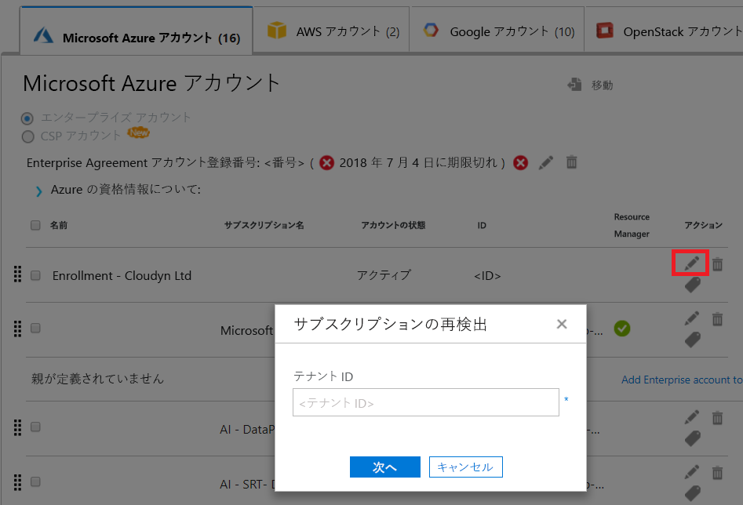

# Azure Cost Management で Azure サブスクリプションとアカウントをアクティブ化する

Azure Resource Manager の資格情報を追加または更新すると、Azure Cost Management は Azure テナント内のすべてのアカウントとサブスクリプションを検出できるようになります。 仮想マシンで Azure 診断拡張機能も有効にしてある場合は、Azure Cost Management は CPU やメモリなどの拡張メトリックを収集できます。 この記事では、Azure Resource Manager API を使って新規アカウントおよび既存アカウントに対するアクセスを有効にする方法を説明します。 また、アカウントに関する一般的な問題を解決する方法についても説明します。

サブスクリプションが "_アクティブ化されていない_" 場合は、Azure Cost Management はほとんどの Azure サブスクリプション データにアクセスできません。 Azure Cost Management がアクセスできるように、"_アクティブ化されていない_" アカウントを編集する必要があります。

## 必要な Azure アクセス許可

この記事の手順を最後まで行うには、特定のアクセス許可が必要です。 ユーザーまたはユーザーのテナント管理者は、次のアクセス許可を両方とも持っている必要があります。

- Azure AD テナントに CloudynCollector アプリケーションを登録するためのアクセス許可。
- Azure サブスクリプションのロールにアプリケーションを割り当てる権限。

CloudynCollector アプリケーションを割り当てるには、Azure サブスクリプションのアカウントに `Microsoft.Authorization/*/Write` アクセス権が必要です。 このアクションは、[所有者](../active-directory/role-based-access-built-in-roles.md#owner)ロールまたは[ユーザー アクセス管理者](../active-directory/role-based-access-built-in-roles.md#user-access-administrator)ロールを通じて許可されます。

アカウントが**共同作成者**ロールに割り当てられている場合は、アプリケーションの割り当てに必要な適切なアクセス許可がありません。 CloudynCollector アプリケーションを Azure サブスクリプションに割り当てようとすると、エラーが表示されます。

### Azure Active Directory のアクセス許可を確認する

1. [Azure Portal](https://portal.azure.com) にログインします。
2. Azure Portal で、**[Azure Active Directory]** を選びます。
3. Azure Active Directory で **[ユーザー設定]** を選択します。
4. **[アプリの登録]** オプションを確認します。
    - **[はい]** に設定されている場合は、管理者以外のユーザーでも AD アプリを登録できます。 この設定は、Azure AD テナント内のすべてのユーザーがアプリを登録できることを意味します。 必要な Azure サブスクリプションのアクセス許可に進んで構いません。  
    
    - **[アプリの登録]** オプションが **[いいえ]** に設定されている場合は、テナント管理者ユーザーのみが Azure Active Directory アプリを登録できます。 テナント管理者が CloudynCollector アプリケーションを登録する必要があります。

## アカウントを追加するか、サブスクリプションを更新する

アカウントを追加するか、サブスクリプションを更新すると、Azure Cost Management に Azure データへのアクセス権が付与されます。

### 新しいアカウント (サブスクリプション) を追加する

1. Azure Cost Management ポータルで、右上にある歯車アイコンをクリックして、**[Cloud Accounts]\(クラウド アカウント\)** を選びます。
2. **[Add new account]\(新しいアカウントの追加\)** をクリックし、**[Add new account]\(新しいアカウントの追加\)** ボックスを表示します。 必要な情報を入力します。  
    ![[Add new account]\(新しいアカウントの追加\) ボックス](./media/activate-subs-accounts//add-new-account.png)

### サブスクリプションを更新する

1. アカウント管理で Azure Cost Management に既に存在する "_アクティブ化されていない_" サブスクリプションを更新する場合は、"_テナントの GUID_" の右側にある編集用の鉛筆アイコンをクリックします。
    
2. 必要に応じて、テナント ID を入力します。 テナント ID がわからない場合は、次の手順を使って調べます。
    1. [Azure Portal](https://portal.azure.com) にログインします。
    2. Azure Portal で、**[Azure Active Directory]** を選びます。
    3. テナント ID を取得するには、Azure AD テナントの **[プロパティ]** を選択します。
    4. [ディレクトリ ID] の GUID をコピーします。 この値がテナント ID です。
    詳しくは、「[テナント ID を取得する](../azure-resource-manager/resource-group-create-service-principal-portal.md#get-tenant-id)」をご覧ください。
3. 必要に応じて、レート ID を選びます。 レート ID がわからない場合は、次の手順を使って調べます。
    1. Azure Portal の右上にあるユーザー情報をクリックし、**[明細の表示]** をクリックします。
    2. **[請求先アカウント]** で **[サブスクリプション]** をクリックします。
    3. **[個人用サブスクリプション]** で、サブスクリプションを選びます。
    4. **[プラン ID]** の下にレート ID が表示されます。 サブスクリプションのプラン ID をコピーします。
4. [新しいアカウントの追加] (または [サブスクリプションの編集]) ボックスで、**[保存]** (または **[次へ]**) をクリックします。 Azure Portal にリダイレクトされます。
5. ポータルにサインインします。 **[許可]** をクリックして、Azure Cost Management Collector がお使いの Azure アカウントにアクセスするのを承認します。

    Azure Cost Management のアカウント管理ページにリダイレクトされ、サブスクリプションが**アクティブな**アカウント状態に更新されます。 Resource Manager の列の下に緑のチェックマーク記号が表示されます。

    1 つ以上のサブスクリプションに緑色のチェックマーク記号が表示されていない場合は、そのサブスクリプションのリーダー アプリ (CloudynCollector) を作成するためのアクセス許可がないことを示しています。 そのサブスクリプションのより高いアクセス許可を持つユーザーが、この手順を繰り返す必要があります。

手順については、ビデオ「[Connecting to Azure Resource Manager with Azure Cost Management by Cloudyn](https://youtu.be/oCIwvfBB6kk)」(Cloudyn を使って Azure Cost Management で Azure Resource Manager に接続する) をご覧ください。

>[!VIDEO https://www.youtube.com/embed/oCIwvfBB6kk?ecver=1]

## 間接加入契約のエンタープライズ設定に関する一般的な問題を解決する

Azure Cost Management ポータルを初めて使うとき、Enterprise Agreement またはクラウド ソリューション プロバイダー (CSP) ユーザーのお客様の場合、次のメッセージが表示されることがあります。

- **Azure Cost Management 設定**ウィザード: *The specified API key is not a top level enrollment key* (指定された API キーは、最上位レベルの登録キーではありません)。
- Enterprise Agreement ポータル: *Direct Enrollment – No* (直接登録 – いいえ)。
- Azure Cost Management ポータル: *No usage data was found for the last 30 days.Please contact your distributor to make sure markup was enabled for your Azure account* (過去 30 日間に使用状況データが見つかりませんでした。ディストリビューターに連絡してお使いの Azure アカウントに対してマークアップが有効になっていることを確認してください)。

前述のメッセージは、Azure Enterprise Agreement を再販業者または CSP から購入したことを示します。 Azure Cost Management でデータを確認するには、再販業者または CSP がユーザーの Azure アカウントの "_マークアップ_" を有効にする必要があります。

問題の修正方法は次のとおりです。

1. 再販業者がユーザーのアカウントの "_マークアップ_" を有効にする。 手順については、「[間接加入契約者向けオンボード ガイド](https://ea.azure.com/api/v3Help/v2IndirectCustomerOnboardingGuide)」をご覧ください。
2. ユーザーが Azure Cost Management で使用する Azure Enterprise Agreement キーを生成する。 手順については、「[Azure エンタープライズ契約を登録してコスト データを表示する](https://docs.microsoft.com/en-us/azure/cost-management/quick-register-ea)」をご覧ください。

Cost Management を有効にできるのは Azure のサービス管理者のみです。 共同管理者のアクセス許可では不十分です。

Azure Enterprise Agreement API キーを生成して Azure Cost Management を設定する前に、次の手順に従って Azure Billing API を有効にする必要があります。

- [企業ユーザー向けの Reporting API の概要](../billing/billing-enterprise-api.md)
- 「**Enabling data access to the API (API へのデータ アクセスを有効にする)**」の「[Microsoft Azure Enterprise Portal Reporting API](https://ea.azure.com/helpdocs/reportingAPI)」

また、部門管理者、アカウント所有者、およびエンタープライズ管理者に、Billing API による "_請求を確認する_" アクセス許可を付与する必要がある場合もあります。

## 次の手順

- Cost Management の最初のチュートリアルをまだ完了していない場合は、「[使用状況とコストを確認する](tutorial-review-usage.md)」をご覧ください。
