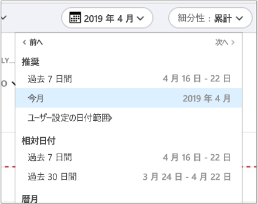

# クイック スタート:コスト分析を使用してコストを調査および分析する

Azure コストを正しく制御して最適化するには、コストが組織内のどこで発生しているかを把握する必要があります。 また、サービスのコストがどれくらいの金額であり、どのような環境やシステムをサポートしているかを認識することも有効です。 あらゆるコストを調査することは、組織の消費パターンを正確に把握するために重要です。 消費パターンは、コスト管理のメカニズム (予算など) を適用するために使用できます。

このクイック スタートでは、コスト分析を使用して組織のコストを調査および分析します。 組織ごとの集計コストを表示することで、時間の経過に伴いコストがどこで発生しているかを把握したり、消費傾向を識別したりできます。 一定期間の累積コストを表示することで、予算に対する月単位、四半期ごと、場合によっては年単位のコスト傾向を見積もることができます。 予算は、財務上の制約に対処するうえで役立ちます。 また、予算は、日単位または月単位のコストを確認して、支出の不規則性を特定するために使用します。 また、さらに分析を行うか、または外部システムで使用するために、現在のレポートのデータをダウンロードできます。

このクイックスタートでは、次の方法について説明します。

- コスト分析でコストを確認する
- コスト ビューをカスタマイズする
- コスト分析データをダウンロードする

## 前提条件

コスト分析は、すべての [Enterprise Agreement (EA)](https://azure.microsoft.com/pricing/enterprise-agreement/) 顧客が使用できます。 コスト データを表示するには、次に示す 1 つ以上のスコープへの読み取りアクセス権が必要です。 Cost Management データに対するアクセス権割り当ての詳細については、[データへのアクセスの割り当て](assign-access-acm-data.md)に関するページを参照してください。

- 請求先アカウント
- 部署
- 登録アカウント
- 管理グループ
- サブスクリプション
- リソース グループ

## Azure へのサインイン

- Azure Portal ( https://portal.azure.com ) にサインインします。

## コスト分析でコストを確認する

コスト分析でコストを確認するには、Azure portal で **[コストの管理と請求]** &gt; **[コスト管理]** &gt; **[スコープの変更]** の順に移動し、スコープを選択して **[選択]** をクリックします。

選択したスコープは、データの統合とコスト情報へのアクセスの制御のために、Cost Management 全体を通して使用されます。 スコープを使用する場合は、複数選択を行いません。 代わりに、他のユーザーがロールアップする、より大きなスコープを選択し、後で必要なものをフィルターで絞り込みます。 一部のユーザーは子スコープがロール アップする親スコープにはアクセスできないようにする必要があるため、これを理解しておくことが重要です。

**[コスト分析を開く]** をクリックします。

初期のコスト分析ビューには、次の領域が含まれています。

**[合計]** – 当月の総コストを示します。

**[予算]** – 選択されたスコープの計画的な使用制限を示します (使用可能な場合)。

**[累積コスト]** – 月初から始まる、発生した日単位の消費の合計を示します。 請求先アカウントまたはサブスクリプションのための[予算を作成](tutorial-acm-create-budgets.md)した後、予算に対する消費傾向をすばやく確認できます。 日付の上にカーソルを置くと、その日までの累積コストが表示されます。

**[ピボット (ドーナツ) グラフ]** – 総コストを一般的な標準プロパティのセット別に分割する動的ピボットを提供します。 これらは、当月に発生した最も多いコストから最も少ないコストまでを示します。 これらのピボット グラフは、別のピボットを選択することによっていつでも変更できます。 コストは、既定では、サービス (測定カテゴリ)、場所 (リージョン)、および子スコープによって分類されます。 たとえば、請求先アカウントの下の登録アカウント、サブスクリプションの下のリソース グループ、およびリソース グループの下のリソースです。

## コスト ビューをカスタマイズする

既定のビューでは、次のような一般的な質問へのすばやい回答が提供されます。

- 私はどれだけ消費したでしょうか。
- 予算内に収まるでしょうか。

ただし、より深い分析が必要な多くのケースが存在します。 カスタマイズは、ページの一番上の日付の選択から始まります。

コスト分析では、既定では当月のデータが示されます。 先月、今月、今暦四半期、今暦年、または任意のカスタムの日付範囲にすばやく切り替えるには、日付セレクターを使用します。 先月を選択することが、最新の Azure 請求書を分析したり、請求を容易に調整したりするための最もすばやい方法です。 当四半期および当年オプションは、長期的な予算に対するコストを追跡するのに役立ちます。 別の日付範囲を選択することもできます。 たとえば、1 日、過去 7 日間、または当月の 1 年前までの任意の日付を選択できます。

コスト分析では、既定では**累積**コストも示されます。 累積コストには前の数日に加えて、各日のすべてのコストが含まれており、日単位の発生コストの絶えず増加するビューが表示されます。 このビューは、選択された時間範囲の間、予算に対してどのような傾向があるかを示すように最適化されています。

毎日のコストを示す**日単位**のビューもあります。 日単位のビューには、増加の傾向は示されません。 このビューは、不規則性をコストの急上昇または日ごとの低下として示すように設計されています。 予算を選択した場合、日単位のビューでは、日単位の予算の見積もりがどうなっているかも示されます。 日単位のコストが、常に見積もられた日単位の予算を上回っている場合は、月単位の予算を超えることを予測できます。 見積もられた日単位の予算は、単純に、低いレベルで予算を視覚化するために役立つ手段です。 日単位のコストに変動があるときは、見積もられた日単位の予算と月単位の予算の比較の正確性が低くなります。

一般に、8 時間以内の消費リソースのデータまたは通知を見ることができます。

**[グループ化]** を実行すると、グループ カテゴリを選択して、一番上の合計領域のグラフに表示されるデータを変更できます。 一般的なリソースと使用状況のプロパティ (リソース グループ、リソース タグなど) によって支出がどのように分類されているかは、グループ化することによってすばやく確認することができます。 タグでグループ化するには、グループ化の基準とするタグ キーを選択します。 そのタグの値ごとのコスト明細が表示され、そのタグが適用されていないリソースについては別途セグメントが表示されます。

ほとんどの [Azure リソースではタグ付けがサポート](../azure-resource-manager/tag-support.md)されていますが、一部のタグは Cost Management および請求で使用できません。 また、リソース グループのタグはサポートされていません。 Cost Management でサポートされるのは、リソースにタグが直接適用された日付以降のリソース タグだけです。

先月のビューの Azure サービス コストのビューを次に示します。

メイン グラフの下のピボット グラフには、選択された期間やフィルターに対応するコストの全体像が把握しやすいよう各種のグループが表示されます。 プロパティまたはタグを選択すると、あらゆるディメンションに基づく集計コストが表示されます。 **[データ]** ドロワーを展開するか、画面上部で **[エクスポート] > [CSV のダウンロード]** を選択することによって、[合計] ビューの全データが画面の一番下に表示されます。 以下に、リソース グループのデータ ドロワーの例を示します。

上の図は、リソース グループ名を示しています。 タグでグループ化することで、タグごとの合計コストを表示できますが、どのコスト分析ビューにおいても、リソースまたはリソース グループごとにすべてのタグを表示できるわけではありません。

特定の属性によってコストをグループ化すると、上位 10 個のコスト要因が高いものから順に表示されます。 グループが 10 個を超える場合は、上位 9 個のコスト要因が表示されます。 また、**[その他]** グループも表示され、残りのすべてのグループがここに含まれています。 また、タグでグループ化する場合、タグ キーが適用されていないコストについて **[タグなし]** というグループも表示されることがあります。 タグなしのコストがタグ付きのコストより多く存在している場合でも、**[タグなし]** は常に最後になります。 タグの値が 10 以上存在する場合、タグなしのコストは、**[その他]** に含められます。

"*クラシック*" (Azure サービス管理: ASM) の仮想マシン、ネットワーク、およびストレージ リソースは、詳細な課金データを共有しません。 それらは、コストをグループ化する場合、**クラシック サービス**としてマージされます。

## コスト分析データをダウンロードする

コスト分析情報の **[ダウンロード]** を実行すると、現在 Azure Portal に表示されているすべてのデータの CSV ファイルを生成できます。 適用するフィルターやグループは、このファイルに含まれています。 アクティブには表示されていない、一番上の [合計] グラフに関する基礎となるデータは、その CSV ファイルに含まれます。

## 次の手順

最初のチュートリアルに進み、予算の作成と管理の方法を学習してください。

> [!div class="nextstepaction"]
> [予算を作成して管理する](tutorial-acm-create-budgets.md)
