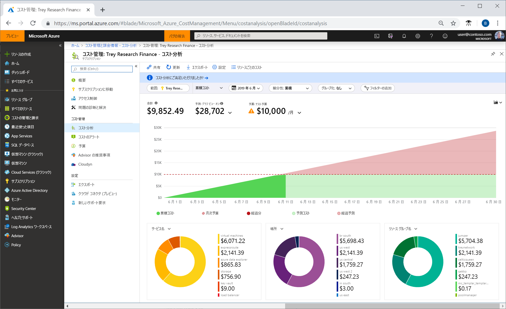
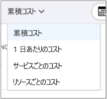
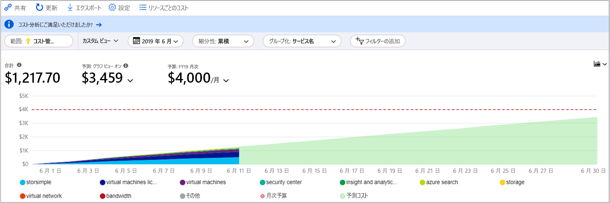
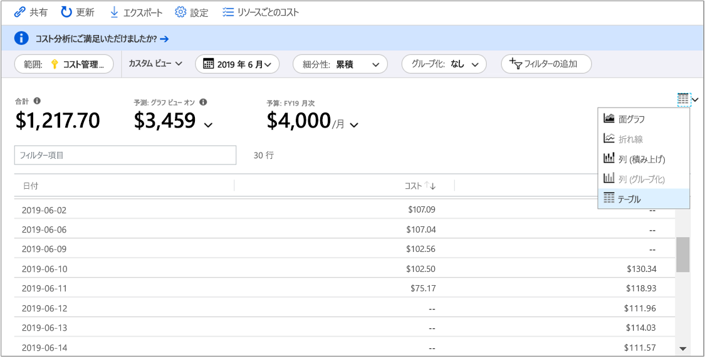

# クイック スタート:コスト分析を使用してコストを調査および分析する

Azure コストを正しく制御して最適化するには、コストが組織内のどこで発生しているかを把握する必要があります。 また、サービスのコストがどれくらいの金額であり、どのような環境やシステムをサポートしているかを認識することも有効です。 あらゆるコストを調査することは、組織の消費パターンを正確に把握するために重要です。 消費パターンは、コスト管理のメカニズム (予算など) を適用するために使用できます。

このクイック スタートでは、コスト分析を使用して組織のコストを調査および分析します。 組織ごとの集計コストを表示することで、時間の経過に伴いコストがどこで発生しているかを把握したり、消費傾向を識別したりできます。 一定期間の累積コストを表示することで、予算に対する月単位、四半期ごと、場合によっては年単位のコスト傾向を見積もることができます。 予算は、財務上の制約に対処するうえで役立ちます。 また、予算は、日単位または月単位のコストを確認して、支出の不規則性を特定するために使用します。 また、さらに分析を行うか、または外部システムで使用するために、現在のレポートのデータをダウンロードできます。

このクイックスタートでは、次の方法について説明します。

- コスト分析でコストを確認する
- コスト ビューをカスタマイズする
- コスト分析データをダウンロードする

## 前提条件

コスト分析では、さまざまな種類の Azure アカウントがサポートされています。 サポートされているアカウントの種類の完全な一覧については、「[Understand Cost Management data (Cost Management データの概要)](understand-cost-mgt-data.md)」を参照してください。 コスト データを表示するには、少なくとも Azure アカウントの読み取りアクセス許可が必要です。

[Enterprise Agreement (EA)](https://azure.microsoft.com/pricing/enterprise-agreement/) のお客様の場合、コスト データを表示するには、次に示す 1 つ以上のスコープへの読み取りアクセス権が必要です。

- 請求先アカウント
- 部署
- 登録アカウント
- 管理グループ
- サブスクリプション
- リソース グループ

Cost Management データに対するアクセス権割り当ての詳細については、[データへのアクセスの割り当て](assign-access-acm-data.md)に関するページを参照してください。

## Azure へのサインイン

- Azure Portal ( https://portal.azure.com ) にサインインします。

## コスト分析でコストを確認する

コスト分析でコストを確認するには、Azure portal でスコープを開き、メニューで **[コスト分析]** を選択します。 たとえば、 **[サブスクリプション]** に移動し、一覧からサブスクリプションを選択して、メニューから **[コスト分析]** を選択します。 コスト分析で別のスコープに切り替えるには、 **[スコープ]** ピルを使用します。 スコープの詳細については、「[Understand and work with scopes (スコープを理解して使用する)](understand-work-scopes.md)」を参照してください。

選択したスコープは、データの統合とコスト情報へのアクセスの制御のために、Cost Management 全体を通して使用されます。 スコープを使用する場合は、複数選択を行いません。 代わりに、他のユーザーがロールアップする、より大きなスコープを選択してから、必要な入れ子のスコープにフィルターで絞り込みます。 ユーザーによっては、複数の入れ子になったスコープをカバーする単一の親スコープにアクセスできない場合があるため、このアプローチを理解することは重要です。

初期のコスト分析ビューには、次の領域が含まれています。

**[合計]** – 当月の総コストを示します。

**[予算]** – 選択されたスコープの計画的な使用制限を示します (使用可能な場合)。

**[累積コスト]** – 月初から始まる、日単位の消費の総集計を示します。 請求先アカウントまたはサブスクリプションのための[予算を作成](tutorial-acm-create-budgets.md)した後、予算に対する消費傾向をすばやく確認できます。 日付の上にカーソルを置くと、その日までの累積コストが表示されます。

**[ピボット (ドーナツ) グラフ]** – 総コストを一般的な標準プロパティのセット別に分割する動的ピボットを提供します。 これらは、当月の最も多いコストから最も少ないコストまでを示します。 これらのピボット グラフは、別のピボットを選択することによっていつでも変更できます。 コストは、既定では、サービス (測定カテゴリ)、場所 (リージョン)、および子スコープによって分類されます。 たとえば、請求先アカウントの下の登録アカウント、サブスクリプションの下のリソース グループ、およびリソース グループの下のリソースです。

## コスト ビューをカスタマイズする

コスト分析には、最も一般的な目標に合わせて最適化された 4 つの組み込みビューがあります。

表示 | 答える質問の例
--- | ---
累積コスト | 今月のこれまでの出費はどれくらいですか。 予算内に収まるでしょうか。
1 日あたりのコスト | 過去 30 日間の 1 日あたりのコストに増加はみられましたか。
サービスごとのコスト | 過去 3 回分の請求書で月間使用量はどのように推移しましたか。
リソースごとのコスト | 今月はこれまで、どのリソースに最もコストがかかっていますか。

ただし、より深い分析が必要な多くのケースが存在します。 カスタマイズは、ページの一番上の日付の選択から始まります。

コスト分析では、既定では当月のデータが示されます。 一般的な日付範囲にすばやく切り替えるには、日付セレクターを使用します。 例としては、過去 7 日間、先月、今年、またはカスタムの日付範囲があります。 従量課金制サブスクリプションには、現在の請求期間や最後の請求書のように、カレンダーの月に制約されない請求期間に基づいた日付範囲も含まれます。 メニューの上部にある **<前へ** および **次へ>** リンクを使用して、それぞれ前の期間または次の期間にジャンプします。 たとえば、 **<PREVIOUS** を使用すると、最後の 7 日間から 8 ～ 14 日前に、次は 15 ～ 21 日前に、というように順番に切り替わります。

コスト分析では、既定では**累積**コストも示されます。 累積コストには前の数日に加えて、各日のすべてのコストが含まれており、日単位の集計コストの絶えず増加するビューが表示されます。 このビューは、選択された時間範囲の間、予算に対してどのような傾向があるかを示すように最適化されています。

毎日のコストを示す**日単位**のビューもあります。 日単位のビューには、増加の傾向は示されません。 このビューは、不規則性をコストの急上昇または日ごとの低下として示すように設計されています。 予算を選択した場合、日単位のビューでは、日単位の予算の見積もりがどうなっているかも示されます。 日単位のコストが、常に見積もられた日単位の予算を上回っている場合は、月単位の予算を超えることを予測できます。 見積もられた日単位の予算は、単純に、低いレベルで予算を視覚化するために役立つ手段です。 日単位のコストに変動があるときは、見積もられた日単位の予算と月単位の予算の比較の正確性が低くなります。

一般に、8 ～ 12 時間以内の消費リソースのデータまたは通知を見ることができます。

共通のプロパティで**グループ化**してコストを明細化し、最も寄与した要因を識別します。 たとえば、リソース タグでグループ化するには、グループ化の基準とするタグ キーを選択します。 タグの値ごとのコスト明細が表示され、そのタグが適用されていないリソースについては別途セグメントが表示されます。

ほとんどの [Azure リソースではタグ付けがサポート](../azure-resource-manager/tag-support.md)されていますが、一部のタグは Cost Management および請求で使用できません。 また、リソース グループのタグはサポートされていません。 Cost Management でサポートされるのは、リソースにタグが直接適用された日付以降のリソース タグだけです。 Azure タグ ポリシーを使用してコスト データの可視性を向上させる方法については、[Azure Cost Management でタグ ポリシーを確認する方法](https://www.youtube.com/watch?v=nHQYcYGKuyw)に関するビデオをご覧ください。

先月のビューの Azure サービス コストのビューを次に示します。

メイン グラフの下のピボット グラフには、選択された期間やフィルターに対応するコストの全体像が把握しやすいよう各種のグループが表示されます。 プロパティまたはタグを選択すると、あらゆるディメンションに基づく集計コストが表示されます。

上の図は、リソース グループ名を示しています。 タグでグループ化することで、タグごとの合計コストを表示できますが、どのコスト分析ビューにおいても、リソースまたはリソース グループごとにすべてのタグを表示できるわけではありません。

特定の属性によってコストをグループ化すると、上位 10 個のコスト要因が高いものから順に表示されます。 10 個を超える場合、上位 9 個のコスト要因と、 **[その他]** グループが表示されます。このグループに、残りのすべてのグループが含まれます。 また、タグでグループ化する場合、タグ キーが適用されていないコストについて **[タグなし]** というグループも表示されることがあります。 タグなしのコストがタグ付きのコストより高い場合でも、 **[タグなし]** は常に最後になります。 タグの値が 10 個以上ある場合、タグなしのコストは、 **[その他]** に含められます。

"*クラシック*" の仮想マシン、ネットワーク、およびストレージ リソースは、詳細な課金データを共有しません。 それらは、コストをグループ化する場合、**クラシック サービス**としてマージされます。

任意のビューの完全なデータ セットを表示することができます。 適用したすべての選択またはフィルターが、表示されるデータに影響します。 完全なデータ セットを表示するには、**グラフの種類**の一覧をクリックして、 **[テーブル]** ビューをクリックします。

## コスト分析データをダウンロードする

コスト分析情報の **[ダウンロード]** を実行すると、現在 Azure Portal に表示されているすべてのデータの CSV ファイルを生成できます。 適用するフィルターやグループは、このファイルに含まれています。 アクティブには表示されていない、一番上の [合計] グラフに関する基礎となるデータは、その CSV ファイルに含まれます。

## 次の手順

最初のチュートリアルに進み、予算の作成と管理の方法を学習してください。

> [!div class="nextstepaction"]
> [予算を作成して管理する](tutorial-acm-create-budgets.md)
