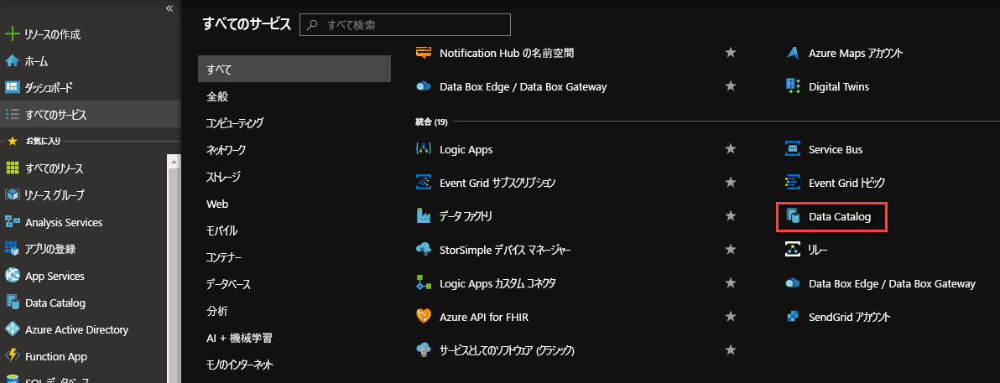
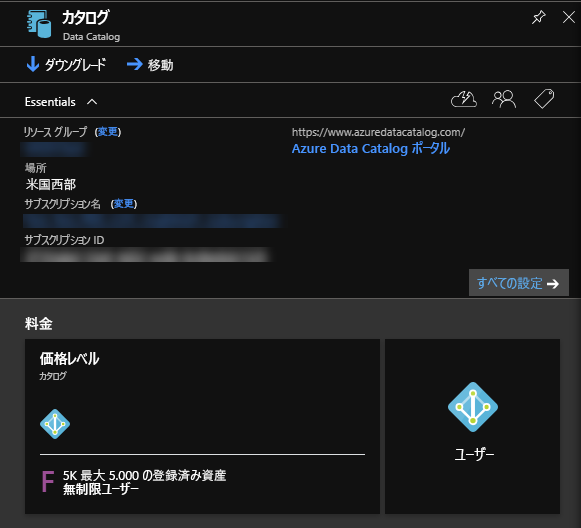

<properties
	pageTitle="Data Catalog を使ってみる | Microsoft Azure"
	description="Azure Data Catalog のシナリオと機能を紹介するエンド ツー エンドのチュートリアルです。"
	documentationCenter=""
	services="data-catalog"
	authors="steelanddata"
	manager=""
	editor=""
	tags=""/>
<tags
	ms.service="data-catalog"
	ms.devlang="NA"
	ms.topic="get-started-article"
	ms.tgt_pltfrm="NA"
	ms.workload="data-catalog"
	ms.date="07/06/2016"
	ms.author="spelluru"/>

# チュートリアル: Azure Data Catalog を使ってみる
Azure Data Catalog は、完全に管理されたクラウド サービスで、エンタープライズ データ資産の登録システムと検出システムとして機能します。詳細については、「[Azure Data Catalog とは何ですか](data-catalog-what-is-data-catalog.md)」を参照してください。

このチュートリアルでは、Azure Data Catalog の概要について説明します。このチュートリアルでは、以下の手順を実施します。

| 手順 | 説明 |
| :--- | :---------- |
| [データ カタログのプロビジョニング](#provision-data-catalog) | この手順では、Azure Data Catalog のプロビジョニングと設定を行います。この手順は、これまでにカタログを設定したことがない場合のみ実行します。Azure アカウントに関連付けられているサブスクリプションが複数ある場合でも、持つことができるデータ カタログは組織 (Azure Active Directory ドメイン) につき 1 つだけです。 | 
| [データ資産の登録](#register-data-assets) | この手順では、AdventureWorks2014 サンプル データベースのデータ資産をデータ カタログに登録します。登録とは、データ ソースから重要な構造メタデータ (名前、型、場所など) を抽出し、そのメタデータをカタログにコピーするプロセスです。データ ソースとデータ資産はそのままの場所に残りますが、メタデータは、それらを簡単に検出して理解できるようにカタログで使用されます。 |
| [データ資産の検出](#discover-data-assets) | この手順では、Azure Data Catalog ポータルを使用して、前の手順で登録されたデータ資産を検出します。データ ソースが Azure Data Catalog に登録されると、そのメタデータにはサービスによってインデックスが付けられます。その結果、ユーザーは検索を実行して必要なデータを容易に検出できるようになります。 |
| [データ資産への注釈付け](#annotate-data-assets) | この手順では、データ ソースから抽出されたメタデータを補完したり、データ ソースをより多くの人にわかりやすくしたりするために、データ資産に注釈 (説明、タグ、ドキュメント、エキスパートなど) を指定します。 | 
| [データ資産への接続](#connect-to-data-assets) | この手順では、Excel や SQL Server Data Tools などの統合クライアント ツールや非統合ツール (SQL Server Management Studio) で接続情報を使用してデータ資産を開きます。 |
| [データ資産の管理](#manage-data-assets) | この手順では、データ資産のセキュリティを設定する方法を説明します。Data Catalog のユーザーにデータ自体へのアクセス権は与えられません。データへのアクセスは、データ ソースの所有者が管理します。  ユーザーは Data Catalog を通じてデータ ソースを検出し、カタログに登録されたソースに関連した**メタデータ**を閲覧できます。しかし、データ ソースの可視性を特定のユーザー (または特定のグループのメンバー) に限定すべきケースもあります。そのようなケースではユーザーが、カタログ内の登録済みデータ資産の所有権を取得したうえで、所有する資産の可視性を制御できます。 | 
| [データ資産の削除](#remove-data-assets) | この手順では、データ カタログからデータ資産を削除する方法について説明します。 |  
 
## チュートリアルの前提条件

このチュートリアルを始める前に、次の項目を用意する必要があります。

### Azure サブスクリプション
Azure Data Catalog をセットアップするには、Azure サブスクリプションの**所有者または共同所有者**である必要があります。

Azure サブスクリプションは、Azure Data Catalog のようなクラウド サービス リソースへのアクセスを整理するために役立ちます。さらに、リソースの使用状況の報告、課金、および支払い方法の制御にも役立ちます。サブスクリプションごとに異なる課金および支払いを設定することができるため、部門別、プロジェクト別、支社別などで、異なるサブスクリプションや異なるプランを利用することができます。すべてのクラウド サービスがサブスクリプションに属しているため、Azure Data Catalog をセットアップする前に、サブスクリプションが必要です。詳細については、「[アカウント、サブスクリプション、管理ロールの管理](../active-directory/active-directory-how-subscriptions-associated-directory.md)」を参照してください。

サブスクリプションがない場合は、無料試用版のアカウントを数分で作成することができます。詳細については、[無料試用版](https://azure.microsoft.com/pricing/free-trial/)に関するページを参照してください。

### Azure Active Directory
Azure Data Catalog をセットアップするには、**Azure Active Directory ユーザー アカウント**を使ってログインする必要があり、Azure サブスクリプションの所有者または共同所有者である必要があります。

Azure Active Directory (Azure AD) は、企業がクラウドとオンプレミス環境の両方で ID とアクセスを簡単に管理できるサービスです。ユーザーは、任意のクラウドおよびオンプレミス Web アプリケーションへのシングル サインオンのために、1 つの職場または学校アカウントを使用できます。Azure Data Catalog は、Azure AD を使用して、サインオンを認証します。詳細については、「[Azure Active Directory とは](../active-directory/active-directory-whatis.md)」を参照してください。

### Active Directory ポリシーの構成

場合によっては、ユーザーは、Azure Data Catalog ポータルにログオンできる状況が発生することがありますが、データ ソース登録ツールにログオンしようとすると、ログオンを妨げるエラー メッセージが表示されます。ユーザーが企業ネットワーク上にいる場合のみ、またはユーザーが企業ネットワークの外部から接続している場合のみ、このエラー動作が発生することがあります。

登録ツールは、**フォーム認証**を使用して、Active Directory に対するユーザー ログオンを検証します。ログオンを成功させるには、Active Directory 管理者によって、**グローバル認証ポリシー**でフォーム認証が有効にされている必要があります。

下図に示すように、グローバル認証ポリシーでは、イントラネット接続とエクストラネット接続で個別に認証方法を有効にすることができます。ログオン エラーは、ユーザーの接続元のネットワークで、フォーム認証が有効にされていない場合に発生する可能性があります。

 

詳細については、「[認証ポリシーの構成](https://technet.microsoft.com/library/dn486781.aspx)」を参照してください。

## データ カタログのプロビジョニング
組織 (Azure Active Directory ドメイン) につき、プロビジョニングできるデータ カタログは 1 つだけです。そのため、この Active Directory ドメインに属している、Azure サブスクリプションの所有者または共同所有者が既にカタログを作成している場合、複数の Azure サブスクリプションを所有していても、もう一度カタログを作成することはできません。データ カタログが Active Directory ドメイン内のユーザーによって作成されているかどうかをテストするには、http://azuredatacatalog.com に移動し、カタログが表示されるかどうかを確認してください。カタログが既に作成されている場合は、以下の手順をスキップし、次のセクションに進んでください。

1. [https://azure.microsoft.com/services/data-catalog](https://azure.microsoft.com/services/data-catalog) に移動します。

	**[はじめに]** をクリックします。
2. Azure サブスクリプションの**所有者または共同所有者**であるユーザー アカウントを使用してログインします。ログインに成功すると、次のページが表示されます。

	
2. データ カタログの**名前**、使用する**サブスクリプション**、カタログの**場所**を指定します。
3. **[価格設定]** を展開し、その Azure Data Catalog の**エディション** (Free および Standard) を指定します。
4. **[カタログ ユーザー]** を展開し、**[追加]** をクリックしてデータ カタログのユーザーを追加します。自身はこのグループに自動的に追加されます。
5. **[カタログの管理者]** を展開し、**[追加]** をクリックしてデータ カタログの他の管理者を追加します。自身はこのグループに自動的に追加されます。
6. **[カタログの作成]** ボタンをクリックして、組織のデータ カタログを作成します。データ カタログが正常に作成されると、そのデータ カタログのホーム ページが表示されます。

### Azure ポータルでのデータ カタログの検索
1. Web ブラウザーの別のタブまたは別の Web ブラウザー ウィンドウで、[https://portal.azure.com](https://portal.azure.com) に移動し、前の手順でデータ カタログを作成する際に使用したのと同じアカウントでログインします。
2. **[参照]** をクリックし、**[Data Catalog]** をクリックします。

	
3. 作成したデータ カタログが表示されます。

	
4.  作成したカタログをクリックすると、ポータルに **[Data Catalog]** ブレードが表示されます。

	
5. データ カタログのプロパティを表示するだけでなく、更新することもできます。たとえば、**[価格レベル]** をクリックし、エディションを変更します。

	

### Adventure Works サンプル データベース 
このチュートリアルでは、SQL Server データベース エンジンの AdventureWorks2014 サンプル データベースからデータ資産 (テーブル) を登録しますが、馴染みがあり、自分のロールに関連するデータを操作したいと考える場合は、サポートされている任意のデータ ソースも使用できます。サポートされているデータ ソースの一覧については、[サポートされるデータ ソース](data-catalog-dsr.md)に関する記事を参照してください。

### Adventure Works 2014 OLTP データベースのインストール
Adventure Works データベースは、製品、販売、および購入を含む、架空の自転車メーカー (Adventure Works Cycles) の標準オンライン トランザクション処理シナリオをサポートします。このチュートリアルでは、製品に関する情報を **Azure Data Catalog** に登録します。

Adventure Works サンプル データベースのインストール方法を次に示します。

1. CodePlex の [Adventure Works 2014 Full Database Backup.zip](https://msftdbprodsamples.codeplex.com/downloads/get/880661) をダウンロードします。
2. [SQL Server Management Studio を使用したデータベース バックアップの復元](http://msdn.microsoft.com/library/ms177429.aspx)に関する記事の手順に従って、お使いのコンピューターにデータベースを復元します。**簡単な手順**:
	1. SQL Server Management Studio を起動し、SQL Server データベース エンジンに接続します。
	2. **[データベース]** を右クリックし、**[データベースの復元]** を選択します。
	3. **[データベースの復元]** ダイアログ ボックスで、**[ソース]** の **[デバイス]** オプションを選択し、**参照 ([...])** ボタンをクリックします。
	4. **[バックアップ デバイスの選択]** ダイアログ ボックスで、**[追加]** をクリックします。
	5. **AdventureWorks2014.bak** ファイルがあるフォルダーに移動して、そのファイルを選択し、**[OK]** をクリックして **[バックアップ ファイルの検索]** ダイアログ ボックスを閉じます。
	6. **[OK]** をクリックして **[バックアップ デバイスの選択]** ダイアログ ボックスを閉じます。
	7. **[OK]** をクリックして **[データベースの復元]** ダイアログ ボックスを閉じます。

次に、Adventure Works サンプル データベースのデータ資産を **Azure Data Catalog** に登録する方法を見てみましょう。

## データ資産の登録

この演習では、登録ツールを使用して、Adventure Works データベースのデータ資産をカタログに登録します。登録は、データ ソースおよびそれに格納されている資産から、名前、型、および場所などの重要な構造メタデータを抽出し、そのメタデータをカタログにコピーするプロセスです。データ ソースとデータ資産はそのままの場所に残りますが、メタデータは、それらを簡単に検出して理解できるようにカタログで使用されます。

### ここにデータ ソースを登録する方法を示します

1.	[https://azuredatacatalog.com](https://azuredatacatlog.com) に移動し、ホーム ページの **[データの発行]** をクリックします。

    

3.	**[アプリケーションを起動]** をクリックして、お使いのコンピューターで**登録ツール**をダウンロード、インストール、実行します。

    

4. [**ようこそ**] ページで、[**サインイン**] をクリックし、資格情報を入力します。

	

5. **[Microsoft Azure Data Catalog]** ページで、**[SQL Server]** をダブルクリックするか、**[SQL Server]** をクリックして **[次へ]** をクリックします。

    

6.	**AdventureWorks2014** の SQL Server 接続のプロパティを入力し (以下の例を参照)、**[接続]** をクリックします。

    

7.	次のページでは、データ資産のメタデータを登録します。この例では、AdventureWorks Production 名前空間から **Production/Product** オブジェクトを登録します。これを実行する方法を次に示します。
    
	1. **[サーバー階層]** のツリーで、**AdventureWorks2014** を展開し、**Production** をクリックします。
	2. Ctrl キーを押しながら、**[Product]**、**[ProductCategory]**、**[ProductDescription]**、および **[ProductPhoto]** をクリックします。
	3. **選択項目の移動矢印** (**>**) をクリックします。これにより、選択した Product オブジェクトすべてが **[登録されるオブジェクト]** の一覧に移動します。
			
    	
	4. **[プレビューを含める]** チェック ボックスをオンにして、データのスナップショット プレビューを含めます。スナップショットには、各テーブルから最大 20 レコードが含まれており、これはカタログにコピーされます。
	5. **[データ プロファイルを含める]** チェック ボックスをオンにして、データ プロファイルのオブジェクト統計情報のスナップショットを含めます (列の最小値、最大値、平均値、行数など)。
	5. **[コンマで区切られたタグを追加しています]** に、「**adventure works, cycles**」と入力します。これにより、これらのデータ資産に検索タグが追加されます。タグは、ユーザーが登録されているデータ ソースを見つけるために役立つ優れた方法です。
	6. (オプション) このデータの**エキスパート**の名前を指定します。
	
    	
    
	7. [**登録**] をクリックします。Azure Data Catalog は、選択したオブジェクトを登録します。この演習では、Adventure Works から選択したオブジェクトが登録されます。登録ツールは、データ資産からメタデータを抽出し、そのデータを Azure Data Catalog サービスにコピーします。データは現在存在する場所に残り、現在のシステムの管理者とポリシーの制御下に留まります。
	
		

	8. 登録されているデータ ソース オブジェクトを表示するには、[**ポータルの表示**] をクリックします。**Azure Data Catalog** ポータルで、4 つのテーブルとデータベースすべてがグリッド ビューに表示されていることを確認します。
 
    	
  
	
この演習では、組織全体でユーザーがオブジェクトを簡単に検出できるように、Adventure Works サンプル データベースからオブジェクトを登録しました。次の演習では、登録されているデータ資産を検出する方法を学習します。

## データ資産の検出
Azure Data Catalog での検出では、検索とフィルター処理という 2 つの主要なメカニズムを使用します。

**検索**は直感的で強力です。既定で、検索語句はカタログ内の任意のプロパティと照合されます (ユーザーが指定した注釈を含む)。

**フィルター処理**は、検索を補完するものです。エキスパート、データ ソースの種類、オブジェクトの種類、タグなどの特定の特性を選択することで、一致するデータ資産のみを表示することも、検索結果を一致する資産に制限することもできます。

検索とフィルター処理を組み合わせて使用することで、Azure Data Catalog に登録されたデータ ソースをすばやく移動し、必要なデータ資産を検出することができます。

この演習では、**Azure Data Catalog** ポータルを使用して、前の演習で登録したデータ資産を検出します。検索構文の詳細については、「[Data Catalog Search syntax reference (Data Catalog の検索構文のリファレンス)](https://msdn.microsoft.com/library/azure/mt267594.aspx)」を参照してください。

カタログ内のデータ資産を検出する例をいくつか見てみましょう。

### 基本的な検索
基本的な検索では、1 つ以上の検索語句を使用してカタログを検索できます。任意のプロパティで、指定した 1 つまたは複数の語句と一致する任意の資産が返されます。

1. Azure Data Catalog ポータルの **[ホーム]** ボタンをクリックします。Web ブラウザーを閉じてしまった場合、[https://www.azuredatacatalog.com](https://www.azuredatacatalog.com) にアクセスします。
2. 上部にある検索ボックスに「**cycles**」と入力し、**検索**アイコンをクリックするか、**Enter** キーを押します。
	
	
3. 結果に 4 つのテーブルとデータベース (AdventureWorks2014) が表示されることを確認します。次の図に示すように、上部のボタンをクリックすることで、**グリッド ビュー**と**リスト ビュー**を切り替えることができます。上部の **[ハイライト]** オプションが**オン**になっているため、検索結果内で検索キーワードが強調表示されていることがわかります。検索結果の**ページごとの結果**数を指定することもできます。

	
	
	左側に **[検索]** パネル、右側に **[プロパティ]** パネルが表示されます。[検索] パネルでは、検索条件を変更したり、結果をフィルター処理したりできます。[プロパティ] パネルには、グリッドまたはリストで選択したオブジェクトのプロパティが表示されます。

4. 検索結果にある **[Product]** をクリックします。**[プレビュー]**、**[列]**、**[データ プロファイル]**、**[ドキュメント]** というタブをクリックするか、**下向き**矢印を使用して、中央の下部にあるペインを展開します。
 
	
	
	**[プレビュー]** タブには、Product テーブルのデータのプレビューが表示されます。
5. **[列]** タブをクリックすると、データ資産の列の詳細 (**名前**や**データ型**など) がわかります。
6. **[データ プロファイル]** タブをクリックすると、データ資産のデータのプロファイル (行数、データ サイズ、列の最小値など) が表示されます。
6. 左側にある **[フィルター]** を使用して、結果をフィルター処理します。たとえば、**[オブジェクト タイプ]** の **[テーブル]** をクリックすると、4 つのテーブルのみが表示され、データベースは表示されません。

	

### プロパティ スコープ
プロパティ スコープを使用すると、指定したプロパティと検索語句が一致するデータ資産を検出できます。

3. **[フィルター]** で、**[オブジェクト タイプ]** の **[テーブル]** フィルターをオフにします。
4. 検索ボックスに「**tags:cycles**」と入力し、**検索**アイコンをクリックするか、**Enter** キーを押します。データ カタログの検索に使用できるすべてのプロパティについては、「[Data Catalog Search syntax reference (Data Catalog の検索構文のリファレンス)](https://msdn.microsoft.com/library/azure/mt267594.aspx)」を参照してください。
3. 結果に 4 つのテーブルとデータベース (AdventureWorks2014) が表示されることを確認します。

	

### 検索の保存 
1. 左側にある [検索] ペインの [現在の検索] セクションで、[保存] をクリックして現在の検索条件を保存します。検索の名前を入力し、[保存] をクリックします。
	
	
2. 保存した検索条件が [保存された検索条件] の下に表示されていることを確認します。

	
3. 下向き矢印をクリックして、保存した検索条件に対して実行できるアクション (名前の変更、削除、既定の検索に設定) を表示します。 

### ブール演算子
ブール演算子を使用すると、検索の範囲を広げたり狭めたりできます。

2. 検索ボックスに「**tags:cycles AND objectType:table**」と入力し、**検索**アイコンをクリックするか、**Enter** キーを押します。
3. 結果にテーブルのみが表示され、データベースが表示されていないことを確認します。

	

### かっこを使用したグループ化
かっこを使用したグループ化では、かっこを使用してクエリの一部をグループ化し、論理的に分離することができます。特にブール演算子と組み合わせて使用します。

1. 検索ボックスに「**name:product AND (tags:cycles AND objectType:table)**」と入力し、**検索**アイコンをクリックするか、**Enter** キーを押します。
2. ここで、検索結果に **Product** テーブルのみが表示されていることを確認します。

	

### 比較演算子
比較演算子を使用すると、数値データ型および日付データ型を持つプロパティについて、等値演算子以外の比較演算子を使用できます。

1. 検索ボックスに「**lastRegisteredTime:>"06/09/2016"**」と入力します。
2. 左側にある **[オブジェクト タイプ]** の **[テーブル]** フィルターをオフにします。
3. **検索**アイコンをクリックするか、**Enter** キーを押します。
2. 検索結果に、Product、ProductCategory、ProductDescription、ProductPhoto テーブルと、登録した AdventureWorks2014 が表示されていることを確認します。

	

データ資産の探索の詳細については[データ資産の探索方法](data-catalog-how-to-discover.md)に関する記事、検索構文については「[Data Catalog Search syntax reference (Data Catalog の検索構文のリファレンス)](https://msdn.microsoft.com/library/azure/mt267594.aspx)」を参照してください。

## データ資産への注釈付け
この演習では、**Azure Data Catalog** ポータルを使用して、前の手順でカタログに登録したデータ資産に注釈 (説明、タグ、エキスパートなどの追加) を設定します。指定する注釈は、登録時にデータ ソースから抽出された構造型メタデータを補完、拡張して、データ資産をさらに検出および理解しやすくします。

### 次に、データ資産に注釈を設定する方法を示します
この手順では、1 つのデータセット (ProductPhoto) に注釈を設定します。ProductPhoto データ資産にフレンドリ名、説明などを追加します。

1.  ブラウザーを閉じてしまった場合は、[https://www.azuredatacatalog.com](https://www.azuredatacatalog.com) にアクセスし、**tags:cycles** で検索して、登録したデータ資産を探します。
2. 検索結果で **ProductPhoto** をクリックします。
3. **[フレンドリ名]** に「**Product images**」と入力し、**[説明]** フィールドに「**Product photos for marketing materials**」と入力します。

	

	**[説明]** は、他のユーザーが、選択したデータ資産を検出したり、そのデータ資産を使用する理由と方法を理解したりするのに役立ちます。さらに、タグとビュー列を追加することもできます。これで、カタログに追加したわかりやすいメタデータを使用して、データ資産を検出するための検索とフィルター処理を試行できます。

このページでは次のことも実行できることに注意してください。

- データ資産のエキスパートを追加する。右側のペインで **[エキスパート]** の下にある **[追加]** をクリックします。
- データセット レベルでタグを追加する。右側のペインで **[タグ]** の下にある **[追加]** をクリックします。タグは、ユーザー タグにも用語集タグにもすることができます。Data Catalog Standard Edition には、カタログ管理者が中心的なビジネスの分類を定義できるビジネス用語集が含まれています。そのため、Catalog ユーザーは用語集の用語を使ってデータ資産に注釈を付けることができます。詳細については、「[管理タグ付け用のビジネス用語集を設定する方法](data-catalog-how-to-business-glossary.md)」を参照してください。
- 列レベルでタグを追加する。中央下部のペインで、注釈を設定する列の **[タグ]** の下にある **[追加]** をクリックします。
- 列レベルで説明を追加する。中央下部のペインで、列の **[説明]** を入力します。また、データ ソースから抽出された説明メタデータを表示することもできます。
- データ資産へのアクセスを要求する方法をユーザーに指定する**アクセスの要求**情報を追加する。

	
  
- 中央下部のペインで **[ドキュメント]** タブをクリックし、データ資産に関するドキュメントを指定する。Azure Data Catalog での文書化により、データ カタログをコンテンツのリポジトリとして使用して、既にあるデータ資産を網羅した概要を作成できます。

	

また、複数選択またはすべて選択し、複数またはすべてのデータ資産に注釈を付けることもできます。たとえば、登録したすべてのデータ資産を選択し、それらにエキスパートを指定することができます。

Azure Data Catalog では、注釈に対するクラウドソーシング アプローチにより、すべての Data Catalog ユーザーがタグ (ユーザーまたは用語集)、説明などのメタデータを追加できます。このため、データ資産とその使用に関してある観点を持つ任意のユーザーは、その観点を他のユーザーがキャプチャし、使用できるようにすることができます。

データ資産への注釈付けの詳細については、[データ資産に注釈を付ける方法](data-catalog-how-to-annotate.md)に関する記事を参照してください。
 
## データ資産への接続
この演習では、統合クライアント ツール (Excel) や非統合ツール (SQL Server Management Studio) で接続情報を使ってデータ資産を開きます。

> [AZURE.NOTE] **Azure Data Catalog** は、ユーザーに実際のデータ ソースへのアクセス権を付与するのではなく、単にユーザーがそれらを検出し、理解しやすくするだけであることに注意することが重要です。ユーザーがデータ ソースに接続すると、選択したクライアント アプリケーションが、ユーザーの Windows 資格情報を使用するか、または必要に応じて、ユーザーに資格情報の入力を求めます。ユーザーに以前にデータ ソースへのアクセス権が付与されていない場合、データ ソースに接続する前に、アクセス権を付与される必要があります。

### Excel からデータ資産に接続する方法

1. 検索結果から **[Product]** を選択します。ツール バーの **[開く]** をクリックし、**[Excel]** を選択します。
 
    
5. 下部にあるダウンロードのポップアップ ウィンドウで **[開く]** をクリックします (この操作はブラウザーによって異なる可能性があります)。

	
6. [**Microsoft Excel のセキュリティに関する通知**] ウィンドウで、[**有効にする**] をクリックします。

	
7. **[データの取り込み]** ダイアログ ボックスで、既定値をそのままにし、**[OK]** をクリックします。

	
8. データ ソースが Excel で開きます。

    

この演習では、**Azure Data Catalog** を使用して検出されたデータ資産に接続しました。**Azure Data Catalog** ポータルでは、ユーザーがその [**開く**] メニューに統合されたクライアント アプリケーションを使用して、直接接続することも、選択した任意のアプリケーションを使用し、資産のメタデータに含まれる接続の場所情報を使用して、接続することもできます。たとえば、SQL Server Management Studio を使用すると、AdventureWorks2014 データベースに接続し、このチュートリアルで登録されたデータ資産のデータにアクセスできます。

1. **SQL Server Management Studio** を起動します。
2. **[サーバーへの接続]** ダイアログ ボックスで、Azure Data Catalog ポータルの **[プロパティ]** ペインに表示されている**サーバー名**を入力します。
3. データ資産へのアクセス権を既に持っている場合は、適切な**認証**と**資産**を使用してデータ資産にアクセスします。アクセス権がない場合は、[アクセスの要求] フィールドの情報を使用してアクセスします。

	

**[接続文字列の表示]** をクリックして、ADF.NET、ODBC、OLEDB の接続文字列を表示し、アプリケーションで使用するためにクリップボードにコピーします。

## データ資産の管理
この手順では、データ資産のセキュリティを設定する方法を説明します。Data Catalog のユーザーにデータ自体へのアクセス権は与えられません。データへのアクセスは、データ ソースの所有者が管理します。

ユーザーは Data Catalog を通じてデータ ソースを検出し、カタログに登録されたソースに関連した**メタデータ**を閲覧できます。しかし、データ ソースの可視性を特定のユーザー (または特定のグループのメンバー) に限定すべきケースもあります。そのようなケースではユーザーが、カタログ内の登録済みデータ資産の所有権を取得したうえで、所有する資産の可視性を制御できます。

> [AZURE.NOTE] この演習で説明している管理機能は、**Azure Data Catalog の Standard Edition** でのみ使用できます。**Free Edition** では使用できません。**Azure Data Catalog** では、データ資産の所有権を取得し、共同所有者をデータ資産に追加し、データ資産の可視性を設定できます。

### 次に、データ資産の所有権を取得し、可視性を制限する方法を示します

1. [https://www.azuredatacatalog.com](https://www.azuredatacatalog.com) にアクセスします (Web ブラウザーを閉じてしまった場合)。検索テキスト ボックスに「**tags:cycles**」と入力し、**Enter** キーを押します。
3. 次の図に示すように、結果の一覧で、項目 (**Product** など) を右上隅にあるチェック ボックスをオンにして選択し、ツール バーの **[所有権の取得]** をクリックします。
4. 右側にあるペインの **[プロパティ]** パネルで、**[管理]** セクションの **[所有権の取得]** をクリックします。

	
5. 可視性を制限するには、**[表示]** セクションで **[所有者とこれらのユーザー]** をクリックし、**[追加]** をクリックします。テキスト ボックスにユーザーのメール アドレスを入力し、Enter キーを押します。

    

## データ資産の削除

この演習では、**Azure Data Catalog** ポータルを使用して、登録されているデータ資産からプレビュー データを削除し、カタログからデータ資産を削除します。

**Azure Data Catalog** では、個々の資産を削除したり、複数の資産を削除したりできます。

### データ資産を削除する方法

1. [https://www.azuredatacatalog.com](https://www.azuredatacatalog.com) にアクセスします (Web ブラウザーを閉じてしまった場合)。
2. 検索テキスト ボックスに「**tags:cycles**」と入力し、**Enter** キーを押します。
3. 次の図に示すように、結果の一覧で、項目 (**ProductDescription** など) を右上隅にあるチェック ボックスをオンにして選択し、ツール バーの **[削除]** をクリックします。

	
	
	(グリッド ビューではなく) リスト ビューを使用している場合、チェック ボックスは、次の図に示すように、項目の左側にあります。

	

	また、次に示すように、複数のデータ資産を選択して削除することもできます。

	

> [AZURE.NOTE] カタログの既定の動作は、すべてのユーザーが任意のデータ ソースを登録でき、すべてのユーザーが登録されている任意のデータ資産を削除できることです。**Azure Data Catalog の Standard Edition** に含まれる管理機能では、資産の所有権の取得、資産を検出できるユーザーの制限、および資産を削除できるユーザーの制限のための追加のオプションがあります。

## 概要

このチュートリアルでは、**Azure Data Catalog** の重要な機能 (エンタープライズ データ資産の登録、注釈付け、検出、管理など) について学習しました。これでチュートリアルは完了したので、使用を開始できます。自分やチームが依存するデータ ソースを登録し、カタログを使用する同僚を招待することによって、今すぐ始めることができます。

## 参照

- [データ資産の登録方法](data-catalog-how-to-register.md)
- [データ資産の探索方法](data-catalog-how-to-discover.md)
- [データ資産に注釈を付ける方法](data-catalog-how-to-annotate.md)
- [データ資産を文書化する方法](data-catalog-how-to-documentation.md)
- [データ資産への接続方法](data-catalog-how-to-connect.md)
- [データ資産を管理する方法](data-catalog-how-to-manage.md)

<!---HONumber=AcomDC_0713_2016-->