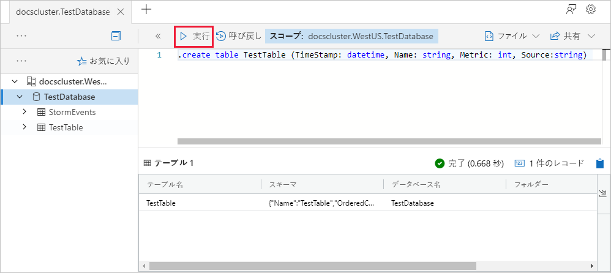
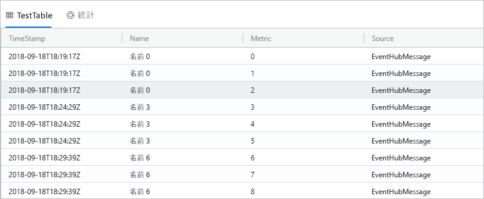

# <a name="quickstart-ingest-data-from-kafka-into-azure-data-explorer"></a>クイック スタート: Kafka から Azure Data Explorer にデータを取り込む
 
Azure Data Explorer は、ログと利用統計情報データのための高速で拡張性に優れたデータ探索サービスです。 Azure Data Explorer には、Kafka からの取り込み (データの読み込み) 機能があります。 Kafka は、システム間やアプリケーション間で確実にデータを移動するリアルタイム ストリーミング データ パイプラインの構築を可能にする分散ストリーミング プラットフォームです。 
 
## <a name="prerequisites"></a>前提条件
 
* Azure サブスクリプションをお持ちでない場合は、開始する前に[無料の Azure アカウント](https://azure.microsoft.com/free/)を作成してください。 
 
* [テスト用のクラスターとデータベース](create-cluster-database-portal.md)
 
* データを生成して Kafka に送信する[サンプル アプリ](https://github.com/Azure/azure-kusto-samples-dotnet/tree/master/kafka)

* サンプル アプリを実行する [Visual studio 2017 Version 15.3.2 以降](https://www.visualstudio.com/vs/)
 
## <a name="kafka-connector-setup"></a>Kafka コネクタのセットアップ
Kafka Connect は、Apache Kafka と他のシステムとの間でスケーラブルに、かつ高い信頼性でデータをストリーム配信するためのツールです。 大規模なデータのコレクションを Kafka との間でやり取りするコネクタを簡単に定義できます。 ADX Kafka Sink が Kafka のコネクタとして機能します。
 
### <a name="bundle"></a>バンドル 
Kafka は、カスタム コネクタの役割を果たすプラグインとして `.jar` を読み込むことができます。 そのような `.jar` を生成するために、ここではローカルにコードを複製し、Maven を使用してビルドします。 

#### <a name="clone"></a>複製

```bash
git clone git://github.com:Azure/kafka-sink-azure-kusto.git
cd ./kafka-sink-azure-kusto/kafka/
```
 
#### <a name="build"></a>構築

Maven でローカルにビルドし、依存関係をすべて含んだ `.jar` を生成します。

* JDK 1.8 以上 ([ダウンロード](https://www.oracle.com/technetwork/java/javase/downloads/index.html))
* Maven ([ダウンロード](https://maven.apache.org/install.html))
 

ルート ディレクトリ *kafka-sink-azure-kusto* 内で、次のコマンドを実行します。

```bash
mvn clean compile assembly:single
```
 
### <a name="deploy"></a>デプロイ 
 
Kafka にプラグインを読み込みます。 Docker を使用したデプロイ例は、[kafka-sink-azure-kusto](https://github.com/Azure/kafka-sink-azure-kusto#deploy) でご覧いただけます。
 

Kafka コネクタとそのデプロイ方法に関する詳細なドキュメントについては、[Kafka Connect](https://kafka.apache.org/documentation/#connect) に関するセクションをご覧ください。 

### <a name="example-configuration"></a>構成の例 
 
```config
name=KustoSinkConnector 
connector.class=com.microsoft.azure.kusto.kafka.connect.sink.KustoSinkConnector 
kusto.sink.flush_interval_ms=300000 
key.converter=org.apache.kafka.connect.storage.StringConverter 
value.converter=org.apache.kafka.connect.storage.StringConverter 
tasks.max=1 
topics=testing1 
kusto.tables.topics_mapping=[{'topic': 'testing1','db': 'daniel', 'table': 'TestTable','format': 'json', 'mapping':'TestMapping'}] 
kusto.auth.authority=XXX 
kusto.url=https://ingest-{mycluster}.kusto.windows.net/ 
kusto.auth.appid=XXX 
kusto.auth.appkey=XXX 
kusto.sink.tempdir=/var/tmp/ 
kusto.sink.flush_size=1000
```
 
## <a name="create-a-target-table-in-adx"></a>ADX にターゲット テーブルを作成する
 
Kafka からのデータの送信先となるテーブルを ADX に作成します。 「**前提条件**」でプロビジョニングしたクラスターとデータベースにテーブルを作成します。
 
1. Azure portal でクラスターに移動し、**[クエリ]** を選択します。
 
    ![アプリケーションの [クエリ] リンク](media/ingest-data-event-hub/query-explorer-link.png)
 
1. 次のコマンドをウィンドウにコピーし、**[実行]** を選択します。
 
    ```Kusto
    .create table TestTable (TimeStamp: datetime, Name: string, Metric: int, Source:string)
    ```
 
    
 
1. 次のコマンドをウィンドウにコピーし、**[実行]** を選択します。
 
    ```Kusto
    .create table TestTable ingestion json mapping 'TestMapping' '[{"column":"TimeStamp","path":"$.timeStamp","datatype":"datetime"},{"column":"Name","path":"$.name","datatype":"string"},{"column":"Metric","path":"$.metric","datatype":"int"},{"column":"Source","path":"$.source","datatype":"string"}]'
    ```

    このコマンドによって、受信 JSON データがテーブル (TestTable) の列名とデータ型にマップされます。


## <a name="generate-sample-data"></a>サンプル データを作成する

Kafka クラスターが ADX に接続されたら、ダウンロードした[サンプル アプリ](https://github.com/Azure-Samples/event-hubs-dotnet-ingest)を使用してデータを生成します。

### <a name="clone"></a>複製
サンプル アプリをローカルに複製します。

```cmd
git clone git://github.com:Azure/azure-kusto-samples-dotnet.git
cd ./azure-kusto-samples-dotnet/kafka/
```
### <a name="run-the-app"></a>アプリの実行
1. Visual Studio でサンプル アプリ ソリューションを開きます。

1. `Program.cs` ファイルの `connectionString` 定数を実際の Kafka 接続文字列に更新します。

    ```csharp    
    const string connectionString = @"<YourConnectionString>";
    ```

1. アプリケーションをビルドし、実行します。 アプリから Kafka クラスターにメッセージが送信され、10 秒ごとに状態が出力されます。

1. アプリからいくつかメッセージが送信されたら、次の手順に進みます。
 
## <a name="query-and-review-the-data"></a>データを照会して確認する 

1. 取り込み中にエラーが発生していないことを確認します。

    ```Kusto
    .show ingestion failures
    ```

1. 新たに取り込まれたデータを確認します。

    ```Kusto
    TestTable 
    | count
    ```

1. メッセージの内容を確認します。
 
    ```Kusto
    TestTable
    ```
 
    結果セットは次のようになっている必要があります。
 
    
 
## <a name="next-steps"></a>次の手順
 
> [!div class="nextstepaction"]
> [クイック スタート: Azure データ エクスプローラーでデータのクエリを実行する](web-query-data.md)
