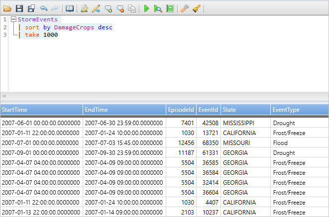
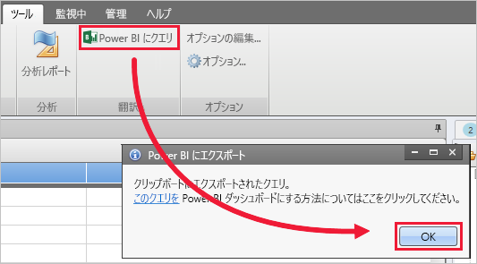
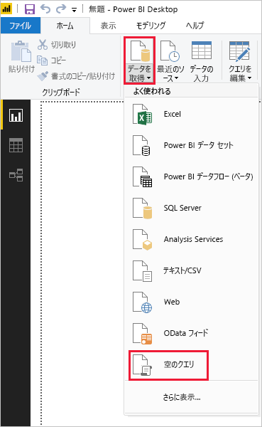
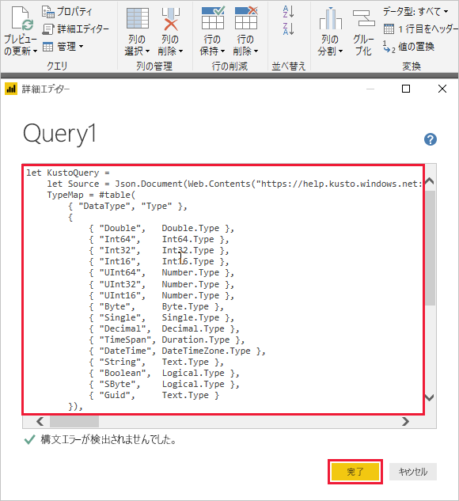
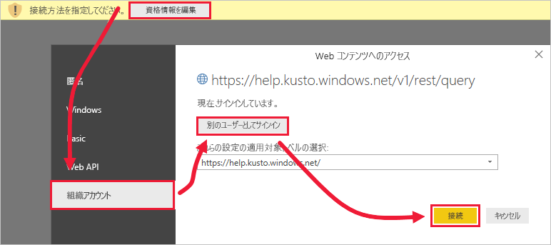
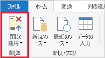

# <a name="quickstart-visualize-data-using-a-query-imported-into-power-bi"></a>クイック スタート:Power BI にインポートされたクエリを使用してデータを視覚化する

Azure Data Explorer は、ログと利用統計情報データのための高速で拡張性に優れたデータ探索サービスです。 Power BI はビジネス分析ソリューションであり、データを視覚化して、組織全体で結果を共有することができます。

Azure Data Explorer には、Power BI のデータに接続する方法が 3 つ用意されています。ビルトインのコネクタを使用する方法、Azure Data Explorer からクエリをインポートする方法、SQL クエリを使用する方法です。 このクイック スタートでは、データを取得して Power BI レポートで視覚化できるようにクエリをインポートする方法を説明します。

Azure サブスクリプションをお持ちでない場合は、開始する前に[無料の Azure アカウント](https://azure.microsoft.com/free/)を作成してください。

## <a name="prerequisites"></a>前提条件

このクイック スタートを完了するには、次のものが必要となります。

* Azure Active Directory のメンバーである組織の電子メール アカウント。このアカウントによって [Azure Data Explorer ヘルプ クラスター](https://dataexplorer.azure.com/clusters/help/databases/samples)に接続できます。

* [Power BI Desktop](https://powerbi.microsoft.com/get-started/) (**[無料ダウンロード]** を選択)

* [Azure Data Explorer デスクトップ アプリケーション](/azure/kusto/tools/kusto-explorer)

## <a name="get-data-from-azure-data-explorer"></a>Azure Data Explorer からデータを取得する

まず、Azure Data Explorer デスクトップ アプリケーションでクエリを作成し、それを Power BI 用にエクスポートします。 次に、Azure Data Explorer ヘルプ クラスターに接続し、*StormEvents* テーブルからデータのサブセットを取り込みます。 [!INCLUDE [data-explorer-storm-events](../../includes/data-explorer-storm-events.md)]

1. ブラウザーで [https://help.kusto.windows.net/](https://help.kusto.windows.net/) にアクセスして Azure Data Explorer デスクトップ アプリケーションを起動します。

1. デスクトップ アプリケーションで、次のクエリを右上のクエリ ウィンドウにコピーして実行します。

    ```Kusto
    StormEvents
    | sort by DamageCrops desc
    | take 1000
    ```

    結果セットの先頭の数行は、次の画像のように表示されます。

    

1. **[ツール]** タブで **[Query to Power BI]\(Power BI のクエリに変換\)** を選択し、**[OK]** を選択します。

    

1. Power BI Desktop の **[ホーム]** タブで、**[データの取得]**、**[空のクエリ]** の順に選択します。

    

1. Power Query エディターの **[ホーム]** タブで、**[詳細エディター]** を選択します。

1. エクスポートしたクエリを **[詳細エディター]** ウィンドウに貼り付けて、**[完了]** を選択します。

    

1. Power Query エディターのメイン ウィンドウで **[資格情報の編集]** を選択します。 **[組織アカウント]** を選択してサインインし、**[接続]** を選択します。

    

1. **[ホーム]** タブの **[Close & Apply]\(閉じて適用\)** を選択します。

    

## <a name="visualize-data-in-a-report"></a>レポートでデータを視覚化する

[!INCLUDE [data-explorer-power-bi-visualize-basic](../../includes/data-explorer-power-bi-visualize-basic.md)]

## <a name="clean-up-resources"></a>リソースのクリーンアップ

このクイック スタートで作成したレポートが不要になったら、Power BI Desktop (.pbix) ファイルを削除してください。

## <a name="next-steps"></a>次の手順

> [!div class="nextstepaction"]
> [クイック スタート:Power BI にインポートされたクエリを使用してデータを視覚化する](power-bi-sql-query.md)