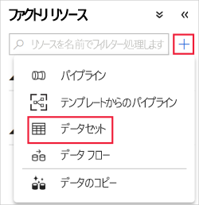
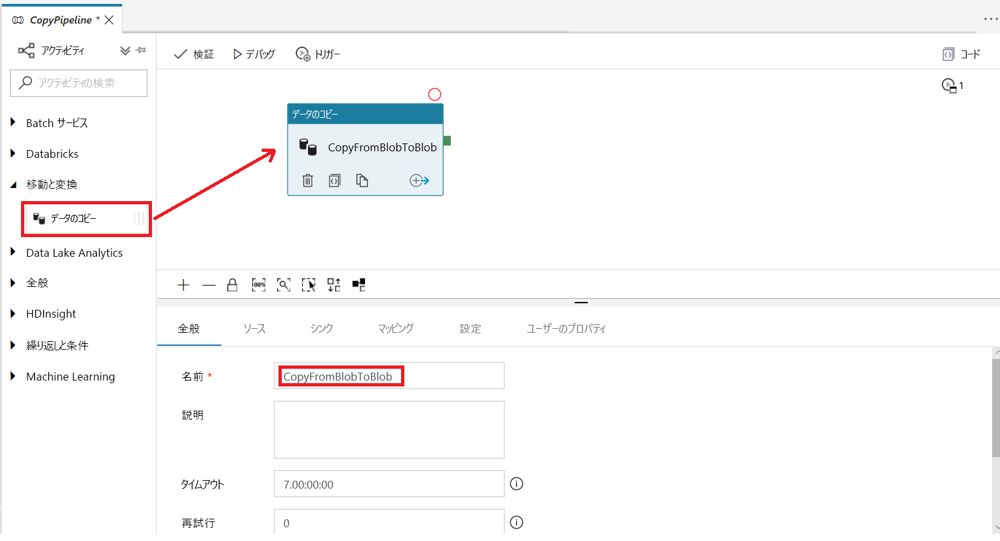
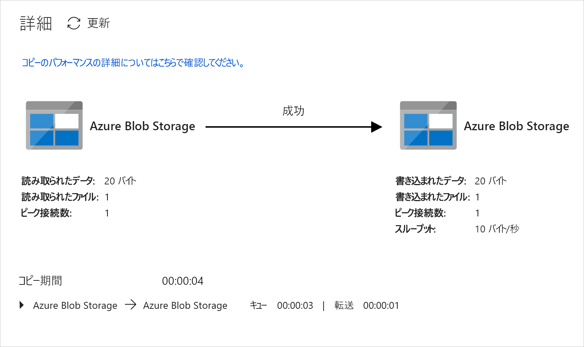

# Azure Data Factory UI を使用してデータ ファクトリを作成する
> [!div class="op_single_selector" title1="Select the version of Data Factory service that you are using:"]
> * [バージョン 1 - 一般公開](v1/data-factory-copy-data-from-azure-blob-storage-to-sql-database.md)
> * [バージョン 2 - プレビュー](quickstart-create-data-factory-portal.md)

このクイックスタートでは、Azure Data Factory UI を使用してデータ ファクトリを作成および監視する方法について説明します。 このデータ ファクトリに作成したパイプラインは、データを Azure Blob Storage 内のあるフォルダーから別のフォルダーに "*コピー*" します。 Azure Data Factory を使用してデータを "*変換*" する方法のチュートリアルについては、[Spark を使用したデータ変換のチュートリアル](tutorial-transform-data-spark-portal.md)を参照してください。 

> [!NOTE]
> Azure Data Factory を初めて使用する場合は、このクイック スタートを実行する前に、「[Azure Data Factory の概要](data-factory-introduction.md)」を参照してください。 
>
> この記事は、現在プレビュー段階にある Data Factory のバージョン 2 に適用されます。 一般公開 (GA) されているサービスのバージョン 1 を使用している場合は、[Data Factory バージョン 1 のチュートリアル](v1/data-factory-copy-data-from-azure-blob-storage-to-sql-database.md)を参照してください。

[!INCLUDE [data-factory-quickstart-prerequisites](../../includes/data-factory-quickstart-prerequisites.md)] 

### ビデオ 
このビデオを視聴すると、Data Factory UI を理解できます。 
>[!VIDEO https://channel9.msdn.com/Shows/Azure-Friday/Visually-build-pipelines-for-Azure-Data-Factory-v2/Player]

## Data Factory を作成する。

1. [Azure ポータル](https://portal.azure.com)にアクセスします。 
2. 左側のメニューの **[新規]** を選択し、**[データ + 分析]** を選択して、**[Data Factory]** を選択します。 
   
   ![[新規] ウィンドウでの [Data Factory] の選択](./media/quickstart-create-data-factory-portal/new-azure-data-factory-menu.png)
2. **[新しいデータ ファクトリ]** ページで、**[名前]**に「**ADFTutorialDataFactory**」と入力します。 
      
   ![[新しいデータ ファクトリ] ページ](./media/quickstart-create-data-factory-portal/new-azure-data-factory.png)
 
   Azure データ ファクトリの名前は *グローバルに一意*にする必要があります。 次のエラーが発生した場合は、データ ファクトリの名前を変更して (**&lt;yourname&gt;ADFTutorialDataFactory** など) 作成し直してください。 Data Factory アーティファクトの名前付け規則については、[Data Factory の名前付け規則](naming-rules.md)に関する記事を参照してください。
  
   
3. **[サブスクリプション]** で、データ ファクトリを作成する Azure サブスクリプションを選択します。 
4. **[リソース グループ]** で、次の手順のいずれかを行います。
     
   - **[既存のものを使用]** を選択し、一覧から既存のリソース グループを選択します。 
   - **[新規作成]**を選択し、リソース グループの名前を入力します。   
         
   リソース グループの詳細については、 [リソース グループを使用した Azure のリソースの管理](../azure-resource-manager/resource-group-overview.md)に関するページを参照してください。  
4. **[バージョン]** では、**[V2 (プレビュー)]** を選択します。
5. **[場所]** で、データ ファクトリの場所を選択します。

   この一覧に表示されるのは、Data Factory でサポートされている場所のみです。 Data Factory で使用するデータ ストア (Azure Storage、Azure SQL Database など) やコンピューティング (Azure HDInsight など) は他の場所に配置できます。
6. **[ダッシュボードにピン留めする]** をオンにします。     
7. **[作成]**を選択します。
8. ダッシュボードに、**[Deploying Data Factory]\(Data Factory をデプロイしています\)** というステータスを示した次のタイルが表示されます。 

   ![[Deploying data factory]\(データ ファクトリをデプロイしています\) タイル](media//quickstart-create-data-factory-portal/deploying-data-factory.png)
9. 作成が完了すると、**[Data Factory]** ページが表示されます。 **[作成と監視]** タイルを選択して、別のタブで Azure Data Factory ユーザー インターフェイス (UI) アプリケーションを起動します。
   
   ![[作成と監視] タイルが表示された、データ ファクトリのホーム ページ](./media/quickstart-create-data-factory-portal/data-factory-home-page.png)
10. **[Let's get started]\(始めましょう\)** ページで、左側のパネルで **[編集]** タブに切り替えます。 

    ![[Let's get started]\(始めましょう\) ページ](./media/quickstart-create-data-factory-portal/get-started-page.png)

## リンクされたサービスを作成する
この手順では、Azure ストレージ アカウントをデータ ファクトリにリンクするためのリンクされたサービスを作成します。 リンクされたサービスは、Data Factory サービスが実行時に接続するために使用する接続情報を持っています。

1. **[接続]** を選択し、ツール バーの **[新規]** ボタンを選択します。 

       
2. **[New Linked Service]\(新しいリンクされたサービス\)** ページで **[Azure Blob Storage]** を選択し、**[続行]** を選択します。 

   ![[Azure Blob Storage] タイルの選択](./media/quickstart-create-data-factory-portal/select-azure-storage.png)
3. 次の手順を完了します。 

   a.[サインオン URL] ボックスに、次のパターンを使用して、ユーザーが RightScale アプリケーションへのサインオンに使用する URL を入力します。 **[名前]** に「**AzureStorageLinkedService**」と入力します。

   b. **[ストレージ アカウント名]** で Azure ストレージ アカウントの名前を選択します。

   c. **[テスト接続]** を選択して、Data Factory サービスがストレージ アカウントに接続できることを確認します。 

   d. **[保存]** を選択して、リンクされたサービスを保存します。 

    
4. リンクされたサービスの一覧に **AzureStorageLinkedService** が表示されていることを確認します。 

   

## データセットを作成する
この手順では、**InputDataset** と **OutputDataset** という 2 つのデータセットを作成します。 これらのデータセットの種類は、**AzureBlob** です。 これらは、前のセクションで作成した Azure Storage のリンクされたサービスを参照します。 

入力データセットは、入力フォルダーのソース データを表します。 入力データセットの定義では、ソース データを格納している BLOB コンテナー (**adftutorial**)、フォルダー (**input**)、およびファイル (**emp.txt**) を指定します。 

出力データセットは、ターゲットにコピーされるデータを表します。 出力データセットの定義では、データのコピー先の BLOB コンテナー (**adftutorial**)、フォルダー (**output**)、およびファイルを指定します。 パイプラインの各実行には、一意の ID が関連付けられます。 この ID には、システム変数 **RunId** を使用してアクセスできます。 出力ファイルの名前は、パイプラインの実行 ID に基づいて動的に評価されます。   

リンクされたサービスの設定では、ソース データを含む Azure ストレージ アカウントを指定しました。 ソース データセットの設定では、ソース データがどこにあるかを正確に指定します (BLOB コンテナー、フォルダー、およびファイル)。 シンク データセットの設定では、データがどこにコピーされるかを指定します (BLOB コンテナー、フォルダー、およびファイル)。 
 
1. **+** (正符号) ボタンを選択し、**[データセット]** を選択します。

   
2. **[新しいデータセット]** ページで **[Azure Blob Storage]** を選択し、**[完了]** を選択します。 

   ![[Azure Blob Storage] の選択](./media/quickstart-create-data-factory-portal/select-azure-blob-storage.png)
3. データセットの **[プロパティ]** ウィンドウで、**[名前]** に「**InputDataset**」と入力します。 

   
4. **[接続]** タブに切り替えて、次の手順を実行します。 

   a.[サインオン URL] ボックスに、次のパターンを使用して、ユーザーが RightScale アプリケーションへのサインオンに使用する URL を入力します。 **[リンクされたサービス]** で **[AzureStorageLinkedService]** を選択します。

   b. **[ファイル パス]** で、**[参照]** ボタンを選択します。

      ![[接続] タブと [参照] ボタン](./media/quickstart-create-data-factory-portal/file-path-browse-button.png) c. **[Choose a file or folder]\(ファイルまたはフォルダーの選択\)** ウィンドウで、**adftutorial** コンテナーの **input** フォルダーを参照し、**emp.txt** ファイルを選択して、**[完了]** をクリックします。

      
    
   d. (省略可能) **[データのプレビュー]** を選択して、emp.txt ファイル内のデータをプレビューします。     
5. この手順を繰り返して、出力データセットを作成します。  

   a.[サインオン URL] ボックスに、次のパターンを使用して、ユーザーが RightScale アプリケーションへのサインオンに使用する URL を入力します。 **+** (正符号) ボタンを選択し、**[データセット]** を選択します。

   b. **[新しいデータセット]** ページで **[Azure Blob Storage]** を選択し、**[完了]** を選択します。

   c. 名前として「**OutputDataset**」と指定します。

   d. フォルダーとして「**adftutorial/output**」と入力します。 出力フォルダーがない場合は、コピー アクティビティによって作成されます。

   e. ファイル名に「`@CONCAT(pipeline().RunId, '.txt')`」と入力します。 
   
      パイプラインを実行するたびに、パイプラインの実行に一意の ID が関連付けられます。 式はパイプラインの実行 ID と **.txt** を連結して、出力ファイル名を評価します。 サポートされているシステム変数および式の一覧については、[システム変数](control-flow-system-variables.md)に関するページと[式言語](control-flow-expression-language-functions.md)に関するページを参照してください。

   

## パイプラインを作成する。 
この手順では、入力データセットと出力データセットを使用するコピー アクティビティを持つパイプラインを作成および検証します。 コピー アクティビティにより、入力データセットの設定で指定されたファイルから、出力データセットの設定で指定されたファイルにデータがコピーされます。 入力データセットで、ファイル名を指定せず、フォルダーのみを指定すると、コピー アクティビティはソース フォルダーのすべてのファイルをターゲットにコピーします。 

1. **+** (正符号) ボタンを選択し、**[パイプライン]** を選択します。 

   
2. **[プロパティ]** ウィンドウの **[名前]** に「**CopyPipeline**」と指定します。 

   
3. **[アクティビティ]** ツールボックスで **[データ フロー]** を展開します。 **[アクティビティ]** ツールボックスからパイプライン デザイナー画面に **[コピー]** アクティビティをドラッグします。 **[アクティビティ]** ツールボックスで、アクティビティを検索することもできます。 **[名前]** に「**CopyFromBlobToBlob**」と指定します。

   
4. コピー アクティビティの設定で **[ソース]** タブに切り替えて、**[Source Dataset]\(ソース データセット\)** で **[InputDataset]** を選択します。

       
5. コピー アクティビティの設定で **[シンク]** タブに切り替えて、**[Sink Dataset]\(シンク データセット\)** で **[OutputDataset]** を選択します。

       
7. **[検証]** を選択して、パイプラインの設定を検証します。 パイプラインが正常に検証されたことを確認します。 検証出力を閉じるには、**>>** (右矢印) ボタンを選択します。 

   

## パイプラインをテスト実行する
この手順では、パイプラインを Data Factory にデプロイする前にテスト実行します。 

1. パイプラインのツール バーで、**[テストの実行]** を選択します。 
    
   
2. パイプラインの設定の **[出力]** タブに、パイプラインの実行の状態が表示されることを確認します。 

       
3. **adftutorial** コンテナーの **output** フォルダーに出力ファイルがあることを確認します。 output フォルダーが存在しない場合は、Data Factory サービスによって自動的に作成されます。 
    
   

## パイプラインを手動でトリガーする
この手順では、Azure Data Factory にエンティティ (リンクされたサービス、データセット、パイプライン) をデプロイします。 次に、パイプラインの実行を手動でトリガーします。 エンティティを自分の Visual Studio Team Services Git リポジトリに発行することもできます。これについては、[別のチュートリアル](tutorial-copy-data-portal.md?#configure-code-repository)で説明します。

1. パイプラインをトリガーする前に、エンティティを Data Factory に発行する必要があります。 発行するには、左側のウィンドウで **[発行]** を選択します。 

   ![[発行] ボタン](./media/quickstart-create-data-factory-portal/publish-button.png)
2. パイプラインを手動でトリガーするには、ツール バーの **[トリガー]** を選択し、**[Trigger Now]\(今すぐトリガー\)** を選択します。 
    
   ![[Trigger Now]\(今すぐトリガー\) コマンド](./media/quickstart-create-data-factory-portal/pipeline-trigger-now.png)

## パイプラインの監視

1. 左側で **[監視]** タブに切り替えます。 **[最新の情報に更新]** ボタンを使用して、一覧を更新します。

   ![[最新の情報に更新] ボタンが表示されている、パイプライン実行を監視するためのタブ](./media/quickstart-create-data-factory-portal/monitor-trigger-now-pipeline.png)
2. **[アクション]** の **[View Activity Runs]\(アクティビティの実行の表示\)** リンクを選択します。 コピー アクティビティの実行の状態が、このページに表示されます。 

   
3. コピー操作の詳細を確認するには、**[アクション]** 列にある **[詳細]** (眼鏡アイコン) リンクを選択します。 プロパティの詳細については、[コピー アクティビティの概要](copy-activity-overview.md)に関するページを参照してください。 

   
4. **output** フォルダーに新しいファイルが表示されていることを確認します。 
5. **[パイプライン]** リンクを選択すると、**[アクティビティの実行]** ビューから **[Pipeline Runs]\(パイプラインの実行\)** ビューに戻ることができます。 

## スケジュールに基づいてパイプラインをトリガーする
この手順は、このチュートリアルでは省略できます。 "*スケジューラ トリガー*" を作成して、パイプラインを定期的 (毎時、毎日など) に実行するようにスケジュールすることができます。 この手順では、指定した終了日時まで毎分実行するようにトリガーを作成します。 

1. **[編集]** タブに切り替えます。 

   ![[編集] ボタン](./media/quickstart-create-data-factory-portal/switch-edit-tab.png)
1. メニューの **[トリガー]** を選択し、**[New/Edit]\(新規作成/編集\)** を選択します。 

   
2. **[Add Triggers]\(トリガーの追加\)** ページで、**[Choose trigger]\(トリガーの選択\)** を選択し、**[新規]** を選択します。 

   
3. **[新しいトリガー]** ページの **[終了]** で **[指定日]** を選択し、終了時刻として現在から数分後を指定して、**[適用]** を選択します。 

   各パイプラインの実行にはコストがかかります。そのため、開始時刻からほんの数分後の終了時刻を指定してください。 同じ日であることを確認します。 ただし、発行時から終了時刻までにパイプラインを実行できる十分な時間があるようにします。 トリガーは、UI でトリガーを保存したときではなく、Data Factory にソリューションを発行した後で有効になります。 

   
4. **[新しいトリガー]** ページで、**[アクティブ化済み]** チェック ボックスをオンにし、**[次へ]** を選択します。 

   ![[アクティブ化済み] チェック ボックスと [次へ] ボタン](./media/quickstart-create-data-factory-portal/trigger-settings-next.png)
5. 警告メッセージを確認し、**[完了]** を選択します。

   ![警告と [完了] ボタン](./media/quickstart-create-data-factory-portal/new-trigger-finish.png)
6. **[発行]** をクリックして、変更を Data Factory に発行します。 

   ![[発行] ボタン](./media/quickstart-create-data-factory-portal/publish-2.png)
8. 左側で **[監視]** タブに切り替えます。 **[最新の情報に更新]** を選択して、一覧を更新します。 発行時刻から終了時刻まで、毎分 1 回パイプラインが実行されることがわかります。 

   **[トリガー元]** 列の値に注意してください。 手動のトリガー実行は、前に行った手順 (**[Trigger Now]\(今すぐトリガー\)**) によるものでした。 

   
9. **[Pipeline Runs]\(パイプラインの実行\)** の横にある下向き矢印を選択して、**[Trigger Runs]\(トリガーの実行\)** ビューに切り替えます。 

   ![[Trigger Runs]\(トリガーの実行\) ビューへの切り替え](./media/quickstart-create-data-factory-portal/monitor-trigger-runs.png)    
10. **output** フォルダー内に、指定した終了日時までパイプラインが実行されるたびに出力ファイルが作成されていることを確認します。 

## 次の手順
このサンプルのパイプラインは、Azure Blob Storage 内のある場所から別の場所にデータをコピーします。 より多くのシナリオで Data Factory を使用する方法については、[チュートリアル](tutorial-copy-data-portal.md)を参照してください。 