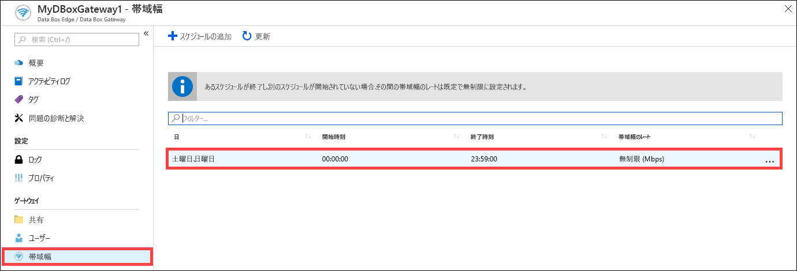

# Azure portal を使用して Azure Data Box Gateway の帯域幅のスケジュールを管理する  

この記事では、Data Box Gateway のユーザーを管理する方法について説明します。 帯域幅のスケジュールを使用すると、複数の時刻スケジュールにわたって、ネットワーク帯域幅の使用量を構成することができます。 これらのスケジュールは、デバイスとクラウド間のアップロード操作とダウンロード操作に適用することができます。 

Azure portal を使用して Data Box Gateway の帯域幅スケジュールを追加、変更、または削除することができます。

> [!IMPORTANT]
> - Data Box Gateway はプレビュー段階にあります。 このソリューションを注文して展開する前に、[Azure プレビューの追加使用条件](https://azure.microsoft.com/support/legal/preview-supplemental-terms/)を確認してください。

この記事では、次のことについて説明します:

> [!div class="checklist"]
> * スケジュールの追加
> * スケジュールの変更
> * スケジュールの削除 

## スケジュールの追加

ユーザーを追加するには、Azure portal で次の手順を実行します。

1. Azure portal の Data Box Gateway リソースで、**[帯域幅]** に移動します。
2. 右側のウィンドウで、**[+ スケジュールの追加]** をクリックします。

    ![[ユーザーの追加] をクリックする](media/data-box-gateway-manage-bandwidth-schedules/add-schedule-1.png)

3. **[スケジュールの追加]** で、以下の操作を行います。 

    1. スケジュールの **[開始日]**、**[終了日]**、**[開始時刻]**、および **[終了時刻]** を指定します。 
    2. このスケジュールを 1 日中実行する場合は、**[終日]** オプションをオンにすることができます。 
    3. **[帯域幅のレート]** は、クラウドに関連する操作 (アップロードとダウンロード) でデバイスが使用する帯域幅 (メガビット/秒 (Mbps)) です。 1 ～ 1,000 の値をこのフィールドで指定します。 
    4. アップロードとダウンロードの日付を調整しない場合は、**[無制限の帯域幅]** をオンにします。 
    5. **[追加]** をクリックします。

    ![[ユーザーの追加] をクリックする](media/data-box-gateway-manage-bandwidth-schedules/add-schedule-2.png)

3. 指定したパラメーターでスケジュールが作成されます。 このスケジュールは、ポータルで、帯域幅のスケジュールの一覧に表示されます。

## スケジュールの編集

帯域幅のスケジュールを編集するには、次の手順を実行します。 

1. Azure portal で Data Box Gateway リソースに移動し、[帯域幅] に移動します。 
2. 帯域幅のスケジュールの一覧で、変更するスケジュールを選択してクリックします。
    

3. 必要な変更を加えたら、変更を保存します。

    

4. スケジュールを変更した後、スケジュールの一覧は、変更されたスケジュールを反映するように更新されます。

    

## スケジュールの削除

Data Box Gateway デバイスに関連付けられている帯域幅のスケジュールを削除するには、次の手順を実行します。

1. Azure portal で Data Box Gateway リソースに移動し、**[帯域幅]** に移動します。  

2. 帯域幅のスケジュールの一覧で、削除するスケジュールを選択します。 右クリックしてコンテキスト メニューを表示し、**[削除]** をクリックします。 

   

3.  スケジュールを削除した後、スケジュールの一覧が更新されます。

## 次の手順

- [帯域幅を管理する](data-box-gateway-manage-bandwidth-schedules.md)方法について学習します。
