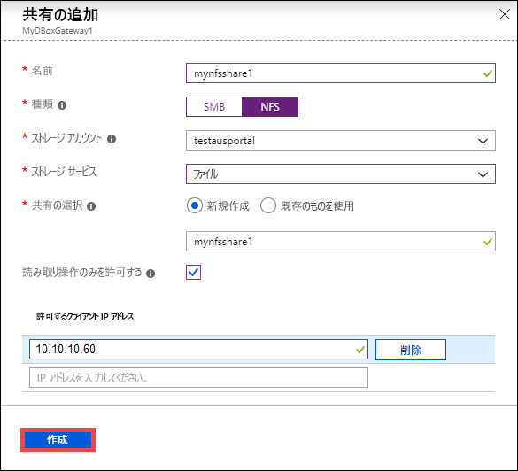
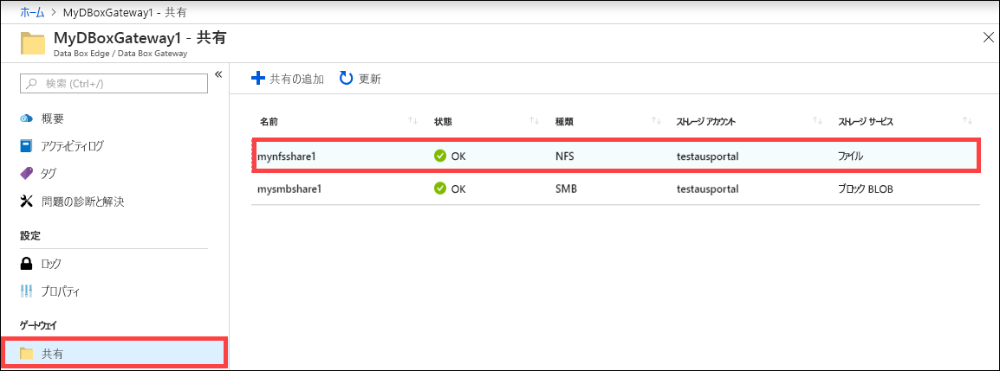
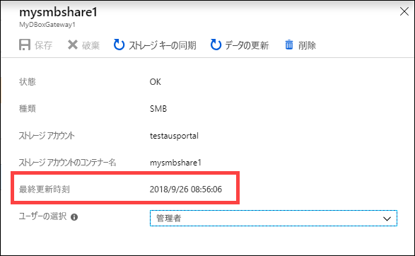
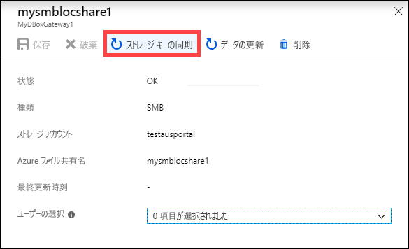

# Azure portal を使用して Azure Data Box Gateway の共有を管理する 

この記事では、Azure Data Box Gateway の共有を管理する方法について説明します。 Azure Data Box Gateway の管理は、Azure portal またはローカル Web UI を通じて行えます。 Azure portal を使用して共有を追加、削除、更新したり、共有に関連するストレージ アカウントのストレージ キーを同期したりします。

## 共有について

データを Azure に転送するには、Azure Data Box Gateway で共有を作成する必要があります。 Data Box Gateway デバイスに追加する共有は、クラウド共有です。 これらの共有のデータは、クラウドに自動的にアップロードされます。 これらの共有には、すべてのクラウド機能 (更新、ストレージ キーの同期など) が適用されます。 デバイス データがクラウドのストレージ アカウントに自動的にプッシュされるようにする場合は、クラウド共有を使用します。

この記事では、次のことについて説明します。

> [!div class="checklist"]
> * 共有の追加
> * 共有を削除する
> * 共有の更新
> * ストレージ キーの同期

## 共有の追加

共有を作成するには、Azure portal で次の手順を実行します。

1. Azure portal で Data Box Gateway リソースに移動し、**[概要]** に移動します。 コマンド バーの **+ [共有の追加]** をクリックします。
2. **[共有の追加]** で共有設定を指定します。 共有の一意の名前を指定します。

    ![[共有の追加] をクリックする](media/data-box-gateway-manage-shares/add-share-1.png)

    共有名には、数字、英小文字、ハイフンのみを使用できます。 共有名の長さは 3 から 63 文字で、先頭は英字または数字にする必要があります。 各ハイフンの前後にはハイフン以外の文字を指定する必要があります。

3. 共有の **[種類]** を選択します。 種類には **SMB** (既定値) または **NFS** を選択することができます。 SMB は Windows クライアントの場合に標準です。また、Linux クライアントの場合は NFS が使用されます。 SMB 共有と NFS 共有のどちらを選択するかに応じて、表示されるオプションの一部が変わります。

4. 共有を配置する**ストレージ アカウント**を指定します。 コンテナーがまだ存在しない場合は、ストレージ アカウントに共有名を持つコンテナーが作成されます。 コンテナーが既に存在する場合は、既存のコンテナーが使用されます。

5. ブロック BLOB、ページ BLOB、またはファイルから **[ストレージ サービス]** を選択します。 選択されるサービスの種類は、Azure に存在するデータの形式によって変わります。 たとえば、このインスタンスでは、BLOB ブロックとして Azure にデータを配置するため、**[ブロック BLOB]** を選択します。 **[ページ BLOB]** を選択する場合は、データが 512 バイトでアラインされていることを確認する必要があります。 たとえば、VHDX は常に 512 バイトでアラインされています。

6. この手順は、SMB 共有と NFS 共有のどちらを作成するかに応じて変わります。
    - **SMB 共有を作成する場合** - **[すべての権限を持つローカル ユーザー]** フィールドで、**[新規作成]** または **[既存のものを使用]** を選択します。 新しいローカル ユーザーを作成する場合は、**ユーザー名**、**パスワード**を指定し、パスワードの確認を入力します。 これで、ローカル ユーザーにアクセス許可が割り当てられます。 ここで割り当てたアクセス許可は、ファイル エクスプローラーを使用して変更できます。

        

        この共有データに対して [読み取り操作のみを許可する] をオンにすると、読み取り専用ユーザーを指定することができます。
    - **NFS 共有を作成する場合** - 共有へのアクセスが**許可されたクライアントの IP アドレス**を指定する必要があります。

        

7. **[作成]** をクリックして共有を作成します。 共有の作成が進行中であることが通知されます。 指定した設定で共有を作成すると、**[共有]** ブレードは更新され、新しい共有が反映されます。
 
## 共有を削除する

共有を削除するには、Azure portal で次の手順を実行します。

1. 共有の一覧で、削除したい共有を選択してクリックします。

    

2. **[削除]** をクリックします。 

    ![[削除] をクリック](media/data-box-gateway-manage-shares/delete-2.png)

3. 確認を求められたら、 **[はい]** をクリックします。

    

共有の一覧が更新され、削除が反映されます。

## 共有の更新

更新機能を使用すると、オンプレミスの共有の内容を更新することができます。 共有を更新すると、前回の更新後にクラウドに追加された BLOB とファイルを含むすべての Azure オブジェクトを見つけるために、検索が開始されます。 これらの追加ファイルは、後でデバイス上のオンプレミスの共有の内容を更新するために使用されます。 

> [!NOTE]
> アクセス許可とアクセス制御リスト (ACL) は、更新操作の間で保持されません。 

共有を更新するには、Azure portal で次の手順を実行します。

1.  Azure portal で **[共有]** に移動します。 更新したい共有を選択してクリックします。

    

2.  **[最新の情報に更新]** をクリックします。 

    ![[最新の情報に更新] をクリックする](media/data-box-gateway-manage-shares/refresh-2.png)
 
3.  確認を求められたら、 **[はい]** をクリックします。 オンプレミスの共有の内容を更新するジョブが開始されます。 

    
 
4.  更新の進行中は、コンテキスト メニューで更新オプションが淡色表示になります。 更新ジョブの状態を表示するには、ジョブの通知をクリックします。

5.  更新の時間は、Azure コンテナー内のファイルの数と、デバイス上のファイルの数によって異なります。 更新が正常に完了すると、共有のタイムスタンプが更新されます。 更新が部分的に失敗しても、操作は成功したと見なされ、タイムスタンプが更新されます。 

    
 
失敗がある場合は、アラートが発生します。 アラートには、問題を解決するための推奨事項と原因が詳しく記載されています。 アラートには、更新または削除が失敗したファイルなど、失敗の完全なまとめが記載されているファイルへのリンクもあります。

>[!IMPORTANT]
> このリリースでは、一度に複数の共有を更新しないでください。

## ストレージ キーの同期

ストレージ アカウント キーのローテーションが行われたら、ストレージ アクセス キーを同期する必要があります。 同期すると、ストレージ アカウントの最新のキーをデバイスで取得することができます。

ストレージ アクセス キーを同期するには、Azure portal で次の手順を実行してください。

1. リソースの **[概要]** に移動します。 
2. 共有の一覧で、同期する必要があるストレージ アカウントに関連付けられている共有を選択してクリックします。**[ストレージ キーの同期]** をクリックします。 

     

3. ページ下部の **[はい]** をクリックします。 同期が完了したら、ダイアログを閉じます。

     

>[!NOTE]
> 指定のストレージ アカウントに対してこれを実行しなければならないのは 1 回だけです。 同じストレージ アカウントに関連付けられているすべての共有に対して、この操作を繰り返す必要はありません。

## 次の手順

- [Azure portal を使用してユーザーを管理する](data-box-gateway-manage-users.md)方法について学習します。
