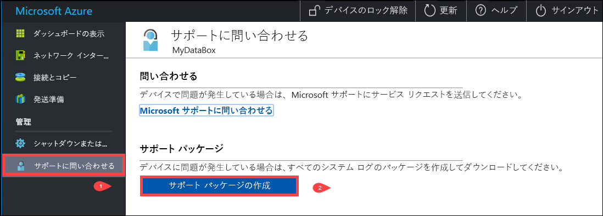
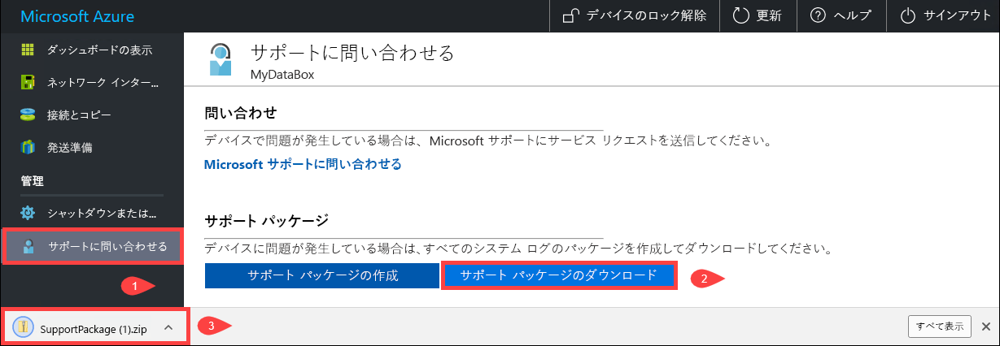
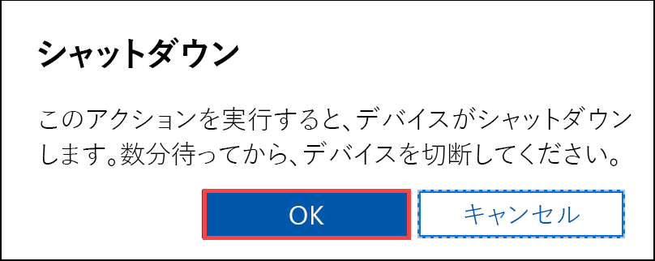
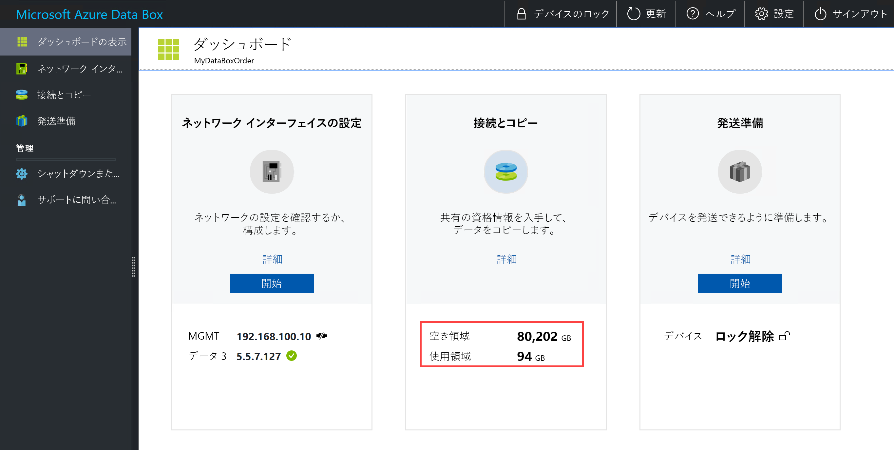
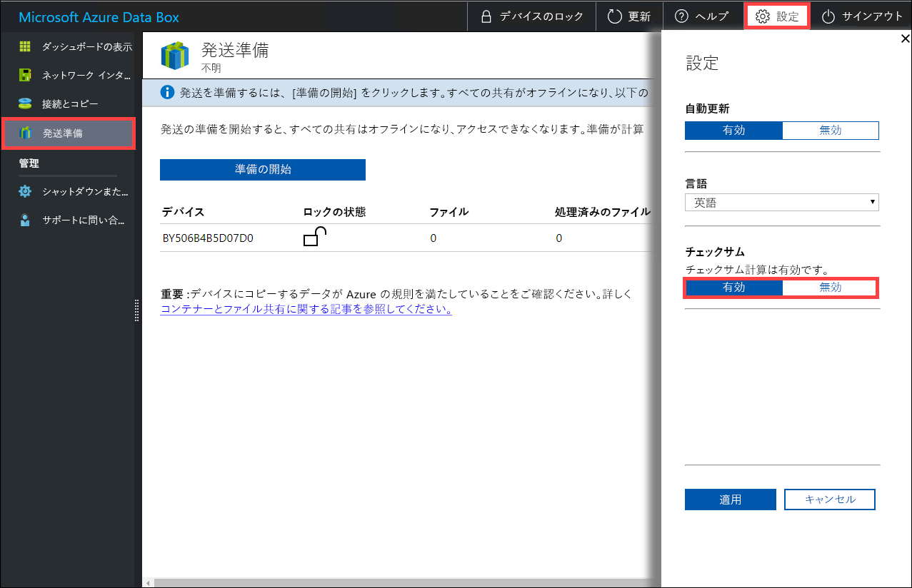

# ローカル Web UI を使用して Data Box を管理する

この記事では、Data Box で実行できる一部の構成と管理タスクについて説明します。 Data Box の管理は、Azure portal UI またはデバイスのローカル Web UI から行うことができます。 この記事では、ローカル Web UI を使用して実行できるタスクについて説明します。

Data Box のローカル Web UI は、デバイスの初期構成に使用されます。 ローカル Web UI を使用して、Data Box のシャットダウンまたは再起動、診断テストの実行、ソフトウェアの更新、コピー ログの表示、および Microsoft サポートのログ パッケージの生成を行うこともできます。

この記事には次のチュートリアルが含まれています。

- サポート パッケージの生成
- デバイスのシャットダウンと再起動
- デバイスからのデータの安全な消去
- デバイスの使用可能な容量の監視
- チェックサム検証のスキップ 

## サポート パッケージの生成

デバイスの問題が発生した場合は、システム ログからサポート パッケージを作成できます。 Microsoft サポートでは、このパッケージを使用して問題のトラブルシューティングを行います。 サポート パッケージを作成するには、次の手順を実行します。

1. ローカル Web UI で、**[サポートにお問い合わせ]** に移動し、**[サポート パッケージの作成]** をクリックします。

    

2. サポート パッケージが収集されます。 この操作は、数分かかります。

    

3. サポート パッケージの作成が完了したら、**[サポート パッケージのダウンロード]** をクリックします。 

    

4. ダウンロードする場所を参照して選択します。 フォルダを開いて内容を表示します。

    

## デバイスのシャットダウンと再起動

ローカル Web UI を使用して、Data Box をシャットダウンまたは再起動できます。 再起動する前に、ホストの共有をオフラインにしてから、デバイスをオフラインにすることをお勧めします。 これにより、データ破損の可能性を最小限に抑えられます。 デバイスをシャットダウンするときに、データのコピーが進行中でないことを確認してください。

Data Box をシャットダウンするには、次の手順を実行します。

1. ローカル Web UI で、**[シャット ダウンまたは再起動]** に移動します。
2. **[シャットダウン]** をクリックします。

    

3. 確認を求められたら、**[OK]** をクリックして続行します。

    

デバイスがシャットダウンしたら、フロントパネルの電源ボタンを使用して、デバイスをオンにします。

Data Box を再起動するには、次の手順を実行します。

1. ローカル Web UI で、**[シャット ダウンまたは再起動]** に移動します。
2. **[Restart (再開)]** をクリックします。

    

3. 確認を求められたら、**[OK]** をクリックして続行します。

   デバイスは、シャットダウンしてから再起動します。

## デバイスの使用可能な容量の表示

デバイス ダッシュボードを使用して、デバイスの使用可能な容量と使用済み容量を表示できます。 

1. ローカル Web UI で、**[ダッシュボードの表示]** に移動します。
2. **[接続とコピー]** の下に、デバイスの空き容量と使用済み容量が表示されます。

    

## チェックサム検証のスキップ

発送の準備をするときに、既定ではチェックサムがデータ用に生成されます。 特定のまれなケースにおいて、データ型 (小さいファイル サイズ) によっては、パフォーマンスが非常に遅くなることがあります。 このような場合は、チェックサムをスキップできます。 

パフォーマンスに重大な影響がない限り、チェックサムを無効にしないことを強くお勧めします。

1. デバイスのローカル Web UI の右上隅にある [設定] に移動します。

    

2. **[無効]** をクリックしてチェックサム検証を無効にします
3. **[Apply]** をクリックします。

## 次の手順

- [Azure portal から Data Box を管理する](data-box-portal-admin.md)方法について説明します。

