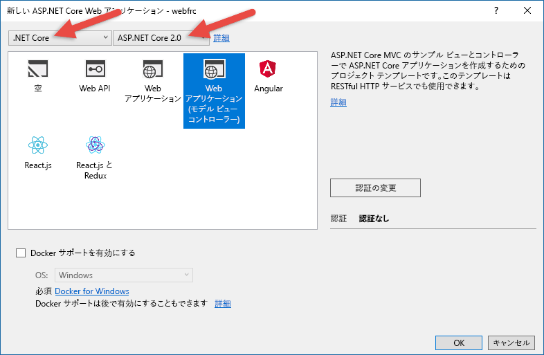
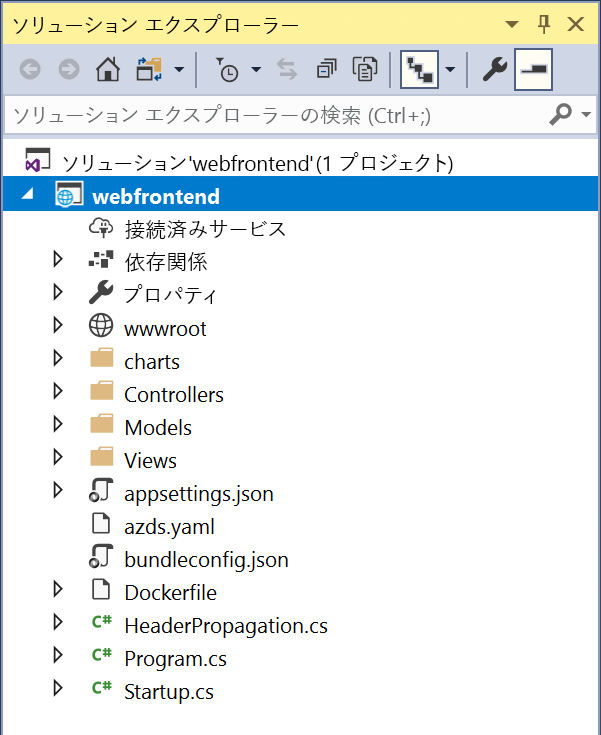

# <a name="get-started-on-azure-dev-spaces-with-net-core-and-visual-studio"></a>Azure Dev Spaces での .NET Core と Visual Studio の使用

このガイドでは、以下の方法について説明します。

- Azure でマネージド Kubernetes クラスターを使用して Azure Dev Spaces をセットアップする。
- Visual Studio を使用して、コンテナー内のコードを繰り返し開発する。
- 2 つのサービスを個別に開発し、Kubernetes の DNS サービス検索を使用して別のサービスを呼び出す。
- チーム環境でコードを生産的に開発してテストする。

[!INCLUDE[](includes/see-troubleshooting.md)]

[!INCLUDE[](includes/portal-aks-cluster.md)]

## <a name="get-the-visual-studio-tools"></a>Visual Studio Tools を入手する
1. 最新バージョンの [Visual Studio 2017](https://www.visualstudio.com/vs/) をインストールします。
1. Visual Studio インストーラーで、次のワークロードが選択されていることを確認します。
    * ASP.NET および Web の開発
1. [Visual Studio Tools for Kubernetes](https://aka.ms/get-azds-visualstudio) をインストールする

## <a name="create-a-web-app-running-in-a-container"></a>コンテナーで実行される Web アプリを作成する

このセクションでは、ASP.NET Core Web アプリを作成し、Kubernetes のコンテナーで実行します。

### <a name="create-an-aspnet-web-app"></a>ASP.NET Web アプリを作成する

Visual Studio 2017 で、新しいプロジェクトを作成します。 現時点では、このプロジェクトは **ASP.NET Core Web アプリケーション**である必要があります。 プロジェクトに "**webfrontend**" という名前を付けます。


**[Web アプリケーション (モデル ビュー コントローラー)]** テンプレートを選択し、ダイアログの上部にある 2 つのドロップダウンで **.NET Core** と **ASP.NET Core 2.0** が対象になっていることを確認します。 **[OK]** をクリックしてプロジェクトを作成します。




### <a name="enable-dev-spaces-for-an-aks-cluster"></a>AKS クラスターの開発空間を有効にする

先ほど作成したプロジェクトに対し、次の図のように、起動設定のドロップダウンから **[Azure Dev Spaces]** を選択します。


次に表示されるダイアログで、適切なアカウントでサインインしていることを確認し、既存の Kubernetes クラスターを選択します。


現時点では、**[スペース]** ドロップダウンは既定の `default` のままにしておきます。 このオプションについては、後で詳しく説明します。 パブリック エンドポイント経由で Web アプリにアクセスできるように、**[Publicly Accessible]\(パブリックにアクセス可能\)** チェック ボックスをオンにします。 この設定は必須ではありませんが、このチュートリアルの後の方でいくつかの概念を示す際に役立ちます。 いずれにせよ、Visual Studio を使用して Web サイトをデバッグできるので心配はありません。


**[OK]** をクリックして、クラスターを選択または作成します。

Azure Dev Spaces を使用できないクラスターを選択すると、クラスターを構成するかどうかをたずねるメッセージが表示されます。


**[OK]** をクリックします。

 処理を完了するために、バックグラウンド タスクが開始されます。 完了するまでに、数分かかります。 まだ作成中かどうかを確認するには、次の画像に示すように、ステータス バーの左下隅にある **[バックグラウンド タスク]** アイコンをポイントします。


> [!Note]
> 開発空間が正常に作成されるまで、アプリケーションをデバッグすることはできません。

### <a name="look-at-the-files-added-to-project"></a>プロジェクトに追加されたファイルを確認する
開発空間が作成されるのを待っている間に、開発空間を使用することを選択したときにプロジェクトに追加されたファイルを確認しておきましょう。

まず、`charts` という名前のフォルダーが追加されており、このフォルダー内にアプリケーションの [Helm チャート](https://docs.helm.sh)がスキャフォールディングされていることがわかります。 これらのファイルは、アプリケーションを開発空間に展開するために使用されます。

`Dockerfile` という名前のファイルが追加されています。 このファイルには、標準の Docker 形式でアプリケーションをパッケージ化するために必要な情報が含まれています。

最後に、`azds.yaml` という名前のファイルがあります。このファイルには、開発空間で必要となる開発時の構成が含まれています。



## <a name="debug-a-container-in-kubernetes"></a>Kubernetes でコンテナーをデバッグする
開発空間が正常に作成されたら、アプリケーションをデバッグすることができます。 コードにブレークポイントを設定します。たとえば、`HomeController.cs` ファイルの 20 行目 (`Message` 変数が設定されている行) に設定します。 **F5** キーを押してデバッグを開始します。 

Visual Studio は開発空間と通信してアプリケーションをビルドして展開した後、ブラウザーを開いて Web アプリを実行します。 コンテナーはローカルで実行されているように見えますが、実際には Azure の開発空間で実行されています。 localhost アドレスであるのは、Azure Dev Spaces では AKS で実行されているコンテナーへの一時的な SSH トンネルが作成されるためです。

ページの上部にある **[About]\(バージョン情報\)** リンクをクリックすると、ブレークポイントがトリガーされます。 コードがローカルで実行されている場合と同様に、デバッグ情報 (呼び出し履歴、ローカル変数、例外情報など) にフル アクセスできます。

## <a name="iteratively-develop-code"></a>反復的にコードを開発する

Azure Dev Spaces は、Kubernetes でコードを実行するだけのものではありません。Azure Dev Spaces を使用すると、クラウドの Kubernetes 環境でコードの変更が有効になっていることをすぐに繰り返し確認できるようになります。

### <a name="update-a-content-file"></a>コンテンツ ファイルを更新する
1. `./Views/Home/Index.cshtml` ファイルを見つけ、HTML を編集します。 たとえば、70 行目の `<h2>Application uses</h2>` を `<h2>Hello k8s in Azure!</h2>` のように変更します。
1. ファイルを保存します。
1. ブラウザーに移動し、ページを更新します。 Web ページに更新された HTML が表示されます。

なぜでしょうか? HTML や CSS などのコンテンツ ファイルを編集しても、.NET Core Web アプリで再コンパイルする必要はありません。アクティブな F5 セッションによって、変更されたコンテンツ ファイルが AKS で実行中のコンテナーに自動的に同期されるので、編集後のコンテンツをすぐに確認できます。

### <a name="update-a-code-file"></a>コード ファイルを更新する
コード ファイルを更新するには、.NET Core アプリを再ビルドし、更新されたアプリケーション バイナリを生成する必要があるため、もう少し作業が必要です。

1. Visual Studio のデバッガーを停止します。
1. `Controllers/HomeController.cs` という名前のコード ファイルを開き、About ページに表示されるメッセージ (`ViewData["Message"] = "Your application description page.";`) を編集します。
1. ファイルを保存します。
1. **F5** キーを押して再度デバッグを開始します。 

コードを編集するたびに新しいコンテナー イメージを再構築して再展開すると、多くの場合、かなりの時間がかかります。Azure Dev Spaces では、代わりに既存のコンテナー内でコードの増分再コンパイルを実行することで、編集/デバッグ ループを高速化します。

ブラウザーで Web アプリを更新し、About ページに移動します。 UI にカスタム メッセージが表示されます。


## <a name="call-another-container"></a>別のコンテナーを呼び出す
このセクションでは、2 つ目のサービス (`mywebapi`) を作成し、`webfrontend` でそのサービスを呼び出します。 各サービスは別々のコンテナーで実行されます。 その後、両方のコンテナーでデバッグします。


### <a name="download-sample-code-for-mywebapi"></a>*mywebapi* のサンプル コードをダウンロードする
時間を節約するために、GitHub リポジトリからサンプル コードをダウンロードしましょう。 https://github.com/Azure/dev-spaces に移動し、**[Clone or download]** をクリックして GitHub リポジトリをダウンロードします。 このセクションのコードは、`samples/dotnetcore/getting-started/mywebapi` にあります。

### <a name="run-mywebapi"></a>*mywebapi* を実行する
1. "*別の Visual Studio ウィンドウ*" で `mywebapi` プロジェクトを開きます。
1. 前に `webfrontend` プロジェクトで行ったように、起動設定ドロップダウンから **[Azure Dev Spaces]** を選択します。 今回は新しい AKS クラスターを作成するのではなく、作成済みのものを選択します。 前述のように、[スペース] は既定の `default` のままにし、**[OK]** をクリックします。 [出力] ウィンドウを見ると、デバッグを開始したときの作業速度を上げるために、Visual Studio によって開発空間でこの新しいサービスの "ウォーム アップ" が開始されたことがわかります。
1. F5 キーを押し、サービスがビルドされ、展開されるまで待ちます。 準備ができると、Visual Studio のステータス バーがオレンジ色に変わります。
1. **[出力]** ウィンドウの **[Azre Dev Spaces for AKS]** ウィンドウに表示されるエンドポイント URL を書き留めます。 これは、http://localhost:\<portnumber\> のように表示されます。 コンテナーはローカルで実行されているように見えますが、実際には Azure の開発空間で実行されています。
2. `mywebapi` の準備ができたら、ブラウザーで localhost アドレスを開き、URL に `/api/values` を追加して `ValuesController` の既定の GET API を呼び出します。 
3. すべての手順が正常に完了すると、次のような `mywebapi` サービスからの応答を確認できます。

    

### <a name="make-a-request-from-webfrontend-to-mywebapi"></a>*webfrontend* から *mywebapi* に対して要求を行う
次に、`mywebapi` に対して要求を行う `webfrontend` のコードを記述しましょう。 `webfrontend` プロジェクトがある Visual Studio ウィンドウに切り替えます。 `HomeController.cs` ファイルで、About メソッドのコードを次のコードに*置き換えます*。

   ```csharp
   public async Task<IActionResult> About()
   {
      ViewData["Message"] = "Hello from webfrontend";

      using (var client = new System.Net.Http.HttpClient())
            {
                // Call *mywebapi*, and display its response in the page
                var request = new System.Net.Http.HttpRequestMessage();
                request.RequestUri = new Uri("http://mywebapi/api/values/1");
                if (this.Request.Headers.ContainsKey("azds-route-as"))
                {
                    // Propagate the dev space routing header
                    request.Headers.Add("azds-route-as", this.Request.Headers["azds-route-as"] as IEnumerable<string>);
                }
                var response = await client.SendAsync(request);
                ViewData["Message"] += " and " + await response.Content.ReadAsStringAsync();
            }

      return View();
   }
   ```

前述のコード例は、`azds-route-as` ヘッダーを受信要求から送信要求に転送します。 これにより、チーム シナリオでの生産性の高い開発エクスペリエンスがどのように促進されるのかについては、後ほど説明します。

### <a name="debug-across-multiple-services"></a>複数のサービスでデバッグする
1. この時点で、`mywebapi` は引き続きデバッガーがアタッチされた状態で実行されています。 そうでない場合は、`mywebapi` プロジェクトで F5 キーを押します。
1. `api/values/{id}` の GET 要求を処理する、`Controllers/ValuesController.cs` ファイルの `Get(int id)` メソッドにブレークポイントを設定します。
1. 上記のコードを貼り付けた `webfrontend` プロジェクトで、GET 要求を `mywebapi/api/values` に送信する直前にブレークポイントを設定します。
1. `webfrontend` プロジェクトで F5 キーを押します。 Visual Studio はブラウザーで適切な localhost ポートを再度開き、Web アプリが表示されます。
1. ページの上部にある **[About]** リンクをクリックすると、`webfrontend` プロジェクトのブレークポイントがトリガーされます。 
1. F10 キーを押して続行します。 `mywebapi` プロジェクトのブレークポイントがトリガーされます。
1. F5 キーを押して続行し、`webfrontend` プロジェクトのコードに戻ります。
1. F5 キーをもう一度押すと要求が完了し、ブラウザーでページが返されます。 Web アプリの About ページに、2 つのサービスによって連結されたメッセージ ("Hello from webfrontend and Hello from mywebapi") が表示されます。

お疲れさまでした。 これで、各コンテナーを個別に開発して展開できる、複数コンテナー アプリケーションが作成されました。

## <a name="learn-about-team-development"></a>チーム開発について学ぶ

ここまでは、アプリの開発に取り組んでいる開発者が 1 人だけであるかのようにアプリケーションのコードを実行していました。 このセクションでは、Azure Dev Spaces によるチーム開発の効率化について説明します。
* 共有開発空間で、または必要に応じて個別の開発空間で作業することで、同じ環境の中で開発者チームが作業できるようにします。
* 各開発者が他の開発者の妨げになることを心配せずに、単独でコードを反復処理できるようにします。
* モックを作成したり、依存関係をシミュレートしたりする必要なく、コードをコミットする前に、エンド ツー エンドでコードをテストする。

### <a name="challenges-with-developing-microservices"></a>マイクロサービスの開発に伴う課題
現時点では、サンプル アプリケーションはそれほど複雑ではありません。 しかし、実際の開発では、さらに多くのサービスが追加され、開発チームが拡大するにつれて、すぐに課題が生じます。

他の多くのサービスと対話するサービスの開発に取り組む自分の姿を想像してみてください。

- 開発のためにすべてをローカルで実行するのは非現実的になる可能性があります。 開発用コンピューターに、アプリ全体を実行できるだけのリソースがない場合があります。 また、アプリに、パブリックに到達できる必要があるエンドポイントがある場合もあります (アプリで SaaS アプリからの webhook に応答するなど)。
- 依存するサービスだけを実行するよう試みることはできますが、その場合、依存関係の完全なクロージャ (依存関係の依存関係など) を把握しておく必要があります。 あるいは、依存関係を扱っていなかったために、依存関係を構築し、実行する方法が簡単にはわからないという問題が生じます。
- サービスの依存関係の多くをシミュレートしたり、モックを作成したりする開発者もいます。 これが役立つ場合もありますが、モックの管理に開発労力を費やすことになる可能性があります。 さらに、開発環境が運用環境と異なって見えるようになり、微妙なバグが入り込む可能性もあります。
- その結果、あらゆる種類のエンド ツー エンド テストの実行が困難になります。 実際には、統合テストはコミット後にのみ行われる可能性があります。つまり、開発サイクルの後半に問題が発生します。

    

### <a name="work-in-a-shared-dev-space"></a>共有開発空間で作業する
Azure Dev Spaces を使用して、Azure に "*共有*" 開発空間をセットアップできます。 各開発者は、アプリケーションの自分の担当部分だけに集中でき、自分のシナリオが依存する他のすべてのサービスとクラウド リソースが既に含まれている開発空間で、"*事前コミット コード*" を繰り返し開発できます。 依存関係は常に最新の状態であり、開発者は運用環境を反映した方法で作業を行います。

### <a name="work-in-your-own-space"></a>自分のスペースで作業する
サービスのコードを開発するときには、チェックインできる状態になるまで、多くの場合、コードは良好な状態ではありません。 引き続きコードの調整とテストを繰り返し、ソリューションを試します。 Azure Dev Spaces では、**スペース**という概念を導入しています。このスペースにより、チーム メンバーの妨げになることを心配せずに、単独で作業を行うことができます。

次の手順を実行して、`webfrontend` サービスと `mywebapi` サービスが、どちらも **`default` 開発空間**で実行されていることを確認します。
1. 両方のサービスの F5/デバッグ セッションをすべて閉じます。ただし、Visual Studio ウィンドウでプロジェクトを開いたままにしておきます。
2. `mywebapi` プロジェクトがある Visual Studio ウィンドウに切り替え、Ctrl + F5 キーを押してデバッガーをアタッチせずにサービスを実行します。
3. `webfrontend` プロジェクトがある Visual Studio ウィンドウに切り替え、Ctrl + F5 キーを押してこのサービスも同様に実行します。

> [!Note]
> Ctrl + F5 キーを押して Web ページが最初に表示された後に、ブラウザーを更新することが必要な場合があります。

パブリック URL を開き、Web アプリに移動するすべてのユーザーは、既定の `default` スペースを使用して両方のサービスを介して実行される、作成済みのコード パスを呼び出します。 `mywebapi` の開発を続けるとします。開発空間を使用している他の開発者の作業を妨げずに続行するにはどうすればよいのでしょうか。 それには、独自のスペースを設定することです。

### <a name="create-a-new-dev-space"></a>新しい開発空間を作成する
Visual Studio 内から、F5 キーまたは Ctrl + F5 キーを押してサービスを実行するときに使用される追加のスペースを作成できます。 スペースには任意の名前を付けることができます。内容に合わせて自由に名前を付けることができます (例:  `sprint4`、`demo`)。

新しいスペースを作成するには、次の手順を実行します。
1. `mywebapi` プロジェクトがある Visual Studio ウィンドウに切り替えます。
2. **ソリューション エクスプローラー**でプロジェクトを右クリックし、**[プロパティ]** を選択します。
3. 左側の **[デバッグ]** タブを選択して、Azure Dev Spaces の設定を表示します。
4. ここから、F5 キーまたは Ctrl + F5 キーを押したときに使用されるクラスターやスペースを変更または作成できます。 *以前に作成した Azure Dev Space が選択されていることを確認します。*
5. [スペース] ドロップダウンで、**[<Create New Space…>]\(<新しいスペースの作成…>\)** を選択します。

    

6. **[スペースの追加]** ダイアログでスペースの名前を入力し、**[OK]** をクリックします。 誰が作業しているスペースであるかを同僚がわかるように、新しいスペースに自分の名前 (例: "scott") を使用できます。

    

7. これで、AKS クラスターと、プロジェクトのプロパティ ページで選択した新しいスペースが表示されます。

    

### <a name="update-code-for-mywebapi"></a>*mywebapi* のコードを更新する

1. `mywebapi` プロジェクトで、`Controllers/ValuesController.cs` ファイルの `string Get(int id)` メソッドのコードを次のように変更します。
 
    ```csharp
    [HttpGet("{id}")]
    public string Get(int id)
    {
        return "mywebapi now says something new";
    }
    ```

2. この更新されたコード ブロックにブレークポイントを設定します (既に設定されている場合があります)。
3. F5 キーを押して、`mywebapi` サービスを開始します。 これにより、選択したスペース (ここでは `scott`) を使用してクラスターでサービスが開始されます。

さまざまなスペースのしくみを理解するうえで役立つ図を次に示します。 紫色のパスは、`default` スペースを使用した要求を示しています。この既定のパスは、URL の先頭にスペースが追加されていない場合に使用されます。 ピンク色のパスは、`default/scott` スペースを使用した要求を示しています。


Azure Dev Spaces のこの組み込み機能を使用すると、共有環境でコードをエンド ツー エンドでテストできます。各開発者が自分のスペースにサービスの完全なスタックを再作成する必要はありません。 このガイドの以前の手順で示したように、このルーティングではアプリ コードで伝達ヘッダーを転送する必要があります。

### <a name="test-code-running-in-the-defaultscott-space"></a>`default/scott` スペースで実行されているコードをテストする
新しいバージョンの `mywebapi` を `webfrontend` と共にテストするには、ブラウザーで `webfrontend` のパブリック アクセス ポイントの URL (例: http://webfrontend.123456abcdef.eastus.aksapp.io) を開き、About ページに移動します。 "Hello from webfrontend and Hello from mywebapi" という元のメッセージが表示されます。

URL に "scott.s." の部分を追加して、 http://scott.s.webfrontend.123456abcdef.eastus.aksapp.io になるようにし、ブラウザーを更新します。 `mywebapi` プロジェクトで設定したブレークポイントに到達します。 F5 キーを押して続行すると、"Hello from webfrontend and mywebapi now says something new" という新しいメッセージがブラウザーに表示されます。 これは、`mywebapi` で更新したコードのパスが `default/scott` スペースで実行されているためです。

[!INCLUDE[](includes/well-done.md)]

[!INCLUDE[](includes/clean-up.md)]
