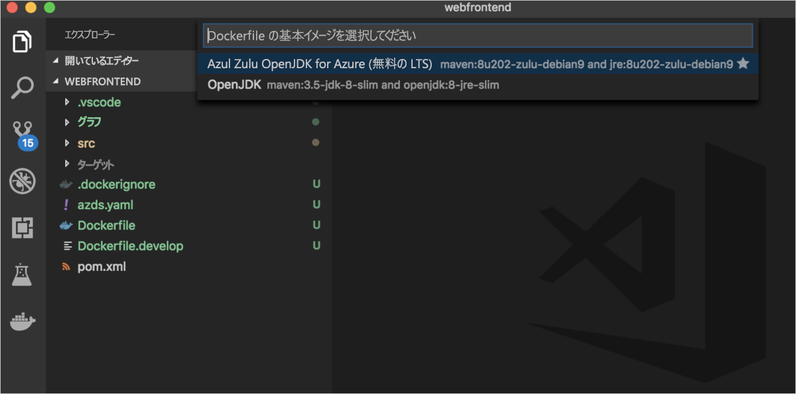
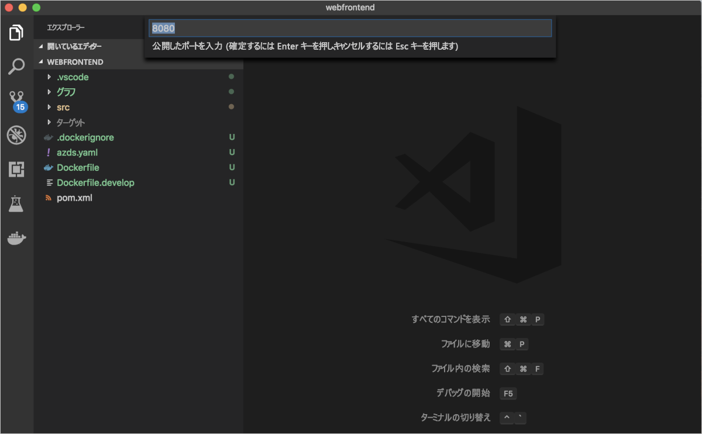
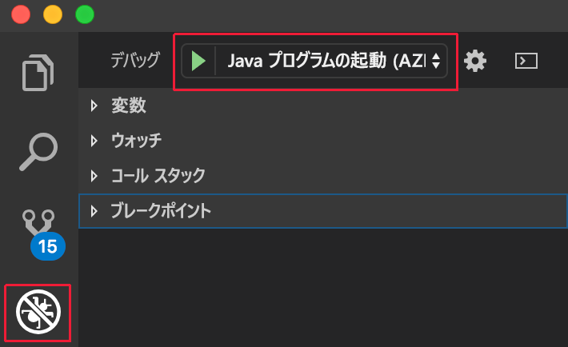

# <a name="quickstart-develop-with-java-on-kubernetes-using-azure-dev-spaces"></a>クイック スタート:Azure Dev Spaces を使用して Kubernetes 上で Java の開発を行う

このガイドでは、以下の方法について説明します。

- Azure でマネージド Kubernetes クラスターを使用して Azure Dev Spaces をセットアップする。
- Visual Studio Code とコマンド ラインを使用して、コンテナー内のコードを繰り返し開発する。
- Visual Studio Code で開発空間のコードをデバッグする。


## <a name="prerequisites"></a>前提条件

- Azure サブスクリプション。 アカウントがない場合は、[無料アカウントを作成する](https://azure.microsoft.com/free)ことができます。
- [Visual Studio Code がインストールされていること](https://code.visualstudio.com/download)。
- Visual Studio Code 用の [Azure Dev Spaces](https://marketplace.visualstudio.com/items?itemName=azuredevspaces.azds) 拡張機能と [Java Debugger for Azure Dev Spaces](https://marketplace.visualstudio.com/items?itemName=vscjava.vscode-java-debugger-azds) 拡張機能がインストールされていること。
- [Azure CLI がインストールされていること](/cli/azure/install-azure-cli?view=azure-cli-latest)。
- [Maven がインストールされ構成されていること](https://maven.apache.org)。

## <a name="create-an-azure-kubernetes-service-cluster"></a>Azure Kubernetes Service クラスターを作成する

[サポートされているリージョン](https://docs.microsoft.com/azure/dev-spaces/#a-rapid,-iterative-kubernetes-development-experience-for-teams)で AKS クラスターを作成する必要があります。 下記のコマンドを使用すると、*MyResourceGroup* というリソース グループと *MyAKS* という AKS クラスターが作成されます。

```cmd
az group create --name MyResourceGroup --location eastus
az aks create -g MyResourceGroup -n MyAKS --location eastus --node-count 1 --generate-ssh-keys
```

## <a name="enable-azure-dev-spaces-on-your-aks-cluster"></a>AKS クラスターで Azure Dev Spaces を有効にする

`use-dev-spaces` コマンドを使用して AKS クラスターで Dev Spaces を有効にし、プロンプトに従います。 下記のコマンドを使用すると、*MyResourceGroup* グループ内の *MyAKS* クラスターで Dev Spaces が有効になり、*default* 開発空間が作成されます。

```cmd
$ az aks use-dev-spaces -g MyResourceGroup -n MyAKS

'An Azure Dev Spaces Controller' will be created that targets resource 'MyAKS' in resource group 'MyResourceGroup'. Continue? (y/N): y

Creating and selecting Azure Dev Spaces Controller 'MyAKS' in resource group 'MyResourceGroup' that targets resource 'MyAKS' in resource group 'MyResourceGroup'...2m 24s

Select a dev space or Kubernetes namespace to use as a dev space.
 [1] default
Type a number or a new name: 1

Kubernetes namespace 'default' will be configured as a dev space. This will enable Azure Dev Spaces instrumentation for new workloads in the namespace. Continue? (Y/n): Y

Configuring and selecting dev space 'default'...3s

Managed Kubernetes cluster 'MyAKS' in resource group 'MyResourceGroup' is ready for development in dev space 'default'. Type `azds prep` to prepare a source directory for use with Azure Dev Spaces and `azds up` to run.
```

## <a name="get-sample-application-code"></a>サンプル アプリケーション コードを取得する

この記事では、[Azure Dev Spaces サンプル アプリケーション](https://github.com/Azure/dev-spaces)を使用して、Azure Dev Spaces の使い方のデモを行います。

GitHub からアプリケーションを複製して、*dev-spaces/samples/java/getting-started/webfrontend* ディレクトリに移動します。

```cmd
git clone https://github.com/Azure/dev-spaces
cd dev-spaces/samples/java/getting-started/webfrontend
```

## <a name="prepare-the-application"></a>アプリケーションを準備する

`azds prep` コマンドを使用して、Kubernetes でアプリケーションを実行するための Docker 資産と Helm チャート資産を生成します。

```cmd
azds prep --public
```

Docker 資産と Helm チャート資産を正しく生成するには、*dev-spaces/samples/java/getting-started/webfrontend* ディレクトリから `prep` コマンドを実行する必要があります。

## <a name="build-and-run-code-in-kubernetes"></a>Kubernetes でコードをビルドして実行する

`azds up` コマンドを使用して、AKS でコードをビルドして実行します。

```cmd
$ azds up
Using dev space 'default' with target 'MyAKS'
Synchronizing files...3s
Installing Helm chart...8s
Waiting for container image build...28s
Building container image...
Step 1/8 : FROM maven:3.5-jdk-8-slim
Step 2/8 : EXPOSE 8080
Step 3/8 : WORKDIR /usr/src/app
Step 4/8 : COPY pom.xml ./
Step 5/8 : RUN /usr/local/bin/mvn-entrypoint.sh     mvn package -Dmaven.test.skip=true -Dcheckstyle.skip=true -Dmaven.javadoc.skip=true --fail-never
Step 6/8 : COPY . .
Step 7/8 : RUN mvn package -Dmaven.test.skip=true -Dcheckstyle.skip=true -Dmaven.javadoc.skip=true
Step 8/8 : ENTRYPOINT ["java","-jar","target/webfrontend-0.1.0.jar"]
Built container image in 37s
Waiting for container...57s
Service 'webfrontend' port 'http' is available at http://webfrontend.1234567890abcdef1234.eus.azds.io/
Service 'webfrontend' port 80 (http) is available at http://localhost:54256
...
```

`azds up` コマンドの出力に表示されるパブリック URL を開いて、サービスが稼働していることを確認できます。 この例では、パブリック URL は *http://webfrontend.1234567890abcdef1234.eus.azds.io/* です。

*Ctrl + C* キーを押して `azds up` コマンドを停止すると、サービスは引き続き AKS で稼働し、パブリック URL は使用可能な状態のままになります。

## <a name="update-code"></a>コードの更新

サービスの更新バージョンをデプロイするには、ご自分のプロジェクトにある任意のファイルを更新して、`azds up` コマンドを再実行します。 例: 

1. `azds up` がまだ実行されている場合、*Ctrl + C* キーを押します。
1. [`src/main/java/com/ms/sample/webfrontend/Application.java` の 16 行目](https://github.com/Azure/dev-spaces/blob/master/samples/java/getting-started/webfrontend/src/main/java/com/ms/sample/webfrontend/Application.java#L16)を以下に更新します。
    
    ```java
    return "Hello from webfrontend in Azure!";
    ```

1. 変更を保存します。
1. `azds up` コマンドを再実行します。

    ```cmd
    $ azds up
    Using dev space 'default' with target 'MyAKS'
    Synchronizing files...1s
    Installing Helm chart...3s
    Waiting for container image build...
    ...    
    ```

1. 稼働中のご自分のサービスに移動して、変更を確認します。
1. *Ctrl + C* キーを押して、`azds up` コマンドを停止します。

## <a name="enable-visual-studio-code-to-debug-in-kubernetes"></a>Visual Studio Code を有効にして Kubernetes でデバッグを行う

Visual Studio Code を開き、*[ファイル]*、*[開く]* の順にクリックし、*dev-spaces/samples/java/getting-started/webfrontend* ディレクトリに移動して、*[開く]* をクリックします。

これで Visual Studio Code で *webfrontend* プロジェクトが開かれます。これは `azds up` コマンドを使用して稼働したのと同じサービスです。 Visual Studio Code を使用して AKS でこのサービスをデバッグするには、`azds up` を直接使用する場合と違って、Visual Studio Code を使用して自分の開発空間と通信するためにこのプロジェクトを準備する必要があります。

Visual Studio Code でコマンド パレットを開くには、*[表示]*、*[コマンド パレット]* の順にクリックします。 「`Azure Dev Spaces`」の入力を開始して、`Azure Dev Spaces: Prepare configuration files for Azure Dev Spaces` をクリックします。


また、Visual Studio Code で基本イメージと公開ポートの構成を求められたら、基本イメージに `Azul Zulu OpenJDK for Azure (Free LTS)`、公開ポートに `8080` を選択します。





このコマンドによって、Visual Studio Code から直接 Azure Dev Spaces で実行するようプロジェクトが準備されます。 また、デバッグ構成が含まれた *.vscode* ディレクトリが、お客様のプロジェクトのルートに生成されます。

## <a name="build-and-run-code-in-kubernetes-from-visual-studio"></a>Visual Studio で Kubernetes のコードをビルドして実行する

左側の *[デバッグ]* アイコンをクリックし、上部の *[Launch Java Program (AZDS)]\(Java プログラムの起動 (AZDS)\)* をクリックします。



このコマンドによって、デバッグ モードで Azure Dev Spaces のサービスがビルドされ、稼働します。 下部にある *[ターミナル]* ウィンドウに、Azure Dev Spaces が動作しているサービスのビルド出力と URL が表示されます。 "*デバッグ コンソール*" にログの出力が表示されます。

> [!Note]
> "*コマンド パレット*" に Azure Dev Spaces コマンドが表示されない場合は、[Azure Dev Spaces 用 Visual Studio Code 拡張機能](https://marketplace.visualstudio.com/items?itemName=azuredevspaces.azds)がインストールされていることを確認してください。 また、Visual Studio Code で *dev-spaces/samples/java/getting-started/webfrontend* ディレクトリを開いたことを確認してください。

*[デバッグ]*、*[デバッグの停止]* の順にクリックして、デバッガーを停止します。

## <a name="setting-and-using-breakpoints-for-debugging"></a>デバッグ用のブレークポイントを設定して使用する

*[Launch Java Program (AZDS)]\(Java プログラムの起動 (AZDS)\)* を使用して、デバッグ モードでサービスを開始します。

*[表示]*、*[エクスプローラー]* の順にクリックして、*[エクスプローラー]* ビューに戻ります。 `src/main/java/com/ms/sample/webfrontend/Application.java` を開き、16 行目のどこかをクリックして、カーソルをそこに置きます。 ブレークポイントを設定するには、*F9* キーを押すか、*[デバッグ]*、*[ブレークポイントの設定/解除]* の順にクリックします。

ブラウザーでサービスを開き、メッセージが表示されないことに注目します。 Visual Studio Code に戻って、16 行目が強調表示されていることを確認します。 設定したブレークポイントによって、16 行目でサービスが一時停止されました。 サービスを再開するには、*F5* キーを押すか、*[デバッグ]*、*[続行]* の順にクリックします。 ブラウザーに戻って、メッセージが表示されたことに注目します。

デバッガーがアタッチされた状態で Kubernetes でサービスを稼働している間、デバッグ情報 (呼び出し履歴、ローカル変数、例外情報など) にフル アクセスできます。

`src/main/java/com/ms/sample/webfrontend/Application.java` の 16 行目にカーソルを置いて *F9* キーを押し、ブレークポイントを削除します。

## <a name="update-code-from-visual-studio-code"></a>Visual Studio Code でコードを更新する

デバッグ モードでサービスが稼働している間に、`src/main/java/com/ms/sample/webfrontend/Application.java` の 16 行目を更新します。 例: 
```java
return "Hello from webfrontend in Azure while debugging!";
```

ファイルを保存します。 *[デバッグ]*、*[デバッグの再起動]* の順にクリックします。または、*[デバッグ] ツール バー*で、*[デバッグの再起動]* ボタンをクリックします。


ブラウザーでサービスを開き、更新されたメッセージが表示されることに注目します。

Azure Dev Spaces では、コードが編集されるたびに新しいコンテナー イメージをリビルドして再デプロイするのではなく、既存のコンテナー内でコードの増分再コンパイルを実行して、編集とデバッグのループを高速化します。

## <a name="clean-up-your-azure-resources"></a>Azure リソースをクリーンアップする

```cmd
az group delete --name MyResourceGroup --yes --no-wait
```

## <a name="next-steps"></a>次の手順

Azure Dev Spaces を使用して複数のコンテナーにまたがるより複雑なアプリケーションを開発する方法と、別の空間で別のバージョンまたは分岐を使用して作業することによって共同開発を簡略化する方法について学習します。

> [!div class="nextstepaction"]
> [複数のコンテナーの操作とチーム開発](multi-service-java.md)
