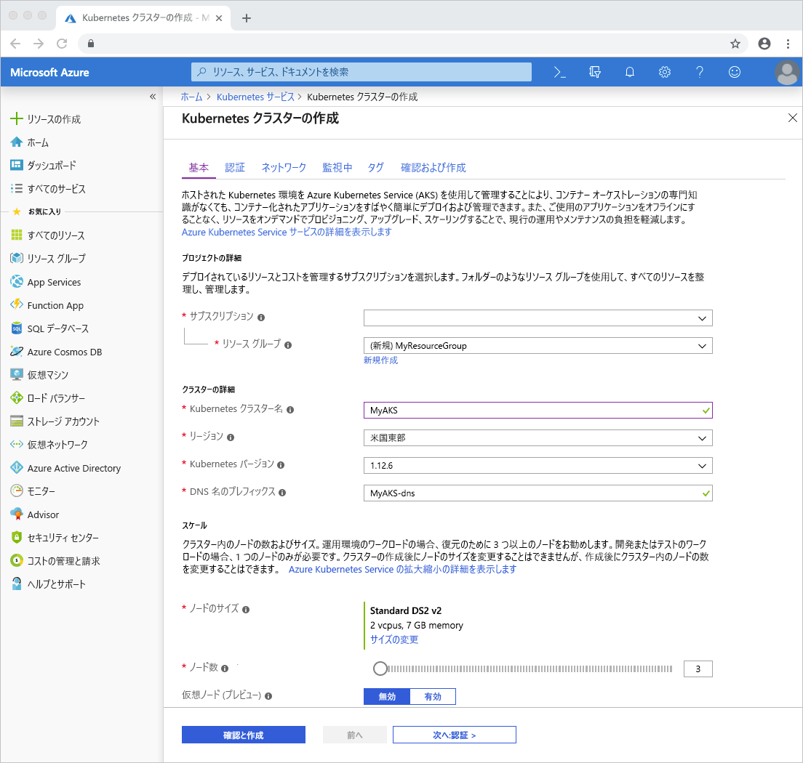
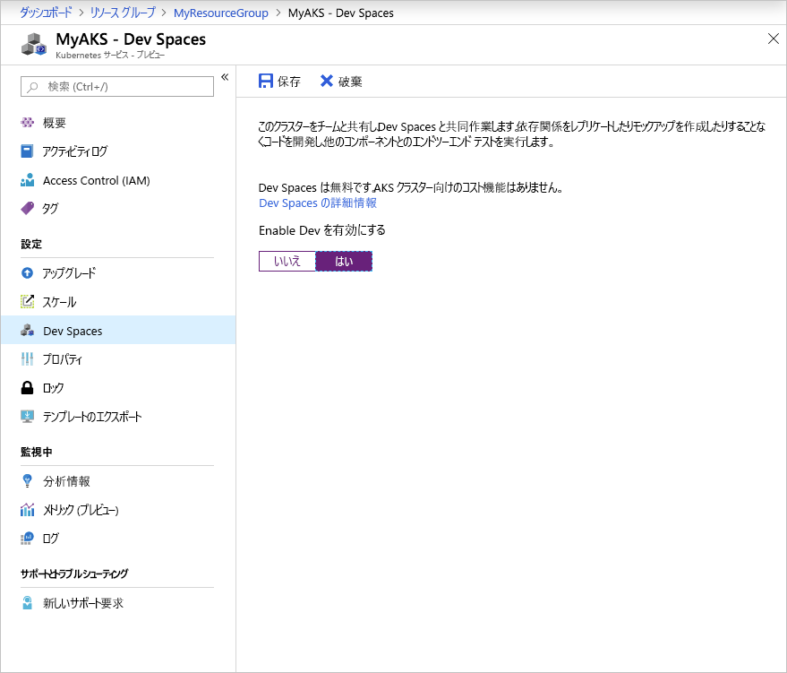

# <a name="quickstart-develop-with-net-core-on-kubernetes-with-azure-dev-spaces-visual-studio-2017"></a>クイック スタート:Azure Dev Spaces を使用して Kubernetes 上で .NET Core の開発を行う (Visual Studio 2017)

このガイドでは、以下の方法について説明します。

- Azure でマネージド Kubernetes クラスターを使用して Azure Dev Spaces をセットアップする。
- Visual Studio 2017 を使用して、コンテナー内のコードを繰り返し開発する。
- Visual Studio 2017 を使用して、クラスターで実行されるコードをデバッグする。

## <a name="prerequisites"></a>前提条件

- Azure サブスクリプション。 アカウントがない場合は、[無料アカウントを作成する](https://azure.microsoft.com/free)ことができます。
- Web 開発ワークロードがインストールされている Windows 上の Visual Studio 2017。 インストールしていない場合は、[ここから](https://aka.ms/vsdownload?utm_source=mscom&utm_campaign=msdocs)ダウンロードします。
- [Visual Studio Tools for Kubernetes](https://aka.ms/get-vsk8stools) がインストールされていること。

## <a name="create-an-azure-kubernetes-service-cluster"></a>Azure Kubernetes Service クラスターを作成する

[サポートされているリージョン](https://docs.microsoft.com/azure/dev-spaces/#a-rapid,-iterative-kubernetes-development-experience-for-teams)で AKS クラスターを作成する必要があります。 クラスターを作成するには:

1. [Azure ポータル](https://portal.azure.com)
1. *+ [リソースの作成]、[Kubernetes サービス]* の順に選択します。 
1. _[サブスクリプション]_、_[リソース グループ]_、_[Kubernetes クラスター名]_、_[リージョン]_、_[Kubernetes バージョン]_、_[DNS 名のプレフィックス]_ の入力を行います。

    

1. *[Review + create]\(レビュー + 作成\)* をクリックします。
1. *Create* をクリックしてください。

## <a name="enable-azure-dev-spaces-on-your-aks-cluster"></a>AKS クラスターで Azure Dev Spaces を有効にする

Azure portal でご自分の AKS クラスターに移動して、*[Dev Spaces]* をクリックします。 *[Dev Spaces を有効にする]* を *[はい]* に変更して *[保存]* をクリックします。



## <a name="create-a-new-aspnet-web-app"></a>新しい ASP.NET Web アプリを作成する

1. Visual Studio 2017 を開きます。
1. 新しいプロジェクトを作成する。
1. *[ASP.NET Core Web アプリケーション]* を選択し、プロジェクトに *webfrontend* という名前を付けます。
1. Click *OK*.
1. 要求されたら、*[Web アプリケーション (モデル ビュー コントローラー)]* をテンプレートに選択します。
1. 上部にある *[.NET Core]* と *[ASP.NET Core 2.0]* を選択します。
1. Click *OK*.

## <a name="connect-your-project-to-your-dev-space"></a>プロジェクトを開発空間に接続する

ご自分のプロジェクトで、次の図のように、起動設定のドロップダウンから **[Azure Dev Spaces]** を選択します。


[Azure Dev Spaces] ダイアログで、ご自分の "*サブスクリプション*" と "*Azure Kubernetes クラスター*" を選択します。 *[空間]* は *[default]* に設定しておいて、*[公的にアクセス可能]* チェック ボックスをオンします。 Click *OK*.


このプロセスによって、パブリックにアクセスできる URL を備えた *default* 開発空間にお客様のサービスがデプロイされます。 Azure Dev Spaces と共に動作するように構成されていないクラスターを選択すると、クラスターを構成するかどうかをたずねるメッセージが表示されます。 Click *OK*.


*default* 開発空間で稼働するサービスのパブリック URL が、*[出力]* ウィンドウに表示されます。

```cmd
Starting warmup for project 'webfrontend'.
Waiting for namespace to be provisioned.
Using dev space 'default' with target 'MyAKS'
...
Successfully built 1234567890ab
Successfully tagged webfrontend:devspaces-11122233344455566
Built container image in 39s
Waiting for container...
36s

Service 'webfrontend' port 'http' is available at http://webfrontend.1234567890abcdef1234.eus.azds.io/
Service 'webfrontend' port 80 (http) is available at http://localhost:62266
Completed warmup for project 'webfrontend' in 125 seconds.
```

上記の例では、パブリック URL は http://webfrontend.1234567890abcdef1234.eus.azds.io/ です。 ご自分のサービスのパブリック URL に移動し、開発空間で稼働しているサービスを操作します。

## <a name="update-code"></a>コードの更新

Visual Studio 2017 がまだ開発空間に接続されている場合、停止ボタンをクリックします。 `Controllers/HomeController.cs` の 20 行目を以下に変更します。
    
```csharp
ViewData["Message"] = "Your application description page in Azure.";
```

変更を保存し、起動設定のドロップダウンで **[Azure Dev Spaces]** を使用してサービスを開始します。 ブラウザーでご自分のサービスのパブリック URL を開き、*[詳細]* をクリックします。 更新されたメッセージが表示されることを確認します。

Azure Dev Spaces では、コードが編集されるたびに新しいコンテナー イメージをリビルドして再デプロイするのではなく、既存のコンテナー内でコードの増分再コンパイルを実行して、編集とデバッグのループを高速化します。

## <a name="setting-and-using-breakpoints-for-debugging"></a>デバッグ用のブレークポイントを設定して使用する

Visual Studio 2017 がまだ開発空間に接続されている場合、停止ボタンをクリックします。 `Controllers/HomeController.cs` を開いて、20 行目のどこかをクリックし、そこにカーソルを置きます。 ブレークポイントを設定するには、*F9* キーを押すか、*[デバッグ]*、*[ブレークポイントの設定/解除]* の順にクリックします。 開発空間においてデバッグ モードでサービスを開始するには、*F5* キーを押すか、または *[デバッグ]*、*[デバッグの開始]* の順にクリックします。

ブラウザーでサービスを開き、メッセージが表示されないことに注目します。 Visual Studio 2017 に戻って、20 行目が強調表示されていることを確認します。 設定したブレークポイントによって、20 行目でサービスが一時停止されました。 サービスを再開するには、*F5* キーを押すか、*[デバッグ]*、*[続行]* の順にクリックします。 ブラウザーに戻って、メッセージが表示されたことに注目します。

デバッガーがアタッチされた状態で Kubernetes でサービスを稼働している間、デバッグ情報 (呼び出し履歴、ローカル変数、例外情報など) にフル アクセスできます。

`Controllers/HomeController.cs` の 20 行目にカーソルを置いて *F9* キーを押すことで、ブレークポイントを削除します。

## <a name="clean-up-your-azure-resources"></a>Azure リソースをクリーンアップする

Azure portal でご自分のリソース グループに移動して、*[リソース グループの削除]* をクリックします。 または、[az aks delete](/cli/azure/aks#az-aks-delete) コマンドを使用できます。

```cmd
az group delete --name MyResourceGroup --yes --no-wait
```

## <a name="next-steps"></a>次の手順

> [!div class="nextstepaction"]
> [複数のコンテナーの操作とチーム開発](multi-service-netcore-visualstudio.md)
