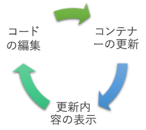

# <a name="quickstart-create-a-kubernetes-dev-space-with-azure-dev-spaces-nodejs"></a>クイック スタート: Azure Dev Spaces を使用して Kubernetes 開発空間を作成する (Node.js)

このガイドでは、以下の方法について説明します。

- Azure でマネージド Kubernetes クラスターを使用して Azure Dev Spaces をセットアップする。
- VS Code とコマンド ラインを使用して、コンテナー内のコードを繰り返し開発する。
- クラスターで実行されるコードをデバッグする。

> [!Note]
> **問題が発生した場合は**いつでも、「[トラブルシューティング](troubleshooting.md)」セクションを参照するか、このページでコメントを投稿してください。 より詳細な[チュートリアル](get-started-nodejs.md)を試すこともできます。

## <a name="prerequisites"></a>前提条件

- Azure サブスクリプション。 Azure サブスクリプションをお持ちでない場合は、[無料のアカウント](https://azure.microsoft.com/free)を作成できます。
- 米国東部、米国中部、米国西部 2、西ヨーロッパ、カナダ中部、カナダ東部のいずれかのリージョンに存在し、**[HTTP アプリケーションのルーティング]** が有効になっていて、Kubernetes 1.9.6 以降を実行する [Kubernetes クラスター](https://ms.portal.azure.com/#create/microsoft.aks)。

  ![[Http アプリケーションのルーティング] が有効であることを確認してください。](media/common/Kubernetes-Create-Cluster-3.PNG)

- Visual Studio Code。[こちら](https://code.visualstudio.com/download)からダウンロードできます。

## <a name="set-up-azure-dev-spaces"></a>Azure Dev Spaces をセットアップする

Azure CLI と Azure Dev Spaces 拡張機能は、Windows、Mac、Linux のいずれかのマシンにインストールして実行できます。 Linux では、Ubuntu (18.04、16.04、14.04)、Debian 8、Debian 9、RHEL 7、Fedora 26+、CentOS 7、openSUSE 42.2、SLES 12 の各ディストリビューションがサポートされます。

Azure Dev Spaces を設定するには、次の手順に従います。

1. [Azure CLI](/cli/azure/install-azure-cli?view=azure-cli-latest) (バージョン 2.0.43 以上) をインストールします。
1. AKS クラスターに Dev Spaces をセットアップします。`az aks use-dev-spaces -g MyResourceGroup -n MyAKS`
1. VS Code 用の[Azure Dev Spaces 拡張機能](https://marketplace.visualstudio.com/items?itemName=azuredevspaces.azds)をダウンロードします。 拡張機能の Marketplace ページで [インストール] を 1 回クリックし、VS Code でもう一度クリックします。

## <a name="build-and-run-code-in-kubernetes"></a>Kubernetes でコードをビルドして実行する

1. GitHub からサンプル コードをダウンロードします。[https://github.com/Azure/dev-spaces](https://github.com/Azure/dev-spaces) 
1. ディレクトリを webfrontend フォルダーに変更します。`cd dev-spaces/samples/nodejs/getting-started/webfrontend`
1. Docker と Helm チャート資産を生成します。`azds prep --public`
1. AKS でコードをビルドして実行します。 ターミナル ウィンドウで、**Webfrontend フォルダー**から `azds up` コマンドを実行します。
1. コンソールの出力をスキャンして、`up` コマンドによって作成された URL に関する情報を探します。 形式は次のようになります。 

   `Service 'webfrontend' port 'http' is available at <url>` 

   ブラウザー ウィンドウでこの URL を開くと、Web アプリ ロードが表示されるはずです。 コンテナーが実行されると、`stdout` と `stderr` の出力がターミナル ウィンドウにストリーミングされます。
   
   > [!Note]
   > 最初の実行では、パブリック DNS が準備されるまでに数分かかることがあります。 公開 URL が解決されない場合は、コンソール出力に表示される代替 http://localhost:<portnumber> URL を使用することができます。 localhost URL を使用する場合、コンテナーはローカルで実行されているように見えるかもしれませんが、実際には AKS で実行されています。 利便性を考慮し、また、ローカル コンピューターからのサービスとの対話を容易にするために、Azure Dev Spaces では、Azure で実行されているコンテナーへの一時的な SSH トンネルが作成されます。 後で DNS レコードが準備できたら、戻って公開 URL を試してみることができます。

### <a name="update-a-content-file"></a>コンテンツ ファイルを更新する
Azure Dev Spaces は、Kubernetes でコードを実行するだけのものではありません。Azure Dev Spaces を使用すると、クラウドの Kubernetes 環境でコードの変更が有効になっていることをすぐに繰り返し確認できるようになります。

1. `./public/index.html` ファイルを見つけ、HTML を編集します。 たとえば、ページの背景色を青の網掛けに変更します。

    ```html
    <body style="background-color: #95B9C7; margin-left:10px; margin-right:10px;">
    ```

1. ファイルを保存します。 しばらくすると、ターミナル ウィンドウに、実行中のコンテナー内のファイルが更新されたことを示すメッセージが表示されます。
1. ブラウザーに移動し、ページを更新します。 色が更新されていることがわかります。

なぜでしょうか? HTML や CSS などのコンテンツ ファイルの編集では、Node.js プロセスを再開する必要はありません。アクティブな `azds up` コマンドによって、変更されたコンテンツ ファイルが Azure で実行中のコンテナーに自動的に直接同期されるので、編集後のコンテンツをすばやく確認できます。

### <a name="test-from-a-mobile-device"></a>モバイル デバイスからテストする
webfrontend の公開 URL を使用して、モバイル デバイスで Web アプリを開きます。 長いアドレスを入力しなくて済むように、デスクトップからデバイスに URL をコピーして送信することができます。 モバイル デバイスで Web アプリが読み込まれると、小さなデバイスでは UI が正しく表示されないことがわかります。

これを修正するには、`viewport` メタ タグを追加します。
1. `./public/index.html` ファイルを開きます。
1. 既存の `head` 要素に `viewport` メタ タグを追加します。

    ```html
    <head>
        <!-- Add this line -->
        <meta name="viewport" content="width=device-width, initial-scale=1">
    </head>
    ```

1. ファイルを保存します。
1. デバイスのブラウザーを更新します。 正しくレンダリングされた Web アプリが表示されます。 

この例は、アプリが使用されるデバイスでテストするまで見つからない問題があることを示しています。 Azure Dev Spaces を使用すると、コードを迅速に反復処理し、ターゲット デバイスで変更を検証できます。

### <a name="update-a-code-file"></a>コード ファイルを更新する
Node.js アプリを再起動する必要があるため、サーバー側のコード ファイルを更新するにはもう少し作業が必要です。

1. ターミナル ウィンドウで、`Ctrl+C` キーを押して `azds up` を停止します。
1. `server.js` という名前のコード ファイルを開き、サービスの hello メッセージを編集します。 

    ```javascript
    res.send('Hello from webfrontend running in Azure!');
    ```

3. ファイルを保存します。
1. ターミナル ウィンドウで `azds up` を実行します。 

これにより、コンテナー イメージが再構築され、Helm チャートが再展開されます。 ブラウザー ページを再度読み込んで、コードの変更が有効になっていることを確認します。

コードを開発するさらに "*迅速な方法*" があります。これについては、次のセクションで説明します。 

## <a name="debug-a-container-in-kubernetes"></a>Kubernetes でコンテナーをデバッグする

このセクションでは、VS Code を使用して、Azure で実行されるコンテナーを直接デバッグします。 編集、実行、テストを高速で繰り返す方法についても説明します。



### <a name="initialize-debug-assets-with-the-vs-code-extension"></a>VS Code 拡張機能によるデバッグ アセットの初期化
まず、VS Code が Azure 内の開発空間と通信するように、コード プロジェクトを構成する必要があります。 Azure Dev Spaces 用の VS Code 拡張機能は、デバッグ構成をセットアップするためのヘルパー コマンドを提供します。 

(**[表示 | コマンド パレット]** メニューを使用して) **コマンド パレット**を開き、オート コンプリートを使用して次のコマンドを入力および選択します: `Azure Dev Spaces: Prepare configuration files for Azure Dev Spaces`。

Azure Dev Spaces 用のデバッグ構成が `.vscode` フォルダー下に追加されます。 このコマンドを、展開用にプロジェクトを構成する `azds prep` コマンドと混同しないでください。


### <a name="select-the-azds-debug-configuration"></a>AZDS デバッグ構成を選択する
1. VS Code の左側の**アクティビティ バー**で、[デバッグ] アイコンをクリックしてデバッグ ビューを開きます。
1. アクティブなデバッグ構成として **[Launch Program (AZDS)]\(プログラムの起動 (AZDS)\)** を選択します。


> [!Note]
> コマンド パレットに Azure Dev Spaces コマンドが表示されない場合は、Azure Dev Spaces 用 VS Code 拡張機能がインストールされていることを確認します。

### <a name="debug-the-container-in-kubernetes"></a>Kubernetes でコンテナーをデバッグする
**F5** キーを押して、Kubernetes でコードをデバッグします。

`up` コマンドと同様に、デバッグを開始するとコードが開発空間に同期され、コンテナーがビルドされて Kubernetes にデプロイされます。 今回は、デバッガーがリモート コンテナーにアタッチされます。

> [!Tip]
> VS Code のステータス バーに、クリック可能な URL が表示されます。

サーバー側のコード ファイル (たとえば、`server.js` の `app.get('/api'...` 内) にブレークポイントを設定します。 ブラウザー ページを更新するか、[Say It Again]\(繰り返してください\) ボタンをクリックすると、ブレークポイントに到達し、コードをステップ実行できます。

コードがローカルで実行されている場合と同様に、デバッグ情報 (呼び出し履歴、ローカル変数、例外情報など) にフル アクセスできます。

### <a name="edit-code-and-refresh-the-debug-session"></a>コードを編集し、デバッグ セッションを更新する
デバッガーをアクティブにしてコードを編集します。たとえば、hello メッセージをもう一度変更します。

```javascript
app.get('/api', function (req, res) {
    res.send('**** Hello from webfrontend running in Azure! ****');
});
```

ファイルを保存し、**デバッグ操作ウィンドウ**で **[最新の情報に更新]** ボタンをクリックします。 


コードを編集するたびに新しいコンテナー イメージを再構築して再展開すると、多くの場合、かなりの時間がかかります。Azure Dev Spaces では、代わりに、デバッグ セッション間に Node.js プロセスを再開することで、編集/デバッグ ループを高速化します。

ブラウザーで Web アプリを更新するか、*[Say It Again]\(繰り返してください\)* ボタンをクリックします。 UI にカスタム メッセージが表示されます。

### <a name="use-nodemon-to-develop-even-faster"></a>NodeMon を使用して開発をさらに迅速化する

サンプルの `webfrontend` プロジェクトは、[nodemon](https://nodemon.io/) を使用するように構成されていました。これは Node.js 開発を高速化する一般的なツールであり、Azure Dev Spaces と完全に互換性があります。

次の手順を試してみてください。
1. VS Code デバッガーを停止します。
1. VS Code の左側の**アクティビティ バー**で [デバッグ] アイコンをクリックします。 
1. アクティブなデバッグ構成として、**[Attach (AZDS)]\(アタッチ (AZDS)\)** を選択します。
1. F5 キーを押します。

この構成では、コンテナーは *nodemon* を起動するように構成されています。 サーバー コードが編集されると、ローカルで開発する場合と同様に、*nodemon* によって Node プロセスが自動的に再開されます。 
1. `server.js` で hello メッセージをもう一度編集し、ファイルを保存します。
1. ブラウザーを更新するか、*[Say It Again]\(繰り返してください\)* ボタンをクリックして、変更が有効になっていることを確認します。

**これで、コードを迅速に反復処理し、Kubernetes で直接デバッグできるようになりました。**

## <a name="next-steps"></a>次の手順

> [!div class="nextstepaction"]
> [複数のコンテナーの操作とチーム開発](team-development-nodejs.md)
