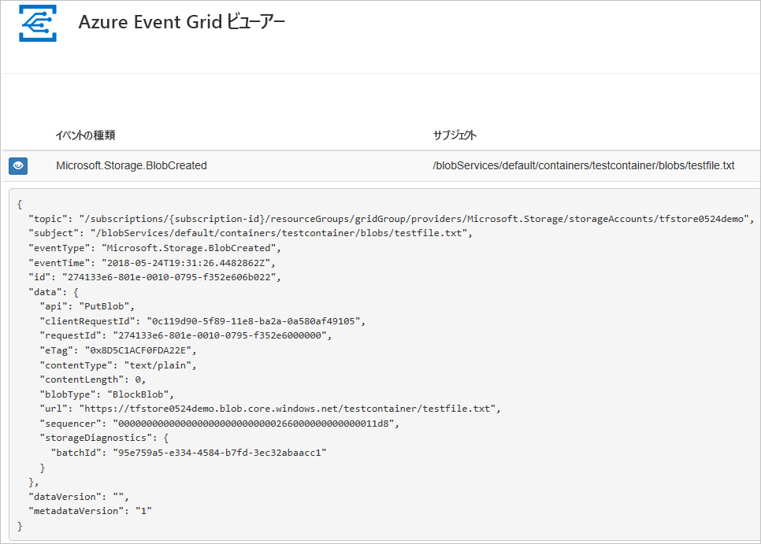
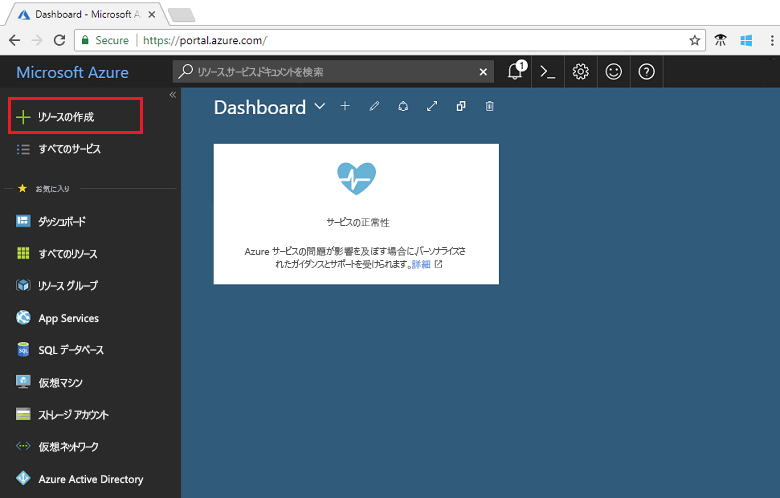
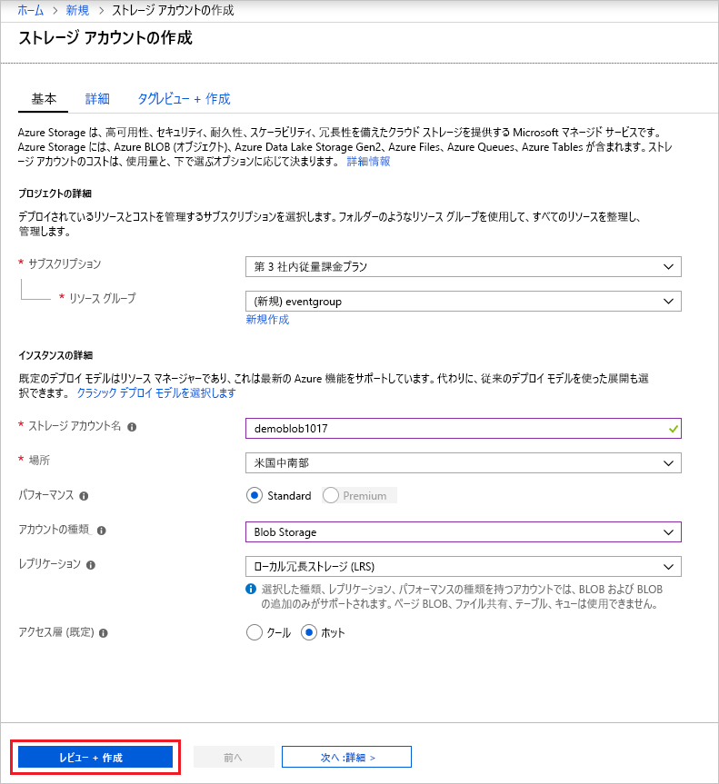
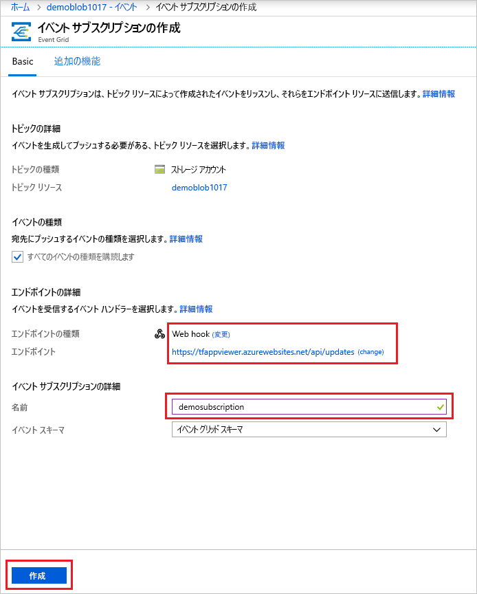
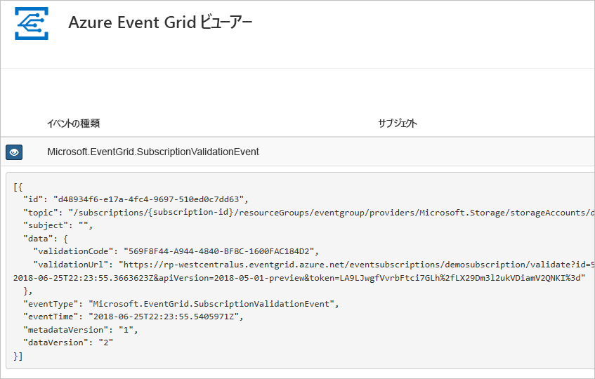
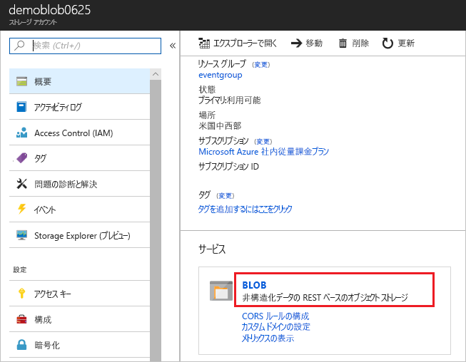
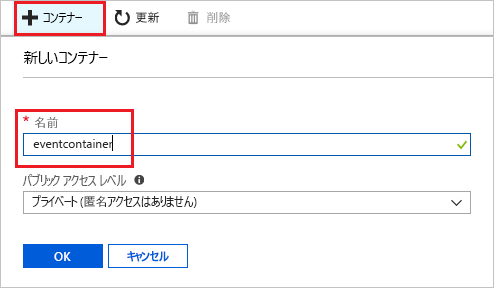
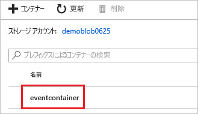

# <a name="create-and-route-blob-storage-events-with-the-azure-portal-and-event-grid"></a>Azure portal と Event Grid を使用した BLOB ストレージ イベントの作成とルーティング

Azure Event Grid は、クラウドのイベント処理サービスです。 この記事では、Azure portal を使用して BLOB ストレージ アカウントを作成し、その BLOB ストレージのイベントをサブスクライブし、イベントをトリガーして結果を表示します。 通常は、イベント データを処理し、アクションを実行するエンドポイントにイベントを送信します。 ただし、この記事では、単純化するために、メッセージを収集して表示する Web アプリにイベントを送信します。

[!INCLUDE [quickstarts-free-trial-note.md](../../includes/quickstarts-free-trial-note.md)]

最後に、イベント データが Web アプリに送信されたことを確認します。



## <a name="create-a-storage-account"></a>ストレージ アカウントの作成

1. [Azure ポータル](https://portal.azure.com/)にサインインします。

1. BLOB ストレージを作成するには、**[リソースの作成]** を選択します。 

   

1. 使用可能なオプションをフィルター選択するために **[ストレージ]** を選択し、**[ストレージ アカウント - Blob、File、Table、Queue]** を選択します。

   ![[ストレージ] を選択する](./media/blob-event-quickstart-portal/create-storage.png)

1. イベントに対してサブスクライブするには、汎用 v2 ストレージ アカウントまたは BLOB ストレージ アカウントのどちらかを作成します。 詳しくは、「[ストレージ アカウントの作成](../storage/common/storage-quickstart-create-account.md)」をご覧ください。

   

## <a name="create-a-message-endpoint"></a>メッセージ エンドポイントの作成

BLOB ストレージのイベントをサブスクライブする前に、イベント メッセージのエンドポイントを作成しましょう。 通常、エンドポイントは、イベント データに基づくアクションを実行します。 このクイック スタートを簡素化するために、イベント メッセージを表示する[構築済みの Web アプリ](https://github.com/Azure-Samples/azure-event-grid-viewer)をデプロしします。 デプロイされたソリューションには、App Service プラン、App Service Web アプリ、および GitHub からのソース コードが含まれています。

1. **[Deploy to Azure]\(Azure にデプロイ\)** を選択して、ソリューションをサブスクリプションにデプロイします。 Azure portal で、パラメーターの値を指定します。

   <a href="https://portal.azure.com/#create/Microsoft.Template/uri/https%3A%2F%2Fraw.githubusercontent.com%2FAzure-Samples%2Fazure-event-grid-viewer%2Fmaster%2Fazuredeploy.json" target="_blank"></a>

1. デプロイが完了するまでに数分かかる場合があります。 デプロイが成功した後で、Web アプリを表示して、実行されていることを確認します。 Web ブラウザーで `https://<your-site-name>.azurewebsites.net` にアクセスします

1. サイトは表示されますが、イベントはまだ送信されていません。

   

[!INCLUDE [event-grid-register-provider-portal.md](../../includes/event-grid-register-provider-portal.md)]

## <a name="subscribe-to-the-blob-storage"></a>BLOB ストレージのサブスクライブ

どのイベントを追跡し、どこにイベントを送信するかは、トピックを購読することによって Event Grid に伝えます。

1. ポータルで、対象の BLOB ストレージを選択し、**[イベント]** を選択します。

   ![[イベント] を選択する](./media/blob-event-quickstart-portal/select-events.png)

1. イベントをビューアー アプリに送信するには、エンドポイントの Web hook を使用します。 **[その他のオプション]** を選択し、**[webhook]** を選択します。

   ![[webhook] を選択する](./media/blob-event-quickstart-portal/select-web-hook.png)

1. イベント サブスクリプションには、BLOB ストレージの値があらかじめ入力されています。 Web hook エンドポイントに対して、Web アプリの URL を入力し、ホーム ページの URL に `api/updates` を追加します。 サブスクリプションに名前を付けます。 完了したら、**[作成]** を選択します。

   

1. Web アプリをもう一度表示し、その Web アプリにサブスクリプションの検証イベントが送信されたことに注目します。 目のアイコンを選択してイベント データを展開します。 Event Grid は検証イベントを送信するので、エンドポイントはイベント データを受信することを確認できます。 Web アプリには、サブスクリプションを検証するコードが含まれています。

   

では、イベントをトリガーして、Event Grid がメッセージをエンドポイントに配信するようすを見てみましょう。

## <a name="send-an-event-to-your-endpoint"></a>エンドポイントへのイベントの送信

BLOB ストレージのイベントをトリガーするには、ファイルをアップロードします。 このファイルは、特定のコンテンツを必要としません。 この記事では、testfile.txt という名前のファイルがあると仮定していますが、任意のファイルを使用できます。

1. BLOB ストレージのために、**[BLOB]** を選択します。

   

1. **[+ コンテナー]** を選択します。 コンテナーに名前を付け、任意のアクセス レベルを使用します。

   

1. 新しいコンテナーを選択します。

   

1. ファイルをアップロードするには、**[アップロード]** を選択します。

   ![[アップロード] を選択する](./media/blob-event-quickstart-portal/upload-file.png)

1. テスト ファイルを参照し、それをアップロードします。

1. 以上でイベントがトリガーされ、そのメッセージが、Event Grid によってサブスクライブ時に構成したエンドポイントに送信されました。 Web アプリを表示して、BLOB 作成イベントが受信されたことを確認します。 

  ```json
  {
    "topic": "/subscriptions/{subscription-id}/resourceGroups/eventgroup/providers/Microsoft.Storage/storageAccounts/demoblob0625",
    "subject": "/blobServices/default/containers/eventcontainer/blobs/testfile.txt",
    "eventType": "Microsoft.Storage.BlobCreated",
    "eventTime": "2018-06-25T22:50:41.1823131Z",
    "id": "89a2f9da-c01e-00bb-13d6-0c599506e4e3",
    "data": {
      "api": "PutBlockList",
      "clientRequestId": "41341a9b-e977-4a91-9000-c64125039047",
      "requestId": "89a2f9da-c01e-00bb-13d6-0c5995000000",
      "eTag": "0x8D5DAEE13C8F9ED",
      "contentType": "text/plain",
      "contentLength": 4,
      "blobType": "BlockBlob",
      "url": "https://demoblob0625.blob.core.windows.net/eventcontainer/testfile.txt",
      "sequencer": "00000000000000000000000000001C24000000000004712b",
      "storageDiagnostics": {
        "batchId": "ef633252-32fd-464b-8f5a-0d10d68885e6"
      }
    },
    "dataVersion": "",
    "metadataVersion": "1"
  }
  ```

## <a name="clean-up-resources"></a>リソースのクリーンアップ

引き続きこのイベントを使用する場合は、この記事で作成したリソースをクリーンアップしないでください。 それ以外の場合は、この記事で作成したリソースを削除してください。

リソース グループを選択し、**[リソース グループの削除]** を選択します。

## <a name="next-steps"></a>次の手順

カスタム トピックを作成し、イベントをサブスクライブする方法がわかったら、Event Grid でできることについて、さらに情報を収集しましょう。

- [Event Grid について](overview.md)
- [Blob Storage のイベントをカスタム Web エンドポイントにルーティングする](../storage/blobs/storage-blob-event-quickstart.md?toc=%2fazure%2fevent-grid%2ftoc.json)
- [Azure Event Grid と Logic Apps で仮想マシンの変更を監視する](monitor-virtual-machine-changes-event-grid-logic-app.md)
- [ビッグ データをデータ ウェアハウスにストリーミングする](event-grid-event-hubs-integration.md)
