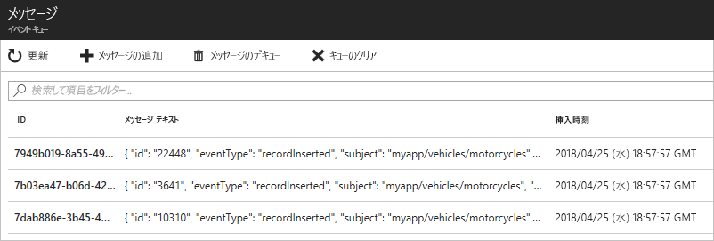

# <a name="route-custom-events-to-azure-queue-storage-with-azure-cli-and-event-grid"></a>Azure CLI と Event Grid を使ってカスタム イベントを Azure Queue Storage にルーティングする

Azure Event Grid は、クラウドのイベント処理サービスです。 Azure Queue Storage は、サポートされているイベント ハンドラーの 1 つです。 この記事では、Azure CLI からカスタム トピックを作成してトピックをサブスクライブし、イベントをトリガーして結果を表示します。 イベントを Queue Storage に送信します。

[!INCLUDE [quickstarts-free-trial-note.md](../../includes/quickstarts-free-trial-note.md)]

[!INCLUDE [event-grid-preview-feature-note.md](../../includes/event-grid-preview-feature-note.md)]

## <a name="create-a-resource-group"></a>リソース グループの作成

Event Grid のトピックは Azure リソースであり、Azure リソース グループに配置する必要があります。 リソース グループは、Azure リソースをまとめてデプロイして管理するための論理上のコレクションです。

[az group create](/cli/azure/group#az_group_create) コマンドでリソース グループを作成します。 

次の例では、*gridResourceGroup* という名前のリソース グループを *westus2* の場所に作成します。

```azurecli-interactive
az group create --name gridResourceGroup --location westus2
```

## <a name="create-a-custom-topic"></a>カスタム トピックの作成

Event Grid のトピックは、イベントの送信先となるユーザー定義のエンドポイントになります。 次の例では、リソース グループにカスタム トピックを作成します。 `<topic_name>` は、トピックの一意の名前に置き換えてください。 トピック名は、DNS エントリによって表されるため、一意である必要があります。

```azurecli-interactive
# if you have not already installed the extension, do it now.
# This extension is required for preview features.
az extension add --name eventgrid

az eventgrid topic create --name <topic_name> -l westus2 -g gridResourceGroup
```

## <a name="create-queue-storage"></a>キュー ストレージを作成する

トピックをサブスクライブする前に、イベント メッセージ用のエンドポイントを作成しましょう。 イベントを収集するためのキュー ストレージを作成します。

```azurecli-interactive
storagename="<unique-storage-name>"
queuename="eventqueue"

az storage account create -n $storagename -g gridResourceGroup -l westus2 --sku Standard_LRS
az storage queue create --name $queuename --account-name $storagename
```

## <a name="subscribe-to-a-topic"></a>トピックのサブスクライブ

どのイベントを追跡するかは、トピックをサブスクライブすることによって Event Grid に伝えます。次の例では、作成したトピックをサブスクライブし、エンドポイントのキュー ストレージのリソース ID を渡します。 Azure CLI では、エンドポイントとしてキュー ストレージの ID を渡します。 エンドポイントの形式は次のとおりです。

`/subscriptions/<subscription-id>/resourcegroups/<resource-group-name>/providers/Microsoft.Storage/storageAccounts/<storage-name>/queueservices/default/queues/<queue-name>`

次のスクリプトは、キューのストレージ アカウントのリソース ID を取得します。 キュー ストレージの ID を作成して、イベント グリッドのトピックをサブスクライブします。 エンドポイントの種類を `storagequeue` に設定し、エンドポイントのキュー ID を使います。

```azurecli-interactive
storageid=$(az storage account show --name $storagename --resource-group gridResourceGroup --query id --output tsv)
queueid="$storageid/queueservices/default/queues/$queuename"

az eventgrid event-subscription create \
  --topic-name <topic_name> \
  -g gridResourceGroup \
  --name <event_subscription_name> \
  --endpoint-type storagequeue \
  --endpoint $queueid
```

サブスクリプションの作成に REST API を使用する場合には、ストレージ アカウントの ID とキューの名前をそれぞれ別個のパラメーターとして渡します。

```json
"destination": {
  "endpointType": "storagequeue",
  "properties": {
    "queueName":"eventqueue",
    "resourceId": "/subscriptions/<subscription-id>/resourcegroups/<resource-group-name>/providers/Microsoft.Storage/storageAccounts/<storage-name>"
  }
  ...
```

## <a name="send-an-event-to-your-topic"></a>トピックへのイベントの送信

イベントをトリガーして、Event Grid がメッセージをエンドポイントに配信するようすを見てみましょう。 まず、カスタム トピックの URL とキーを取得します。 `<topic_name>` には、先ほどと同じトピック名を使用してください。

```azurecli-interactive
endpoint=$(az eventgrid topic show --name <topic_name> -g gridResourceGroup --query "endpoint" --output tsv)
key=$(az eventgrid topic key list --name <topic_name> -g gridResourceGroup --query "key1" --output tsv)
```

この記事では、単純化するために、トピックに送信するサンプル イベント データを使用します。 通常はイベント データをアプリケーションまたは Azure サービスから送信することになります。 CURL は、HTTP 要求を送信するユーティリティです。 この記事では、CURL を使用して、イベントをトピックに送信します。  次の例では、3 つのイベントをイベント グリッド トピックに送信します。

```azurecli-interactive
for i in 1 2 3
do
   body=$(eval echo "'$(curl https://raw.githubusercontent.com/Azure/azure-docs-json-samples/master/event-grid/customevent.json)'")
   curl -X POST -H "aeg-sas-key: $key" -d "$body" $endpoint
done
```

ポータルでキュー ストレージに移動し、イベント グリッドがキューにこれら 3 つのイベントを送信したことを確認します。




## <a name="clean-up-resources"></a>リソースのクリーンアップ
引き続きこのイベントを使用する場合は、この記事で作成したリソースをクリーンアップしないでください。 それ以外の場合は、次のコマンドを使用して、この記事で作成したリソースを削除します。

```azurecli-interactive
az group delete --name gridResourceGroup
```

## <a name="next-steps"></a>次の手順

トピックを作成し、イベントをサブスクライブする方法がわかったら、Event Grid でできることについて、さらに情報を収集しましょう。

- [Event Grid について](overview.md)
- [Blob Storage のイベントをカスタム Web エンドポイントにルーティングする](../storage/blobs/storage-blob-event-quickstart.md?toc=%2fazure%2fevent-grid%2ftoc.json)
- [Azure Event Grid と Logic Apps で仮想マシンの変更を監視する](monitor-virtual-machine-changes-event-grid-logic-app.md)
- [ビッグ データをデータ ウェアハウスにストリーミングする](event-grid-event-hubs-integration.md)
