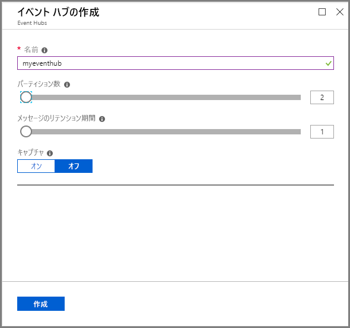

# クイック スタート: Azure portal を使用したイベント ハブの作成

Azure Event Hubs は高度にスケーラブルなデータ ストリーミング プラットフォームであり、毎秒数百万のイベントを受け取って処理できるインジェスト サービスでもあります。 このクイック スタートでは、[Azure portal](https://portal.azure.com) を使用してイベント ハブを作成したうえで、.NET Standard SDK を使用してイベント ハブとの間で送受信を行う方法について説明します。

このクイック スタートを完了するには、Azure サブスクリプションが必要です。 お持ちでない場合は、開始する前に[無料アカウントを作成][]してください。

## 前提条件

このクイック スタートを実行するには、以下が必要です。

- [Visual Studio 2017 Update 3 (バージョン 15.3, 26730.01)](http://www.visualstudio.com/vs) 以降。
- [.NET Standard SDK](https://www.microsoft.com/net/download/windows) バージョン 2.0 以降。

## リソース グループの作成

リソース グループは、Azure リソースの論理的なコレクションです。 すべてのリソースのデプロイと管理はリソース グループで行われます。 以下を実行してリソース グループを作成します。

1. 左側のナビゲーションで、**[リソース グループ]** をクリックします。 **[追加]** をクリックします。

   ![][1]

2. リソース グループに一意の名前を入力します。 現在選択されている Azure サブスクリプションでその名前を使用できるかどうかが、すぐに自動で確認されます。

3. **[サブスクリプション]** で、リソース グループを作成したい Azure サブスクリプションの名前をクリックします。

4. リソース グループの地理的な場所を選択します。

5. **Create** をクリックしてください。

   ![][2]

## Event Hubs 名前空間を作成します

Event Hubs 名前空間は一意のスコープ コンテナーを提供します。このコンテナーは、1 つ以上のイベント ハブを作成する完全修飾ドメイン名によって参照されます。 ポータルを使用してリソース グループに名前空間を作成するには、以下を実行します。

1. [Azure portal][] にログオンし、画面の左上にある **[リソースの作成]** をクリックします。

2. **[モノのインターネット]**、**[Event Hubs]** の順にクリックします。

3. **[名前空間の作成]** で、名前空間の名前を入力します。 その名前が使用できるかどうかがすぐに自動で確認されます。

   

4. 入力した名前空間の名前が使用できることを確認したら、価格レベル (Basic または Standard) を選択します。 Azure サブスクリプション、リソース グループ、リソースが作成される場所を選択します。
 
5. **[作成]** をクリックして、名前空間を作成します。 システムがリソースを完全にプロビジョニングするまで、数分間待つことが必要な場合があります。

6. 名前空間のポータルの一覧で、新しく作成した名前空間をクリックします。

7. **[共有アクセス ポリシー]** をクリックし、**[RootManageSharedAccessKey]** をクリックします。
    
8. コピー ボタンをクリックして **RootManageSharedAccessKey** 接続文字列をクリップボードにコピーします。 後で使用するため、メモ帳などの一時的な場所に、この接続文字列を保存します。
    
## イベント ハブの作成

名前空間内にイベント ハブを作成するには、以下を実行します。

1. Event Hubs 名前空間の一覧で、新しく作成された名前空間をクリックします。      
   
     

2. 名前空間ウィンドウで **[Event Hubs]** をクリックします。
   
    

1. ウィンドウの上部にある **+ [イベント ハブの追加]** をクリックします。
   
    
1. イベント ハブの名前を入力し、 **[作成]** をクリックします。
   
    

お疲れさまでした。 ポータルを使用して Event Hubs 名前空間を作成し、その名前空間内にイベント ハブを作成しました。

## イベント プロセッサ ホストのストレージ アカウントの作成

イベント プロセッサ ホストは、永続的なチェックポイントの管理によって Event Hubs のイベントの受信を簡素化し、並列して受信を行うインテリジェントなエージェントです。 チェックポイント処理を実行するために、イベント プロセッサ ホストではストレージ アカウントが必要です。 次の例は、ストレージ アカウントを作成する方法とそのアクセス キーを取得する方法を示します。

1. [Azure Portal][Azure Portal] にログオンし、画面の左上にある **[新規]** をクリックします。

2. **[ストレージ]**、**[ストレージ アカウント]** の順にクリックします。
   
    

3. **[ストレージ アカウントの作成]** で、ストレージ アカウントの名前を入力します。 リソースが作成される Azure サブスクリプション、リソース グループ、場所を選択します。 **[Create]** をクリックします。
   
    

4. ストレージ アカウントの一覧で、新しく作成したストレージ アカウントをクリックします。

5. ストレージ アカウントのウィンドウで、**[アクセス キー]** をクリックします。 後で使用するため、**key1** の値をコピーしておきます。
   
    

## サンプルのダウンロードと実行

次の手順では、イベントがイベント ハブに送信され、イベント プロセッサ ホストを使用してそれらのイベントが受信されるサンプル コードを実行します。 

最初に、GitHub から [SampleSender](https://github.com/Azure/azure-event-hubs/tree/master/samples/DotNet/Microsoft.Azure.EventHubs/SampleSender) サンプルと [SampleEphReceiver](https://github.com/Azure/azure-event-hubs/tree/master/samples/DotNet/Microsoft.Azure.EventHubs/SampleEphReceiver) サンプルをダウンロードします。または、[azure-event-hubs リポジトリ](https://github.com/Azure/azure-event-hubs)を複製します。

### 送信者

1. Visual Studio を開き、**[ファイル]** メニューの **[開く]** をクリックしてから、**[プロジェクト/ソリューション]** をクリックします。

2. 先ほどダウンロードした **SampleSender** サンプル フォルダーを探して、SampleSender.sln ファイルをダブルクリックし、Visual Studio でプロジェクトを読み込みます。

3. ソリューション エクスプローラーで Program.cs をダブルクリックし、Visual Studio エディターでそのファイルを開きます。

4. `EventHubConnectionString` の値は、名前空間を作成したときに取得した接続文字列に置き換えます。

5. `EventHubName` を、その名前空間内に作成したイベント ハブの名前に置き換えます。

6. エラーが発生しないよう、**[ビルド]** メニューの **[ソリューションのビルド]** をクリックします。

### 受信者

1. Visual Studio を開き、**[ファイル]** メニューの **[開く]** をクリックしてから、**[プロジェクト/ソリューション]** をクリックします。

2. 手順 1. でダウンロードした **SampleEphReceiver** サンプル フォルダーを探して、SampleEphReceiver.sln ファイルをダブルクリックし、Visual Studio でプロジェクトを読み込みます。

3. ソリューション エクスプローラーで Program.cs をダブルクリックし、Visual Studio エディターでそのファイルを開きます。

4. 以下の変数の値を置き換えます。
    1. `EventHubConnectionString`: 名前空間を作成したときに取得した接続文字列に置き換えます。
    2. `EventHubName`: その名前空間内に作成したイベント ハブの名前。
    3. `StorageContainerName`: ストレージ コンテナーの名前。 一意の名前を付けてください。コンテナーはアプリを実行するときに自動で作成されます。
    4. `StorageAccountName`: 作成したストレージ アカウントの名前。
    5. `StorageAccountKey`: Azure portal から取得したストレージ アカウント キー。

5. エラーが発生しないよう、**[ビルド]** メニューの **[ソリューションのビルド]** をクリックします。

### アプリの実行

最初に、**SampleSender** アプリケーションを実行して、100 個のメッセージが送信されるのを確認します。 **Enter** キーを押してプログラムを終了します。

![][3]

次に、**SampleEphReceiver** アプリを実行し、イベント プロセッサ ホストによってメッセージが受信されるのを確認します。

![][4]
 
## リソースのクリーンアップ

ポータルを使用して、ストレージ アカウント、名前空間、イベント ハブを削除できます。 

1. Azure portal で、左側のウィンドウの **[すべてのリソース]** をクリックします。 
2. 削除したいストレージ アカウントまたは名前空間をクリックします。 名前空間を削除すると、その中のイベント ハブもすべて削除されます。
3. 画面上部にあるメニュー バーで、**[削除]** をクリックします。 削除を確定します。 

## 次の手順

この記事では、イベント ハブからイベントを送受信するために必要な Event Hubs 名前空間などのリソースを作成しました。 さらに学習するには、次のチュートリアルに進んでください。

> [!div class="nextstepaction"]
> [Event Hubs データ ストリームでデータの異常を視覚化する](event-hubs-tutorial-visualize-anomalies.md)

[無料アカウントを作成]: https://azure.microsoft.com/free/?ref=microsoft.com&utm_source=microsoft.com&utm_medium=docs&utm_campaign=visualstudio
[Azure Portal]: https://portal.azure.com/
[1]: ./media/event-hubs-quickstart-portal/resource-groups1.png
[2]: ./media/event-hubs-quickstart-portal/resource-groups2.png
[3]: ./media/event-hubs-quickstart-portal/sender1.png
[4]: ./media/event-hubs-quickstart-portal/receiver1.png
