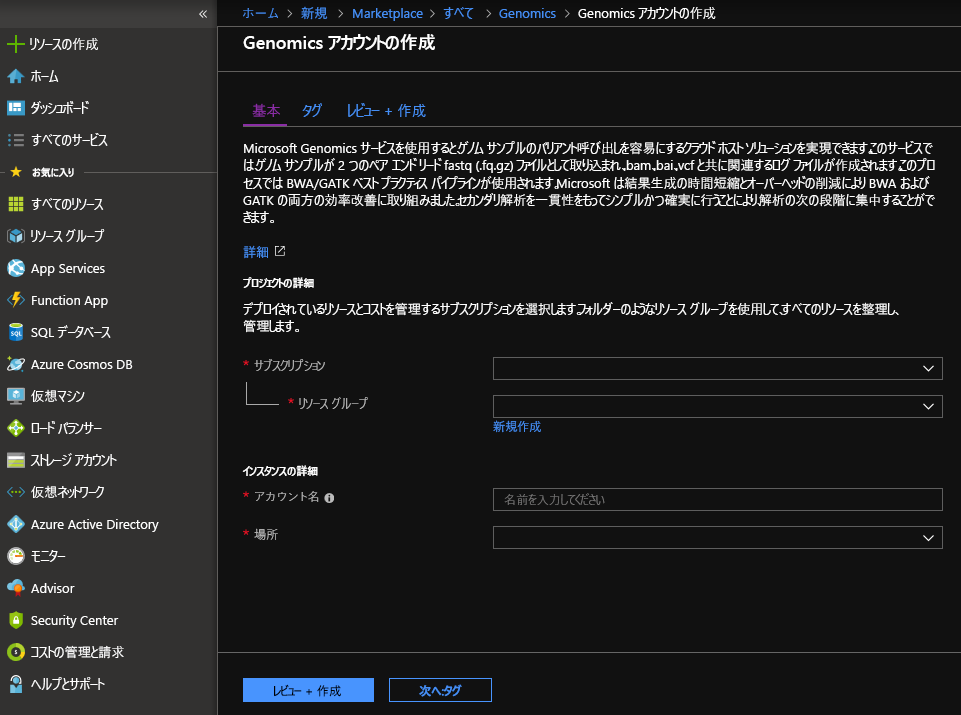
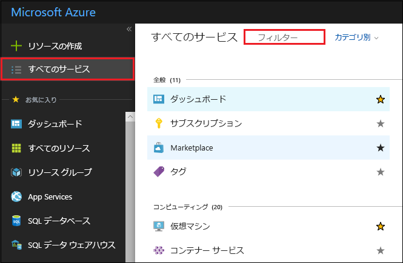
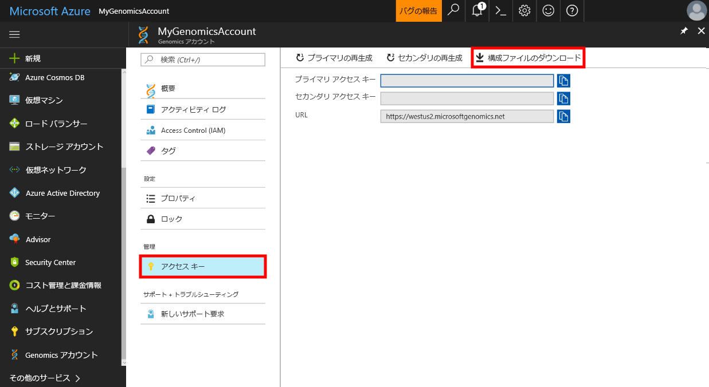

# <a name="quickstart-run-a-workflow-through-the-microsoft-genomics-service"></a>クイックスタート: Microsoft Genomics サービス経由でのワークフローの実行

このクイック スタートでは、Azure Blob Storage に入力データを読み込み、Microsoft Genomics サービス経由でワークフローを実行する方法を示します。 Microsoft Genomics は、Raw 読み取りから始まり、アライメントされたリードの作成およびバリアント呼び出しなどのゲノムを迅速に処理できる二次解析のための、スケーラブルでセキュリティに保護されたサービスです。 

次のいくつかの手順のみで、使用を開始できます。 
1.  設定: Azure Portal 経由で Microsoft Genomics アカウントを作成して、ローカル環境に Microsoft Genomics Python クライアントをインストールします。 
2.  入力データのアップロード: Azure Portal 経由で Microsoft Azure Storage アカウントを作成し、入力ファイルをアップロードします。 入力ファイルは、paired end 読み取り (fastq または bam ファイル) にする必要があります。
3.  実行: Microsoft Genomics コマンドライン インターフェイスを使用して、Microsoft Genomics サービス経由でワークフローを実行します。 

Microsoft Genomics の詳細については、「[What is Microsoft Genomics?](overview-what-is-genomics.md)」 (Microsoft Genomics について) をご覧ください。

## <a name="set-up-create-a-microsoft-genomics-account-in-the-azure-portal"></a>設定: Azure Portal で Microsoft Genomics アカウントを作成する

Microsoft Genomics アカウントを作成するには、[Azure Portal](https://portal.azure.com/#create/Microsoft.Genomics) に移動します。 Azure サブスクリプションをまだお持ちでない場合は、Microsoft Genomics アカウントを作成する前に、サブスクリプションを作成してください。 




以下の情報を使用して、上記の画像に示したように Genomics アカウントを構成します。 

 |**設定**          |  **推奨値**  | **フィールドの説明** |
 |:-------------       |:-------------         |:----------            |
 |アカウント名         | MyGenomicsAccount     |一意のアカウント識別子を選択します。 有効な名前については、「[名前付け規則](https://docs.microsoft.com/azure/architecture/best-practices/naming-conventions)」をご覧ください。 |
 |サブスクリプション         | お使いのサブスクリプション名|これは、Azure サービスの課金単位です。サブスクリプションの詳細については、[サブスクリプション](https://account.azure.com/Subscriptions)に関するページをご覧ください。 |      
 |リソース グループ       | MyResourceGroup       |  リソース グループを使用すると、複数の Azure リソース (Storage アカウント、Genomics アカウントなど) を1 つのグループにまとめて、管理を簡単にできます。 詳細については、「[リソース グループ](https://docs.microsoft.com/azure/azure-resource-manager/resource-group-overview#resource-groups)」を参照してください。 有効なリソース グループ名については、「[名前付け規則](https://docs.microsoft.com/azure/architecture/best-practices/naming-conventions)」をご覧ください。 |
 |Location                   | 米国西部 2                    |    サービスは、米国西部 2、西ヨーロッパ、および東南アジアで利用可能です。 |


最上部のメニュー バーにある [通知] をクリックすると、デプロイ プロセスを監視できます。


## <a name="set-up-install-the-microsoft-genomics-python-client"></a>設定: Microsoft Genomics Python クライアントをインストールする

ユーザーは、ローカル環境に Python と Microsoft Genomics Python クライアントの両方をインストールする必要があります。 

### <a name="install-python"></a>Python のインストール

Microsoft Genomics Python クライアントは、Python 2.7 と互換性があります。 2.7.12 またはそれ以降の 2.7.xx バージョンと互換性があります。この記事の執筆時点における最新バージョンは 2.7.15 で、推奨されるバージョンは 2.7.14 です。 ダウンロードは[こちら](https://www.python.org/downloads/)で検索できます。 

注: Python 3.x には Python 2.7.xx との互換性がありません。  MSGen は Python 2.7 アプリケーションです。 MSGen を実行するときは、アクティブな Python 環境で 2.7.xx バージョンの Python が使用されていることを確認してください。 3.x バージョンの Python で MSGen を使用しようとすると、エラーが発生する可能性があります。


### <a name="install-the-microsoft-genomics-client"></a>Microsoft Genomics クライアントのインストール

Python pip を使用してMicrosoft Genomics クライアントの `msgen`をインストールします。 次の手順では、Python が既にシステム パスにあることを前提としています。 pip のインストールが認識されない問題が生じた場合は、システム パスに Python とスクリプトのサブフォルダーを追加する必要があります。


```
pip install --upgrade --no-deps msgen
pip install msgen
```


`msgen` をシステム全体のバイナリとしてインストールして、システム全体の Python パッケージを修正したくない場合は、`pip`と共に `–-user`フラグを使用します。
パッケージ ベースのインストールまたは setup.py を使用すると、必要なすべての必須パッケージがインストールされます。 それ以外の場合は、以下に示す msgen 用の基本の必須パッケージがインストールされます。 

 * [Azure-storage](https://pypi.python.org/pypi/azure-storage) 
 * [Requests](https://pypi.python.org/pypi/requests) 


`pip` を使用して、`easy_install`または標準の `setup.py` プロシージャ経由で、これらのパッケージをインストールできます。 


### <a name="test-the-microsoft-genomics-client"></a>Microsoft Genomics クライアントのテスト
Microsoft Genomics クライアントをテストするには、お使いのgenomics アカウントから config ファイルをダウンロードします。 左上の **[すべてのサービス]** をクリックし、フィルターを使って genomics アカウントを選択して、自分の genomics アカウントに移動します。





先ほど作成した genomics アカウントを選択して、**[アクセス キー]** に移動し、構成ファイルをダウンロードします。




次のコマンドを使って、Microsoft Genomics Python クライアントが動作することをテストします。


```
msgen list -f “<full path where you saved the config file>”
```

## <a name="create-a-microsoft-azure-storage-account"></a>Microsoft Azure Storage アカウントを作成する 
Microsoft Genomics サービスでは、Azure Storage アカウントのブロック BLOB として、入力が格納されることを期待します。 また、Azure Storage アカウントにあるユーザー指定コンテナーに、出力ファイルをブロック BLOB として書き込みます。 入力と出力は、さまざまなストレージ アカウントに配置できます。
お使いのデータが既に Azure Storage アカウントにある場合、Genomics アカウントと同じ場所にそのデータを配置するだけでかまいません。 それ以外の場合は、Genomics サービスを実行するときに送信費が発生します。 まだ Microsoft Azure Storage アカウントを持っていない場合は、アカウントを作成してデータをアップロードする必要があります。 ストレージ アカウントの概要やサービスの提供内容など、Azure Storage アカウントの詳細情報については、[こちら](https://docs.microsoft.com/azure/storage/common/storage-create-storage-account)から検索できます。 Microsoft Azure Storage アカウントを作成するには、[Azure Portal](https://portal.azure.com/#create/Microsoft.StorageAccount-ARM ) に移動します。  


以下の情報を使用して、上記の画像に示したようにストレージ アカウントを構成します。 アカウントが BLOB ストレージであり、汎用的な目的でないことだけを指定して、ストレージ アカウントの標準オプションのほとんどを使用します。 BLOB ストレージでは、ダウンロードおよびアップロードの 2 ～ 5倍の高速化が可能です。 


 |**設定**          |  **推奨値**  | **フィールドの説明** |
 |:-------------------------       |:-------------         |:----------            |
 |Name         | MyStorageAccount     |一意のアカウント識別子を選択します。 有効な名前については、「[名前付け規則](https://docs.microsoft.com/azure/architecture/best-practices/naming-conventions)」をご覧ください。 |
 |デプロイメント モデル         | リソース マネージャー| リソース マネージャーは、推奨されるデプロイ モデルです。 詳細については、[リソース マネージャー デプロイの理解](https://docs.microsoft.com/azure/azure-resource-manager/resource-manager-deployment-model)に関するページをご覧ください。 |      
 |アカウントの種類       | BLOB ストレージ       |  BLOB ストレージでは、汎用的な目的の場合より、2 ～ 5 倍のダウンロードおよびアップロードの高速化が可能です。 |
 |[パフォーマンス]                  | 標準                   | 既定値は Standard です。 Standard および Premium Storage アカウントの詳細については、「[Microsoft Azure Storage の概要](https://docs.microsoft.com/azure/storage/common/storage-introduction)」をご覧ください。    |
 |レプリケーション                  | ローカル冗長ストレージ                  | ローカル冗長ストレージでは、お使いのストレージ アカウントが作成されたリージョンのデータセンター内に、データをレプリケートします。 詳細については、「[Azure Storage のレプリケーション](https://docs.microsoft.com/azure/storage/common/storage-redundancy)」をご覧ください。    |
 |安全な転送が必須                  | Disabled                 | 既定では無効になっています。 データ転送セキュリティの詳細については、[安全な転送が必要](https://docs.microsoft.com/azure/storage/common/storage-require-secure-transfer)であることに関するページをご覧ください。    |
 |アクセス層                  | ホット                   | ホット アクセスは、ストレージ アカウント内のオブジェクトへのアクセス頻度が高いことを示します。    |
 |サブスクリプション         | お使いの Azure サブスクリプション |サブスクリプションの詳細については、[サブスクリプション](https://account.azure.com/Subscriptions)に関するページをご覧ください。 |      
 |リソース グループ       | MyResourceGroup       |  お使いの genomics アカウントと同じリソース グループを選択できます。 有効なリソース グループ名については、「[名前付け規則](https://docs.microsoft.com/azure/architecture/best-practices/naming-conventions)」をご覧ください。 |
 |Location                  | 米国西部 2                  | お使いの genomics アカウントの場所と同じ場所を使用し、送信費を削減すると共に待機時間を短縮します。 Genomics サービスは、米国西部 2、西ヨーロッパ、および東南アジアで利用可能です。    |
 |仮想ネットワーク                | Disabled                   | 既定では無効になっています。 詳細については、[Azure Virtual Networks](https://docs.microsoft.com/azure/storage/common/storage-network-security) に関するページをご覧ください。    |


その後、[作成] をクリックしてストレージ アカウントを作成します。 Genomics アカウントの作成時と同様に、最上部のメニュー バーにある [通知] をクリックして、デプロイ プロセスを監視できます。 


## <a name="upload-input-data-to-your-storage-account"></a>入力データをストレージ アカウントにアップロードする

Microsoft Genomics サービスでは、paired end 読み取りを入力ファイルに期待します。 独自のデータをアップロードするか、またはユーザー向けに提供されている一般利用可能なサンプル データの使用を検討するかを選択できます。 一般利用可能なサンプル データを使用する場合は、以下でホストされます。


[https://msgensampledata.blob.core.windows.net/small/chr21_1.fq.gz](https://msgensampledata.blob.core.windows.net/small/chr21_1.fq.gz)
[https://msgensampledata.blob.core.windows.net/small/chr21_2.fq.gz](https://msgensampledata.blob.core.windows.net/small/chr21_2.fq.gz)


ストレージ アカウント内では、入力データ用に 1 つの BLOB コンテナーと、出力データ用に 2 つ目の BLOB コンテナーを作成する必要があります。  入力データをお使いの入力用 BLOB コンテナーにアップロードします。 アップロードを行うために、[Microsoft Azure Storage Explorer](https://azure.microsoft.com/features/storage-explorer/)、[blobporter](https://github.com/Azure/blobporter)、[AzCopy](https://docs.microsoft.com/azure/storage/common/storage-use-azcopy?toc=%2fazure%2fstorage%2fblobs%2ftoc.json) など、さまざまなツールを使用できます。 


## <a name="run-a-workflow-through-the-microsoft-genomics-service-using-the-python-client"></a>Python クライアントを使用して Microsoft Genomics サービス経由でワークフローを実行する 

Microsoft Genomics サービス経由でワークフローを実行するために、config.txt ファイルを編集してお使いのデータの入力および出力ストレージ コンテナーを指定します。
お使いの Genomics アカウントからダウンロードした config.txt ファイルを開きます。 ユーザーによる指定が必要なセクションは、サブスクリプション キーと下部にある 6 つの項目、ストレージ アカウント名、入力および出力用のキーとコンテナー名です。 この情報を検索するには、ポータル内でお使いのストレージ アカウントの**アクセス キー**に移動するか、Azure Storage Explorer から直接移動します。  


### <a name="submit-your-workflow-to-the-microsoft-genomics-service-the-microsoft-genomics-client"></a>Microsoft Genomics クライアントを使用して Microsoft Genomics サービスにワークフローを送信する

Microsoft Genomics Python クライアントを使用して、次のコマンドを使ってワークフローを送信します。


```python
msgen submit -f [full path to your config file] -b1 [name of your first paired end read] -b2 [name of your second paired end read]
```


次のコマンドを使ってワークフローの状態を表示できます。 
```python
msgen list -f c:\temp\config.txt 
```


ワークフローが完了すると、構成した出力コンテナーにあるお使いの Azure Storage アカウントの出力ファイルを表示できます。 


## <a name="next-steps"></a>次の手順
この記事では、サンプル入力データを Azure Storage にアップロードして、`msgen` Python クライアント経由で Microsoft Genomics サービスにワークフローを送信しました。 Microsoft Genomics サービスで使用できる他の入力 ファイルの種類の詳細については、[一組の FASTQ](quickstart-input-pair-FASTQ.md) | [BAM](quickstart-input-BAM.md) | [複数の FASTQ または BAM](quickstart-input-multiple.md) に関するページをご覧ください。 このチュートリアルは、[Azure notebook チュートリアル](https://aka.ms/genomicsnotebook)を使って考察することもできます。
