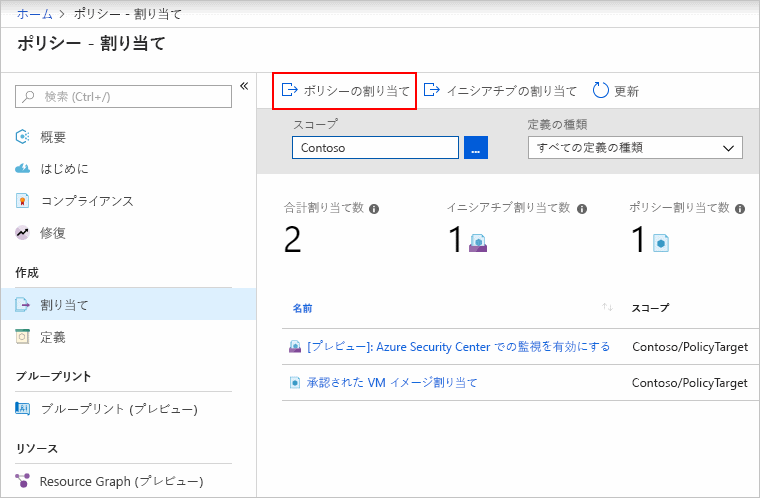
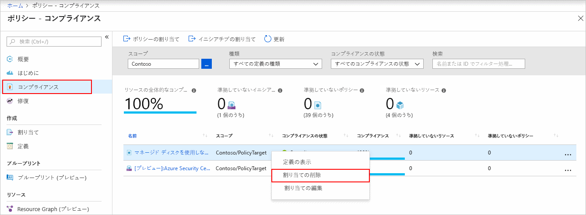

# ポリシーの割り当てを作成し、Azure 環境内の準拠していないリソースを特定する

Azure のコンプライアンスを理解する第一歩は、リソースの状態を特定することです。
このクイックスタートでは、ポリシー割り当てを作成して、マネージド ディスクを使用していない仮想マシンを特定するプロセスについて順を追って説明します。

このプロセスを終了すると、マネージド ディスクを使用していない仮想マシンを適切に特定できるようになります。 これらはポリシー割り当てに*準拠していません*。

Azure サブスクリプションをお持ちでない場合は、開始する前に[無料](https://azure.microsoft.com/free/)アカウントを作成してください。

## ポリシー割り当てを作成する

このクイックスタートでは、ポリシー割り当てを作成し、"*管理ディスクのない仮想マシンを監査*" ポリシー定義を割り当てます。

1. Azure portal 上で **[すべてのサービス]** をクリックし、**[ポリシー]** を検索して選択し、Azure Policy サービスを起動します。

   

1. Azure Policy ページの左側にある **[割り当て]** を選択します。 割り当ては、特定のスコープ内で実行するように割り当てられたポリシーです。

   

1. **[ポリシー - 割り当て]** ページの上部で **[ポリシーの割り当て]** を選択します。

   

1. **[ポリシーの割り当て]** ページで、**[スコープ]** を選択します。その際、省略記号をクリックし、管理グループまたはサブスクリプションを選択します。 任意でリソース グループを選択します。 スコープによって、ポリシー割り当てを強制するリソースまたはリソースのグループが決まります。  次に、**[スコープ]** ページの下部にある **[選択]** をクリックします。

   この例では、**Contoso** サブスクリプションを使用しています。 お客様によってサブスクリプションは異なります。

1. リソースは**スコープ**に基づいて除外できます。  **除外**は**スコープ**のレベルよりも 1 つ下のレベルで開始されます。 **除外**は省略可能です。ここでは空のまま残してください。

1. **[ポリシー定義]** の省略記号を選択して、使用可能な定義の一覧を開きます。 Azure Policy に組み込まれているポリシー定義を使用できます。 次のようなさまざまな定義を利用できます。

   - タグとその値を強制
   - タグとその値を適用
   - SQL Server バージョン 12.0 が必要

   使用できるすべての組み込みのポリシーの完全な一覧については、[ポリシー サンプル](./samples/index.md)に関する記事をご覧ください。

1. ポリシー定義の一覧で、"*Audit VMs that do not use managed disks\(マネージド ディスクを使用しない VM の監査\)*" 定義を見つけます。 そのポリシーをクリックし、**[選択]** をクリックします。

   

1. **[割り当て名]** には選択したポリシー名が自動的に入力されますが、この名前は変更できます。 この例では、"*Audit VMs that do not use managed disks\(マネージド ディスクを使用しない VM の監査\)*" をそのまま使用します。 必要に応じて、**説明**を追加することもできます。 説明では、このポリシーの割り当ての詳細を示します。 **[割り当て担当者]** には、ログイン ユーザーに基づいて自動的にデータが入力されます。 このフィールドは任意です。カスタム値を入力できます。

1. **[マネージド ID を作成します]** のチェックは外しておいてください。 これは、割り当てられるポリシーまたはイニシアティブに [deployIfNotExists](./concepts/effects.md#deployifnotexists) 効果を含むポリシーが含まれるときに選択する_必要があります_。 このクイック スタートに使用するポリシーにはそれが含まれないため、空のままにします。 詳細については、「[マネージド ID](../../active-directory/managed-identities-azure-resources/overview.md)」と「[how remediation security works](./how-to/remediate-resources.md#how-remediation-security-works)」 (修復セキュリティのしくみ) を参照してください。

1. **[割り当て]** をクリックします。

以上の手順で、準拠していないリソースを特定し、環境のコンプライアンスの状態を理解できるようになりました。

## 準拠していないリソースを特定する

ページの左側の **[コンプライアンス]** を選択し、作成した "**Audit VMs that do not use managed disks\(マネージド ディスクを使用しない VM の監査\)**" ポリシーの割り当てを見つけます。

この新しい割り当てに準拠していない既存のリソースがある場合、**[準拠していないリソース]** の下に表示されます。

既存のリソースに対して条件が評価され、該当した場合、そのリソースはポリシーに準拠していないとしてマークされます。 次の表は、さまざまなポリシーの効果での条件の評価と、その結果であるコンプライアンスの状態を示しています。 Azure Portal では評価ロジックは表示されませんが、コンプライアンスの状態の結果が表示されます。 コンプライアンスの状態の結果は、"対応" または "準拠していない" のいずれかです。

| **リソースの状態** | **効果** | **ポリシーの評価** | **コンプライアンスの状態** |
| --- | --- | --- | --- |
| Exists | Deny、Audit、Append\*、DeployIfNotExist\*、AuditIfNotExist\* | True | 非準拠 |
| Exists | Deny、Audit、Append\*、DeployIfNotExist\*、AuditIfNotExist\* | False | 対応 |
| 新規 | Audit、AuditIfNotExist\* | True | 非準拠 |
| 新規 | Audit、AuditIfNotExist\* | False | 対応 |

\* Append、DeployIfNotExist、AuditIfNotExist の各効果では、IF ステートメントが TRUE である必要があります。 また、非準拠となるには、既存の条件が FALSE である必要があります。 TRUE のとき、IF 条件は関連するリソースの既存の条件の評価をトリガーします。

## リソースのクリーンアップ

このコレクションの他のガイドは、このクイックスタートに基づいています。 引き続きチュートリアルの作業を行う場合は、このクイックスタートで作成したリソースをクリーンアップしないでください。 これ以上作業を行わない場合は、次の手順に従って、このクイック スタートで作成したすべてのリソースを Azure Portal で削除してください。

1. Azure Policy ページの左側の **[コンプライアンス]** (または **[割り当て]**) を選択し、作成した "**Audit VMs that do not use managed disks\(マネージド ディスクを使用しない VM の監査\)**" ポリシーの割り当てを見つけます。

1. "**Audit VMs that do not use managed disks\(マネージド ディスクを使用しない VM の監査\)**" ポリシーの割り当てを右クリックし、**[割り当ての削除]** を選択します。

   

## 次の手順

このクイック スタートでは、ポリシー定義をスコープに割り当て、コンプライアンス レポートを評価しました。 ポリシー定義により、スコープ内のすべてのリソースを確実に準拠させることができ、準拠していないリソースを特定できます。

ポリシーの割り当てについてさらに詳しく学び、**今後**作成されるリソースが準拠していることを確認するには、次に進んでください。

> [!div class="nextstepaction"]
> [ポリシーの作成と管理](./tutorials/create-and-manage.md)