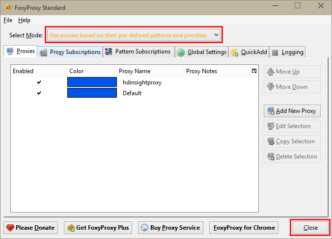

<properties
   pageTitle="Linux、Unix、または OS X から Linux ベースの HDInsight 上の Hadoop で SSH キーを使用する | Azure"
   description="SSH キーを作成して、Linux ベースの HDInsight クラスターに対する認証に使用する方法について説明します。"
   services="hdinsight"
   documentationCenter=""
   authors="Blackmist"
   manager="paulettm"
   editor="cgronlun"/>

<tags
   ms.service="hdinsight"
   ms.devlang=""
   ms.topic="article"
   ms.tgt_pltfrm="na"
   ms.workload="big-data"
   ms.date="02/18/2015"
   ms.author="larryfr"/>

##Linux、Unix、または OS X から HDInsight 上の Linux ベースの Hadoop で SSH キーを使用する (プレビュー)

Linux ベースの HDInsight クラスターには、パスワードまたは SSH キーを使用して SSH アクセスを保護するためのオプションが用意されています。このドキュメントでは、Linux、Unix、または OS X の各クライアントから HDInsight で SSH を使用する方法について説明します。

> [AZURE.NOTE] この記事で説明する手順は、Linux、Unix、または OS X の各クライアントを使用していることを前提とします。 `ssh` と `ssh-keygen` を提供するパッケージ (Windows の Git など) をインストール済みの場合は、これらの手順を Windows クライアントで実行できますが、[HDInsight の Linux ベースの Hadoop での Windows からの SSH の使用]に関するページに記載されている手順に従って Windows クライアントを設定することをお勧めします(/documentation/articles/hdinsight-hadoop-linux-use-ssh-windows/)。

##前提条件

* Linux、Unix、および OS X の各クライアント用の **ssh-keygen** と **ssh**。通常、このユーティリティはオペレーティング システムに付属しています。また、パッケージ管理システムから入手することもできます。

* HTML5 をサポートする最新の Web ブラウザー

または

* Azure クロスプラットフォーム コマンド ライン ツール

##SSH とは

SSH は、リモート サーバーにログインしたり、リモート サーバーでコマンドをリモート実行したりするためのユーティリティです。Linux ベースの HDInsight では、SSH によりクラスター ヘッド ノードへの安全な接続が確立され、コマンドの入力に使用するコマンド ラインが提供されます。コマンドは、直接サーバーで実行されます。

##SSH キーの作成 (オプション)

Linux ベースの HDInsight クラスターを作成するとき、SSH キーを使用したサーバーへの認証にパスワードまたは SSH キーを使用することを選択できます。証明書ベースであるため、SSH キーの方がより安全です。クラスターで SSH キーを使用する場合は、次の手順を実行します。

1. ターミナル セッションを開き、次のコマンドを使用して、既存の SSH キーがあるかどうかを確認します。

		ls -al ~/.ssh

	ディレクトリ一覧で、次のファイルを探します。これらは SSH 公開キーの共通名です。

	* id\_dsa.pub
	* id\_ecdsa.pub
	* id\_ed25519.pub
	* id\_rsa.pub

2. 既存のファイルを使用しない場合や、既存の SSH キーがない場合は、次のコマンドを使用して新しいファイルを生成します。

		ssh-keygen -t rsa

	次の情報の入力を求められます。

	* ファイルの場所 - 既定値は ~/.ssh/id\_rsa です。
	* パスフレーズ - 1 回入力した後に再入力を求められます。
	
		> [AZURE.NOTE] 安全性の高いパスフレーズをキーに使用することを強くお勧めします。ただし、パスフレーズを忘れた場合、復元する方法はありません。

	コマンドが完了すると、2 つの新しいファイル (秘密キー (**id\_rsa** など) と公開キー (**id\_rsa.pub** など)) が作成されます。

##Linux ベースの HDInsight クラスターの作成

Linux ベースの HDInsight クラスターを作成するときには、以前に作成した**公開キー**を指定する必要があります。Linux、Unix、または OS X の各クライアントからは、2 つの方法で HDInsight クラスターを作成できます。

* **Azure 管理ポータル** - Web ベースのポータルを使用してクラスターを作成します。

* **Azure クロスプラットフォーム コマンド ライン インターフェイス (xplat-cli)** - コマンド ラインでコマンドを使用してクラスターを作成します。

これらの方法では、それぞれ**パスワード**または**公開キー**が必要です。Linux ベースの HDInsight クラスターを作成する方法の詳細については、<a href="/documentation/articles/hdinsight-hadoop-provision-linux-clusters/" target="_blank">HDInsight での Linux クラスターのプロビジョニング</a>に関するページを参照してください。

###Azure の管理ポータル

このポータルを使用して Linux ベースの HDInsight クラスターを作成する場合は、**SSH ユーザー名**を入力して、**パスワード**と **SSH 公開キー**のどちらを入力するかを選択する必要があります。**SSH 公開キー**を選択した場合は、(拡張子が **.pub** のファイルに含まれている) 公開キーを次のフォームに貼り付ける必要があります。


> [AZURE.NOTE] このキー ファイルは単なるテキスト ファイルです。内容は次のようになります。
> ```
ssh-rsa AAAAB3NzaC1yc2EAAAADAQABAAABAQCelfkjrpYHYiks4TM+r1LVsTYQ4jAXXGeOAF9Vv/KGz90pgMk3VRJk4PEUSELfXKxP3NtsVwLVPN1l09utI/tKHQ6WL3qy89WVVVLiwzL7tfJ2B08Gmcw8mC/YoieT/YG+4I4oAgPEmim+6/F9S0lU2I2CuFBX9JzauX8n1Y9kWzTARST+ERx2hysyA5ObLv97Xe4C2CQvGE01LGAXkw2ffP9vI+emUM+VeYrf0q3w/b1o/COKbFVZ2IpEcJ8G2SLlNsHWXofWhOKQRi64TMxT7LLoohD61q2aWNKdaE4oQdiuo8TGnt4zWLEPjzjIYIEIZGk00HiQD+KCB5pxoVtp user@system
> ```

これで、入力したパスワードまたは公開キーを使用して、指定されたユーザーのログインが作成されます。

###Azure クロスプラットフォーム コマンド ライン インターフェイス

<a href="../xplat-cli/" target="_brad">Azure クロスプラットフォーム コマンド ライン インターフェイス</a>を使用すると、 `azure hdinsight cluster create` コマンドで新しいクラスターを作成できます。

このコマンドの使用方法の詳細については、「<a href="../hdinsight-hadoop-provision-linux-clusters/" target="_blank">カスタム オプションを使用した HDInsight での Hadoop クラスターのプロビジョニング</a>」を参照してください。

##Linux ベースの HDInsight クラスターへの接続

ターミナル セッションから、SSH コマンドを使用して、ユーザー名とクラスター アドレスを入力し、クラスターに接続します。

* **SSH アドレス** - クラスター名に続けて「**-ssh.azurehdinsight.net**」と入力します。たとえば、**mycluster-ssh.azurehdinsight.net** のようになります。

* **ユーザー名** - クラスターの作成時に指定した SSH ユーザー名。

次の例では、ユーザー **me** として、**mycluster** というクラスターに接続します。

	ssh me@mycluster-ssh.azurehdinsight.net

ユーザー アカウントに**パスワード**を使用した場合は、そのパスワードの入力を求められます。

パスフレーズで保護された **SSH キー**を使用した場合は、そのパスフレーズの入力を求められます。パスフレーズを入力しない場合、SSH はローカルの秘密キーのいずれかをクライアントで使用して自動的に認証を試行します。

> [AZURE.NOTE] SSH が適切な**秘密キー**を使用して自動的に認証を行わない場合は、**-i** パラメーターを使用して、秘密キーのパスを指定します。次の例は、`~/.ssh/id_rsa` から**秘密キー**を読み込みます。
> 
> `ssh -i ~/.ssh/id_rsa me@mycluster-ssh.azurehdinsight.net`

##アカウントの追加

2. 新しいユーザー アカウントの**公開キー**と**秘密キー**を、「[SSH キーの作成]」(#create) の手順に従って新しく生成します。

	> [AZURE.NOTE] 秘密キーは、クラスターに接続するためにユーザーが使用するクライアントで生成するか、または生成後にそのクライアントに安全に転送する必要があります。

1. クラスターに対する SSH セッションから、次のコマンドを使用して新しいユーザーを追加します。

		sudo adduser --disabled-password <username> 

	これで、新しいユーザー アカウントが作成されますが、パスワード認証は無効になります。

2. 次のコマンドを使用して、キーを保存するためのディレクトリとファイルを作成します。

		sudo mkdir -p /home/<username>/.ssh
		sudo touch /home/<username>/.ssh/authorized_keys
		sudo nano /home/<username>/.ssh/authorized_keys

3. nano エディターが開いたら、新しいユーザー アカウントの**公開キー**の内容をコピーして貼り付けます。最後に、**Ctrl + X ** キーを押してファイルを保存し、エディターを終了します。

	

4. 次のコマンドを使用して、.ssh フォルダーとその内容の所有権を新しいユーザー アカウントに変更します。

		sudo chown -hR <username>:<username> /home/<username>/.ssh

5. これで、新しいユーザー アカウントと**秘密キー**を使用してサーバーに対する認証が行えるようになりました。

##<a id="tunnel"></a>SSH トンネリング

SSH を使用して、Web 要求などのローカルの要求を HDInsight クラスターにトンネリングすることもできます。ここでは、最初から HDInsight クラスター ヘッド ノード上にあったかのように、要求が要求済みリソースにルーティングされます。

これは、クラスター内でヘッドまたはワーカー ノードの内部ドメイン名を使用する HDInsight クラスターで Web ベースのサービスにアクセスするときに最も役立ちます。Ambari Web ベースの一部のセクションで **headnode0.mycluster.d1.internal.cloudapp.net** などの内部ドメイン名を使用する場合などです。これらの名前は、クラスター外部で解決できませんが、SSH を介してトンネリングされた要求はクラスター内から発信され、正常に解決します。

SSH トンネルを作成し、ブラウザーでこれを使用してクラスターに接続するように構成するには、次の手順を実行します。

1. 次のコマンドを使用して、クラスターのヘッド ノードへの SSH トンネルを作成できます。

		ssh -C2qTnNf -D 9876 username@clustername-ssh.azurehdinsight.net

	これで、ローカル ポート 9876 へのトラフィックを SSH 経由でクラスターにルーティングする接続が作成されます。オプションは次のとおりです。

	* **D 8080** - トンネル経由でトラフィックをルーティングするローカル ポート。

	* **C** - すべてのデータを圧縮します (Web トラフィックの大部分はテキストであるため)。

	* **2** - SSH プロトコル バージョンを強制的に 2 のみに指定します。

	* **q** - Quiet モードです。

	* **T** - pseudo-tty の割り当てを無効にします (ポートの転送だけを行うため)。
	
	* **n** - STDIN を読み取らないようにします (ポートの転送だけを行うため)。

	* **N** - リモート コマンドを実行しません (ポートの転送だけを行うため)。

	* **f** - バックグラウンドで実行します。

	**SSH キー**を使用してクラスターを構成した場合は、SSH 秘密キーのパスを `-i` パラメーターで指定する必要があることがあります。

	コマンドが完了すると、ローカル コンピューター上でポート 9876 に送信されるトラフィックは、クラスターのヘッド ノードに SSL 経由でルーティングされ、そのヘッド ノードで生成されたかのように見えます。

2. **SOCKS v5** プロキシとして **localhost:9876** を使用するようにクライアント プログラム (Firefox など) を構成します。Firefox の設定例を次に示します。

	

	> [AZURE.NOTE] **[Remote DNS]** を選択すると、HDInsight クラスターを使用して DNS 要求が解決されます。選択しない場合は、DNS がローカルで解決されます。

	Firefox でプロキシ設定を有効および無効にした状態で <a href="http://www.whatismyip.com/" target="_blank">http://www.whatismyip.com/</a> などのサイトにアクセスすると、トラフィックがトンネル経由でルーティングされていることを検証できます。有効の場合、IP アドレスは Microsoft Azure データセンター内のコンピューターの IP アドレスになります。

###ブラウザー拡張

ブラウザーをトンネル ワークを使用するように構成する場合、通常、一部のトラフィックをトンネルを経由で送信しないように設定する必要があることがあります。<a href="http://getfoxyproxy.org/" target="_blank">FoxyProxy</a> などのブラウザー拡張機能では、URL 要求に対するパターン マッチングがサポートされるため (FoxyProxy Standard または Plus のみ)、特定の URL の要求のみがトンネル経由で送信されます。

**FoxyProxy Standard** をインストール済みの場合は、次の手順を使用して、HDInsight の トラフィックだけをトンネル経由で転送するように構成します。

1. ブラウザーで FoxyProxy 拡張を開きます。Firefox などで、アドレス フィールドの横にある FoxyProxy アイコンを選択します。

	

2. **[新しいプロキシの追加]**、**[全般]** タブの順に選択し、**HDInsight** のプロキシ名を入力します。

	

3. **[プロキシの詳細]** タブを選択し、次のフィールドを入力します。

	* **[ホストまたは IP アドレス]** - ローカル マシンで SSH トンネルを使用するため localhost と入力します。

	* **[ポート]** - SSH トンネル用に使用するポート

	* **[SOCKS プロキシ]** - ブラウザーでのプロキシとしてのトンネルの使用を有効にします。

	* **[SOCKS v5]** - プロキシに必要なバージョンを設定します。

	

4. **[URL パターン]** タブを選択し、**[新しいパターンの追加]** を選択します。以下を使用してパターンを定義し、**[OK]** をクリックします。

	* **[パターン名]** - **headnode** - パターンのフレンドリ名です

	* **[URL パターン]** - **\*headnode\*** - **headnode** という単語を含む URL と一致するパターンを定義します。

	

4. **[OK]** を選択してプロキシを追加し、**[プロキシの設定]** を閉じます。

5. FoxyProxy ダイアログの上部で、**[モードの選択]** を **[定義済みのパターンと優先順位に基づいてプロキシを使用]** に変更し、**[閉じる]** を選択します。

	

これらを完了すると、**headnode** という文字列を含む URL の要求のみが SSH トンネル経由で送信されます。

##次のステップ

これで、SSH キーを使用して認証する方法、また、HDInsight 上の Hadoop で MapReduce を使用する方法についてご理解いただけたと思います。

* [HDInsight での Hive の使用](../hdinsight-use-hive/)

* [HDInsight での Pig の使用](../hdinsight-use-pig/)

* [HDInsight での MapReduce ジョブの使用](../hdinsight-use-mapreduce/)
 
<!--HONumber=47-->
