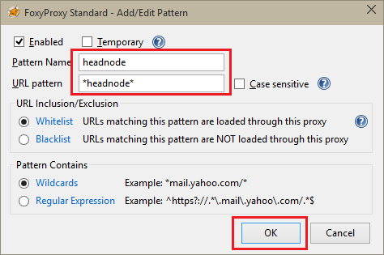

<properties
   pageTitle="Linux ベースの HDInsight で Windows から SSH キーと Hadoop を使用する | Aure"
   description="Linux ベースの HDInsight クラスターへの認証用に SSH キーを作成、使用する方法を説明します。"
   services="hdinsight"
   documentationCenter=""
   authors="Blackmist"
   manager="paulettm"
   editor="cgronlun"/>

<tags
   ms.service="hdinsight"
   ms.devlang=""
   ms.topic="article"
   ms.tgt_pltfrm="na"
   ms.workload="big-data"
   ms.date="02/18/2015"
   ms.author="larryfr"/>

## HDInsight の Linux ベースの Hadoop で Windows から SSH を使用する (プレビュー)

Linux ベースの HDInsight クラスターには、パスワードまたは SSH キーを使用した SSH アクセスのセキュリティを保護するオプションが用意されています。このドキュメントでは、PuTTY SSH クライアントを使用した Windows クライアントからの HDInsight への接続について説明します。

> [AZURE.NOTE] この記事の手順では、Windows クライアントを使用していることを前提としています。Linux、Unix、または OS X クライアントを使用する場合は、「[Use SSH with Linux-based Hadoop on HDInsight from Linux, Unix, or OS X (HDInsight の Linux ベース Hadoop で Linux、Unix、または OS X から SSH を使用する)](/ja-jp/documentation/articles/hdinsight-hadoop-linux-use-ssh-unix/)」を参照してください。

## 前提条件

* **PuTTY** および **PuTTYGen** (Windows クライアント)。これらのユーティリティは以下の場所から入手できます。 <a href="http://www.chiark.greenend.org.uk/~sgtatham/putty/download.html" target="_blank">http://www.chiark.greenend.org.uk/~sgtatham/putty/download.html</a>

* HTML5 をサポートする最新の Web ブラウザー。

または

* Azure PowerShell

または

* Azure クロスプラットフォーム コマンド ライン ツール

## SSH とは

SSH はリモート サーバーにログインして、コマンドをリモートに実行するためのユーティリティです。Linux ベースの HDInsight では、SSH によりクラスター ヘッド ノードへの安全な接続が確立され、コマンドの入力に使用するコマンド ラインが提供されます。コマンドは、直接サーバーで実行されます。

## SSH キーの作成 (オプション)

Linux ベースの HDInsight クラスターを作成するとき、SSH キーを使用したサーバーへの認証にパスワードまたは SSH キーを使用することを選択できます。証明書ベースであるため、SSH キーの方がより安全です。クラスターで SSH キーを使用する場合は、次の手順を実行します。

1. **PuTTYGen** を開きます。

2. **生成するキーの種類**に **[SSH-2 RSA]** を選択し、**[生成]** をクリックします。

	

3. 進行状況バーが塗りつぶされるまで、バーの下の領域にマウスを移動します。マウスを移動すると、キーの生成に使用するランダム データが生成されます。

	

	キーが生成されると、パブリック キーが表示されます。

4. セキュリティを強化するために、**キーのパスフレーズ** フィールドにパスフレーズを入力し、**パスフレーズの確認**フィールドに同じ値を入力できます。

	
	
	> [AZURE.NOTE] キーにセキュリティで保護されたパスフレーズを使用することを強くお勧めします。ただし、パスフレーズを忘れた場合、それを回復する方法はありません。

5. **[プライベート キーの保存]** をクリックして、キーを **.ppk** ファイルに保存します。このキーは、Linux ベースの HDInsight クラスターへの認証に使用されます。

	> [AZURE.NOTE] こキーは Linux ベースの HDInsight クラスターへのアクセスに使用できるため、セキュリティ保護された場所に保存する必要があります。

6. **[パブリック キーの保存]** をクリックして、キーを **.ppk** ファイルとして保存します。これにより、Linux ベースの HDInsight クラスターを今後追加で作成するときにパブリック キーを再利用できます。

	> [AZURE.NOTE] また、パブリック キーは **PuTTYGen** の上部に表示されます。このフィールドを右クリックし、値をコピーして、Azure 管理ポータルの HDInsight ウィザードなどのフォームに貼り付けます。

## Linux ベースの HDInsight クラスターの作成

Linux ベースの HDInsight クラスターを作成するときは、以前に作成した**パブリック キー**を指定する必要があります。Windows クライアントから、次の 2 つの方法で、Linux ベースの HDInsight クラスターを作成できます。

* **Azure 管理ポータル** - Web ベースのポータルを使用してクラスターを作成します。

* **Azure クロスプラットフォーム コマンド ライン インターフェイス (xplat-cli)** - コマンド ラインでコマンドを使用してクラスターを作成します。

これらの各メソッドには**パブリック キー**が必要です。Linux ベースの HDInsight クラスターを作成する完全な情報については、「 <a href="./hdinsight-hadoop-provision-linux-clusters/" target="_blank">Provision Linux-based HDInsight clusters (Linux ベースの HDInsight クラスターのプロビジョニング)</a>」を参照してください。

### Azure 管理ポータル

ポータルを使用して Linux ベースの HDInsight クラスターを作成する場合は、次のフォームにユーザー名と、パスワードまたはパブリック キーを入力する必要があります。

これにより、指定したユーザーのログインが作成され、パスワード認証または SSH キー認証のいずれかが有効になります。

### Azure クロスプラットフォーム コマンド ライン インターフェイス

Azure  <a href="../xplat-cli/" target="_brad">クロスプラットフォーム コマンド ライン インターフェイス</a>を使用して、 `azure hdinsight cluzter create` コマンドを使って新しいクラスターを作成できます。

このコマンドの使用方法の詳細については、以下を参照してください。 <a href="../hdinsight-hadoop-provision-linux-clusters/" target="_blank">「Provision Hadoop Linux clusters in HDInsight using custom options (カスタム オプションを使用した HDInsight での Hadoop Linux クラスターのプロビジョニング」</a>

## Linux ベースの HDInsight クラスターへの接続

1. PuTTY を開きます。

	

2. ユーザー アカウントの作成時に **SSH キー**を指定した場合は、次の手順に従って、クラスターへの認証に使用する**プライベート キー**を選択する必要があります。

	**[カテゴリ]** で **[接続]**、**[SSH]** の順に展開し、**[認証]** を選択します。最後に、**[参照]** をクリックし、**プライベート キー**が含まれた **.ppk** を選択します。

	

3. **[カテゴリ]** で **[セッション]** を選択します。**[PuTTY セッションの基本オプション]** 画面で、**ホスト名 (または IP アドレス)** フィールドに HDInsight サーバーの SSH アドレスを入力します。SSH アドレスは、クラスター名に **-ssh.azurehdinsight.net** を続けます。たとえば、**mycluster-ssh.azurehdinsight.net** のようになります。

	

4. 後で使用するために接続情報を保存するには、**[保存されたセッション]** にこの接続の名前を入力し、**[保存]** をクリックします。接続が、保存済みセッションの一覧に追加されます。

5. **[開く]** をクリックして、クラスターに接続します。

	> [AZURE.NOTE] クラスターに初めて接続する場合は、セキュリティ の警告が返されます。これは正常な動作です。**[はい]** を選択し、サーバーの RSA2 キーをキャッシュして続行します。

6. プロンプトが表示されたら、クラスターの作成時に入力したユーザーを入力します。ユーザーに**パスワード**を指定している場合は、その入力も求められます。

## アカウントの追加

2. 前述の説明に従って、新しいユーザー アカウントの新しい**パブリック キー**と**プライベート キー**を生成します。

1. クラスターへの SSH セッションから、次のコマンドを使用して新しいユーザーを追加します。

		sudo adduser --disabled-password <username> 

	これにより、新しいユーザー アカウントが作成されますが、パスワード認証は無効になります。

2. 次のコマンドを使用して、キーを格納するディレクトリとファイルを作成します。

		sudo mkdir -p /home/<username>/.ssh
		sudo touch /home/<username>/.ssh/authorized_keys
		sudo nano /home/<username>/.ssh/authorized_keys

3. ナノ エディターが開いたら、新しいユーザー アカウントの**パブリック キー**の内容をコピーして貼り付けます。最後に、**Ctrl + X** キーを使用してファイルを保存し、エディターを終了します。

	

4. 次のコマンドを使用して、新しいユーザー アカウントに対する .ssh フォルダーの所有権をとコンテンツを変更します。

		sudo chown -hR <username>:<username> /home/<username>/.ssh

5. これで、新しいユーザー アカウントおよび**プライベート キー**を使用してサーバーへの認証を行えるようになります。

## SSH トンネリング

SSH を使用すると、Web 要求などのローカル要求を HDInsight クラスターにトンネリングすることもできます。ここでは、最初から HDInsight クラスター ヘッド ノード上にあったかのように、要求が要求済みリソースにルーティングされます。

これは、クラスター内でヘッドまたはワーカー ノードの内部ドメイン名を使用する HDInsight クラスターで Web ベースのサービスにアクセスするときに最も役立ちます。Ambari Web ベースの一部のセクションで **headnode0.mycluster.d1.internal.cloudapp.net** などの内部ドメイン名を使用する場合などです。これらの名前は、クラスター外部で解決できませんが、SSH を介してトンネリングされた要求はクラスター内から発信され、正常に解決します。

SSH トンネルを作成し、ブラウザーでこれを使用してクラスターに接続するように構成するには、次の手順を実行します。

1. PuTTY を開き、[[接続]] (#connect) セクションに記載されているように接続情報を入力します。

2. ダイアログの左にある **[カテゴリ]** セクションで、**[接続]**、**[SSH]** の順に展開し、**[トンネル]** を選択します。

2. **[SSH ポートの転送を管理するオプション]** フォームに次の情報を入力します。

	* **[ソース ポート]** - 転送するクライアント上のポート (**9876** など)

	* **[宛先]** - Linux ベースの HDInsight クラスターの SSH アドレス (**mycluster-ssh.azurehdinsight.net** など)

	* **[動的]** - 動的な SOCKS プロキシを有効にします。

	

3. 最後に、**[追加]** を選択して設定を追加し、**[開く]** を選択して SSH 接続を開きます。

4. プロンプトが表示されたら、サーバーにログインします。これにより、SSH セッションが確立され、トンネルが有効になります。

2. Firefox などのクライアント プログラムで **SOCKS v5** プロキシとして **localhost:9876** を使用するように構成します。Firefox の設定は次のようになります。

	

	> [AZURE.NOTE] **[リモート DNS]** を選択すると DNS 要求は HDInsight クラスターを使用して解決されます。選択しないと、DNS はローカルに解決されます。

	Firefox でプロキシ設定を有効または無効にして  <a href="http://www.whatismyip.com/" target="_blank">http://www.whatismyip.com/</a>  などのサイトにアクセスして、トラフィックがトンネルを経由しているかどうか確認できます。有効にすると、IP アドレスが Microsoft Azure データセンター内のコンピューター向けになります。

### ブラウザー拡張

ブラウザーをトンネル ワークを使用するように構成する場合、通常、一部のトラフィックをトンネルを経由で送信しないように設定する必要があることがあります。ブラウザー拡張 ( <a href="http://getfoxyproxy.org/" target="_blank">FoxyProxy</a>   など) は URL 要求のパターン マッチングをサポートしているため (FoxyProxy Standard または Plus のみ)、特定の URL 用の要求のみがトンネル経由で送信されます。

**FoxyProxy Standard** をインストールしている場合は、次の手順に従って、トンネル経由で HDInsight のトラフィックのみを転送するように構成します。

1. ブラウザーで FoxyProxy 拡張を開きます。Firefox などで、アドレス フィールドの横にある FoxyProxy アイコンを選択します。

	

2. **[新しいプロキシの追加]**、**[全般]** タブの順に選択し、**HDInsight** のプロキシ名を入力します。

	

3. **[プロキシの詳細]** タブを選択し、次のフィールドを入力します。

	* **[ホストまたは IP アドレス]** - ローカル マシンで SSH トンネルを使用するため localhost と入力します。

	* **[ポート]** - SSH トンネル用に使用するポート

	* **[SOCKS プロキシ]** - ブラウザーでのプロキシとしてのトンネルの使用を有効にします。

	* **[SOCKS v5]** - プロキシに必要なバージョンを設定します。

	

4. **[URL パターン]** タブを選択し、**[新しいパターンの追加]** を選択します。以下を使用してパターンを定義し、**[OK]** をクリックします。

	* **[パターン名]** - **headnode** - パターンのフレンドリ名です

	* **[URL パターン]** - **\*headnode\*** - **headnode** という語を含む URL と一致するパターンを定義します。

	

4. **[OK]** を選択してプロキシを追加し、**[プロキシ設定]** を閉じます。

5. FoxyProxy ダイアログの上部で、**[モードの選択]** を **[定義済みのパターンと優先順位に基づいてプロキシを使用]** に変更し、**[閉じる]** を選択します。

	

これらを完了すると、**headnode** という文字列を含む URL の要求のみが SSH トンネル経由で送信されます。

## 次のステップ

これで、SSH キーを使用した認証方法、また、HDInsight での MapReduce と Hadoop の使用方法についてご理解いただけたと思います。

* [HDInsight での Hive の使用](../hdinsight-use-hive/)

* [HDInsight での Pig の使用](../hdinsight-use-pig/)

* [HDInsight での MapReduce ジョブの使用](../hdinsight-use-mapreduce/)
 
<!--HONumber=45--> 
