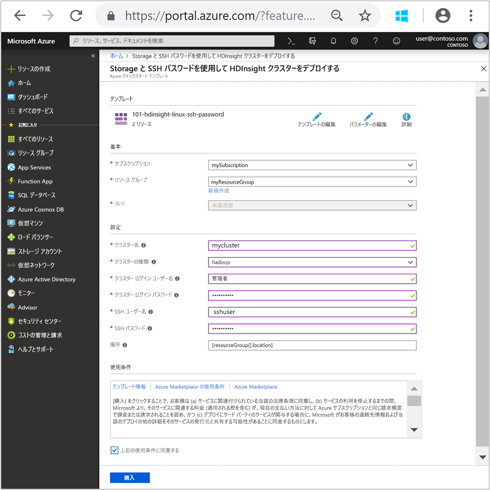
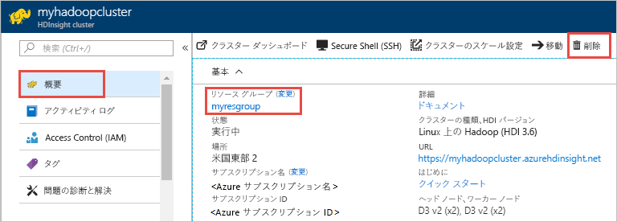

# <a name="quickstart-get-started-with-apache-hadoop-and-apache-hive-in-azure-hdinsight-using-resource-manager-template"></a>クイック スタート:Resource Manager テンプレートを使用して Azure HDInsight で Apache Hadoop と Apache Hive を使用する

この記事では、Resource Manager テンプレートを使用して HDInsight で [Apache Hadoop](https://hadoop.apache.org/) クラスターを作成し、HDInsight で Hive ジョブを実行する方法について説明します。 Hadoop ジョブのほとんどはバッチ ジョブです。 クラスターを作成し、いくつかのジョブを実行して、クラスターを削除します。 この記事では、3 つのすべてのタスクを実行します。

このクイックスタートでは、Resource Manager テンプレートを使用して HDInsight Hadoop クラスターを作成します。 [Azure Portal](apache-hadoop-linux-create-cluster-get-started-portal.md) を使用してクラスターを作成することもできます。  同じようなテンプレートを「[Azure クイック スタート テンプレート](https://azure.microsoft.com/resources/templates/?resourceType=Microsoft.Hdinsight&pageNumber=1&sort=Popular)」で見ることができます。 テンプレートのリファレンスについては、[こちら](https://docs.microsoft.com/azure/templates/microsoft.hdinsight/allversions)をご覧ください。

現在、HDInsight には [7 種類のクラスター](./apache-hadoop-introduction.md#cluster-types-in-hdinsight)が用意されています。 クラスターの種類はそれぞれ異なるコンポーネント セットをサポートしていますが、 Hive は全種類のクラスターでサポートされています。 HDInsight でサポートされているコンポーネントの一覧については、「[HDInsight で提供される Hadoop クラスター バージョンの新機能](../hdinsight-component-versioning.md)」を参照してください。  

Azure サブスクリプションをお持ちでない場合は、開始する前に[無料アカウントを作成](https://azure.microsoft.com/free/)してください。

<a name="create-cluster"></a>
## <a name="create-a-hadoop-cluster"></a>Hadoop クラスターの作成

このセクションでは、Azure Resource Manager テンプレートを利用して、HDInsight で Hadoop クラスターを作成します。 この記事に従うために、Resource Manager テンプレートの使用経験は必要ありません。 

1. 以下の **[Deploy to Azure] (Azure へのデプロイ)** ボタンをクリックして Azure にサインインし、Azure Portal で Resource Manager テンプレートを開きます。 
   
    <a href="https://portal.azure.com/#create/Microsoft.Template/uri/https%3A%2F%2Fraw.githubusercontent.com%2FAzure%2Fazure-quickstart-templates%2Fmaster%2F101-hdinsight-linux-ssh-password%2Fazuredeploy.json" target="_blank"></a>

2. 次のスクリーンショットで提案されているように値を入力するか、選択します。

    > [!NOTE]  
    > 指定する値は一意である必要があり、名前付けガイドラインに従う必要があります。 テンプレートでは、検証チェックは実行されません。 指定した値が既に使用されている場合、またはガイドラインに従ってない場合、テンプレートを送信した後にエラーが発生します。    
    
    

    次の値を入力または選択します。
    
    |プロパティ  |説明  |
    |---------|---------|
    |**サブスクリプション**     |  Azure サブスクリプションを選択します。 |
    |**リソース グループ**     | リソース グループを作成するか、既存のリソース グループを選択します。  リソース グループとは、Azure コンポーネントのコンテナーです。  この場合、リソース グループには、HDInsight クラスターおよび依存する Azure ストレージ アカウントが含まれています。 |
    |**場所**     | クラスターを作成する Azure の場所を選択します。  パフォーマンスを向上させるため、お近くの場所を選択してください。 |
    |**クラスター名**     | Hadoop クラスターの名前を入力します。 HDInsight のすべてのクラスターでは同じ DNS 名前空間が共有されるため、この名前は一意である必要があります。 名前に使用できるのは小文字、数字、ハイフンのみであり、名前の先頭は文字にする必要があります。  各ハイフンの前後にはハイフン以外の文字を指定する必要があります。  また、名前は 3 から 59 文字の範囲でなければなりません。 |
    |**クラスターの種類**     | **[hadoop]** を選択します。 |
    |**クラスター ログイン名とパスワード**     | 既定のログイン名は **admin** です。パスワードは 10 文字以上で、数字、大文字、小文字、英数字以外の文字 (' " ` を除く\) が少なくとも 1 つずつ含まれる必要があります。 "Pass@word1" などのよく使われるパスワードを**指定していない**ことを確認してください。|
    |**SSH ユーザー名とパスワード**     | 既定のユーザー名は **sshuser** です。  SSH ユーザー名は、変更が可能です。  SSH ユーザーのパスワードには、クラスターのログイン パスワードと同じ要件が適用されます。|
       
    一部のプロパティは、テンプレートにハードコーディングされています。  これらの値はテンプレートから構成することができます。 これらのプロパティについて詳しくは、[HDInsight での Apache Hadoop クラスターの作成](../hdinsight-hadoop-provision-linux-clusters.md)に関するページをご覧ください。

3. **[上記の使用条件に同意する]** を選択し、**[購入]** を選択します。 デプロイの進行状況が通知されます。  クラスターの作成には約 20 分かかります。

4. クラスターが作成されると、**[リソース グループに移動]** リンクを含む**デプロイ成功**通知を受け取ります。  **[リソース グループ]** ページには、新しい HDInsight クラスターと、クラスターに関連付けられている既定のストレージが一覧表示されます。 各クラスターには、[Azure Storage アカウント](../hdinsight-hadoop-use-blob-storage.md)または [Azure Data Lake Storage アカウント](../hdinsight-hadoop-use-data-lake-store.md)との依存関係があります。 このアカウントを、既定のストレージ アカウントと呼びます。 HDInsight クラスターとその既定のストレージ アカウントは、同じ Azure リージョンに配置されている必要があります。 クラスターを削除しても、ストレージ アカウントは削除されません。

> [!NOTE]  
> その他のクラスター作成方法と、このチュートリアルで使うプロパティの詳細については、[HDInsight クラスターの作成](../hdinsight-hadoop-provision-linux-clusters.md)に関するページを参照してください。       


## <a name="use-vscode-to-run-hive-queries"></a>VS Code を使用して Hive クエリを実行する

VS Code で HDInsight Tools を入手する方法については、「[Azure HDInsight Tool for Visual Studio Code の使用](../hdinsight-for-vscode.md)」をご覧ください。

### <a name="submit-interactive-hive-queries"></a>Submit interactive Hive queries

HDInsight Tools for VS Code を使用すると、対話型 Hive クエリを HDInsight 対話型クエリ クラスターに送信できます。

1. 新しい作業フォルダーと新しい Hive スクリプト ファイルを作成します (まだない場合)。

2. Azure アカウントに接続し、既定のクラスターを構成します (まだ構成していない場合)。

3. 次のコードをコピーし、Hive ファイルに貼り付けて保存します。

    ```hiveql
    SELECT * FROM hivesampletable;
    ```
4. スクリプト エディターを右クリックし、**[HDInsight:Hive Interactive]** を選択してクエリを送信します。 また、このツールでは、コンテキスト メニューを使用して、スクリプト ファイル全体ではなく、コードのブロックを送信することもできます。 その後すぐに、クエリの結果が新しいタブに表示されます。

   

    - **[結果]** パネル:結果全体を CSV、JSON、または Excel ファイルとしてローカル パスに保存したり、複数の行だけを選択したりできます。

    - **[メッセージ]** パネル:**行**の番号を選択すると、実行中のスクリプトの最初の行にジャンプします。

対話型クエリは、[Apache Hive バッチ ジョブ](#submit-hive-batch-scripts)よりもはるかに短時間で実行されます。

### <a name="submit-hive-batch-scripts"></a>Hive バッチ スクリプトの送信

1. 新しい作業フォルダーと新しい Hive スクリプト ファイルを作成します (まだない場合)。

2. Azure アカウントに接続し、既定のクラスターを構成します (まだ構成していない場合)。

3. 次のコードをコピーし、Hive ファイルに貼り付けて保存します。

    ```hiveql
    SELECT * FROM hivesampletable;
    ```
4. スクリプト エディターを右クリックし、**[HDInsight:Hive Batch]** を選択して Hive ジョブを送信します。 

5. 送信先のクラスターを選択します。  

    Hive ジョブを送信したら、送信成功に関する情報とジョブ ID が、**[出力]** パネルに表示されます。 また、Hive ジョブによって **Web ブラウザー**が開かれ、ジョブのリアルタイムのログと状態が表示されます。

   

[対話型 Apache Hive クエリ](#submit-interactive-hive-queries)は、バッチ ジョブよりもはるかに短時間で送信されます。

## <a name="use-visualstudio-to-run-hive-queries"></a>Visual Studio を使用して Hive クエリを実行する

Visual Studio で HDInsight Tools を入手する方法については、「[Data Lake Tools for Visual Studio の使用](./apache-hadoop-visual-studio-tools-get-started.md)」をご覧ください。

### <a name="run-hive-queries"></a>Hive クエリの実行

Hive クエリを作成して実行するためのオプションは 2 つあります。

* アドホック クエリを作成する
* Hive アプリケーションを作成する

アドホック クエリを作成して実行するには:

1. **サーバー エクスプローラー**で、**[Azure]** > **[HDInsight クラスター]** を選択します。

2. クエリを実行するクラスターを右クリックし、**[Hive クエリの作成]** を選択します。  

3. Hive クエリを入力します。 

    Hive エディターは IntelliSense をサポートしています。 Data Lake Tools for Visual Studio では、Hive スクリプトの編集時にリモート メタデータの読み込みをサポートします。 たとえば、**SELECT * FROM** と入力すると、IntelliSense によって提案されるテーブル名が一覧表示されます。 テーブル名を指定すると、Intellisense によって列名が一覧表示されます。 このツールは、Hive の DML ステートメント、サブクエリ、および組み込みの UDF の大半をサポートします。
   
    
   
    
   
   > [!NOTE]  
   > IntelliSense は、HDInsight のツール バーで選択されているクラスターのメタデータのみを推奨します。
   > 
   
4. **[送信]** または **[Submit (Advanced)]\(送信 (詳細設定)\)** を選択します。 
   
    

   [Submit (Advanced)]\(送信 (詳細設定)\) オプションを選択した場合は、スクリプトの **[ジョブ名]**、**[引数]**、**[追加の構成]**、**[状態ディレクトリ]** を構成します。

    

   Interactive Hive クエリを実行する

   * 下向き矢印をクリックして、**[対話型]** を選択します。 
   
   * **[実行]** をクリックします。

   

Hive ソリューションを作成して実行するには:

1. **[ファイル]** メニューから **[新規]**、**[プロジェクト]** の順に選択します。
2. 左側のウィンドウで、**[HDInsight]** を選択します。 中央のウィンドウで、**[Hive アプリケーション]** を選択します。 プロパティを入力し、**[OK]** を選択します。
   
    
3. **ソリューション エクスプローラー**で、**Script.hql** をダブルクリックしてスクリプトを開きます。
4. Hive クエリを入力して送信します。 (上記の手順 3 と 4 を参照)  


## <a name="run-hive-queries"></a>Hive クエリの実行

[Apache Hive](hdinsight-use-hive.md) は、HDInsight で使用される最も一般的なコンポーネントです。 HDInsight で Hive ジョブを実行する方法は多数存在します。 このチュートリアルでは、ポータルから Ambari Hive ビューを使用します。 Hive ジョブを送信する他の方法については、[HDInsight で Apache Hive を使用する方法](hdinsight-use-hive.md)に関するページを参照してください。

1. Ambari を開くには、**[クラスター ダッシュボード]** タイルで **[Ambari Views]** を選択します。  ブラウザーで **https://&lt;クラスター名&gt;.azurehdinsight.net** に移動することもできます。&lt;クラスター名&gt; は、前のセクションで作成したクラスターです。

    

2. クラスターの作成時に指定した Hadoop ユーザー名とパスワードを入力します。 既定のユーザー名は **admin**です。

3. 次のスクリーンショットのように **[Hive View 2.0]** を選択します。
   
    

4. **[QUERY]\(クエリ\)** タブで、次の HiveQL ステートメントをワークシートに貼り付けます。
   
        SHOW TABLES;

    
   
   > [!NOTE]  
   > Hive では、セミコロンが必要です。       


5. **[Execute (実行)]** を選択します。 **[QUERY]\(クエリ\)** タブの下に **[RESULTS]\(結果\)** タブが表示され、ジョブについての情報が表示されます。 
   
    クエリが完了すると、**[QUERY]\(クエリ\)** タブに操作の結果が表示されます。 **hivesampletable**という名前のテーブルが 1 つ表示されます。 このサンプルの Hive テーブルにはすべての HDInsight クラスターが付属します。
   
    

6. 手順 4. と手順 5 を繰り返し、次のクエリを実行します。
   
        SELECT * FROM hivesampletable;
   
7. クエリの結果を保存することもできます。 右側のメニュー ボタンを選択し、結果を CSV ファイルとしてダウンロードするか、クラスターに関連付けられているストレージ アカウントに保存するかを指定します。

    

Hive ジョブが完了したら、[結果を Azure SQL データベースまたは SQL Server データベースにエクスポート](apache-hadoop-use-sqoop-mac-linux.md)できます。[Excel を利用して結果を視覚化](apache-hadoop-connect-excel-power-query.md)することもできます。 HDInsight で Hive を使用する方法の詳細については、[HDInsight で Apache Hadoop と共に Apache Hive と HiveQL を使用して Apache log4j サンプル ファイルを分析する](hdinsight-use-hive.md)方法に関するページを参照してください。

## <a name="troubleshoot"></a>トラブルシューティング

HDInsight クラスターの作成で問題が発生した場合は、「[アクセス制御の要件](../hdinsight-hadoop-create-linux-clusters-portal.md)」を参照してください。

## <a name="clean-up-resources"></a>リソースのクリーンアップ
記事を完了したら、必要に応じてクラスターを削除できます。 HDInsight を使用すると、データは Azure Storage に格納されるため、クラスターは、使用されていない場合に安全に削除できます。 また、HDInsight クラスターは、使用していない場合でも課金されます。 クラスターの料金は Storage の料金の何倍にもなるため、クラスターを使用しない場合は削除するのが経済的にも合理的です。 

> [!NOTE]  
> *すぐに*次のチュートリアルに進み、HDInsight で Hadoop を使用して ETL 操作を実行する方法を学習する場合は、クラスターを実行したままにしておいてかまいません。 そのチュートリアルでは Hadoop クラスターを再度作成する必要があるからです。 ただし、すぐに次のチュートリアルに進まない場合は、クラスターを今すぐ削除する必要があります。

**クラスターと既定のストレージ アカウントを削除するには、次の手順に従います。**

1. ブラウザーの Azure Portal を開いているタブに戻ります。 [クラスターの概要] ページが表示されているはずです。 クラスターのみを削除し、既定のストレージ アカウントを保持する場合は、**[削除]** を選択します。

    

2. クラスターと既定のストレージ アカウントを削除する場合は、(上のスクリーンショットで強調表示されている) リソース グループ名を選択して、リソース グループのページを開きます。

3. **[リソース グループの削除]** を選択して、クラスターと既定のストレージ アカウントが含まれたリソース グループを削除します。 リソース グループを削除するとストレージ アカウントも削除されます。 ストレージ アカウントを残しておく場合は、クラスターのみを削除してください。

## <a name="next-steps"></a>次の手順
この記事では、Resource Manager テンプレートを利用して Linux ベースの HDInsight クラスターを作成する方法と基本的な Hive クエリを実行する方法について説明しました。 次の記事では、HDInsight で Hadoop を使用して抽出、変換、読み込み (ETL) 操作を実行する方法を学習します。

> [!div class="nextstepaction"]
>[HDInsight での Apache Hive を使用したデータの抽出、変換、読み込み](../hdinsight-analyze-flight-delay-data-linux.md)

実際のデータを使用する準備が整っていて、HDInsight のデータの格納方法や HDInsight にデータを取り込む方法を確認する場合は、以下の記事を参照してください。

* HDInsight で Azure Storage を使用する方法の詳細については、[HDInsight での Azure Storage の使用](../hdinsight-hadoop-use-blob-storage.md)に関するページを参照してください。
* Data Lake Storage で HDInsight クラスターを作成する方法については、「[Quickstart:Set up clusters in HDInsight](../../storage/data-lake-storage/quickstart-create-connect-hdi-cluster.md)」(クイック スタート: HDInsight のクラスターを設定する) を参照してください。
* データを HDInsight にアップロードする方法については、[データを HDInsight にアップロードする方法](../hdinsight-upload-data.md)に関する記事を参照してください。
* [Azure HDInsight クラスターで Azure Data Lake Storage Gen2 を使用する](../hdinsight-hadoop-use-data-lake-storage-gen2.md)

HDInsight でデータを分析する方法の詳細については、次の記事を参照してください。

* Visual Studio から Hive クエリを実行する方法など、HDInsight で Hive を使用する方法の詳細については、[HDInsight での Apache Hive の使用](hdinsight-use-hive.md)に関する記事を参照してください。
* データの変換に使用される言語 Pig の詳細については、[HDInsight での Apache Pig の使用](hdinsight-use-pig.md)に関する記事を参照してください。
* Hadoop 上のデータを処理するプログラムを作成する方法の 1 つである MapReduce の詳細については、[HDInsight での MapReduce の使用](hdinsight-use-mapreduce.md)に関する記事を参照してください。
* HDInsight Tools for Visual Studio を使用して HDInsight 上のデータを分析する方法については、 [HDInsight Hadoop Tools for Visual Studio の使用開始](apache-hadoop-visual-studio-tools-get-started.md)に関するページを参照してください。
* HDInsight Tools for VS Code を使用して HDInsight 上のデータを分析する方法については、「[Azure HDInsight Tool for Visual Studio Code の使用](../hdinsight-for-vscode.md)」をご覧ください。


HDInsight クラスターの作成または管理の詳細については、以下の記事を参照してください。

* Linux ベースの HDInsight クラスターを管理する方法については、[Apache Ambari を使用した HDInsight クラスターの管理](../hdinsight-hadoop-manage-ambari.md)に関するページを参照してください。
* HDInsight クラスターの作成時に選択できるオプションの詳細については、「 [HDInsight での Linux ベースの Hadoop クラスターの作成](../hdinsight-hadoop-provision-linux-clusters.md)」を参照してください。

Azure Resource Manager テンプレートを使用した HDInsight クラスターの作成について詳しくは、以下をご覧ください。

* [Azure クイックスタート テンプレート](https://azure.microsoft.com/resources/templates/?resourceType=Microsoft.Hdinsight&pageNumber=1&sort=Popular)。
* [Azure テンプレート リファレンス](https://docs.microsoft.com/azure/templates/microsoft.hdinsight/allversions)。

[1]: ../HDInsight/apache-hadoop-visual-studio-tools-get-started.md

[hdinsight-provision]: hdinsight-provision-linux-clusters.md
[hdinsight-upload-data]: hdinsight-upload-data.md
[hdinsight-use-hive]: hdinsight-use-hive.md
[hdinsight-use-pig]: hdinsight-use-pig.md
