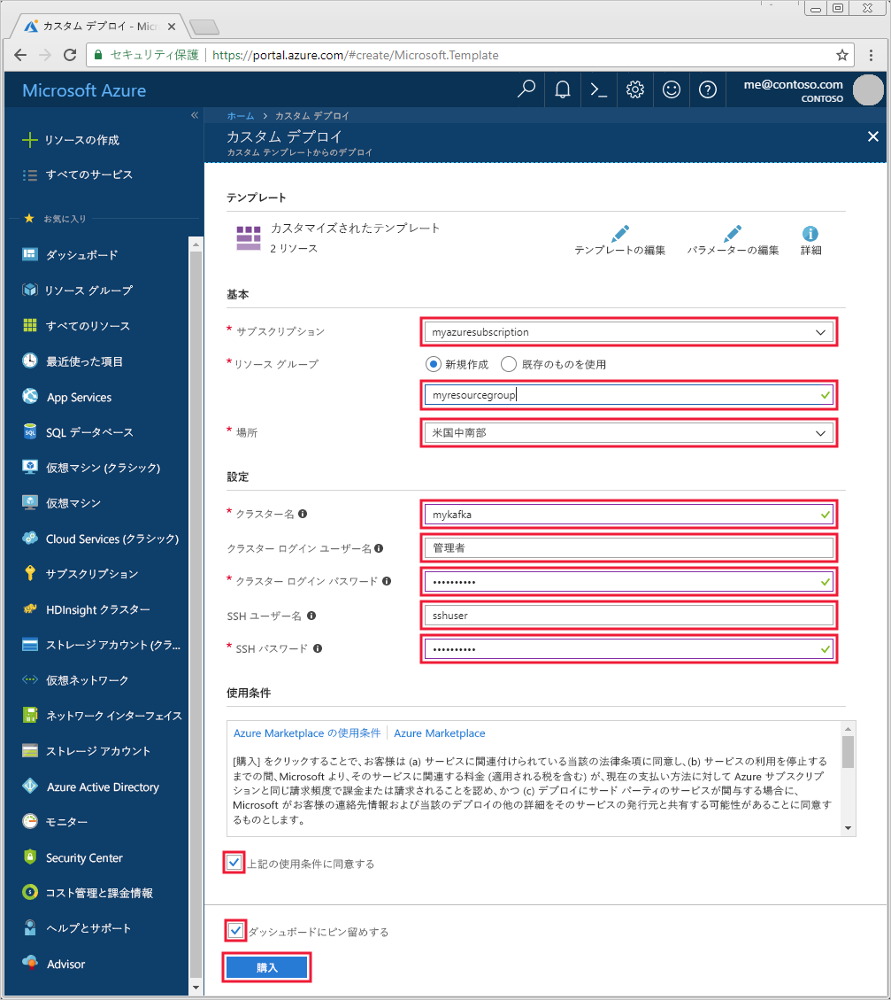

# <a name="quickstart-create-apache-kafka-cluster-in-azure-hdinsight-using-resource-manager-template"></a>クイック スタート:Resource Manager テンプレートを使用して Azure HDInsight 内に Apache Kafka クラスターを作成する

[Apache Kafka](https://kafka.apache.org/) は、オープンソースの分散ストリーミング プラットフォームです。 発行/サブスクライブ メッセージ キューと同様の機能を備えているため、メッセージ ブローカーとして多く使われています。 

このクイック スタートでは、Azure Resource Manager テンプレートを使って [Apache Kafka](https://kafka.apache.org) クラスターを作成する方法について説明します。 Kafka を使って、付属のユーティリティでメッセージを送受信する方法についても説明します。 同じようなテンプレートを「[Azure クイック スタート テンプレート](https://azure.microsoft.com/resources/templates/?resourceType=Microsoft.Hdinsight&pageNumber=1&sort=Popular)」で見ることができます。 テンプレートのリファレンスについては、[こちら](https://docs.microsoft.com/azure/templates/microsoft.hdinsight/allversions)をご覧ください。

[!INCLUDE [delete-cluster-warning](../../../includes/hdinsight-delete-cluster-warning.md)]

Kafka API は、同じ仮想ネットワーク内のリソースによってのみアクセスできます。 このクイック スタートでは、SSH を使って直接クラスターにアクセスします。 他のサービス、ネットワーク、または仮想マシンを Kafka に接続するには、まず、仮想ネットワークを作成してから、ネットワーク内にリソースを作成する必要があります。 詳しくは、[仮想ネットワークを使用した Apache Kafka への接続](apache-kafka-connect-vpn-gateway.md)に関するドキュメントをご覧ください。

Azure サブスクリプションをお持ちでない場合は、開始する前に [無料アカウント](https://azure.microsoft.com/free/?WT.mc_id=A261C142F) を作成してください。

## <a name="prerequisites"></a>前提条件

SSH クライアント 詳細については、[SSH を使用して HDInsight (Apache Hadoop) に接続する方法](../hdinsight-hadoop-linux-use-ssh-unix.md)に関するページを参照してください。

## <a name="create-an-apache-kafka-cluster"></a>Apache Kafka クラスターを作成する

1. 次の画像をクリックして Azure ポータルでテンプレートを開きます。

    <a href="https://portal.azure.com/#create/Microsoft.Template/uri/https%3A%2F%2Fraw.githubusercontent.com%2FAzure-Samples%2Fhdinsight-kafka-java-get-started%2Fmaster%2Fazuredeploy.json" target="_blank"></a>

2. Kafka クラスターを作成するには、次の値を使います。

    | プロパティ | 値 |
    | --- | --- |
    | Subscription | Azure サブスクリプション。 |
    | Resource group | クラスターを作成するリソース グループ。 |
    | Location | クラスターを作成する Azure リージョン。 |
    | クラスター名 | Kafka クラスターの名前。 |
    | [Cluster Login User Name]\(クラスター ログイン ユーザー名\) | クラスターでホストされている HTTPS ベースのサービスにログインするために使うアカウント名。 |
    | [クラスター ログイン パスワード] | ログイン ユーザー名のパスワード。 |
    | [SSH ユーザー名] | SSH ユーザーの名前。 このアカウントは、SSH を使ってクラスターにアクセスできます。 |
    | [SSH パスワード] | SSH ユーザーのパスワード。 |

    

3. **[上記の使用条件に同意する]** 、 **[ダッシュボードにピン留めする]** の順に選択し、 **[購入]** をクリックします。 クラスターの作成には最大で 20 分かかります。

## <a name="connect-to-the-cluster"></a>クラスターへの接続

1. Kafka クラスターのプライマリ ヘッド ノードに接続するには、次のコマンドを使います。 `sshuser` を SSH ユーザー名で置き換えます。 `mykafka` を Kafka クラスターの名前に置き換えます

    ```bash
    ssh sshuser@mykafka-ssh.azurehdinsight.net
    ```

2. クラスターに初めて接続すると、ホストの信頼性を確立できないという警告が SSH クライアントに表示されることがあります。 プロンプトが表示されたら、「__yes__」と入力して、__Enter__ キーを押し、SSH クライアントの信頼済みサーバーの一覧にこのホストを追加します。

3. メッセージが表示されたら、SSH ユーザーのパスワードを入力します。

    接続されると、次のテキストのような情報が表示されます。
    
    ```output
    Authorized uses only. All activity may be monitored and reported.
    Welcome to Ubuntu 16.04.4 LTS (GNU/Linux 4.13.0-1011-azure x86_64)
    
     * Documentation:  https://help.ubuntu.com
     * Management:     https://landscape.canonical.com
     * Support:        https://ubuntu.com/advantage
    
      Get cloud support with Ubuntu Advantage Cloud Guest:
        https://www.ubuntu.com/business/services/cloud
    
    83 packages can be updated.
    37 updates are security updates.
    
    
    Welcome to Kafka on HDInsight.
    
    Last login: Thu Mar 29 13:25:27 2018 from 108.252.109.241
    ```

## <a id="getkafkainfo"></a>Apache Zookeeper およびブローカーのホスト情報を取得する

Kafka を使うときは、*Apache Zookeeper* ホストと "*ブローカー*" ホストについて理解しておく必要があります。 これらのホストは、Kafka の API や、Kafka に付属するユーティリティの多くで使用されます。

このセクションでは、クラスターで Ambari REST API からホスト情報を取得します。

1. クラスターへの SSH 接続から、次のコマンドを使って `jq` ユーティリティをインストールします。 このユーティリティは JSON ドキュメントを解析するためのものであり、ホスト情報の取得に役立ちます。
   
    ```bash
    sudo apt -y install jq
    ```

2. 環境変数をクラスター名に設定するには、次のコマンドを使用します。

    ```bash
    read -p "Enter the Kafka on HDInsight cluster name: " CLUSTERNAME
    ```

    プロンプトが表示されたら、Kafka クラスター名を入力します。

3. Zookeeper ホスト情報で環境変数を設定するには、次のコマンドを使用します。 このコマンドはすべての Zookeeper ホストを取得してから、最初の 2 つのエントリのみを返します。 これは、1 つのホストに到達できない場合に、いくらかの冗長性が必要なためです。

    ```bash
    export KAFKAZKHOSTS=`curl -sS -u admin -G https://$CLUSTERNAME.azurehdinsight.net/api/v1/clusters/$CLUSTERNAME/services/ZOOKEEPER/components/ZOOKEEPER_SERVER | jq -r '["\(.host_components[].HostRoles.host_name):2181"] | join(",")' | cut -d',' -f1,2`
    ```

    プロンプトが表示されたら、クラスターのログイン アカウント (SSH アカウントではなく) のパスワードを入力します。

4. 環境変数が正しく設定されていることを確認するには、次のコマンドを使用します。

    ```bash
     echo '$KAFKAZKHOSTS='$KAFKAZKHOSTS
    ```

    このコマンドでは、次のテキストのような情報が返されます。

    `zk0-kafka.eahjefxxp1netdbyklgqj5y1ud.ex.internal.cloudapp.net:2181,zk2-kafka.eahjefxxp1netdbyklgqj5y1ud.ex.internal.cloudapp.net:2181`

5. Kafka ブローカー ホスト情報で環境変数を設定するには、次のコマンドを使用します。

    ```bash
    export KAFKABROKERS=`curl -sS -u admin -G https://$CLUSTERNAME.azurehdinsight.net/api/v1/clusters/$CLUSTERNAME/services/KAFKA/components/KAFKA_BROKER | jq -r '["\(.host_components[].HostRoles.host_name):9092"] | join(",")' | cut -d',' -f1,2`
    ```

    プロンプトが表示されたら、クラスターのログイン アカウント (SSH アカウントではなく) のパスワードを入力します。

6. 環境変数が正しく設定されていることを確認するには、次のコマンドを使用します。

    ```bash   
    echo '$KAFKABROKERS='$KAFKABROKERS
    ```

    このコマンドでは、次のテキストのような情報が返されます。
   
    `wn1-kafka.eahjefxxp1netdbyklgqj5y1ud.cx.internal.cloudapp.net:9092,wn0-kafka.eahjefxxp1netdbyklgqj5y1ud.cx.internal.cloudapp.net:9092`

## <a name="manage-apache-kafka-topics"></a>Apache Kafka トピックの管理

Kafka は、"*トピック*" にデータのストリームを格納します。 `kafka-topics.sh` ユーティリティを使って、トピックを管理できます。

* **トピックを作成するには**、SSH 接続で次のコマンドを使います。

    ```bash
    /usr/hdp/current/kafka-broker/bin/kafka-topics.sh --create --replication-factor 3 --partitions 8 --topic test --zookeeper $KAFKAZKHOSTS
    ```

    このコマンドを使用すると、`$KAFKAZKHOSTS` に格納されているホスト情報を使用して Zookeeper に接続されます。 次に、**test** という名前の Kafka トピックが作成されます。 

    * このトピックに格納されるデータは、8 つのパーティションに分割されます。

    * 各パーティションは、クラスター内の 3 つのワーカー ノード間でレプリケートされます。

        3 つの障害ドメインを提供する Azure リージョンにクラスターを作成した場合は、3 のレプリケーション係数を使います。 そうでない場合は、4 のレプリケーション係数を使います。
        
        3 つの障害ドメインがあるリージョンでは、3 のレプリケーション係数により、レプリカを障害ドメインに分散できます。 2 つの障害ドメインのリージョンでは、4 のレプリケーション係数により、ドメイン全体に均等にレプリカが分散されます。
        
        リージョン内の障害ドメインの数については、[Linux 仮想マシンの可用性](../../virtual-machines/windows/manage-availability.md#use-managed-disks-for-vms-in-an-availability-set)に関するトピックを参照してください。

        Kafka は、Azure 障害ドメインを認識しません。 トピック用にパーティションのレプリカを作成すると、レプリカが適切に分散されず、高可用性が実現しない場合があります。

        高可用性を確保するには、[Apache Kafka パーティション再調整ツール](https://github.com/hdinsight/hdinsight-kafka-tools)を使用してください。 このツールは、Kafka クラスターのヘッド ノードへの SSH 接続から実行する必要があります。

        Kafka データの最高の可用性のために、次のときにトピックのパーティションのレプリカを再調整する必要があります。

        * 新しいトピックまたはパーティションの作成

        * クラスターのスケールアップ

* **トピックの一覧を表示するには**、次のコマンドを使います。

    ```bash
    /usr/hdp/current/kafka-broker/bin/kafka-topics.sh --list --zookeeper $KAFKAZKHOSTS
    ```

    このコマンドは、Kafka クラスターで使用可能なトピックの一覧を表示します。

* **トピックを削除するには**、次のコマンドを使います。

    ```bash
    /usr/hdp/current/kafka-broker/bin/kafka-topics.sh --delete --topic topicname --zookeeper $KAFKAZKHOSTS
    ```

    このコマンドは、`topicname` という名前のトピックを削除します。

    > [!WARNING]  
    > 前に作成した `test` トピックを削除した場合は、再作しなおす必要があります。 このドキュメントの後半で使います。

`kafka-topics.sh` ユーティリティで使用可能なコマンドの詳細については、次のコマンドを使用します。

```bash
/usr/hdp/current/kafka-broker/bin/kafka-topics.sh
```

## <a name="produce-and-consume-records"></a>レコードの生成および消費

Kafka では、トピック内に*レコード*が格納されます。 レコードは、*プロデューサー*によって生成され、*コンシューマー*によって消費されます。 プロデューサーとコンシューマーは "*Kafka ブローカー*" サービスと通信します。 HDInsight クラスターの各ワーカー ノードが、Kafka ブローカー ホストです。

先ほど作成した test トピックにレコードを格納し、コンシューマーを使用してそれらを読み取るには、次の手順に従います。

1. トピックにレコードを書き込むには、SSH 接続から `kafka-console-producer.sh` ユーティリティを使用します。
   
    ```bash
    /usr/hdp/current/kafka-broker/bin/kafka-console-producer.sh --broker-list $KAFKABROKERS --topic test
    ```
   
    このコマンドの後ろには空の行があります。

2. 空の行にテキスト メッセージを入力して、Enter キーを押します。 このようにメッセージをいくつか入力してから、**Ctrl + C** キーを使用して通常のプロンプトに戻ります。 各行が、個別のレコードとして Kafka トピックに送信されます。

3. トピックからレコードを読み取るには、SSH 接続から `kafka-console-consumer.sh` ユーティリティを使用します。
   
    ```bash
    /usr/hdp/current/kafka-broker/bin/kafka-console-consumer.sh --bootstrap-server $KAFKABROKERS --topic test --from-beginning
    ```
   
    このコマンドにより、レコードがトピックから取得され、表示されます。 `--from-beginning` を使用することで、すべてのレコードが取得されるように、コンシューマーにストリームの先頭から開始するように指示しています。

    以前のバージョンの Kafka を使っている場合、`--bootstrap-server $KAFKABROKERS` を `--zookeeper $KAFKAZKHOSTS` に置き換えます。

4. __Ctrl+C__ キーを使用してコンシューマーを停止します。

プロデューサーとコンシューマーをプログラムから作成することもできます。 この API の使用例については、[HDInsight における Apache Kafka Producer API と Consumer API](apache-kafka-producer-consumer-api.md) に関するドキュメントを参照してください。

## <a name="clean-up-resources"></a>リソースのクリーンアップ

このクイック スタートで作成したリソースをクリーンアップする場合は、リソース グループを削除できます。 リソース グループを削除すると、関連付けられている HDInsight クラスター、およびリソース グループに関連付けられているその他のリソースも削除されます。

Azure Portal を使用してリソース グループを削除するには:

1. Azure Portal で左側のメニューを展開してサービスのメニューを開き、 __[リソース グループ]__ を選択して、リソース グループの一覧を表示します。
2. 削除するリソース グループを見つけて、一覧の右側にある __[詳細]__ ボタン ([...]) を右クリックします。
3. __[リソース グループの削除]__ を選択し、確認します。

> [!WARNING]  
> HDInsight クラスターの課金は、クラスターが作成されると開始し、クラスターが削除されると停止します。 課金は分単位なので、クラスターを使わなくなったら必ず削除してください。
> 
> HDInsight クラスター上の Kafka を削除すると、Kafka に格納されているすべてのデータが削除されます。

## <a name="next-steps"></a>次の手順

> [!div class="nextstepaction"]
> [Apache Kafka で Apache Spark を使用する](../hdinsight-apache-kafka-spark-structured-streaming.md)