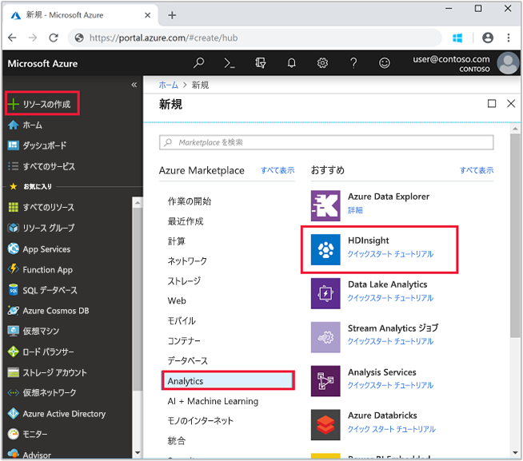
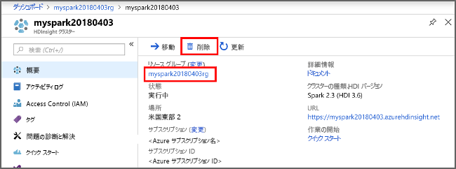

# <a name="quickstart-create-a-spark-cluster-in-hdinsight-using-the-azure-portal"></a>クイック スタート: Azure portal を使用して HDInsight に Spark クラスターを作成する
Azure HDInsight に Apache Spark クラスターを作成し、Hive テーブルに対して Spark SQL クエリを実行する方法を説明します。 Apache Spark により、メモリ内処理を使用した、高速のデータ分析とクラスター コンピューティングが可能になります。 HDInsight での Spark について詳しくは、「[概要: Azure HDInsight での Apache Spark](apache-spark-overview.md)」を参照してください。

このクイック スタートでは、Azure portal を使って HDInsight Spark クラスターを作成します。 クラスターは、クラスター記憶域として Azure Storage Blob を使います。 Data Lake Storage Gen2 の使用について詳しくは、「[クイック スタート: HDInsight のクラスターを設定する](../../storage/data-lake-storage/quickstart-create-connect-hdi-cluster.md)」をご覧ください。

> [!IMPORTANT]
> HDInsight クラスターの料金は、そのクラスターを使用しているかどうかに関係なく、分単位で課金されます。 使用後は、クラスターを必ず削除してください。 詳しくは、この記事の「[リソースのクリーンアップ](#clean-up-resources)」をご覧ください。

Azure サブスクリプションをお持ちでない場合は、開始する前に[無料アカウントを作成](https://azure.microsoft.com/free/)してください。

## <a name="create-an-hdinsight-spark-cluster"></a>HDInsight Spark クラスターを作成する

1. Azure portal で、**[リソースの作成]** > **[データ + 分析]** > **[HDInsight]** の順に選びます。 

    
2. **[基本]** で次の値を指定します。
     
    |プロパティ  |説明  |
    |---------|---------|
    |**クラスター名**     | HDInsight Spark クラスターの名前を指定します。 このクイック スタートで使われるクラスターの名前は **myspark20180403** です。|
    |**サブスクリプション**     | ドロップダウンから、このクラスターに使う Azure サブスクリプションを選びます。 このクイックスタートで使うサブスクリプションは **&lt;Azure サブスクリプション>** です。 |
    |**クラスターの種類**| 項目を展開し、クラスターの種類として **[Spark]** を選んで、Spark クラスターのバージョンを指定します。 <br/>  |
    |**クラスター ログイン ユーザー名**| クラスターのログイン ユーザー名を入力します。  既定の名前は *admin*です。クイック スタートの後半で、このアカウントを使って Jupyter Notebook にログインします。 |
    |**クラスター ログイン パスワード**| クラスターのログイン パスワードを入力します。 |
    |**Secure Shell (SSH) ユーザー名**| SSH ユーザー名を入力します。 このクイック スタートで使う SSH ユーザー名は **sshuser** です。 既定では、このアカウントは "*クラスター ログイン ユーザー名*" アカウントと同じパスワードを共有します。 |
    |**[リソース グループ]**     | 新しいリソース グループを作成するか、既存のリソース グループを使用するかを指定します。 リソース グループは、Azure ソリューションの関連するリソースを保持するコンテナーです。 このクイック スタートで使うリソース グループ名は **myspark20180403rg** です。 |
    |**場所**     | リソース グループの場所を選びます。 テンプレートでは、この場所をクラスターの作成および既定のクラスター ストレージに使用します。 このクイック スタートで使う場所は **米国東部 2** です。 |

    

    **[次へ]** を選んで、**[ストレージ]** ページに進みます。
3. **[ストレージ]** で次の値を指定します。

    - **[ストレージ アカウントの選択]**: **[新規作成]** を選び、新しいストレージ アカウントの名前を指定します。 このクイック スタートで使うストレージ アカウント名は **myspark20180403store** です。

    

    > [!NOTE] 
    > スクリーンショットでは、**[既存のものを選択]** が表示されています。 リンクには **[新規作成]** と **[既存のものを選択]** のどちらかが表示されます。

    **[既定のコンテナー]** には既定の名前が表示されます。  名前は必要に応じて変更できます。

    **[次へ]** を選んで、**[サマリー]** ページに進みます。 


3. **[サマリー]** で **[作成]** を選びます。 クラスターの作成には約 20 分かかります。 次のセッションに進む前に、クラスターを作成する必要があります。

HDInsight クラスターを作成する際に問題が発生した場合は、適切なアクセス許可がない可能性があります。 詳細については、「[アクセス制御の要件](../hdinsight-administer-use-portal-linux.md#create-clusters)」を参照してください。

## <a name="create-a-jupyter-notebook"></a>Jupyter Notebook の作成

Jupyter Notebook は、さまざまなプログラミング言語をサポートする対話型のノートブック環境です。 ノートブックを使うと、データと対話し、Markdown テキストとコードを組み合わせて、簡単な視覚化を実行できます。 

1. [Azure Portal](https://portal.azure.com)を開きます。
2. **[HDInsight クラスター]** を選び、作成したクラスターを選びます。

    

3. ポータルで **[クラスター ダッシュボード]** を選び、**[Jupyter Notebook]** を選びます。 入力を求められたら、クラスターのログイン資格情報を入力します。

   

4. **[新規]** > **[PySpark]** を選んで、ノートブックを作成します。 

   

   Untitled(Untitled.pynb) という名前の新しい Notebook が作成されて開かれます。


## <a name="run-spark-sql-statements"></a>Spark SQL ステートメントを実行する

SQL (構造化照会言語) は、データ照会とデータ定義のための言語として最も一般的かつ広く使用されています。 Spark SQL を Apache Spark の拡張機能として導入することで、使い慣れた SQL 構文を使って構造化データを扱うことができます。

1. カーネルの準備ができていることを確認します。 Notebook のカーネル名の横に白丸が表示されたら、カーネルの準備ができています。 黒丸は、カーネルがビジー状態であることを示します。

    

    Notebook を初めて起動すると、カーネルがバックグラウンドでいくつかのタスクを実行します。 カーネルの準備ができるまで待ちます。 
2. 次のコードを空のセルに貼り付け、**Shift + Enter** キーを押してコードを実行します。 コマンドを実行すると、クラスター上の Hive テーブルが一覧表示されます。

    ```PySpark
    %%sql
    SHOW TABLES
    ```
    HDInsight Spark クラスターで Jupyter Notebook を使用すると、Spark SQL を使用して Hive クエリを実行するために使用できるプリセット `sqlContext` が手に入ります。 `%%sql` により、プリセット `sqlContext` を使用して Hive クエリを実行するよう Jupyter Notebook に指示します。 クエリは、すべての HDInsight クラスターに既定で付属する Hive テーブル (**hivesampletable**) から先頭の 10 行を取得します。 結果が得られるまで約 30 秒かかります。 出力は次のようになります。 

    

    Jupyter でクエリを実行するたびに、Web ブラウザー ウィンドウのタイトルに **[(ビジー)]** ステータスと Notebook のタイトルが表示されます。 また、右上隅にある **PySpark** というテキストの横に塗りつぶされた円も表示されます。
    
2. 別のクエリを実行して、`hivesampletable` のデータを確認します。

    ```PySpark
    %%sql
    SELECT * FROM hivesampletable LIMIT 10
    ```
    
    画面が更新され、クエリ出力が表示されます。

    

2. ノートブックの **[File]\(ファイル\)** メニューの **[Close and Halt]\(閉じて停止\)** を選びます。 Notebook をシャットダウンすると、クラスターのリソースが解放されます。

## <a name="clean-up-resources"></a>リソースのクリーンアップ
HDInsight はデータを Azure Storage または Azure Data Lake Storage に格納するので、クラスターが使われていないときは、クラスターを安全に削除できます。 また、HDInsight クラスターは、使用していない場合でも課金されます。 クラスターの料金は Storage の料金の何倍にもなるため、クラスターを使用しない場合は削除するのが経済的にも合理的です。 「[次のステップ](#next-steps)」で示されているチュートリアルにすぐに取り掛かる場合は、クラスターをそのままにしてもかまいません。

Azure portal に戻り、**[削除]** を選びます。



リソース グループ名を選び、リソース グループ ページを開いて、**[リソース グループの削除]** を選ぶこともできます。 リソース グループを削除すると、HDInsight Spark クラスターと既定のストレージ アカウントの両方が削除されます。

## <a name="next-steps"></a>次の手順 

このクイックスタートでは、HDInsight Spark クラスターを作成し、基本的な Spark SQL クエリを実行する方法を学習しました。 HDInsight Spark クラスターを使用してサンプル データに対話型のクエリを実行する方法については、次のチュートリアルに進みます。

> [!div class="nextstepaction"]
>[Spark への対話型クエリの実行](./apache-spark-load-data-run-query.md)
