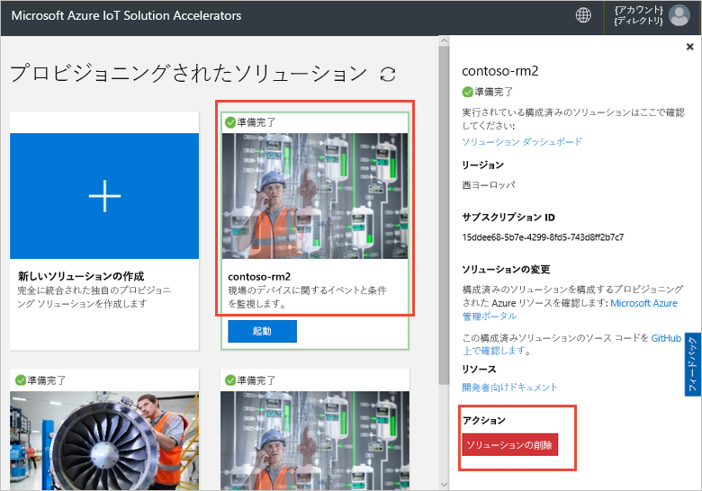

# MXChip IoT DevKit AZ3166 を IoT リモート監視ソリューション アクセラレータに接続する

[!INCLUDE [iot-suite-selector-connecting](../../includes/iot-suite-selector-connecting.md)]

IoT DevKit でサンプル アプリを実行し、センサー データをソリューション アクセラレータに送信する方法を説明します。

[MXChip IoT DevKit](https://aka.ms/iot-devkit) は、豊富な周辺機器とセンサーを備えたオールインワンの Arduino 互換ボードです。 Visual Studio Code の [Azure IoT Workbench](https://marketplace.visualstudio.com/items?itemName=vsciot-vscode.vscode-iot-workbench) を使用して開発できます。 また、Microsoft Azure サービスを活用したモノのインターネット (IoT) ソリューションのプロトタイプを作成する手順を示す[プロジェクト カタログ](https://microsoft.github.io/azure-iot-developer-kit/docs/projects/)が付属しています。

## 必要なもの

[ファースト ステップ ガイド](https://docs.microsoft.com/azure/iot-hub/iot-hub-arduino-iot-devkit-az3166-get-started)を読み、**次のセクションだけを完了**します。

* ハードウェアの準備
* Wi-Fi を構成する
* DevKit の使用を開始する
* 開発環境の準備

## VS Code でリモート監視サンプルを開く

1. IoT DevKit がお使いのコンピューターに接続されて**いない**ことを確認します。 まず VS Code を起動し、DevKit をコンピューターに接続します。

2. `F1` をクリックしてコマンド パレットを開き、**[IoT Workbench: Examples]\(IoT Workbench: 例)** を入力して選択します。 次に、**[IoT DevKit]** をボードとして選択します。

3. **[リモート監視]** を見つけ、**[Open Sample]\(サンプルを開く\)** をクリックします。 プロジェクト フォルダーを含む新しい VS Code ウィンドウが開きます。
  

## IoT Hub デバイスの接続文字列を構成する

1. IoT DevKit を**構成モード**に切り替えます。 そのためには、次の手順を実行します。
   * **A** ボタンを押しながら、
   * **リセット** ボタンを押して離します。

2. 画面に、DevKit の ID と "構成" が表示されます。
   
  

3. `F1` をクリックしてコマンド パレットを開き、**[IoT Workbench: Device]\(IoT Workbench: デバイス)** を入力して選択した後、[Config Device Settings]\(デバイス設定の構成\) を選択します。

4. コピーした接続文字列を貼り付け、`Enter` をクリックして構成します。

## デバイス コードのビルドとアップロード

1. `F1` をクリックしてコマンド パレットを開き、**[IoT Workbench: Device]\(IoT Workbench: デバイス)** を入力して選択した後、[Device Upload]\(デバイスのアップロード\) を選択します。
  

1. VS Code でコンパイルが開始され、コードが DevKit にアップロードされます。
  

DevKit が再起動され、コードの実行が開始されます。

## プロジェクトのテスト

### リモート監視ソリューションに送信されたテレメトリを表示する

サンプル アプリの実行時に、DevKit によって Wi-Fi 経由でセンサー データがリモート監視ソリューションに送信されます。 結果を表示するには、次の手順に従います。

1. ソリューション ダッシュボードに移動し、**[デバイス]** をクリックします。

2. デバイス名をクリックすると、右側のタブに DevKit のセンサー状態がリアルタイム表示されます。
  

### C2D メッセージを送信する

Remote Monitoring ソリューションを使用すると、デバイス上のリモート メソッドを呼び出すことができます。 コード例では、センサーが選択されたときに**メソッド** セクションに表示される 3 つのメソッドを発行します。

"LedColor" メソッドを使用して DevKit LED の 1 つの色を変更してみましょう。

1. デバイス一覧からデバイス名を選択し、**[ジョブ]** をクリックします。

  

2. 下のようにジョブを構成し、**[適用]** をクリックします。
  * ジョブを選択: **Run メソッド**
  * メソッド名: **LedColor**
  * ジョブ名: **ChangeLedColor**
  
  

数秒後、DevKit により RGB LED (A ボタンの下) の色が変化します。

## リソースのクリーンアップ

チュートリアルに進む場合は、リモート監視ソリューション アクセラレータをデプロイしたままにしておきます。

ソリューション アクセラレータが不要になった場合は、[プロビジョニングされたソリューション] ページでそれを選択し、[ソリューションの削除] をクリックして削除してください。

## 問題とフィードバック

問題が発生した場合は、[IoT DevKit の FAQ](https://microsoft.github.io/azure-iot-developer-kit/docs/faq/) に関するページを参照するか、以下のチャネルを使用して Microsoft までお問い合わせください。

* [Gitter.im](http://gitter.im/Microsoft/azure-iot-developer-kit)
* [StackOverflow](https://stackoverflow.com/questions/tagged/iot-devkit)

## 次の手順

ここでは、DevKit デバイスを Azure IoT リモート監視ソリューション アクセラレータに接続して、センサー データを視覚化する方法を説明しました。推奨する次の手順は、以下のとおりです。

* [Azure IoT ソリューション アクセラレータの概要](https://docs.microsoft.com/azure/iot-suite/)
* [UI のカスタマイズ](../iot-accelerators/iot-accelerators-remote-monitoring-customize.md)
* [IoT DevKit を Azure IoT Central アプリケーションに接続する](../iot-central/howto-connect-devkit.md)