# クイック スタート: 工業用 IoT デバイスを管理するクラウドベースのソリューションを試す

このクイック スタートでは、Azure IoT 接続済みファクトリ ソリューション アクセラレータをデプロイして、工業用 IoT デバイスの監視と管理をクラウドベースで行うシミュレーションの実行方法を紹介しています。 デプロイが終わった接続済みファクトリ ソリューション アクセラレータには、IoT の代表的な産業シナリオに順を追って対処できるシミュレーション リソースが事前に入力されています。 シミュレーションの対象としてソリューションに接続された複数の工場から、総合設備効率 (OEE) と主要業績評価指標 (KPI) を計算するために必要なデータ値が報告されます。 このクイック スタートでは、ソリューション ダッシュボードを使用して次のことを行います。

* 工場、生産ライン、ステーションの OEE と KPI の値を監視する。
* これらのデバイスで生成されたテレメトリ データを分析する。
* アラームに対処する。

このクイック スタートを完了するには、アクティブな Azure サブスクリプションが必要です。

Azure サブスクリプションをお持ちでない場合は、開始する前に [無料アカウント](https://azure.microsoft.com/free/?WT.mc_id=A261C142F) を作成してください。

## ソリューションのデプロイ方法

ソリューション アクセラレータを Azure サブスクリプションにデプロイするときは、いくつかの構成オプションを設定する必要があります。

[[Microsoft Azure IoT ソリューション アクセラレータ]](https://www.azureiotsolutions.com) に移動して、Azure アカウントの資格情報を使用してサインインします。

**[接続済みファクトリ]** タイルをクリックします。 **[接続済みファクトリ]** ページで **[Try Now]\(今すぐ試す\)** をクリックします。

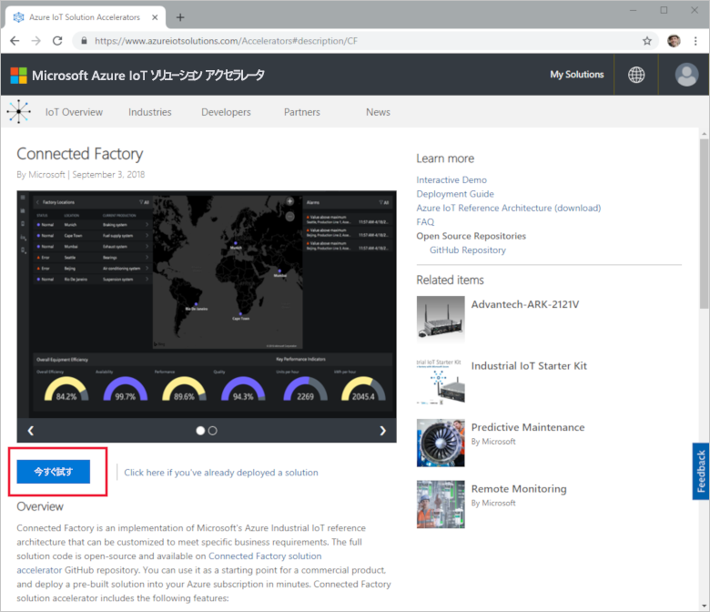

**[Create Connected Factory solution]\(接続済みファクトリ ソリューションの作成\)** ページで、接続済みファクトリ ソリューション アクセラレータに使用する一意の**ソリューション名**を入力します。 この名前は、すべてのソリューション アクセラレータ リソースを含む Azure リソース グループの名前です。 このクイック スタートでは、**MyDemoConnectedFactory** という名前を使用します。

ソリューション アクセラレータのデプロイに使用する**サブスクリプション**と**リージョン**を選択します。 通常は、最も近いリージョンを選択します。 このクイック スタートでは、**[Visual Studio Enterprise]** と **[米国東部]** を使用します。 サブスクリプションの[グローバル管理者またはユーザー](iot-accelerators-permissions.md)である必要があります。

**[ソリューションの作成]** をクリックして、デプロイを開始します。 このプロセスを実行するには、少なくとも 5 分かかります。

## ソリューションにサインインします。

Azure サブスクリプションへのデプロイが完了すると、ソリューション タイルに緑色のチェックマークと "**準備完了**" のメッセージが表示されます。 これで、接続済みファクトリ ソリューション アクセラレータ ダッシュボードにサインインすることができます。

**[プロビジョニングされたソリューション]** ページで、新しい接続済みファクトリ ソリューション アクセラレータをクリックします。

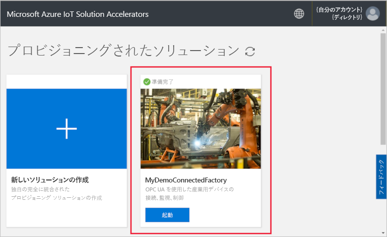

表示されるパネルで、接続済みファクトリ ソリューション アクセラレータに関する情報を確認できます。 **[ソリューション ダッシュボード]** を選択して、接続済みファクトリ ソリューション アクセラレータを表示します。

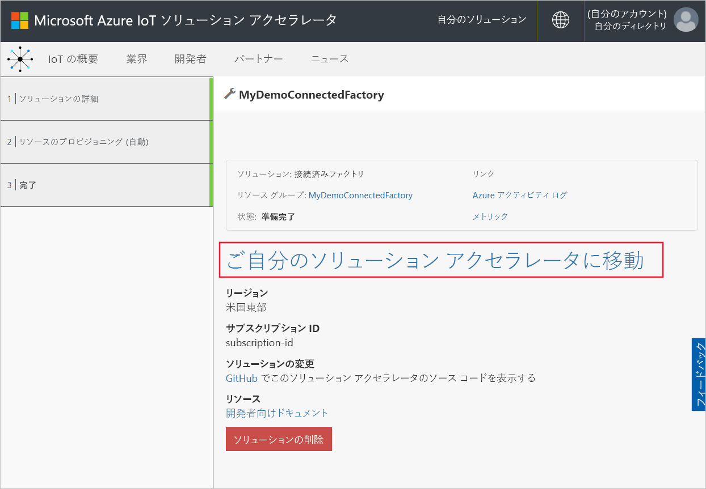

**[同意]** をクリックしてアクセス許可の要求を受け入れると、接続済みファクトリ ソリューション ダッシュボードがブラウザーに表示されます。 シミュレートされた一連の工場、生産ライン、ステーションが表示されます。

## ダッシュボードの表示

既定のビューは "*ダッシュボード*" です。 ポータルの他の領域に移動するには、ページの左端にあるメニューを使用します。

[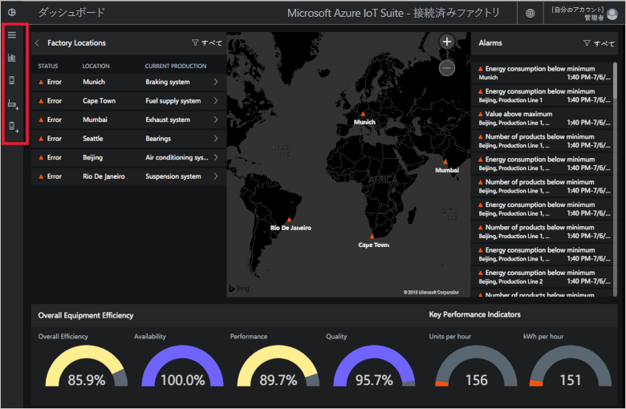](./media/quickstart-connected-factory-deploy/dashboard-expanded.png#lightbox)

対象となる工業用 IoT デバイスを管理するには、ダッシュボードを使用します。 接続済みファクトリでは、グローバルなファクトリ構成が階層を使用して表示されます。 階層の最上位には、少なくとも 1 つの工場を含んだ企業があります。 それぞれの工場には生産ラインがあり、各生産ラインはステーションから成ります。 それぞれのレベルで、OEE と KPI を表示したり、テレメトリに関する新しいノードを発行したり、アラームに対応したりすることができます。

以降、ダッシュボードで確認できる事柄について取り上げます。

## 総合設備効率

**[Overall Equipment Efficiency]\(総合設備効率\)** パネルには、企業全体または表示中の工場/生産ライン/ステーションの OEE 値が表示されます。 この値は、各ステーション ビューから全社レベルに集計されます。 OEE の数値とその構成要素は、さらに詳しく分析できます。

[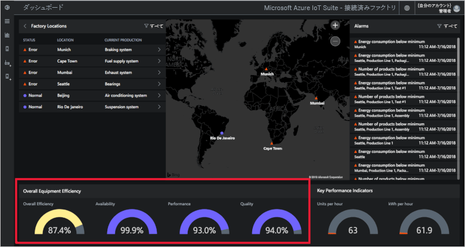](./media/quickstart-connected-factory-deploy/oee-expanded.png#lightbox)

総合設備効率 (OEE) は、生産関連の運用パラメーターを使用して製造工程の効率を評価したものです。 OEE は業界標準の指標の 1 つで、時間稼働率、性能稼働率、良品率を掛け合わせて計算されます (OEE = 稼働率 x 性能 x 品質)。

階層データ内の任意のレベルの OEE をさらに詳しく分析することができます。 OEE、稼働率、性能、品質のいずれかのパーセンテージ目盛り盤をクリックします コンテキスト パネルに、さまざまなタイムスケールでデータが可視化されます。

グラフをクリックすると、さらに詳しくデータを分析することができます。

### 主要業績評価指標

**[主要業績評価指標]** パネルには、企業全体で、または表示中の工場/生産ライン/ステーションで 1 時間に生産されたユニット数とエネルギー量 (kWh) が表示されます。 これらの値は、各ステーション ビューから全社レベルに集計されます。

階層データ内の任意のレベルの KPI をさらに詳しく分析することができます。 OEE、稼働率、性能、品質のいずれかのパーセンテージ目盛り盤をクリックします コンテキスト パネルに、さまざまなタイムスケールでデータが可視化されます。

[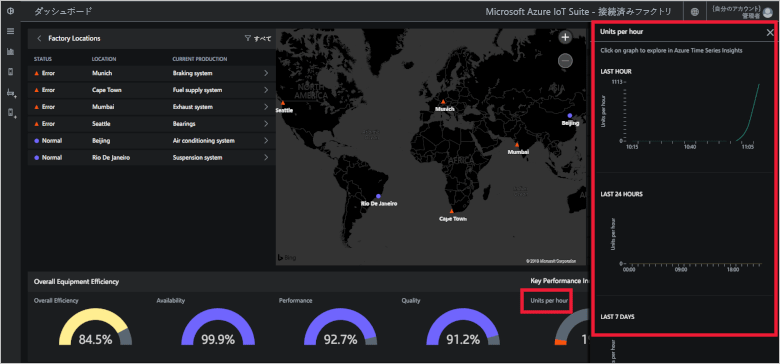](./media/quickstart-connected-factory-deploy/kpidetail-expanded.png#lightbox)

グラフをクリックすると、さらに詳しくデータを分析することができます。

### ファクトリの場所

**[ファクトリの場所]** パネル: ソリューションに接続された工場の状態、場所、および現在の生産構成が表示されます。 ソリューション アクセラレータの初回実行時には、シミュレートされた一連の工場がダッシュボードに表示されます。 各生産ラインのシミュレーションは、シミュレートされたタスクを実行してデータを共有する実際の OPC UA サーバー 3 台で構成されています。 OPC UA の詳細については、[接続済みファクトリの FAQ](iot-accelerators-faq-cf.md) を参照してください。

[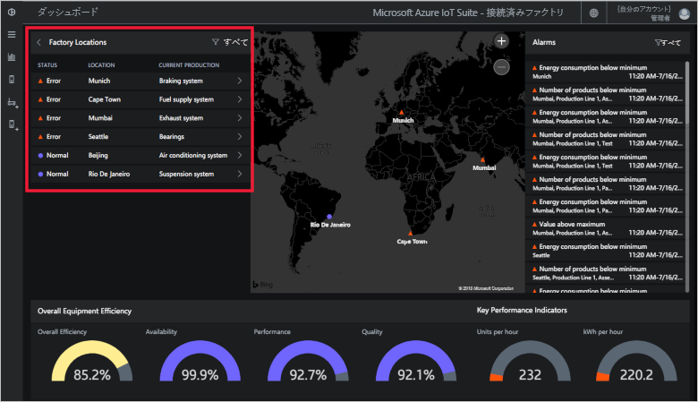](./media/quickstart-connected-factory-deploy/factorylocations-expanded.png#lightbox)

ソリューションの階層間を移動しながら、各レベルの OEE 値や KPI を確認することができます。

1. **[ファクトリの場所]** で **[ムンバイ]** をクリックします。 該当する場所の生産ラインが表示されます。

1. **[生産ライン 1]** をクリックします。 この生産ラインのステーションが表示されます。

1. **[Packaging]\(梱包\)** をクリックします。 このステーションによって発行された OPC UA ノードが表示されます。

1. **[EnergyConsumption]** をクリックします。 この値をさまざまなタイムスケールでプロットしたグラフがいくつか表示されます。 グラフをクリックすると、さらに詳しくデータを分析することができます。

[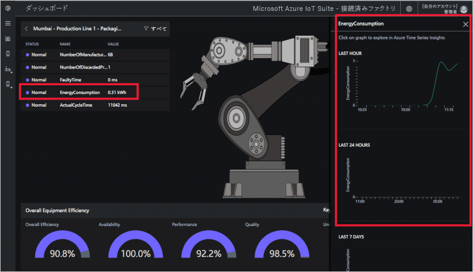](./media/quickstart-connected-factory-deploy/explorelocations-expanded.png#lightbox)

### マップ

お使いのサブスクリプションで [Bing Maps API](iot-accelerators-faq-cf.md) にアクセスできる場合は、"*工場のマップ*" にソリューション内のすべての工場の地理的な場所と状態が表示されます。 その場所の詳細を表示するには、マップに表示されている場所をクリックします。

[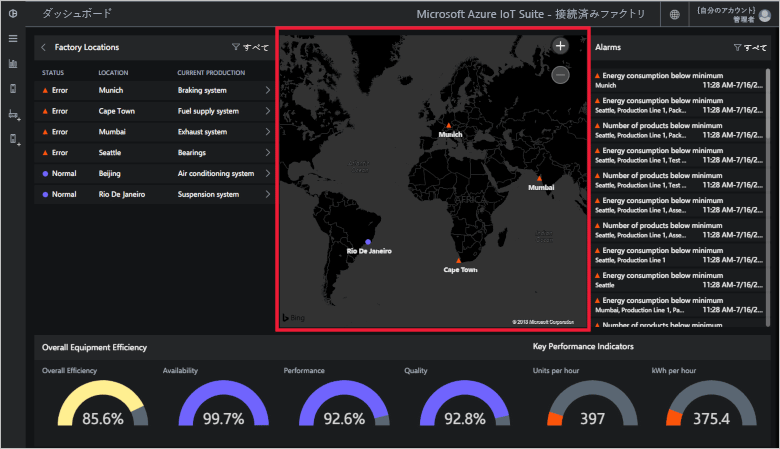](./media/quickstart-connected-factory-deploy/map-expanded.png#lightbox)

### アラーム

**[アラーム]** パネルには、レポートされた値や計算された OEE/KPI 値がしきい値を超えたために生成されたアラームが表示されます。 このパネルには、ステーションからエンタープライズまで、階層の各レベルでアラームが表示されます。 各アラームには、発生の回数、説明、日付、時刻、場所が含まれています。

[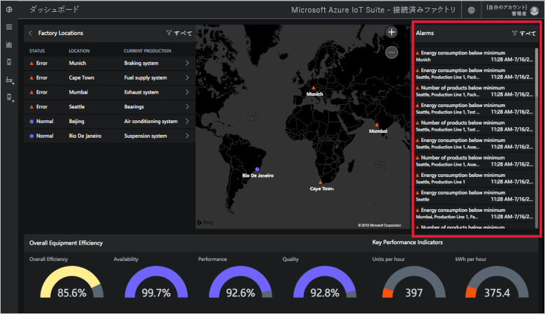](./media/quickstart-connected-factory-deploy/alarms-expanded.png#lightbox)

アラームの原因となったデータは、ダッシュボードから分析できます。 管理者は、アラームに対して次のような既定のアクションを実行できます。

* アラームを閉じる。
* アラームを確認する。

**[アクションの選択]** ボックスの一覧でいずれかのアラームをクリックし、**[アラートを確認する]** を選択して、**[適用]** をクリックします。

[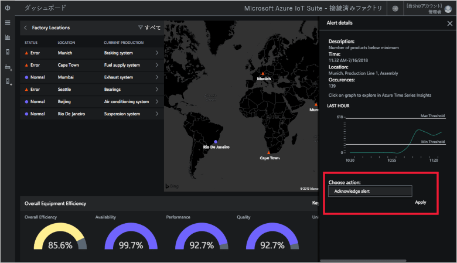](./media/quickstart-connected-factory-deploy/acknowledge-expanded.png#lightbox)

アラーム データをさらに詳しく分析するには、[アラーム] パネルでグラフをクリックします。

これらのアラームは、ソリューション アクセラレータ内の構成ファイルで指定されたルールに基づいて生成されます。 このルールを使用して、OEE/KPI の数値または OPC UA ノードの値がしきい値を超えた場合にアラームを生成できます。 このしきい値は、ご自身で設定することができます。

## リソースのクリーンアップ

さらに調べる場合は、接続済みファクトリ ソリューション アクセラレータをデプロイしたままにします。

ソリューション アクセラレータが不要になった場合は、[[プロビジョニングされたソリューション]](https://www.azureiotsolutions.com/Accelerators#dashboard) ページでそれを選択し、**[ソリューションの削除]** をクリックして削除してください。

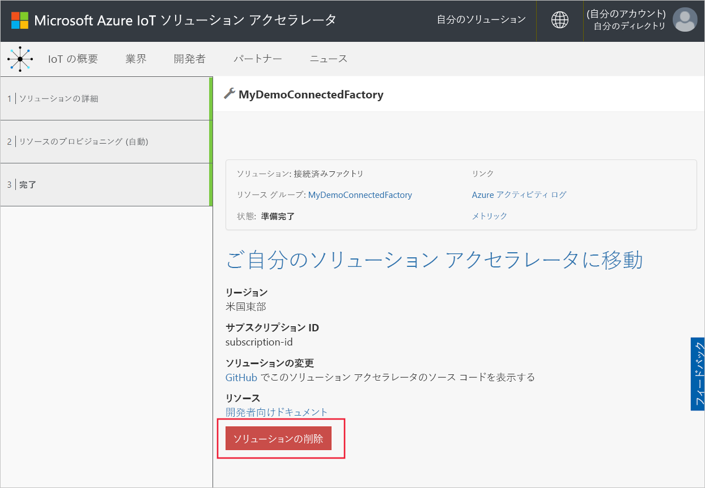

## 次の手順

このクイック スタートでは、接続済みファクトリ ソリューション アクセラレータをデプロイし、工場、生産ライン、ステーション間を移動する方法について説明しました。 階層の各レベルの OEE 値や KPI 値を確認する方法やアラームに対応する方法についても見てきました。

その他のダッシュボード機能を使用して工業用 IoT デバイスを管理する方法については、引き続き次のハウツー ガイドをご覧ください。

> [!div class="nextstepaction"]
> [接続済みファクトリ ダッシュボードの使用](iot-accelerators-connected-factory-dashboard.md)