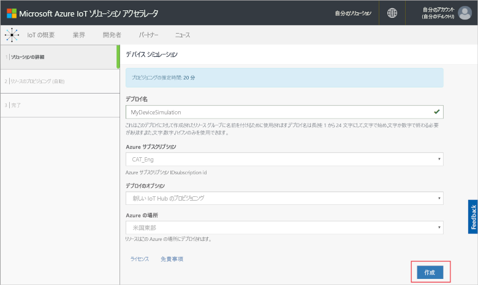
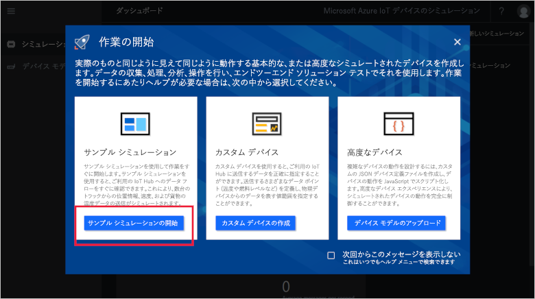
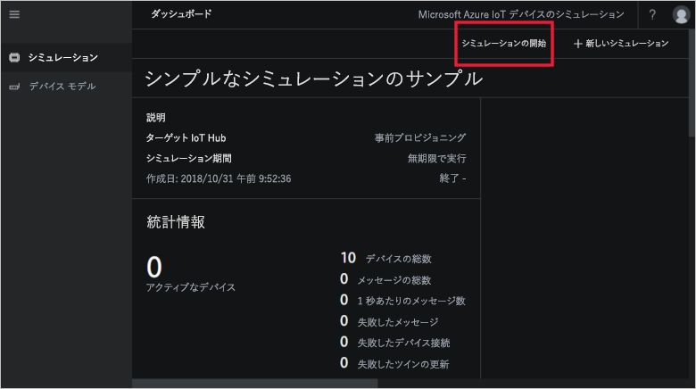
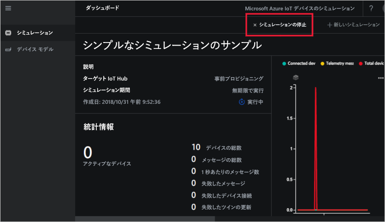

# クイック スタート:Azure で IoT デバイス シミュレーションをデプロイして実行する

このクイック スタートでは、IoT ソリューションをテストするために Azure IoT デバイス シミュレーションをデプロイする方法について説明します。 ソリューション アクセラレータをデプロイした後、サンプル シミュレーションを実行して、作業を開始します。

このクイック スタートを完了するには、アクティブな Azure サブスクリプションが必要です。

Azure サブスクリプションをお持ちでない場合は、開始する前に [無料アカウント](https://azure.microsoft.com/free/?WT.mc_id=A261C142F) を作成してください。

## デバイス シミュレーションのデプロイ

デバイス シミュレーションを Azure サブスクリプションにデプロイするときは、いくつかの構成オプションを設定する必要があります。

Azure アカウントの資格情報を使用して、[azureiotsolutions.com](https://www.azureiotsolutions.com/Accelerators) にサインインします。

**[デバイス シミュレーション]** タイルをクリックします。

デバイス シミュレーションの説明ページで、**[今すぐ試してみる]** をクリックします。

![[今すぐ試してみる] をクリックする](./media/quickstart-device-simulation-deploy/devicesimulationpdp1.png)

**[Create Device Simulation solution]\(デバイス シミュレーション ソリューションの作成\)** ページで、一意の **[Solution name]\(ソリューション名\)** を入力します。

ソリューション アクセラレータのデプロイに使用する**サブスクリプション**と**リージョン**を選択します。 通常は、最も近いリージョンを選択します。 サブスクリプションの[グローバル管理者またはユーザー](iot-accelerators-permissions.md)である必要があります。

ボックスをオンにして、デバイス シミュレーション ソリューションで使用する IoT ハブをデプロイします。 シミュレーションが使用する IoT ハブは、後でいつでも変更できます。

**[作成]** をクリックして、ソリューションのプロビジョニングを始めます。 このプロセスを実行するには、少なくとも 5 分かかります。

## ソリューションにサインインします。

プロビジョニング プロセスが完了したら、**[起動]** ボタンをクリックして、デバイス シミュレーションのインスタンスにサインインすることができます。

**[同意]** をクリックしてアクセス許可の要求を受け入れると、ブラウザーにデバイス シミュレーション ソリューション ダッシュボードが表示されます。

初めて開くと、デバイス シミュレーション ダッシュボードに**ファースト ステップ** ガイドが表示されます。 サンプル シミュレーションを開くには、最初のタイルをクリックします。 **ファースト ステップ** ガイドを閉じた場合、**サンプルの簡単なシミュレーション**を開くには、ダッシュボードでそのタイルをクリックします。

## サンプル シミュレーション

サンプル シミュレーションは、編集できません。 シミュレーションは、次の設定で構成されています。

| Setting             | 値                       |
| ------------------- | --------------------------- |
| IoT Hub を対象にする      | Use pre-provisioned IoT Hub (事前プロビジョニングされた IoT Hub を使用する) |
| デバイスのモデル        | トラック                       |
| Number of devices (デバイス数)   | 10                          |
| Telemetry frequency (テレメトリ頻度) | 10 秒                  |
| シミュレーション期間 | Run indefinitely (無期限に実行する)            |

## シミュレーションを実行する

**[シミュレーションの開始]** をクリックします。 シミュレーションは、構成されているように、無期限に実行されます。 いつでも、**[シミュレーションの停止]** をクリックしてシミュレーションを停止できます。 シミュレーションで、現在の実行の統計情報が表示されます。

デバイス シミュレーション インスタンスから実行できるシミュレーションは、一度に 1 つだけです。

## リソースのクリーンアップ

さらに調べる場合は、デバイス シミュレーションをデプロイしたままにします。

デバイス シミュレーションが不要になった場合は、[[プロビジョニングされたソリューション]](https://www.azureiotsolutions.com/Accelerators#dashboard) ページでそのタイルをクリックし、**[ソリューションの削除]** をクリックして削除してください。

## 次の手順

このクイック スタートでは、デバイス シミュレーションをデプロイし、サンプル IoT デバイス シミュレーションを実行しました。

> [!div class="nextstepaction"]
> [1 つまたは複数のデバイスの種類があるシミュレーションを作成する](iot-accelerators-device-simulation-create-simulation.md)