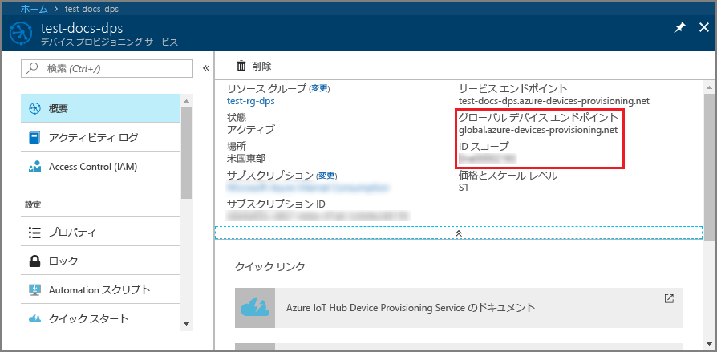

# <a name="create-and-provision-a-simulated-tpm-device-using-python-device-sdk-for-iot-hub-device-provisioning-service"></a>IoT Hub Device Provisioning Service 対応の Python デバイス SDK を使用して、シミュレートされた TPM デバイスを作成してプロビジョニングする

[!INCLUDE [iot-dps-selector-quick-create-simulated-device-tpm](../../includes/iot-dps-selector-quick-create-simulated-device-tpm.md)]

以下の手順では、Windows OS を実行する開発マシン上にシミュレートされたデバイスを作成し、そのデバイスの[ハードウェア セキュリティ モジュール (HSM)](https://azure.microsoft.com/blog/azure-iot-supports-new-security-hardware-to-strengthen-iot-security/) として Windows TPM シミュレーターを実行します。その後、Python コード サンプルを使用して、そのシミュレートされたデバイスを Device Provisioning Service と IoT ハブに接続します。 

自動プロビジョニングの処理に慣れていない場合は、「[自動プロビジョニングの概念](concepts-auto-provisioning.md)」も確認してください。 また、先に進む前に、[Azure Portal での IoT Hub Device Provisioning Service の設定](./quick-setup-auto-provision.md)に関するページの手順も済ませておいてください。 

[!INCLUDE [IoT DPS basic](../../includes/iot-dps-basic.md)]

## <a name="prepare-the-environment"></a>環境の準備 

1. コンピューターに [Visual Studio 2015](https://www.visualstudio.com/vs/older-downloads/) または [Visual Studio 2017](https://www.visualstudio.com/vs/) がインストールされていることを確認します。 Visual Studio のインストールで "C++ によるデスクトップ開発" のワークロードを有効にしておく必要があります。

1. [CMake ビルド システム](https://cmake.org/download/)をダウンロードしてインストールします。

1. マシンに `git` がインストールされ、コマンド ウィンドウからアクセスできる環境変数に追加されていることを確認します。 **Git Bash** (ローカル Git リポジトリと対話する際に使用するコマンドライン アプリ) など、インストールする各種 `git` ツールの最新バージョンについては、[Software Freedom Conservancy の Git クライアント ツール](https://git-scm.com/download/)に関するページを参照してください。 

1. コマンド プロンプトまたは Git Bash を開きます。 デバイス シミュレーション コード サンプルの GitHub リポジトリを複製します。
    
    ```cmd/sh
    git clone https://github.com/Azure/azure-iot-sdk-python.git --recursive
    ```

1. この GitHub リポジトリのローカル コピーに、CMake ビルド プロセス用のフォルダーを作成します。 

    ```cmd/sh
    cd azure-iot-sdk-python/c
    mkdir cmake
    cd cmake
    ```

1. このコード サンプルでは、Windows TPM シミュレーターを使用します。 次のコマンドを実行して、SAS トークン認証を有効にしてください。 これにより、シミュレートされたデバイスの Visual Studio ソリューションも生成されます。

    ```cmd/sh
    cmake -Duse_prov_client:BOOL=ON -Duse_tpm_simulator:BOOL=ON ..
    ```

1. 別のコマンド プロンプトで TPM シミュレーター フォルダーに移動し、[TPM](https://docs.microsoft.com/windows/device-security/tpm/trusted-platform-module-overview) シミュレーターを実行します。 **[アクセスを許可]** をクリックします。 これは、ソケットでポート 2321 とポート 2322 をリッスンします。 このコマンド ウィンドウを閉じないでください。このクイックスタート ガイドの終了まで、このシミュレーターを実行状態にしておく必要があります。 

    ```cmd/sh
    .\azure-iot-sdk-python\c\provisioning_client\deps\utpm\tools\tpm_simulator\Simulator.exe
    ```

    


## <a name="create-a-device-enrollment-entry"></a>デバイス登録エントリを作成する

1. *cmake* フォルダーに生成されたソリューション (`azure_iot_sdks.sln`) を開き、Visual Studio でビルドします。

1. **tpm_device_provision** プロジェクトを右クリックし、**[スタートアップ プロジェクトに設定]** を選択します。 ソリューションを実行する デバイス登録に必要な **_Endorsement Key_** と **_Registration ID_** が出力ウィンドウに表示されます。 これらの値を書き留めておいてください。 

    

1. Azure Portal にログインし、左側のメニューの **[すべてのリソース]** をクリックして、Device Provisioning Service を開きます。

1. Device Provisioning Service の概要ブレードで、**[Manage enrollments]\(登録の管理\)** を選択します。 **[Individual Enrollments]\(個々の登録\)** タブの上部にある **[追加]** ボタンをクリックします。 

1. **[Add enrollment list entry]\(登録リスト エントリの追加\)** で、次の情報を入力します。
    - ID 構成証明の "*メカニズム*" として **[TPM]** を選択します。
    - TPM デバイスの "*登録 ID*" と "*保証キー*" を入力します。 
    - プロビジョニング サービスにリンクされた IoT ハブを選択します。
    - 一意のデバイス ID を入力します。 デバイスに名前を付ける際に機密データを含めないようにしてください。
    - **[Initial device twin state]\(初期のデバイス ツインの状態\)** をデバイスの目的の初期構成で更新します。
    - 作業が完了したら、**[保存]** をクリックします。 

      

   登録に成功すると、*[Individual Enrollments]\(個々の登録\)* タブの一覧に、対象デバイスの "*登録 ID*" が表示されます。 


## <a name="simulate-the-device"></a>デバイスをシミュレートする

1. [Python 2.x または 3.x](https://www.python.org/downloads/) をダウンロードしてインストールします。 必ず、セットアップに必要な 32 ビットまたは 64 ビットのインストールを使用してください。 インストール中に求められた場合は、プラットフォーム固有の環境変数に Python を追加します。
    - Windows OS を使用している場合は、[Visual C++ 再頒布可能パッケージ](http://www.microsoft.com/download/confirmation.aspx?id=48145)によって、Python からネイティブ DLL を使用できます。

1. [これらの手順](https://github.com/Azure/azure-iot-sdk-python/blob/master/doc/python-devbox-setup.md)に従って、Python パッケージをビルドします。

    > [!NOTE]
        > `build_client.cmd` を実行する場合は、必ず `--use-tpm-simulator` フラグを使用してください。

    > [!NOTE]
        > `pip` を使用する場合は、`azure-iot-provisioning-device-client` パッケージもインストールされていることを確認してください。 リリースされている PIP パッケージでは、シミュレーターではなく実際の TPM が使用されています。 シミュレーターを使用するには、`--use-tpm-simulator` フラグを使用してソースからコンパイルする必要があります。

1. samples フォルダーに移動します。

    ```cmd/sh
    cd azure-iot-sdk-python/provisioning_device_client/samples
    ```

1. Python IDE を使用して、**provisioning\_device\_client\_sample.py** という名前の Python スクリプトを編集します。 _GLOBAL\_PROV\_URI_ 変数と _ID\_SCOPE_ 変数を前述の値に変更します。

    ```python
    GLOBAL_PROV_URI = "{globalServiceEndpoint}"
    ID_SCOPE = "{idScope}"
    SECURITY_DEVICE_TYPE = ProvisioningSecurityDeviceType.TPM
    PROTOCOL = ProvisioningTransportProvider.HTTP
    ```

    

1. サンプルを実行します。 

    ```cmd/sh
    python provisioning_device_client_sample.py
    ```

1. デバイスが起動して Device Provisioning Service に接続し、IoT ハブの情報を取得する動作がシミュレートされるので、そのメッセージに注目してください。 

    

1. プロビジョニング サービスにリンクされた IoT ハブに対し、シミュレートされたデバイスが正常にプロビジョニングされると、ハブの **[デバイス エクスプローラー]** ブレードにデバイス ID が表示されます。

     

    *[Initial device twin state]\(初期のデバイス ツインの状態\)* をデバイスの登録エントリの既定値から変更した場合、デバイスはハブから目的のツインの状態をプルし、それに従って動作することができます。 詳細については、「[IoT Hub のデバイス ツインの理解と使用](../iot-hub/iot-hub-devguide-device-twins.md)」を参照してください。


## <a name="clean-up-resources"></a>リソースのクリーンアップ

引き続きデバイス クライアント サンプルを使用する場合は、このクイックスタートで作成したリソースをクリーンアップしないでください。 使用する予定がない場合は、次の手順を使用して、このクイックスタートで作成したすべてのリソースを削除してください。

1. マシンに表示されているデバイス クライアント サンプルの出力ウィンドウを閉じます。
1. マシンに表示されている TPM シミュレーター ウィンドウを閉じます。
1. Azure Portal の左側のメニューにある **[すべてのリソース]** をクリックし、Device Provisioning サービスを選択します。 サービスの **[登録を管理します]** ブレードを開き、**[個々の登録]** タブをクリックします。このクイックスタートで登録したデバイスの*登録 ID* を選択し、上部の **[削除]** ボタンをクリックします。 
1. Azure Portal の左側のメニューにある **[すべてのリソース]** をクリックし、IoT ハブを選択します。 ハブの **[IoT Devices]\(IoT デバイス\)** ブレードを開き、このクイックスタートで登録したデバイスの "*デバイス ID*" を選択し、一番上の **[削除]** ボタンをクリックします。

## <a name="next-steps"></a>次の手順

このクイックスタートでは、TPM のシミュレートされたデバイスをコンピューター上に作成し、IoT Hub Device Provisioning Service を使用して IoT ハブにプロビジョニングしました。 プログラミングによって TPM デバイスを登録する方法については、TPM デバイスのプログラミングによる登録のクイックスタートに進みます。 

> [!div class="nextstepaction"]
> [Azure クイックスタート - Azure IoT Hub Device Provisioning Service への TPM デバイスの登録](quick-enroll-device-tpm-java.md)
