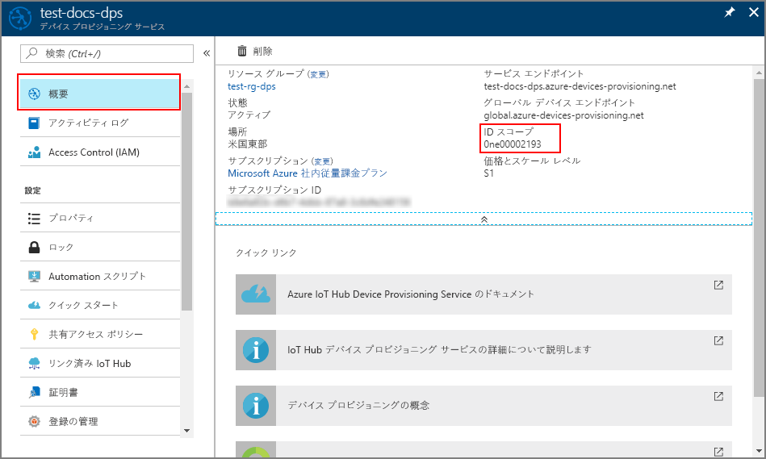

# <a name="create-and-provision-a-simulated-tpm-device-using-c-device-sdk-for-iot-hub-device-provisioning-service"></a>IoT Hub Device Provisioning Service 対応の C デバイス SDK を使用して、シミュレートされた TPM デバイスを作成してプロビジョニングする

[!INCLUDE [iot-dps-selector-quick-create-simulated-device-tpm](../../includes/iot-dps-selector-quick-create-simulated-device-tpm.md)]

以下の手順では、Windows OS を実行する開発マシンにシミュレートされたデバイスを作成し、そのデバイスの[ハードウェア セキュリティ モジュール (HSM)](https://azure.microsoft.com/blog/azure-iot-supports-new-security-hardware-to-strengthen-iot-security/) として Windows TPM シミュレーターを実行します。その後、コード サンプルを使って、そのシミュレートされたデバイスを Device Provisioning Service および IoT ハブに接続します。 

事前に、[Azure Portal での IoT Hub Device Provisioning Service の設定](./quick-setup-auto-provision.md)に関するページの手順を済ませておいてください。

[!INCLUDE [IoT DPS basic](../../includes/iot-dps-basic.md)]

<a id="setupdevbox"></a>

## <a name="prepare-the-development-environment"></a>開発環境の準備 

1. マシンに Visual Studio 2015 または [Visual Studio 2017](https://www.visualstudio.com/vs/) がインストールされていることを確認します。 Visual Studio のインストールで [[C++ によるデスクトップ開発]](https://www.visualstudio.com/vs/support/selecting-workloads-visual-studio-2017/) ワークロードを有効にしておく必要があります。

2. [CMake ビルド システム](https://cmake.org/download/)をダウンロードしてインストールします。 `cmake` のインストール**より前に**、[C++ によるデスクトップ開発] ワークロードが有効な Visual Studio がコンピューターにインストールされていることが重要です。

3. マシンに `git` がインストールされ、コマンド ウィンドウからアクセスできる環境変数に追加されていることを確認します。 **Git Bash** (ローカル Git リポジトリと対話する際に使用するコマンドライン アプリ) など、インストールする各種 `git` ツールの最新バージョンについては、[Software Freedom Conservancy の Git クライアント ツール](https://git-scm.com/download/)に関するページを参照してください。 

4. コマンド プロンプトまたは Git Bash を開きます。 デバイス シミュレーション コード サンプルの GitHub リポジトリを複製します。
    
    ```cmd/sh
    git clone https://github.com/Azure/azure-iot-sdk-c.git --recursive
    ```

5. この GitHub リポジトリのローカル コピーに、CMake ビルド プロセス用のフォルダーを作成します。 

    ```cmd/sh
    cd azure-iot-sdk-c
    mkdir cmake
    cd cmake
    ```

6. このコード サンプルでは、Windows TPM シミュレーターを使用します。 次のコマンドを実行して、SAS トークン認証を有効にしてください。 これにより、シミュレートされたデバイスの Visual Studio ソリューションも生成されます。

    ```cmd/sh
    cmake -Duse_prov_client:BOOL=ON -Duse_tpm_simulator:BOOL=ON ..
    ```

    `cmake` で C++ コンパイラが見つからない場合は、上記のコマンドの実行中にビルド エラーが発生している可能性があります。 これが発生した場合は、[Visual Studio コマンド プロンプト](https://docs.microsoft.com/dotnet/framework/tools/developer-command-prompt-for-vs)でこのコマンドを実行してください。 

7. 別のコマンド プロンプトで GitHub のルート フォルダーに移動し、[TPM](https://docs.microsoft.com/windows/device-security/tpm/trusted-platform-module-overview) シミュレーターを実行します。 これは、ソケットでポート 2321 とポート 2322 をリッスンします。 このコマンド ウィンドウを閉じないでください。このクイックスタート ガイドの終了まで、このシミュレーターを実行状態にしておく必要があります。 

   *cmake* フォルダーにいる場合は、次のコマンドを実行します。

    ```cmd/sh
    cd..
    .\provisioning_client\deps\utpm\tools\tpm_simulator\Simulator.exe
    ```

<a id="simulatetpm"></a>

## <a name="simulate-tpm-device"></a>TPM デバイスをシミュレートする

1. *cmake* フォルダーに生成されたソリューション (`azure_iot_sdks.sln`) を開き、Visual Studio でビルドします。

2. Visual Studio の "*ソリューション エクスプローラー*" ウィンドウで、**Provision\_Tools** フォルダーに移動します。 **tpm_device_provision** プロジェクトを右クリックし、**[スタートアップ プロジェクトに設定]** を選択します。 

3. ソリューションを実行する デバイス登録に必要な "**_保証キー_**" と "**_登録 ID_**" が出力ウィンドウに表示されます。 これらの値を書き留めておいてください。 


<a id="portalenrollment"></a>

## <a name="create-a-device-enrollment-entry-in-the-portal"></a>ポータルでデバイス登録エントリを作成する

1. Azure Portal にログインし、左側のメニューの **[すべてのリソース]** をクリックして、Device Provisioning Service を開きます。

2. Device Provisioning Service の概要ブレードで、**[Manage enrollments]\(登録の管理\)** を選択します。 **[Individual Enrollments]\(個々の登録\)** タブの上部にある **[追加]** ボタンをクリックします。 

3. **[Add enrollment list entry]\(登録リスト エントリの追加\)** で、次の情報を入力します。
    - ID 構成証明の "*メカニズム*" として **[TPM]** を選択します。
    - TPM デバイスの "*登録 ID*" と "*保証キー*" を入力します。
    - 必要に応じて、次の情報を入力することができます。
        - プロビジョニング サービスにリンクされた IoT ハブを選択します。
        - 一意のデバイス ID を入力します。 デバイスに名前を付ける際に機密データを含めないようにしてください。
        - **[Initial device twin state]\(初期のデバイス ツインの状態\)** をデバイスの目的の初期構成で更新します。
    - 作業が完了したら、**[保存]** をクリックします。 

      

   登録に成功すると、*[Individual Enrollments]\(個々の登録\)* タブの一覧に、対象デバイスの "*登録 ID*" が表示されます。 


<a id="firstbootsequence"></a>

## <a name="simulate-first-boot-sequence-for-the-device"></a>デバイスの初回ブート シーケンスのシミュレーション

1. Azure Portal で、Device Provisioning サービスの **[概要]** ブレードを選択し、**_[ID スコープ]_** の値を書き留めます。

     

2. お使いのコンピューターの Visual Studio の "*ソリューション エクスプローラー*" で、**Provision\_Samples** フォルダーに移動します。 **prov\_dev\_client\_sample** という名前のサンプル プロジェクトを選択し、**prov\_dev\_client\_sample.c** ファイルを開きます。

3. _[ID Scope]\(ID スコープ\)_ の値を `id_scope` 変数に代入します。 

    ```c
    static const char* id_scope = "[ID Scope]";
    ```

4. 同じファイルの **main()** 関数で、**SECURE_DEVICE_TYPE** が TPM に設定されていることを確認します。

    ```c
    SECURE_DEVICE_TYPE hsm_type;
    hsm_type = SECURE_DEVICE_TYPE_TPM;
    ```

   既定で存在する `hsm_type = SECURE_DEVICE_TYPE_X509;` ステートメントをコメント アウトするか削除します。 

5. **prov\_dev\_client\_sample** プロジェクトを右クリックし、**[スタートアップ プロジェクトに設定]** を選択します。 ソリューションを実行する 

6. デバイスが起動して Device Provisioning Service に接続し、IoT ハブの情報を取得する動作がシミュレートされるので、そのメッセージに注目してください。 プロビジョニング サービスにリンクされた IoT ハブに対してシミュレートされたデバイスが正常にプロビジョニングされると、ハブの **[IoT デバイス]** ブレードにデバイス ID が表示されます。 

     

    *[Initial device twin state]\(初期のデバイス ツインの状態\)* をデバイスの登録エントリの既定値から変更した場合、デバイスはハブから目的のツインの状態をプルし、それに従って動作することができます。 詳細については、「[IoT Hub のデバイス ツインの理解と使用](../iot-hub/iot-hub-devguide-device-twins.md)」を参照してください。


## <a name="clean-up-resources"></a>リソースのクリーンアップ

引き続きデバイス クライアント サンプルを使用する場合は、このクイックスタートで作成したリソースをクリーンアップしないでください。 使用する予定がない場合は、次の手順を使用して、このクイックスタートで作成したすべてのリソースを削除してください。

1. マシンに表示されているデバイス クライアント サンプルの出力ウィンドウを閉じます。
1. マシンに表示されている TPM シミュレーター ウィンドウを閉じます。
1. Azure Portal の左側のメニューにある **[すべてのリソース]** をクリックし、Device Provisioning サービスを選択します。 サービスの **[登録を管理します]** ブレードを開き、**[個々の登録]** タブをクリックします。このクイックスタートで登録したデバイスの*登録 ID* を選択し、上部の **[削除]** ボタンをクリックします。 
1. Azure Portal の左側のメニューにある **[すべてのリソース]** をクリックし、IoT ハブを選択します。 ハブの **[IoT Devices]\(IoT デバイス\)** ブレードを開き、このクイックスタートで登録したデバイスの "*デバイス ID*" を選択し、一番上の **[削除]** ボタンをクリックします。

## <a name="next-steps"></a>次の手順

このクイックスタートでは、TPM のシミュレートされたデバイスをコンピューター上に作成し、IoT Hub Device Provisioning Service を使用して IoT ハブにプロビジョニングしました。 プログラミングによって TPM デバイスを登録する方法については、TPM デバイスのプログラミングによる登録のクイックスタートに進みます。 

> [!div class="nextstepaction"]
> [Azure クイックスタート - Azure IoT Hub Device Provisioning Service への TPM デバイスの登録](quick-enroll-device-tpm-java.md)

