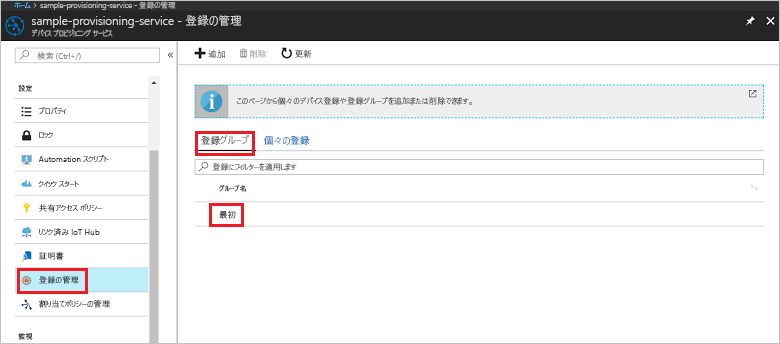

# <a name="enroll-x509-devices-to-iot-hub-device-provisioning-service-using-nodejs-service-sdk"></a>Node.js Service SDK を使用して X.509 デバイスを IoT Hub Device Provisioning Service に登録する

[!INCLUDE [iot-dps-selector-quick-enroll-device-x509](../../includes/iot-dps-selector-quick-enroll-device-x509.md)]


[Node.js Service SDK](https://github.com/Azure/azure-iot-sdk-node) と Node.js サンプルを使用して、中間またはルート CA X.509 証明書の登録グループをプログラムで作成する方法について説明します。 これらの手順は Windows マシンと Linux マシンの両方に利用できますが、この記事では Windows 開発マシンを使用します。
 

## <a name="prerequisites"></a>前提条件

- [Azure Portal での IoT Hub Device Provisioning Service の設定](./quick-setup-auto-provision.md)に関するページの手順を済ませておいてください。 

 
- マシンに [Node.js v4.0 以降](https://nodejs.org)がインストールされていることを確認します。


- プロビジョニング サービスにアップロードされ検証された中間またはルート CA X.509 証明書を含む .pem ファイルが必要です。 **Azure IoT c SDK** には、X.509 証明書チェーンを作成し、そのチェーンからルートまたは中間証明書をアップロードし、サービスで所有証明を実行して証明書を検証するために役立つツールが含まれています。 このツールを使用するには、[Azure IoT c SDK](https://github.com/Azure/azure-iot-sdk-c) を複製し、マシンで [azure-iot-sdk-c\tools\CACertificates\CACertificateOverview.md](https://github.com/Azure/azure-iot-sdk-c/blob/master/tools/CACertificates/CACertificateOverview.md) の手順に従います。

## <a name="create-the-enrollment-group-sample"></a>登録グループのサンプルを作成する 

 
1. 作業フォルダーのコマンド ウィンドウから次のコマンドを実行します。
  
     ```cmd\sh
     npm install azure-iot-provisioning-service
     ```  

2. テキスト エディターを使用して、作業フォルダーに **create_enrollment_group.js** ファイルを作成します。 次のコードをファイルに追加して保存します。

    ```
    'use strict';
    var fs = require('fs');

    var provisioningServiceClient = require('azure-iot-provisioning-service').ProvisioningServiceClient;

    var serviceClient = provisioningServiceClient.fromConnectionString(process.argv[2]);

    var enrollment = {
      enrollmentGroupId: 'first',
      attestation: {
        type: 'x509',
        x509: {
          signingCertificates: {
            primary: {
              certificate: fs.readFileSync(process.argv[3], 'utf-8').toString()
            }
          }
        }
      },
      provisioningStatus: 'disabled'
    };

    serviceClient.createOrUpdateEnrollmentGroup(enrollment, function(err, enrollmentResponse) {
      if (err) {
        console.log('error creating the group enrollment: ' + err);
      } else {
        console.log("enrollment record returned: " + JSON.stringify(enrollmentResponse, null, 2));
        enrollmentResponse.provisioningStatus = 'enabled';
        serviceClient.createOrUpdateEnrollmentGroup(enrollmentResponse, function(err, enrollmentResponse) {
          if (err) {
            console.log('error updating the group enrollment: ' + err);
          } else {
            console.log("updated enrollment record returned: " + JSON.stringify(enrollmentResponse, null, 2));
          }
        });
      }
    });
    ````

## <a name="run-the-enrollment-group-sample"></a>登録グループのサンプルを実行する
 
1. サンプルを実行するには、プロビジョニング サービスの接続文字列が必要です。 
    1. Azure Portal にログインし、左側のメニューの **[すべてのリソース]** をクリックして、Device Provisioning Service を開きます。 
    2. **共有アクセス ポリシー**をクリックし、プロパティを開くために使用するアクセス ポリシーをクリックします。 **[アクセス ポリシー]** ウィンドウで、主キーの接続文字列をコピーしてメモします。 

     


3. 「[前提条件](#prerequisites)」に記載されているように、プロビジョニング サービスにアップロードされ検証された X.509 中間またはルート CA 証明書を含む .pem ファイルも必要です。 証明書がアップロードされ、検証済みであることを確認するには、Azure Portal の Device Provisioning Service の概要ページで **[証明書]** をクリックします。 グループの登録に使用する証明書を見つけ、その状態値が*検証済み*であることを確認します。

     

1. 証明書の登録グループを作成するには、次のコマンドを実行します (コマンド引数は引用符で囲みます)。
 
     ```cmd\sh
     node create_enrollment_group.js "<the connection string for your provisioning service>" "<your certificate's .pem file>"
     ```
 
3. 作成が正常に完了すると、コマンド ウィンドウに新しい登録グループのプロパティが表示されます。

     

4. 登録グループが作成されていることを確認します。 Azure Portal の Device Provisioning Service の概要ブレードで、**[登録を管理します]** を選択します。 **[登録グループ]** タブを選択し、新しい登録エントリ (*1 つ目*) があることを確認します。

     
 
## <a name="clean-up-resources"></a>リソースのクリーンアップ
Node.js Service のサンプルを調べる予定の場合は、このクイックスタートで作成したリソースをクリーンアップしないでください。 使用する予定がない場合は、次の手順を使用して、このクイックスタートで作成したすべての Azure リソースを削除してください。
 
1. マシンに表示されている Node.js サンプルの出力ウィンドウを閉じます。
2. Azure Portal で [デバイス プロビジョニング サービス] に移動し、**[登録を管理します]** をクリックし、**[登録グループ]** タブを選択します。このクイックスタートを使用して作成した登録エントリの*登録 ID* を選択し、ブレードの上部の **[削除]** ボタンをクリックします。  
3. Azure Portal の Device Provisioning サービスから、**[証明書]** をクリックし、このクイックスタート用にアップロードした証明書をクリックし、**[証明書の詳細]** ウィンドウの上部にある **[削除]** ボタンをクリックします。  
 
## <a name="next-steps"></a>次の手順
このクイックスタートでは、Azure IoT Hub Device Provisioning Service を使用して X.509 中間またはルート CA 証明書のグループ登録を作成しました。 Device Provisioning に関する理解をさらに深めるには、Azure Portal における Device Provisioning Service の設定に関するチュートリアルに進んでください。 
 
> [!div class="nextstepaction"]
> [Azure IoT Hub Device Provisioning Service のチュートリアル](./tutorial-set-up-cloud.md)