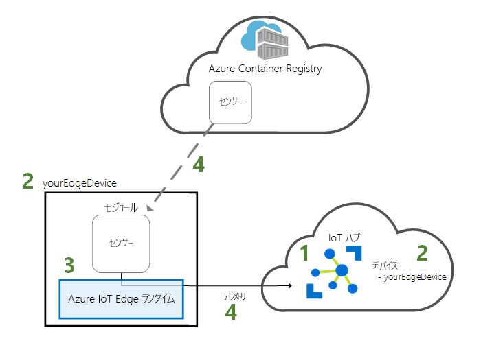
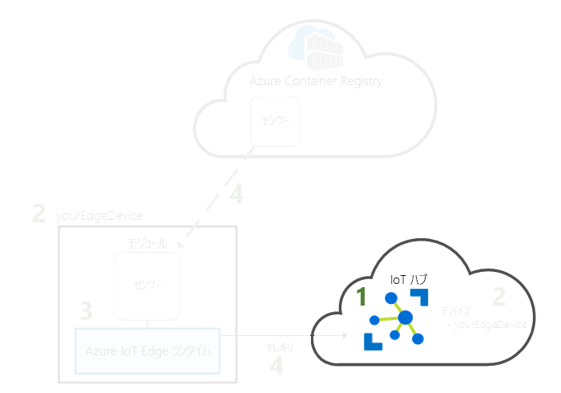
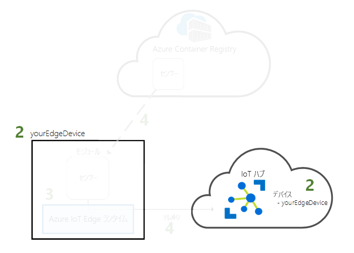
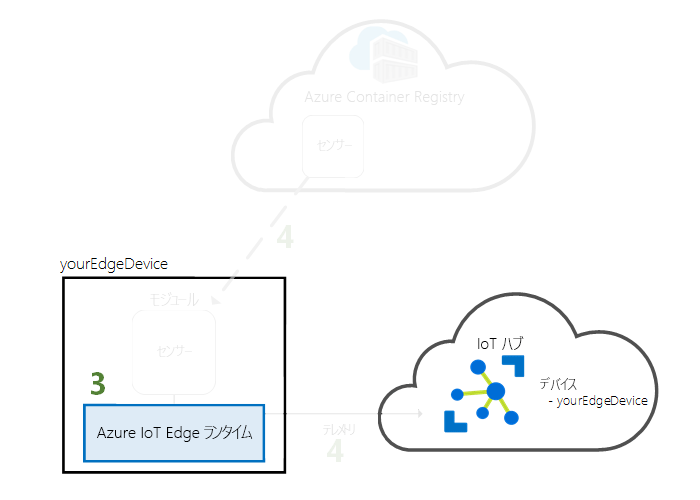
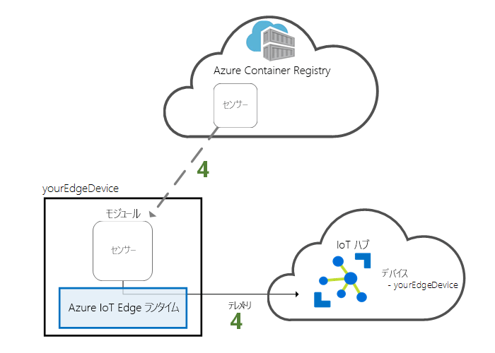

# <a name="quickstart-deploy-your-first-iot-edge-module-to-a-linux-x64-device"></a>クイック スタート:初めての IoT Edge モジュールを Linux x64 デバイスに展開する

Azure IoT Edge は、クラウドの機能をご使用のモノのインターネット (IoT) デバイスでも利用できるようにします。 このクイック スタートでは、クラウド インターフェイスを使用して、事前作成されたコードを IoT Edge デバイスにリモートで展開する方法について説明します。

このクイック スタートでは、次の方法について説明します。

1. IoT Hub を作成します。
2. IoT Edge デバイスを IoT ハブに登録します。
3. IoT Edge ランタイムをご自身のデバイスにインストールして開始する。
4. モジュールを IoT Edge デバイスにリモートで展開する。



このクイック スタートでは、Linux コンピューターまたは仮想マシンを IoT Edge デバイスに変えます。 その後、モジュールを Azure portal からご自身のデバイスに展開できます。 このクイック スタートで展開するモジュールは、温度、湿度、および圧力のデータを生成するシミュレートされたセンサーです。 その他の Azure IoT Edge チュートリアルは、ここで行う作業を基盤としており、ビジネスに関する分析情報を得るためにシミュレートされたデータを分析するモジュールを展開します。

アクティブな Azure サブスクリプションをお持ちでない場合は、開始する前に[無料アカウント](https://azure.microsoft.com/free)を作成してください。

[!INCLUDE [cloud-shell-try-it.md](../../includes/cloud-shell-try-it.md)]

このクイック スタートの多くの手順は、Azure CLI を使用して実行します。Azure IoT には、追加機能を有効にする拡張機能が用意されています。 

Azure IoT の拡張機能を Cloud Shell インスタンスに追加します。

   ```azurecli-interactive
   az extension add --name azure-cli-iot-ext
   ```

## <a name="prerequisites"></a>前提条件

クラウド リソース: 

* このクイック スタートで使用するすべてのリソースを管理するためのリソース グループです。 

   ```azurecli-interactive
   az group create --name IoTEdgeResources --location westus2
   ```

IoT Edge デバイス: 

* IoT Edge デバイスとして機能する Linux デバイスまたは仮想マシン。 Microsoft 提供の [Azure IoT Edge を Ubuntu](https://azuremarketplace.microsoft.com/en-us/marketplace/apps/microsoft_iot_edge.iot_edge_vm_ubuntu) 仮想マシン上で使用することをお勧めします。そうすることで、デバイス上で IoT Edge を実行するために必要なものがすべて事前にインストールされます。 次のコマンドを使用してこの仮想マシンを作成します。

   ```azurecli-interactive
   az vm create --resource-group IoTEdgeResources --name EdgeVM --image microsoft_iot_edge:iot_edge_vm_ubuntu:ubuntu_1604_edgeruntimeonly:latest --admin-username azureuser --generate-ssh-keys --size Standard_DS1_v2
   ```

   新しい仮想マシンを作成して起動するまでに数分かかる場合があります。 

   新しい仮想マシンを作成するときは、create コマンドの出力内容に含まれる **publicIpAddress** を書き留めておいてください。 このクイック スタートの中で、後からこのパブリック IP アドレスを使用して仮想マシンに接続します。

* Azure IoT Edge ランタイムをローカル システム上で実行したい場合は、「[Linux に Azure IoT Edge ランタイムをインストールする (x64)](how-to-install-iot-edge-linux.md)」の手順に従います。

* Raspberry Pi など ARM32 ベースのデバイスを使用したい場合は、「[Linux に Azure IoT Edge ランタイムをインストールする (ARM32v7/armhf)](how-to-install-iot-edge-linux-arm.md)」の手順に従います。

## <a name="create-an-iot-hub"></a>IoT Hub の作成

このクイック スタートでは、最初に Azure CLI を使用して IoT ハブを作成します。



このクイック スタートでは無料レベルの IoT Hub を使用できます。 IoT Hub を以前に使用したことがあり、無料のハブを作成済みである場合は、その IoT ハブを使用できます。 各サブスクリプションで使用できる無料 IoT ハブは 1 つのみです。 

次のコードにより、無料の **F1** ハブがリソース グループ **IoTEdgeResources** に作成されます。 *{hub_name}* は、IoT ハブの一意の名前に置き換えてください。

   ```azurecli-interactive
   az iot hub create --resource-group IoTEdgeResources --name {hub_name} --sku F1 
   ```

   サブスクリプションに無料のハブが既に 1 つあるためにエラーが発生する場合は、SKU を **S1** に変更します。 IoT ハブの名前が利用できないというエラーが発生した場合、自分以外のだれかが既にその名前のハブを所有していることを意味します。 新しい名前を試してください。 

## <a name="register-an-iot-edge-device"></a>IoT Edge デバイスを登録する

新しく作成された IoT ハブに IoT Edge デバイスを登録します。



お使いの IoT ハブと通信できるように、IoT Edge デバイスのデバイス ID を作成します。 デバイス ID はクラウドに置かれるので、デバイスの一意の接続文字列を使用して、物理デバイスとデバイス ID とを関連付けることになります。 

IoT Edge デバイスは、一般的な IoT デバイスとは異なる動作をし、別に管理できるため、この ID は IoT Edge デバイス用として `--edge-enabled` フラグで宣言します。 

1. Azure Cloud Shell で、次のコマンドを入力して、**myEdgeDevice** という名前のデバイスをハブに作成します。

   ```azurecli-interactive
   az iot hub device-identity create --hub-name {hub_name} --device-id myEdgeDevice --edge-enabled
   ```

   iothubowner ポリシー キーに関するエラーが表示された場合は、Cloud Shell で最新バージョンの azure-cli-iot-ext 拡張機能が実行されていることを確認してください。 

2. デバイスの接続文字列を取得します。この接続文字列により、IoT Hub 内で物理デバイスとその ID をリンクさせます。 

   ```azurecli-interactive
   az iot hub device-identity show-connection-string --device-id myEdgeDevice --hub-name {hub_name}
   ```

3. JSON 出力から接続文字列をコピーして保存します。 次のセクションで、IoT Edge ランタイムを構成するときにこの値を使用します。

   

## <a name="configure-your-iot-edge-device"></a>IoT Edge デバイスを構成する

IoT Edge デバイス上で Azure IoT Edge ランタイムを開始します。 



IoT Edge ランタイムはすべての IoT Edge デバイスに展開されます。 これは 3 つのコンポーネントで構成されます。 **IoT Edge セキュリティ デーモン**は、Edge デバイスが起動するたびに開始され、IoT Edge エージェントを起動してデバイスをブートストラップします。 **IoT Edge エージェント**は、IoT Edge ハブなど、IoT Edge デバイス上のモジュールの展開と監視を容易にします。 **IoT Edge ハブ**は、IoT Edge デバイス上のモジュール間、およびデバイスと IoT ハブの間の通信を管理します。 

ランタイムの構成中に、デバイスの接続文字列を入力します。 Azure CLI から取得した文字列を使用してください。 この文字列によって、Azure 内の IoT Edge デバイス ID と物理デバイスとが関連付けられます。 

### <a name="set-the-connection-string-on-the-iot-edge-device"></a>IoT Edge デバイスに接続文字列を設定する

前提条件で推奨されたように Azure IoT Edge を Ubuntu 仮想マシン上で使用している場合、デバイスには IoT Edge ランタイムが既にインストールされています。 必要なのは、前のセクションで取得したデバイスの接続文字列を使用してデバイスを構成することだけです。 これは、仮想マシンに接続しなくてもリモートで行えます。 次のコマンドを実行します。**{device_connection_string}** は実際の文字列に置き換えてください。 

   ```azurecli-interactive
   az vm run-command invoke -g IoTEdgeResources -n EdgeVM --command-id RunShellScript --script '/etc/iotedge/configedge.sh "{device_connection_string}"'
   ```

IoT Edge をローカル コンピューター上または ARM32 デバイス上で実行している場合、IoT Edge ランタイムとその前提条件をデバイスにインストールする必要があります。 「[Linux に Azure IoT Edge ランタイムをインストールする (x64)](how-to-install-iot-edge-linux.md)」または「[Linux に Azure IoT Edge ランタイムをインストールする (ARM32v7/armhf)](how-to-install-iot-edge-linux-arm.md)」の手順に従ってインストールしたら、このクイック スタートに戻ります。 

### <a name="view-the-iot-edge-runtime-status"></a>IoT Edge ランタイムの状態を確認する

このクイック スタートの残りのコマンドは、IoT Edge デバイス自体で実行します。これにより、デバイスの動作を実際に確認することができます。 仮想マシンを使用している場合は、creation コマンドによって出力されたパブリック IP アドレスを使って今すぐそのマシンに接続してください。 パブリック IP アドレスは、Azure portal の仮想マシンの概要ページでも確認できます。 次のコマンドを使用して、仮想マシンに接続します。 前提条件で推奨されたユーザー名とは別の名前を使用している場合は、**{azureuser}** を置き換えます。 **{publicIpAddress}** は、実際のマシンのアドレスに置き換えてください。 

   ```azurecli-interactive
   ssh azureuser@{publicIpAddress}
   ```

IoT Edge デバイスにランタイムが正常にインストールされ、構成されていることを確認します。 

>[!TIP]
>`iotedge` コマンドの実行には、昇格された特権が必要です。 IoT Edge ランタイムのインストール後に初めてマシンにサインインし直すと、アクセス許可は自動的に更新されます。 それまでは、コマンドの前に **sudo** を使用します。 

1. Edge セキュリティ デーモンがシステム サービスとして実行されていることを確認します。

   ```bash
   sudo systemctl status iotedge
   ```

   

2. サービスのトラブルシューティングが必要な場合は、サービス ログを取得します。 

   ```bash
   journalctl -u iotedge
   ```

3. ご自身のデバイスで実行されているモジュールを表示します。 

   ```bash
   sudo iotedge list
   ```

   

IoT Edge デバイスの構成はこれで完了です。 クラウドからモジュールをデプロイして実行することができます。 

## <a name="deploy-a-module"></a>モジュールを展開する

Azure IoT Edge デバイスをクラウドから管理し、IoT Hub に利用統計情報を送信するモジュールを展開します。


[!INCLUDE [iot-edge-deploy-module](../../includes/iot-edge-deploy-module.md)]

## <a name="view-generated-data"></a>生成されたデータを表示する

このクイック スタートでは、新しい IoT Edge デバイスを作成し、そこに IoT Edge ランタイムをインストールしました。 その後、Azure portal を使用して、IoT Edge モジュールをデプロイし、デバイス自体を変更せずにモジュールをデバイスで実行しました。 

この場合は、プッシュしたモジュールによって、テストに使用できるサンプル データが作成されます。 シミュレートされた温度センサー モジュールによって、後でテストに使用できる環境データが生成されます。 シミュレートされたセンサーは、マシンと、マシンの周囲の環境の両方を監視します。 たとえば、このセンサーは、サーバー ルーム、工場のフロア、または風力タービンに配置されている可能性があります。 メッセージには、周囲の温度と湿度、機械の温度と圧力、タイムスタンプが含まれます。 IoT Edge のチュートリアルでは、このモジュールによって作成されたデータを分析用のテスト データとして使用します。

再び IoT Edge デバイスでコマンド プロンプトを開くか、Azure CLI から SSH 接続を使用します。 IoT Edge デバイスで、クラウドからデプロイされたモジュールが実行されていることを確認します。

   ```bash
   sudo iotedge list
   ```

   

温度センサー モジュールから送信されているメッセージを確認します。

   ```bash
   sudo iotedge logs SimulatedTemperatureSensor -f
   ```

   >[!TIP]
   >IoT Edge のコマンドでは、モジュール名を参照する際に大文字と小文字が区別されます。

   

[Visual Studio Code 用の Azure IoT Hub Toolkit の拡張機能](https://marketplace.visualstudio.com/items?itemName=vsciot-vscode.azure-iot-toolkit) (旧称: Azure IoT Toolkit 拡張機能) を使用して、IoT ハブに到着したメッセージを監視することもできます。 

## <a name="clean-up-resources"></a>リソースのクリーンアップ

IoT Edge のチュートリアルに進む場合は、このクイック スタートで登録および設定したデバイスを使用できます。 それ以外の場合は、作成した Azure リソースを削除し、デバイスから IoT Edge ランタイムを削除することができます。

### <a name="delete-azure-resources"></a>Azure リソースを削除する

新しいリソース グループで仮想マシンと IoT ハブを作成した場合、そのグループと関連するすべてのリソースを削除できます。 リソース グループの内容を再確認して、残しておくべきものがないことを確認してください。 グループ全体を削除したくない場合は、リソースを個別に削除してもかまいません。

**IoTEdgeResources** グループを削除します。

   ```azurecli-interactive
   az group delete --name IoTEdgeResources 
   ```

### <a name="remove-the-iot-edge-runtime"></a>IoT Edge ランタイムを削除する

デバイスからインストールを削除するには、次のコマンドを使用します。  

IoT Edge ランタイムを削除します。

   ```bash
   sudo apt-get remove --purge iotedge
   ```

コンテナー ランタイムを削除します。

   ```bash
   sudo apt-get remove --purge moby-cli
   sudo apt-get remove --purge moby-engine
   ```

## <a name="next-steps"></a>次の手順

このクイック スタートは、すべての IoT Edge チュートリアルの前提条件です。 引き続き他のチュートリアルを実行し、Azure IoT Edge が、エッジでこのデータをビジネス上の洞察に変えるうえで、どのように役立つかを確認できます。

> [!div class="nextstepaction"]
> [Azure Function を使用してセンサー データをフィルター処理する](tutorial-deploy-function.md)
