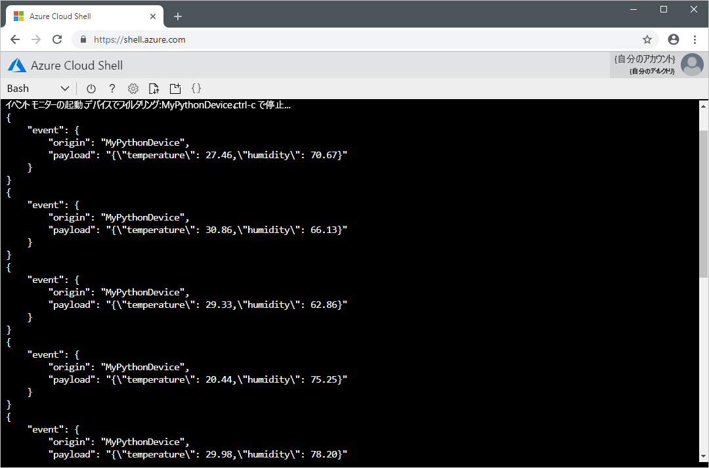

# <a name="quickstart-send-telemetry-from-a-device-to-an-iot-hub-and-read-the-telemetry-from-the-hub-with-a-back-end-application-python"></a>クイック スタート: デバイスから IoT ハブに利用統計情報を送信し、バックエンド アプリケーション (Python) でハブから利用統計情報を読み取る

[!INCLUDE [iot-hub-quickstarts-1-selector](../../includes/iot-hub-quickstarts-1-selector.md)]

IoT Hub は、保管や処理のために IoT デバイスから大量の利用統計情報をクラウドに取り込むことを可能にする Azure サービスです。 このクイック スタートでは、シミュレートされたデバイス アプリケーションから、IoT ハブを経由して、処理のためのバックエンド アプリケーションに、利用統計情報を送信します。

このクイック スタートでは、あらかじめ作成されている Python アプリケーションを使って利用統計情報を送信し、CLI ユーティリティを使ってハブから利用統計情報を読み取ります。 これら 2 つのアプリケーションを実行する前に、IoT ハブを作成し、デバイスをハブに登録します。

[!INCLUDE [cloud-shell-try-it.md](../../includes/cloud-shell-try-it.md)]

Azure サブスクリプションがない場合は、開始する前に[無料アカウント](https://azure.microsoft.com/free/?WT.mc_id=A261C142F)を作成してください。

## <a name="prerequisites"></a>前提条件

このクイック スタートで実行する 2 つのサンプル アプリケーションは、Python を使って書かれています。 Python 2.7.x または 3.5.x が開発コンピューター上に必要です。

複数のプラットフォームに対応する Python を [Python.org](https://www.python.org/downloads/) からダウンロードできます。

開発コンピューターに現在インストールされている Python のバージョンは、次のいずれかのコマンドを使って確認できます。

```python
python --version
```

```python
python3 --version
```

https://github.com/Azure-Samples/azure-iot-samples-python/archive/master.zip からサンプル Python プロジェクトをダウンロードし、ZIP アーカイブを抽出します。

IoT ハブから利用統計情報を読み取る CLI ユーティリティをインストールするには、最初に、Node.js v4.x.x 以降を開発用コンピューターにインストールします。 複数のプラットフォームに対応する Node.js を [nodejs.org](https://nodejs.org) からダウンロードできます。

開発コンピューターに現在インストールされている Node.js のバージョンは、次のコマンドを使って確認できます。

```cmd/sh
node --version
```

`iothub-explorer` CLI ユーティリティをインストールするには、次のコマンドを実行します。

```cmd/sh
npm install -g iothub-explorer
```

## <a name="create-an-iot-hub"></a>IoT Hub の作成

[!INCLUDE [iot-hub-quickstarts-create-hub](../../includes/iot-hub-quickstarts-create-hub.md)]

## <a name="register-a-device"></a>デバイスの登録

デバイスを IoT ハブに接続するには、あらかじめ IoT ハブに登録しておく必要があります。 このクイック スタートでは、Azure CLI を使用して、シミュレートされたデバイスを登録します。

1. IoT Hub CLI 拡張機能を追加し、デバイス ID を作成します。 `{YourIoTHubName}` は、IoT ハブ用に選んだ名前に置き換えます。

    ```azurecli-interactive
    az extension add --name azure-cli-iot-ext
    az iot hub device-identity create --hub-name {YourIoTHubName}--device-id MyPythonDevice
    ```

1. 次のコマンドを実行して、登録したデバイスの "_デバイス接続文字列_" を取得します。

    ```azurecli-interactive
    az iot hub device-identity show-connection-string --hub-name {YourIoTHubName} --device-id MyPythonDevice --output table
    ```

    `Hostname=...=` のようなデバイス接続文字列をメモしておきます。 この値は、このクイック スタートの後の方で使います。

1. また、`iothub-explorer` CLI ユーティリティが IoT ハブに接続してメッセージを取得できるようにするには、"_サービス接続文字列_" が必要です。 次のコマンドを実行すると、IoT ハブのサービス接続文字列が取得されます。

    ```azurecli-interactive
    az iot hub show-connection-string --hub-name {YourIoTHubName} --output table
    ```

    `Hostname=...=` のようなサービス接続文字列をメモしておきます。 この値は、このクイック スタートの後の方で使います。 サービス接続文字列はデバイス接続文字列とは異なります。

## <a name="send-simulated-telemetry"></a>シミュレートされた利用統計情報の送信

シミュレートされたデバイス アプリケーションは、IoT ハブ上のデバイスに固有のエンドポイントに接続し、シミュレートされた温度と湿度の利用統計情報を送信します。

1. ターミナル ウィンドウで、サンプルの Python プロジェクトのルート フォルダーに移動します。 **Quickstarts\simulated-device** フォルダーに移動します。

1. 適当なテキスト エディターで **SimulatedDevice.py** ファイルを開きます。

    `CONNECTION_STRING` 変数の値を、前にメモしたデバイス接続文字列に置き換えます。 その後、変更を **SimulatedDevice.py** ファイルに保存します。

1. ターミナル ウィンドウで次のコマンドを実行して、シミュレートされたデバイス アプリケーションに必要なライブラリをインストールします。

    ```cmd/sh
    pip install azure-iothub-device-client
    ```

1. ターミナル ウィンドウで次のコマンドを実行して、シミュレートされたデバイス アプリケーションを実行します。

    ```cmd/sh
    python SimulatedDevice.py
    ```

    次のスクリーンショットは、シミュレートされたデバイス アプリケーションが IoT ハブに利用統計情報を送信したときの出力を示しています。

    

## <a name="read-the-telemetry-from-your-hub"></a>ハブから利用統計情報を読み取る

`iothub-explorer` CLI ユーティリティは、IoT Hub のサービス側 **Events** エンドポイントに接続します。 このユーティリティは、シミュレートされたデバイスから送信されたデバイスとクラウドの間のメッセージを受信します。 通常、IoT Hub のバックエンド アプリケーションはクラウド内で実行され、デバイスとクラウドの間のメッセージ受信して処理します。

別のターミナル ウィンドウで、次のコマンドを実行します。`{your hub service connection string}` は、前にメモしたデバイス接続文字列に置き換えます。

```cmd/sh
iothub-explorer monitor-events MyPythonDevice --login {your hub service connection string}
```

次のスクリーンショットは、シミュレートされたデバイスがハブに送信した利用統計情報をユーティリティが受信したときの出力を示しています。



## <a name="clean-up-resources"></a>リソースのクリーンアップ

次のクイック スタートを行う場合は、リソース グループと IoT ハブをそのままにしておき、後で再利用します。

IoT ハブが必要でなくなった場合は、ポータルを使用して IoT ハブとリソース グループを削除します。 これを行うには、IoT ハブを含む **qs-iot-hub-rg** リソース グループを選び、**[削除]** をクリックします。

## <a name="next-steps"></a>次の手順

このクイック スタートでは、IoT ハブをセットアップし、デバイスを登録し、Python アプリケーションを使ってハブにシミュレートされた利用統計情報を送信し、簡単なバックエンド アプリケーションを使ってハブから利用統計情報を読み取りました。

バックエンド アプリケーションからシミュレートされたデバイスを制御する方法を学習するには、次のクイック スタートに進んでください。

> [!div class="nextstepaction"]
> [クイック スタート: IoT ハブに接続されたデバイスを制御する](quickstart-control-device-python.md)