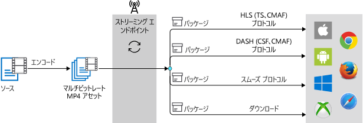
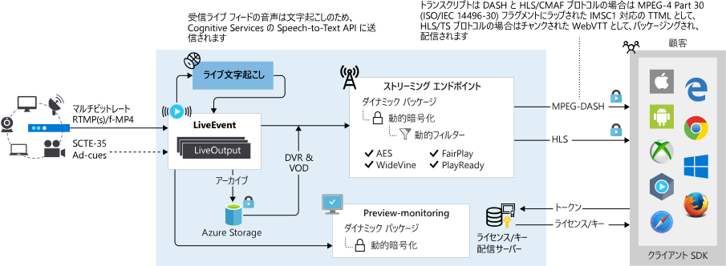

# <a name="dynamic-packaging"></a>ダイナミック パッケージ

Microsoft Azure Media Services を使用して、多数のメディア ソース ファイルの形式、メディア ストリーミング形式、およびコンテンツ保護形式をさまざまなクライアント テクノロジ (iOS、XBOX など) に配信できます。 これらのクライアントは異なるプロトコルを認識します。たとえば、iOS では HTTP ライブ ストリーミング (HLS) 形式が必要で、Xbox ではスムーズ ストリーミングが必要です。 HLS、MPEG DASH、または Smooth Streaming を認識するクライアントに提供する、一連のアダプティブ ビットレート (マルチビット レート) MP4 (ISO Base Media 14496-12) ファイルまたは一連のアダプティブ ビットレート Smooth Streaming ファイルがある場合、**ダイナミック パッケージ**を活用できます。 このパッケージには、ビデオの解像度の指定がなく、SD、HD、UHD-4K をサポートしています。

Media Services では、[ストリーミング エンドポイント](streaming-endpoint-concept.md)は、ダイナミック (Just-In-Time) パッケージおよび配信元サービスを表します。これは、いずれかの一般的なストリーミング メディア プロトコル (HLS または DASH) を使用して、ライブのオンデマンド コンテンツをクライアント プレーヤー アプリケーションに直接配信できます。 ダイナミック パッケージは、すべての**ストリーミング エンドポイント** (Standard または Premium) に標準で付属する機能です。 

**ダイナミック パッケージ**を利用するには、Media Services ダイナミック パッケージで必要とされるアダプティブ ビットレート MP4 ファイルのセットを持つ**アセット**と、ストリーミング構成ファイルが必要です。 これらのファイルを取得する方法の 1 つは、Media Services を使用してお使いの中間 (ソース) ファイルをエンコードすることです。 エンコードされたアセット内のビデオをクライアントが再生できるようにするには、**ストリーミング ロケーター**を作成し、ストリーミング URL をビルドする必要があります。 その後、ストリーミング クライアント マニフェスト (HLS、DASH、または Smooth) で指定した形式に基づいて、選択したプロトコルでストリームを受信します。

その結果、保存と課金の対象となるのは、単一のストレージ形式のファイルのみです。Media Services がクライアントからの要求に応じて、適切な応答を構築して返します。 

Media Services でダイナミック パッケージは、ライブまたはオンデマンドでストリーミング配信するかどうかにかかわらず、使用されます。 

## <a name="common-on-demand-workflow"></a>一般的なオンデマンド ワークフロー

次に、ダイナミック パッケージを使用した一般的な Media Services でのストリーミング ワークフローを示します。

1. 入力ファイル (中間ファイル) をアセットにアップロードします。 たとえば、MP4、MOV、または MXF などです (サポートされている形式の一覧については、「[Media Encoder Standard の形式とコーデック](media-encoder-standard-formats.md)」を参照してください)。
2. Mezzanine ファイルを H.264 MP4 アダプティブ ビットレート セットにエンコードします。
3. アダプティブ ビットレート MP4 セットが含まれる資産を発行します。 **ストリーミング ロケーター**を作成して発行します。
4. さまざまな形式 (HLS、Dash および Smooth Streaming) をターゲットとする URL を構築します。 これらのさまざまな形式の正しいマニフェストおよび要求の処理は、**ストリーミング エンドポイント**が行います。

次の図は、ダイナミック パッケージのワークフローを使用したオンデマンド ストリーミングを示しています。



### <a name="encode-to-adaptive-bitrate-mp4s"></a>アダプティブ ビットレート MP4 へのエンコード

[Media Services を使用してビデオをエンコードする方法](encoding-concept.md)の詳細については、次の例を参照してください。

* [組み込みのプリセットを使用して HTTPS の URL をエンコードする](job-input-from-http-how-to.md)
* [組み込みのプリセットを使用してローカル ファイルをエンコードする](job-input-from-local-file-how-to.md)
* [自分の特定のシナリオまたはデバイス要件に対応するカスタム プリセットを構築する](customize-encoder-presets-how-to.md)

Media Encoder Standard の形式とコーデックの一覧については、[形式とコーデック](media-encoder-standard-formats.md)に関するページを参照してください。

## <a name="common-live-streaming-workflow"></a>一般的なライブ ストリーミング ワークフロー

ライブ ストリーミング ワークフローの手順は次のとおりです。

1. [ライブ イベント](live-events-outputs-concept.md)を作成します。
1. 取り込み URL を取得し、その URL を使用して投稿フィードを送信するようにオンプレミス エンコーダーを構成します。
1. プレビュー URL を取得し、それを使用して、エンコーダーからの入力が実際に受信されていることを確認します。
1. 新しい**資産**を作成します。
1. **ライブ出力**を作成し、作成した資産の名前を使用します。<br/>**ライブ出力**により、ストリームが**資産**にアーカイブされます。
1. 組み込みの**ストリーミング ポリシー** タイプで**ストリーミング ロケーター**を作成します。<br/>コンテンツを暗号化する場合は、「[コンテンツ保護の概要](content-protection-overview.md)」を確認してください。
1. 使用する URL を返すためのパスを**ストリーミング ロケーター**に列挙します。
1. ストリーミングする**ストリーミング エンドポイント**のホスト名を取得します。
1. さまざまな形式 (HLS、Dash および Smooth Streaming) をターゲットとする URL を構築します。 これらのさまざまな形式の正しいマニフェストおよび要求の処理は、**ストリーミング エンドポイント**が行います。

ライブ イベントには、パススルーとライブ エンコードの 2 種類があります。 Media Services v3 のライブ ストリームに関する詳細については、[ライブ ストリーミングの概要](live-streaming-overview.md)に関するページを参照してください。

次の図は、ダイナミック パッケージのワークフローを使用したライブ ストリーミングを示しています。



## <a name="delivery-protocols"></a>配信プロトコル

|Protocol|例|
|---|---|
|HLS V4 |`https://amsv3account-usw22.streaming.media.azure.net/21b17732-0112-4d76-b526-763dcd843449/ignite.ism/manifest(format=m3u8-aapl)`|
|HLS V3 |`https://amsv3account-usw22.streaming.media.azure.net/21b17732-0112-4d76-b526-763dcd843449/ignite.ism/manifest(format=m3u8-aapl-v3)`|
|HLS CMAF| `https://amsv3account-usw22.streaming.media.azure.net/21b17732-0112-4d76-b526-763dcd843449/ignite.ism/manifest(format=m3u8-cmaf)`|
|MPEG DASH CSF| `https://amsv3account-usw22.streaming.media.azure.net/21b17732-0112-4d76-b526-763dcd843449/ignite.ism/manifest(format=mpd-time-csf)` |
|MPEG DASH CMAF|`https://amsv3account-usw22.streaming.media.azure.net/21b17732-0112-4d76-b526-763dcd843449/ignite.ism/manifest(format=mpd-time-cmaf)` |
|スムーズ ストリーミング| `https://amsv3account-usw22.streaming.media.azure.net/21b17732-0112-4d76-b526-763dcd843449/ignite.ism/manifest`|

## <a name="video-codecs-supported-by-dynamic-packaging"></a>ダイナミック パッケージでサポートされているビデオ コーデック

ダイナミック パッケージでは、[H.264](https://en.m.wikipedia.org/wiki/H.264/MPEG-4_AVC) (MPEG-4 AVC または AVC1)、[H.265](https://en.m.wikipedia.org/wiki/High_Efficiency_Video_Coding) (HEVC、hev1 または hvc1) でエンコードされたビデオの MP4 ファイルがサポートされています。

## <a name="audio-codecs-supported-by-dynamic-packaging"></a>ダイナミック パッケージによってサポートされているオーディオ コーデック

ダイナミック パッケージでは、[AAC](https://en.wikipedia.org/wiki/Advanced_Audio_Coding) (AAC-LC、HE-AAC v1、HE-AAC v2)、[Dolby Digital Plus](https://en.wikipedia.org/wiki/Dolby_Digital_Plus) (Enhanced AC-3、E-AC3)、Dolby Atmos、または [DTS](https://en.wikipedia.org/wiki/DTS_%28sound_system%29) (DTS Express、DTS LBR、DTS HD、DTS HD Lossless) でエンコードされたオーディオを含む MP4 ファイルがサポートされています。 Dolby Atmos コンテンツのストリーミングは、CSF (Common Streaming Format) または CMAF (Common Media Application Format) フラグメント化 MP4 による MPEG-DASH プロトコルなどの標準でサポートされ、CMAF による HLS (HTTP ライブ ストリーミング) 経由でサポートされています。

> [!NOTE]
> ダイナミック パッケージでは、[Dolby Digital](https://en.wikipedia.org/wiki/Dolby_Digital) (AC3) オーディオ (古いコーデック) を含むファイルはサポートされていません。

## <a name="dynamic-encryption"></a>動的暗号化

**動的暗号化**では、AES-128 または 3 つの主要なデジタル著作権管理 (DRM) システムのいずれかを用いて、ライブまたはオンデマンドのコンテンツを動的に暗号化できます。コンテンツを配信できます。 Media Services では、承認されたクライアントに AES キーと DRM (PlayReady、Widevine、FairPlay) ライセンスを配信するためのサービスも提供しています。 詳細については、[動的暗号化](content-protection-overview.md)に関するページを参照してください。

## <a name="manifests"></a>マニフェスト 
 
Media Services では、HLS、MPEG DASH、Smooth Streaming のプロトコルがサポートされています。 ストリーミング クライアント マニフェスト (HLS のマスター再生リスト、DASH の Media Presentation Description (MPD)、および Smooth Streaming) は、URL 内の形式セレクターに基づいて、**ダイナミック パッケージ**の一部として動的に生成されます。 [このセクション](#delivery-protocols)の配信プロトコルを確認してください。 

マニフェスト ファイルには、トラックの種類 (オーディオ、ビデオ、テキスト)、トラック名、開始時刻と終了時刻、ビットレート (品質)、トラック言語、プレゼンテーション ウィンドウ (固定時間のスライディング ウィンドウ)、ビデオ コーデック (FourCC) などの、ストリーミング メタデータが含まれます。 また、次に再生可能なビデオ フラグメントとその場所の情報を通知して、次のフラグメントを取得するようにプレイヤーに指示します。 フラグメント (またはセグメント) とは、ビデオ コンテンツの実際の "チャンク" です。

### <a name="hls-master-playlist"></a>HLS マスター プレイリスト

以下に、HLS マニフェスト ファイルの例を示します。 

```
#EXTM3U
#EXT-X-VERSION:4
#EXT-X-MEDIA:TYPE=AUDIO,GROUP-ID="audio",NAME="aac_eng_2_128041_2_1",LANGUAGE="eng",DEFAULT=YES,AUTOSELECT=YES,URI="QualityLevels(128041)/Manifest(aac_eng_2_128041_2_1,format=m3u8-aapl)"
#EXT-X-STREAM-INF:BANDWIDTH=536608,RESOLUTION=320x180,CODECS="avc1.64000d,mp4a.40.2",AUDIO="audio"
QualityLevels(381048)/Manifest(video,format=m3u8-aapl)
#EXT-X-I-FRAME-STREAM-INF:BANDWIDTH=536608,RESOLUTION=320x180,CODECS="avc1.64000d",URI="QualityLevels(381048)/Manifest(video,format=m3u8-aapl,type=keyframes)"
#EXT-X-STREAM-INF:BANDWIDTH=884544,RESOLUTION=480x270,CODECS="avc1.640015,mp4a.40.2",AUDIO="audio"
QualityLevels(721495)/Manifest(video,format=m3u8-aapl)
#EXT-X-I-FRAME-STREAM-INF:BANDWIDTH=884544,RESOLUTION=480x270,CODECS="avc1.640015",URI="QualityLevels(721495)/Manifest(video,format=m3u8-aapl,type=keyframes)"
#EXT-X-STREAM-INF:BANDWIDTH=1327398,RESOLUTION=640x360,CODECS="avc1.64001e,mp4a.40.2",AUDIO="audio"
QualityLevels(1154816)/Manifest(video,format=m3u8-aapl)
#EXT-X-I-FRAME-STREAM-INF:BANDWIDTH=1327398,RESOLUTION=640x360,CODECS="avc1.64001e",URI="QualityLevels(1154816)/Manifest(video,format=m3u8-aapl,type=keyframes)"
#EXT-X-STREAM-INF:BANDWIDTH=2413312,RESOLUTION=960x540,CODECS="avc1.64001f,mp4a.40.2",AUDIO="audio"
QualityLevels(2217354)/Manifest(video,format=m3u8-aapl)
#EXT-X-I-FRAME-STREAM-INF:BANDWIDTH=2413312,RESOLUTION=960x540,CODECS="avc1.64001f",URI="QualityLevels(2217354)/Manifest(video,format=m3u8-aapl,type=keyframes)"
#EXT-X-STREAM-INF:BANDWIDTH=3805760,RESOLUTION=1280x720,CODECS="avc1.640020,mp4a.40.2",AUDIO="audio"
QualityLevels(3579827)/Manifest(video,format=m3u8-aapl)
#EXT-X-I-FRAME-STREAM-INF:BANDWIDTH=3805760,RESOLUTION=1280x720,CODECS="avc1.640020",URI="QualityLevels(3579827)/Manifest(video,format=m3u8-aapl,type=keyframes)"
#EXT-X-STREAM-INF:BANDWIDTH=139017,CODECS="mp4a.40.2",AUDIO="audio"
QualityLevels(128041)/Manifest(aac_eng_2_128041_2_1,format=m3u8-aapl)
```

### <a name="dash-media-presentation-description-mpd"></a>DASH Media Presentation Description (MPD)

DASH のマニフェストの例は、次のとおりです。

```xml
<?xml version="1.0" encoding="UTF-8"?>
<MPD xmlns="urn:mpeg:dash:schema:mpd:2011" xmlns:xsi="https://www.w3.org/2001/XMLSchema-instance" profiles="urn:mpeg:dash:profile:isoff-live:2011" type="static" mediaPresentationDuration="PT1M10.315S" minBufferTime="PT7S">
   <Period>
      <AdaptationSet id="1" group="5" profiles="ccff" bitstreamSwitching="false" segmentAlignment="true" contentType="audio" mimeType="audio/mp4" codecs="mp4a.40.2" lang="en">
         <SegmentTemplate timescale="10000000" media="QualityLevels($Bandwidth$)/Fragments(aac_eng_2_128041_2_1=$Time$,format=mpd-time-csf)" initialization="QualityLevels($Bandwidth$)/Fragments(aac_eng_2_128041_2_1=i,format=mpd-time-csf)">
            <SegmentTimeline>
               <S d="60160000" r="10" />
               <S d="41386666" />
            </SegmentTimeline>
         </SegmentTemplate>
         <Representation id="5_A_aac_eng_2_128041_2_1_1" bandwidth="128041" audioSamplingRate="48000" />
      </AdaptationSet>
      <AdaptationSet id="2" group="1" profiles="ccff" bitstreamSwitching="false" segmentAlignment="true" contentType="video" mimeType="video/mp4" codecs="avc1.640020" maxWidth="1280" maxHeight="720" startWithSAP="1">
         <SegmentTemplate timescale="10000000" media="QualityLevels($Bandwidth$)/Fragments(video=$Time$,format=mpd-time-csf)" initialization="QualityLevels($Bandwidth$)/Fragments(video=i,format=mpd-time-csf)">
            <SegmentTimeline>
               <S d="60060000" r="10" />
               <S d="42375666" />
            </SegmentTimeline>
         </SegmentTemplate>
         <Representation id="1_V_video_1" bandwidth="3579827" width="1280" height="720" />
         <Representation id="1_V_video_2" bandwidth="2217354" codecs="avc1.64001F" width="960" height="540" />
         <Representation id="1_V_video_3" bandwidth="1154816" codecs="avc1.64001E" width="640" height="360" />
         <Representation id="1_V_video_4" bandwidth="721495" codecs="avc1.640015" width="480" height="270" />
         <Representation id="1_V_video_5" bandwidth="381048" codecs="avc1.64000D" width="320" height="180" />
      </AdaptationSet>
   </Period>
</MPD>
```
### <a name="smooth-streaming"></a>スムーズ ストリーミング

Smooth Streaming のマニフェストの例は、次のとおりです。

```xml
<?xml version="1.0" encoding="UTF-8"?>
<SmoothStreamingMedia MajorVersion="2" MinorVersion="2" Duration="703146666" TimeScale="10000000">
   <StreamIndex Chunks="12" Type="audio" Url="QualityLevels({bitrate})/Fragments(aac_eng_2_128041_2_1={start time})" QualityLevels="1" Language="eng" Name="aac_eng_2_128041_2_1">
      <QualityLevel AudioTag="255" Index="0" BitsPerSample="16" Bitrate="128041" FourCC="AACL" CodecPrivateData="1190" Channels="2" PacketSize="4" SamplingRate="48000" />
      <c t="0" d="60160000" r="11" />
      <c d="41386666" />
   </StreamIndex>
   <StreamIndex Chunks="12" Type="video" Url="QualityLevels({bitrate})/Fragments(video={start time})" QualityLevels="5">
      <QualityLevel Index="0" Bitrate="3579827" FourCC="H264" MaxWidth="1280" MaxHeight="720" CodecPrivateData="0000000167640020ACD9405005BB011000003E90000EA600F18319600000000168EBECB22C" />
      <QualityLevel Index="1" Bitrate="2217354" FourCC="H264" MaxWidth="960" MaxHeight="540" CodecPrivateData="000000016764001FACD940F0117EF01100000303E90000EA600F1831960000000168EBECB22C" />
      <QualityLevel Index="2" Bitrate="1154816" FourCC="H264" MaxWidth="640" MaxHeight="360" CodecPrivateData="000000016764001EACD940A02FF9701100000303E90000EA600F162D960000000168EBECB22C" />
      <QualityLevel Index="3" Bitrate="721495" FourCC="H264" MaxWidth="480" MaxHeight="270" CodecPrivateData="0000000167640015ACD941E08FEB011000003E90000EA600F162D9600000000168EBECB22C" />
      <QualityLevel Index="4" Bitrate="381048" FourCC="H264" MaxWidth="320" MaxHeight="180" CodecPrivateData="000000016764000DACD941419F9F011000003E90000EA600F14299600000000168EBECB22C" />
      <c t="0" d="60060000" r="11" />
      <c d="42375666" />
   </StreamIndex>
</SmoothStreamingMedia>
```

## <a name="dynamic-manifest"></a>動的マニフェスト

動的フィルターを使用することで、プレーヤーに送信されるトラック数、形式、ビットレート、プレゼンテーションの時間枠を制御できます。 詳細については、[フィルターと動的マニフェスト](filters-dynamic-manifest-overview.md)に関するページを参照してください。

> [!NOTE]
> 現時点では、Azure portal を使用して v3 リソースを管理することはできません。 [REST API](https://aka.ms/ams-v3-rest-ref)、[CLI](https://aka.ms/ams-v3-cli-ref)、またはサポートされている [SDK](developers-guide.md) のいずれかを使用してください。

## <a name="ask-questions-give-feedback-get-updates"></a>質問、フィードバックの送信、最新情報の入手

「[Azure Media Services community (Azure Media Services コミュニティ)](media-services-community.md)」を参照して、さまざまな質問の方法、フィードバックする方法、Media Services に関する最新情報の入手方法を確認してください。

## <a name="next-steps"></a>次の手順

[ビデオのアップロード、エンコード、およびストリーミング](stream-files-tutorial-with-api.md)

