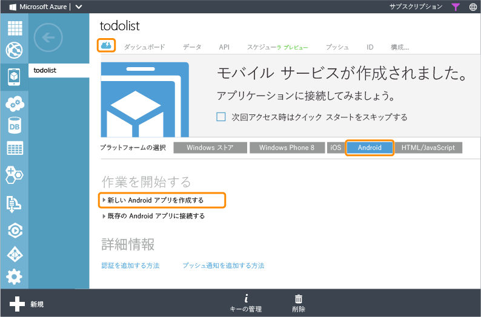

<properties 
	pageTitle="Android アプリ用 Azure Mobile Services の使用" 
	description="次のチュートリアルに従って、Android 開発用の Azure Mobile Services を使用します。" 
	services="mobile-services" 
	documentationCenter="android" 
	authors="RickSaling" 
	manager="dwrede" 
	editor=""/>

<tags 
	ms.service="mobile-services" 
	ms.workload="mobile" 
	ms.tgt_pltfrm="mobile-android" 
	ms.devlang="java" 
	ms.topic="hero-article" 
	ms.date="04/09/2015" 
	ms.author="ricksal"/>

# Mobile Services の使用

[AZURE.INCLUDE [mobile-services-selector-get-started](../includes/mobile-services-selector-get-started.md)]

このチュートリアルでは、Azure Mobile Services を使用して Android アプリにクラウドベースのバックエンド サービスを追加する方法を示します。このチュートリアルでは、新しい Mobile Services と、新しい Mobile Services にアプリケーション データを保存する簡単な <em>To do list</em> アプリケーションの両方を作成します。

完成したアプリケーションのスクリーンショットは次のようになります。

<a href="http://channel9.msdn.com/Series/Windows-Azure-Mobile-Services/Android-Support-in-Windows-Azure-Mobile-Services" target="_blank" class="label">チュートリアルを見る</a> <a style="background-image: url('/media/devcenter/mobile/videos/mobile-get-started-android-180x120.png') !important;" href="http://channel9.msdn.com/Series/Windows-Azure-Mobile-Services/Android-Support-in-Windows-Azure-Mobile-Services" target="_blank" class="dev-onpage-video">ビデオを再生する</a>7:26

## 前提条件

このチュートリアルを完了するには、Android Studio 統合開発環境と最新の Android プラットフォームを含む [Android Developer Tools][Android Studio] が必要です。このほか、Android のバージョン 4.2 以降が必要になります。 

ダウンロードしたクイック スタート プロジェクトには、Android 向けの Azure のMobile Services SDK が含まれています。

> [AZURE.IMPORTANT] このチュートリアルを完了するには、Azure アカウントが必要です。アカウントがない場合は、無料の試用アカウントを数分で作成できます。詳細については、[Azure の無料評価版サイト](http://azure.microsoft.com/pricing/free-trial/?WT.mc_id=AE564AB28)をご覧ください。

## 新しい Mobile Services を作成する

[AZURE.INCLUDE [mobile-services-create-new-service](../includes/mobile-services-create-new-service.md)]

## 新しい Android アプリを作成する

Mobile Services を作成したら、管理ポータルの簡単なクイック スタートに従って、新しいアプリケーションを作成するか、既存のアプリケーションを変更して Mobile Services に接続できます。 

ここでは、Mobile Services に接続された新しい Android アプリを作成します。

1.  管理ポータルで、**[Mobile Services]** をクリックし、先ほど作成した Mobile Services をクリックします。

2. [クイック スタート] タブの **[プラットフォームの選択]** で **[Android]** を選択し、**[新しい Android アプリを作成する]** を展開します。

   	

   	これにより、Mobile Services に接続された Android アプリを作成するための簡単な 3 つの手順が表示されます。

  	

3. まだインストールしていない場合は、[Android Developer Tools][Android SDK]をダウンロードしてローカル コンピューターまたは仮想マシンにインストールします。

4. **[TodoItems テーブルを作成する]** をクリックして、アプリケーション データを格納するテーブルを作成します。

5. アプリケーションをダウンロードします。
	- アプリケーションの最新バージョンでは、Mobile Services Android SDK 2.0 を使用します。このバージョンは、<a href="https://github.com/RickSaling/mobile-services-samples/tree/futures">ここ</a>からダウンロードできます。**[Download Zip]** をクリックしてファイルをダウンロードしたら解凍します。プロジェクトは、GettingStarted の Android フォルダーに含まれています。
	 
	- 以前のバージョンでは、以前のバージョンの SDK を使用しています。これを使用するには、**[アプリケーションをダウンロードして実行する]** の下の **ダウンロード]** をクリックします。これにより、Mobile Services に接続されている _To do list_ サンプル アプリケーションのプロジェクトがダウンロードされます。プロジェクト ファイルは圧縮されています。コンピューター上のファイルをダウンロードした場所を参照し、ファイルを展開してください。

## Android アプリを実行する

[AZURE.INCLUDE [mobile-services-run-your-app](../includes/mobile-services-android-get-started.md)]

### コードを見る (任意)

完成したアプリケーションのソース コードは、[ここ](https://github.com/RickSaling/mobile-services-samples/tree/androidStudio/GettingStarted/AndroidStudio)で確認できます。

このチュートリアルの Eclipse バージョンについては、「[Eclipse の使用に関するページ](mobile-services-android-get-started-EC.md)」をご覧ください。

## 次のステップ
クイック スタートはこれで完了です。Mobile Services で重要になるこれ以外の作業については、以下のトピックをご覧ください。 

* [データの使用]
   Mobile Services を使用してデータの格納とクエリを実行する方法について説明します。

* [認証の使用]
   ID プロバイダーを使用してアプリケーションのユーザーを認証する方法について説明します。

* [プッシュ通知の使用]
   アプリケーションにごく基本的なプッシュ通知を送信する方法について説明します。

<!-- Anchors. -->
[Mobile Services の使用]:#getting-started
[新しい Mobile Services を作成する]:#create-new-service
[Mobile Services  インスタンスの定義]:#define-mobile-service-instance
[次のステップ]:#next-steps

<!-- Images. -->
[0]: ./media/mobile-services-android-get-started/mobile-quickstart-completed-android.png
[6]: ./media/mobile-services-android-get-started/mobile-portal-quickstart-android.png
[7]: ./media/mobile-services-android-get-started/mobile-quickstart-steps-android-AS.png
[8]: ./media/mobile-services-android-get-started/mobile-eclipse-quickstart.png
[10]: ./media/mobile-services-android-get-started/mobile-quickstart-startup-android.png
[11]: ./media/mobile-services-android-get-started/mobile-data-tab.png
[12]: ./media/mobile-services-android-get-started/mobile-data-browse.png
[14]: ./media/mobile-services-android-get-started/mobile-services-import-android-workspace.png
[15]: ./media/mobile-services-android-get-started/mobile-services-import-android-project.png

<!-- URLs. -->
[Eclipse の使用に関するページ]: mobile-services-android-get-started-EC.md
[データの使用]: mobile-services-android-get-started-data.md
[認証の使用]: mobile-services-android-get-started-users.md
[Get started with push notifications]: mobile-services-javascript-backend-android-get-started-push.md
[Android SDK]: https://go.microsoft.com/fwLink/p/?LinkID=280125
[Android Studio]: https://developer.android.com/sdk/index.html
[Mobile Services  Android SDK]: https://go.microsoft.com/fwLink/p/?LinkID=266533

[管理ポータル]: https://manage.windowsazure.com/

[プッシュ通知の使用]: mobile-services-javascript-backend-android-get-started-push.md

<!--HONumber=52-->