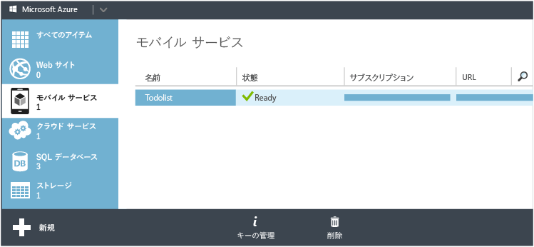
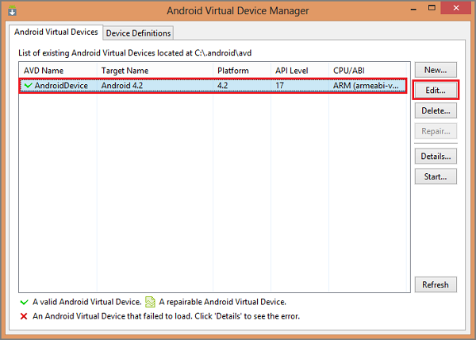

<properties 
	pageTitle="プッシュの使用 (Android) | モバイル デベロッパー センター" 
	description="Azure Mobile Services を使用して Android .Net アプリにプッシュ通知を送信する方法について説明します。" 
	services="mobile-services, notification-hubs" 
	documentationCenter="android" 
	authors="RickSaling" 
	manager="dwrede" 
	editor=""/>

<tags 
	ms.service="mobile-services" 
	ms.workload="mobile" 
	ms.tgt_pltfrm="mobile-android" 
	ms.devlang="java" 
	ms.topic="article" 
	ms.date="02/03/2015" 
	ms.author="ricksal"/>

# モバイル サービス アプリへのプッシュ通知の追加

[AZURE.INCLUDE [mobile-services-selector-get-started-push](../includes/mobile-services-selector-get-started-push.md)]

このトピックでは、Azure Mobile Services を使用して Android アプリにプッシュ通知を送信する方法について説明します。このチュートリアルでは、Google Cloud Messaging (GCM) を使用したプッシュ通知をクイック スタート プロジェクトに追加します。完了すると、モバイル サービスは、レコードが挿入されるたびにプッシュ通知を送信します。 

このチュートリアルは、モバイル サービスのクイック スタートに基づいています。このチュートリアルを開始する前に、「[Mobile Services の使用]」または「[モバイル サービスでのデータの使用]」を完了してプロジェクトをモバイル サービスに接続している必要があります。そのため、このチュートリアルには、Visual Studio 2013 も必要です。 

>[AZURE.NOTE] このチュートリアルを完了するには、Azure アカウントが必要です。アカウントがない場合は、無料の試用アカウントを数分で作成できます。詳細については、「 <a href="http://www.windowsazure.com/pricing/free-trial/?WT.mc_id=AE564AB28&amp;returnurl=http%3A%2F%2Fwww.windowsazure.com%2Fja-jp%2Fdocumentation%2Farticles%2Fmobile-services-dotnet-backend-windows-store-dotnet-get-started-data%2F" target="_blank">Azure 無料評価版</a>」をご覧ください。 

<!-- -->

>[AZURE.NOTE] このチュートリアルの Eclipse バージョンを確認する場合は、「[プッシュ通知の使用 (Eclipse)]」をご覧ください。
 
## Google Cloud Messaging を有効にする

[AZURE.INCLUDE [Enable GCM](../includes/mobile-services-enable-Google-cloud-messaging.md)]

## プッシュ要求を送信するようにモバイル サービスを構成する

1. [Azure 管理ポータル]にログオンし、**[モバイル サービス]** をクリックして、アプリケーションをクリックします。

   	

2. **[プッシュ]** タブをクリックし、前の手順で GCM から取得した **API キー**値を入力して、**[保存]** をクリックします。

   	

> [AZURE.IMPORTANT] ポータルの [プッシュ] タブで拡張プッシュ通知に対応する GCM の資格情報を設定した場合は、アプリに対して通知ハブを構成する目的で、それらの資格情報が通知ハブと共有されます。

これで、GCM と通知ハブと連携するようにモバイル サービスが構成されました。

<h2>ローカル コンピューターにサービスをダウンロードする</h2>

[AZURE.INCLUDE [mobile-services-download-service-locally](../includes/mobile-services-download-service-locally.md)]

<h2>モバイル サービスをテストする</h2>

[AZURE.INCLUDE [mobile-services-dotnet-backend-test-local-service](../includes/mobile-services-dotnet-backend-test-local-service.md)]

## サーバーを更新してプッシュ通知を送信する

1. Visual Studio のソリューション エクスプローラーで、モバイル サービス プロジェクト内の **[コントローラー]** フォルダーを右クリックします。TodoItemController.cs を開きます。ファイルの先頭に、次の  `using` ステートメントを追加します。

		using System;
		using System.Collections.Generic;

2. 次のコードで  `PostTodoItem` メソッドの定義を更新します。  

        public async Task<IHttpActionResult> PostTodoItem(TodoItem item)
        {
            TodoItem current = await InsertAsync(item);

            Dictionary<string, string> data = new Dictionary<string, string>()
            {
                { "message", item.Text}
            };
            GooglePushMessage message = new GooglePushMessage(data, TimeSpan.FromHours(1));

            try
            {
                var result = await Services.Push.SendAsync(message);
                Services.Log.Info(result.State.ToString());
            }
            catch (System.Exception ex)
            {
                Services.Log.Error(ex.Message, null, "Push.SendAsync Error");
            }
            return CreatedAtRoute("Tables", new { id = current.Id }, current);
        }

    Todo 項目を挿入した後、このコードは (挿入された項目のテキストを使用して) プッシュ通知を送信します。エラー イベントが発生した場合は、コードはエラー ログ エントリを追加します。そのエントリは、管理ポータル内でモバイル サービスに対応する **[ログ]** タブに表示されます。

<h2>モバイル サービスを Azure に発行する</h2>

[AZURE.INCLUDE [mobile-services-dotnet-backend-publish-service](../includes/mobile-services-dotnet-backend-publish-service.md)]

## アプリケーションにプッシュ通知を追加する

### Android SDK バージョンの検証

[AZURE.INCLUDE [mobile-services-verify-android-sdk-version](../includes/mobile-services-verify-android-sdk-version.md)]

次の手順は、Google Play サービスをインストールすることです。Google Cloud Messaging には、マニフェストの **minSdkVersion** プロパティが準拠する必要がある、開発とテストに関する最小 API レベル要件があります。 

古いデバイスを使用している場合は、[Google Play Services SDK のセットアップに関するページ]を参考に、どれだけ小さな値を設定できるか判断し、適切に設定してください。

### プロジェクトへの Google Play Services の追加

[AZURE.INCLUDE [Add Play Services](../includes/mobile-services-add-Google-play-services.md)]

### コードの追加

[AZURE.INCLUDE [mobile-services-android-getting-started-with-push](../includes/mobile-services-android-getting-started-with-push.md)]

<h2>発行されたモバイル サービスに対してアプリケーションをテストする</h2>

Android フォンを USB ケーブルで直接接続するか、エミュレーターで仮想デバイスを使用する方法により、アプリケーションをテストできます。

### テスト用のエミュレーターを使用している場合...

Google API をサポートしている Android Virtual Device (AVD) を使用します。

1. **[Window]** で **[Android Virtual Device Manager]** を選択し、デバイスを選択してから **[Edit]** をクリックします (または、デバイスを持っていない場合は、**[New]** をクリックします)。

	

2. **[Target]** で **[Google APIs]** (または **[Google APIs x86]**) を選択し、[OK] をクリックします。

   	

	これで、AVD が Google API を使用するようになります。複数のバージョンの Android SDK をインストールしている場合、API Level が以前プロジェクトのプロパティに設定した値と一致することを確認します。

###  ローカル テストのためにプッシュ通知を有効にする

[AZURE.INCLUDE [mobile-services-dotnet-backend-configure-local-push](../includes/mobile-services-dotnet-backend-configure-local-push.md)]

### テストの実行

1. Eclipse で **[Run]** メニューの **[Run]** をクリックして、アプリケーションを開始します。

2. アプリケーションで、意味のあるテキスト (たとえば、「新しいモバイル サービス タスク」) を入力し、**[Add]** ボタンをクリックします。

  	

3. 画面の上端から下へスワイプし、通知を表示するためのデバイスの通知センターを開きます。

これで、このチュートリアルは終了です。

## 次のステップ

<!---このチュートリアルでは、Android アプリケーションでモバイル サービスと通知ハブを使用してプッシュ通知を送信できるようにする方法の基本について説明しました。次は、タグを使用して、プッシュ通知をモバイル サービスから認証ユーザーにのみ送信する方法を説明した、次のチュートリアル「[認証されたユーザーへのプッシュ通知の送信]」を行うことをお勧めします。

+ [認証されたユーザーへのプッシュ通知の送信]
	 タグを使用してモバイル サービスから認証されたユーザーのみにプッシュ通知を送信する方法について説明します。

+ [登録者へのブロードキャスト通知の送信]
	 ユーザーが興味のあるカテゴリに関してプッシュ通知を登録して、プッシュ通知を受信できるようにする方法について説明します。

+ [登録者へのテンプレートベース通知の送信]
	 テンプレートを使用して、バックエンドでプラットフォームに固有のペイロードを作成する必要なくモバイル サービスからプッシュ通知を送信する方法について説明します。
-->
モバイル サービスと通知ハブについては次のトピックをご覧ください。

* [データの使用]
   モバイル サービスを使用してデータの格納とクエリを実行する方法について説明します。

* [認証の使用]
   モバイル サービスを使用して、別のアカウントの種類のアプリケーションのユーザーを認証する方法について説明します。

* [通知ハブとは]
   通知ハブがすべての主要なクライアント プラットフォーム全体のアプリケーションに通知を配信するための動作を説明します。

* [通知ハブのデバッグ](http://go.microsoft.com/fwlink/p/?linkid=386630)
   通知ハブ ソリューションのトラブルシューティングとデバッグのガイダンスについて説明します。 

* [モバイル サービス向け Android クライアント ライブラリの使用方法]
   Android でモバイル サービスを使用する方法について説明します。  
  
<!-- Anchors. -->

[新しいモバイル サービスを作成する]: #create-service
[サービスをローカルにダウンロードする]: #download-the-service-locally
[モバイル サービスをテストする]: #test-the-service
[GetStartedWithData プロジェクトをダウンロードする]: #download-app
[モバイル サービスをデータ アクセスに使用するためにアプリケーションを更新する]: #update-app
[ローカルでホストされているサービスに対して Android アプリをテストする]: #test-locally-hosted
[モバイル サービスを Azure に発行する]: #publish-mobile-service
[Azure でホストされるサービスに対して Android アプリをテストする]: #test-azure-hosted
[発行されたモバイル サービスに対してアプリケーションをテストする]: #test-app
[次のステップ]:#next-steps

<!-- Images. -->
[0]: ./media/mobile-services-dotnet-backend-windows-store-dotnet-get-started-data/app-view.png
[1]: ./media/mobile-services-dotnet-backend-windows-store-dotnet-get-started-data/mobile-data-sample-download-dotnet-vs13.png
[2]: ./media/mobile-services-dotnet-backend-windows-store-dotnet-get-started-data/mobile-service-overview-page.png
[3]: ./media/mobile-services-dotnet-backend-windows-store-dotnet-get-started-data/download-service-project.png
[4]: ./media/mobile-services-dotnet-backend-windows-store-dotnet-get-started-data/add-service-project-to-solution.png
[5]: ./media/mobile-services-dotnet-backend-windows-store-dotnet-get-started-data/download-publishing-profile.png
[6]: ./media/mobile-services-dotnet-backend-windows-store-dotnet-get-started-data/add-existing-project-dialog.png
[7]: ./media/mobile-services-dotnet-backend-windows-store-dotnet-get-started-data/vs-manage-nuget-packages.png
[8]: ./media/mobile-services-dotnet-backend-windows-store-dotnet-get-started-data/manage-nuget-packages.png
[9]: ./media/mobile-services-dotnet-backend-windows-store-dotnet-get-started-data/copy-mobileserviceclient-snippet.png
[10]: ./media/mobile-services-dotnet-backend-windows-store-dotnet-get-started-data/vs-pasted-mobileserviceclient.png
[11]: ./media/mobile-services-dotnet-backend-windows-store-dotnet-get-started-data/vs-build-solution.png
[12]: ./media/mobile-services-dotnet-backend-windows-store-dotnet-get-started-data/vs-run-solution.png
[13]: ./media/mobile-services-dotnet-backend-windows-store-dotnet-get-started-data/new-local-todoitem.png
[14]: ./media/mobile-services-dotnet-backend-windows-store-dotnet-get-started-data/vs-show-local-table-data.png
[15]: ./media/mobile-services-dotnet-backend-windows-store-dotnet-get-started-data/local-item-checked.png
[16]: ./media/mobile-services-dotnet-backend-windows-store-dotnet-get-started-data/azure-items.png
[17]: ./media/mobile-services-dotnet-backend-windows-store-dotnet-get-started-data/manage-sql-azure-database.png
[18]: ./media/mobile-services-dotnet-backend-windows-store-dotnet-get-started-data/sql-azure-query.png

[20]: ./media/mobile-services-dotnet-backend-windows-store-dotnet-get-started-data/vs-build-service-project.png
[21]: ./media/mobile-services-dotnet-backend-windows-store-dotnet-get-started-data/vs-start-debug-service-project.png
[22]: ./media/mobile-services-dotnet-backend-windows-store-dotnet-get-started-data/service-welcome-page.png
[23]: ./media/mobile-services-dotnet-backend-windows-store-dotnet-get-started-data/iis-express-tray.png

[26]: ./media/mobile-services-dotnet-backend-windows-store-dotnet-get-started-data/copy-service-and-packages-folder.png

<!-- URLs. -->
[プッシュ通知の使用 (Eclipse)]: /documentation/articles/mobile-services-dotnet-backend-android-get-started-push-EC
[スクリプトを使用したモバイル サービスのデータの検証と変更]: /develop/mobile/tutorials/validate-modify-and-augment-data-dotnet
[ページングを使用したクエリの改善]: /develop/mobile/tutorials/add-paging-to-data-dotnet
[Mobile Services の使用]: /documentation/articles/mobile-services-dotnet-backend-android-get-started
[モバイル サービスでのデータの使用]: /documentation/articles/mobile-services-dotnet-backend-android-get-started-data
[データの使用]: /documentation/articles/mobile-services-dotnet-backend-android-get-started-data
[認証の使用]: /documentation/articles/mobile-services-dotnet-backend-android-get-started-users
[JavaScript と HTML]: /develop/mobile/tutorials/get-started-with-data-js
[JavaScript バックエンド バージョン]: /develop/mobile/tutorials/get-started-with-data-android
[Azure 管理ポータル]: https://manage.windowsazure.com/
[管理ポータル]: https://manage.windowsazure.com/
[Mobile Services SDK]: http://go.microsoft.com/fwlink/p/?LinkId=257545
[デベロッパー サンプル コード集のサイト]:  http://go.microsoft.com/fwlink/p/?LinkId=328660
[Mobile Services .NET の使用方法の概念リファレンス]: /develop/mobile/how-to-guides/work-with-net-client-library
[MobileServiceClient クラス]: http://go.microsoft.com/fwlink/p/?LinkId=302030

[モバイル サービス向け Android クライアント ライブラリの使用方法]: /documentation/articles/mobile-services-android-how-to-use-client-library

[認証されたユーザーへのプッシュ通知の送信]: /documentation/articles/mobile-services-dotnet-backend-android-push-notifications-app-users/

[通知ハブとは]: /documentation/articles/notification-hubs-overview/
[登録者へのブロードキャスト通知の送信]: /documentation/articles/notification-hubs-windows-store-dotnet-send-breaking-news/
[登録者へのテンプレートベース通知の送信]: /documentation/articles/notification-hubs-windows-store-dotnet-send-localized-breaking-news/
[Azure 管理ポータル]: https://manage.windowsazure.com/

<!--HONumber=47-->
