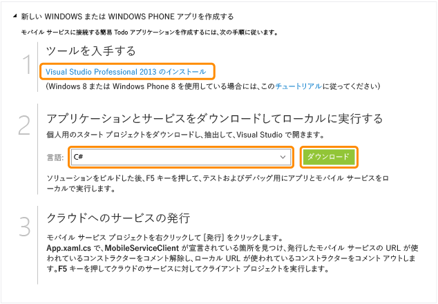

<properties 
	pageTitle="Windows ストア アプリ用 Mobile Services の使用 | モバイル デベロッパー センター" 
	description="このチュートリアルでは、C#、VB、または JavaScript で Windows ストア用の開発を行う場合に Azure Mobile Services を使用する方法を示します。" 
	services="mobile-services" 
	documentationCenter="windows" 
	authors="ggailey777" 
	manager="dwrede" 
	editor=""/>

<tags 
	ms.service="mobile-services" 
	ms.workload="mobile" 
	ms.tgt_pltfrm="" 
	ms.devlang="dotnet" 
	ms.topic="hero-article" 
	ms.date="02/10/2015" 
	ms.author="glenga"/>

# Mobile Services の使用

[AZURE.INCLUDE [mobile-services-selector-get-started](../includes/mobile-services-selector-get-started.md)]

このチュートリアルでは、Azure Mobile Services を使用してユニバーサル Windows アプリにクラウドベースのバックエンド サービスを追加する方法を示します。ユニバーサル Windows アプリ ソリューションには、Windows ストア 8.1 と Windows Phone ストア 8.1 の両方のアプリのプロジェクトと、共通の共有プロジェクトが含まれます。詳細については、「[Windows と Windows Phone を対象とするユニバーサル Windows アプリの構築](http://msdn.microsoft.com/library/windows/apps/xaml/dn609832.aspx)」をご覧ください。

このチュートリアルでは、新しい Mobile Services と、新しい Mobile Services にアプリケーション データを保存する簡単な  *To do list* アプリケーションの両方を作成します。作成する Mobile Services は、サーバー側ビジネス ロジックのために Visual Studio を使用してサポートされる .NET 言語を使用し、Mobile Services を管理します。JavaScript でサーバー側ビジネス ロジックを記述できる Mobile Services を作成する方法については、このトピックの「JavaScript バックエンド バージョン」をご覧ください。

>[AZURE.NOTE]このトピックでは、Azure 管理ポータルを使用して、新しい Mobile Services プロジェクトとユニバーサル Windows アプリを作成する方法を示します。Visual Studio 2013 更新プログラム 3 を使用して、新しい Mobile Services プロジェクトを既存の Visual Studio ソリューションに追加することもできます。詳細については、「[既存のアプリに Mobile Services を追加する](mobile-services-dotnet-backend-windows-universal-dotnet-get-started-data.md)」をご覧ください。

>Mobile Services を Windows Phone 8.0 または Windows Phone Silverlight 8.1 アプリ プロジェクトに追加するには、「[既存のアプリに Mobile Services を追加する](mobile-services-dotnet-backend-windows-phone-get-started-data.md)」をご覧ください。

[AZURE.INCLUDE [mobile-services-windows-universal-get-started](../includes/mobile-services-windows-universal-get-started.md)]

このチュートリアルを完了するには、以下が必要です。

* アクティブな Azure アカウントアカウントがない場合、Azure 評価版にサインアップして、最大 10 件の無料 Mobile Services を入手できます。このサービスは評価終了後も使用できます。詳細については、[Azure の無料評価版サイト](http://www.windowsazure.com/pricing/free-trial/?WT.mc_id=A0E0E5C02&amp;returnurl=http%3A%2F%2Fazure.microsoft.com%2Fja-jp%2Fdocumentation%2Farticles%2Fmobile-services-javascript-backend-windows-store-javascript-get-started%2F)をご覧ください
* <a href="https://go.microsoft.com/fwLink/p/?LinkID=257546" target="_blank">Visual Studio Professional 2013</a> が必要です。

## 新しい Mobile Services を作成する

[AZURE.INCLUDE [mobile-services-dotnet-backend-create-new-service](../includes/mobile-services-dotnet-backend-create-new-service.md)]

## 新しいユニバーサル Windows アプリを作成する

Mobile Services を作成したら、管理ポータルの簡単なクイック スタートに従って、新しいアプリケーションを作成するか、既存のアプリケーションを変更して Mobile Services に接続できます。 

ここでは、Mobile Services に接続された新しいユニバーサル Windows アプリを作成します。

1. 管理ポータルで、**[Mobile Services]** をクリックし、先ほど作成した Mobile Services をクリックします。
   
2. [クイック スタート] タブの **[プラットフォームの選択]** で **[Windows]** を選択し、**[新しい Windows ストア アプリを作成する]** を展開します。

   	これにより、Mobile Services に接続された Windows ストア アプリを作成するための簡単な 3 つの手順が表示されます。

  	

3. <a href="https://go.microsoft.com/fwLink/p/?LinkID=257546" target="_blank">Visual Studio Professional 2013</a> をまだインストールしていない場合は、ダウンロードし、ローカル コンピューターまたは仮想マシンにインストールします。

4. **[アプリケーションとサービスをダウンロードしてローカルに実行する]** で、Windows ストア アプリの言語を選択し、**[ダウンロード]** をクリックします。 

  	これにより、Mobile Services と Mobile Services に接続されている _To do list_ サンプル アプリケーションの両方のプロジェクトを含むソリューションがダウンロードされます。圧縮されたプロジェクト ファイルをローカル コンピューターに保存し、保存場所を書き留めておいてください。

## ローカル Mobile Services に対してアプリをテストする

[AZURE.INCLUDE [mobile-services-dotnet-backend-test-local-service-dotnet](../includes/mobile-services-dotnet-backend-test-local-service-dotnet.md)]

>[AZURE.NOTE]Mobile Services にアクセスして MainPage.xaml.cs ファイルにあるデータを照会および挿入するコードを確認できます。

## Mobile Services を発行する

[AZURE.INCLUDE [mobile-services-dotnet-backend-publish-service](../includes/mobile-services-dotnet-backend-publish-service.md)]

<ol start="4">
<li>
共通コード プロジェクトで、App.xaml.cs ファイルを開き、<a href="http://msdn.microsoft.com/library/Windowsazure/microsoft.windowsazure.mobileservices.mobileserviceclient.aspx" target="_blank">MobileServiceClient</a> インスタンスを作成するコードを見つけて、<em>localhost</em> を使用してこのクライアントを作成するコードをコメント アウトし、リモート Mobile Services URL を使用してクライアントを作成するコードのコメントを解除すると、次のようになります。

        <pre><code>public static MobileServiceClient MobileService = new MobileServiceClient(
            "https://todolist.azure-mobile.net/",
            "XXXX-APPLICATION-KEY-XXXXX");</code></pre>

	
クライアントは Azure に発行された Mobile Services にアクセスするようになります。
</li>
</ol>

## Azure でホストされる Mobile Services に対してアプリをテストする

Mobile Services が発行され、クライアントが Azure でホストされるリモート Mobile Services に接続されたら、項目ストレージ用に Azure を使用してアプリケーションを実行できます。

[AZURE.INCLUDE [mobile-services-windows-universal-test-app](../includes/mobile-services-windows-universal-test-app.md)]

## 次のステップ
クイック スタートはこれで完了です。Mobile Services で重要になるこれ以外の作業については、以下のトピックをご覧ください。 

* [既存のアプリに Mobile Services を追加する][データの使用]
   Mobile Services を使用してデータの格納とクエリを実行する方法について説明します。

* [オフライン データ同期の使用]
   オフライン データの同期を使用してアプリケーションの反応と信頼性を高める方法について説明します。

* [Mobile Services アプリへの認証の追加][認証の使用]
   ID プロバイダーを使用してアプリケーションのユーザーを認証する方法について説明します。

* [アプリケーションにプッシュ通知を追加するプッシュ通知の使用][Get started with push notifications] 
   アプリケーションにごく基本的なプッシュ通知を送信する方法について説明します。

* [Mobile Services .NET バックエンドのトラブルシューティング]
    Mobile Services .NET バックエンドで発生する問題を診断して解決する方法について説明します。 

ユニバーサル Windows アプリの詳細については、「[シングル Mobile Services から複数のデバイス プラットフォームをサポートする](mobile-services-how-to-use-multiple-clients-single-service.md#shared-vs)」をご覧ください。

<!-- Anchors. -->
[Mobile Services の使用]:#getting-started
[新しい Mobile Services を作成する]:#create-new-service
[Mobile Services インスタンスの定義]:#define-mobile-service-instance
[次のステップ]:#next-steps

<!-- Images. -->

<!-- URLs. -->
[データの使用]: mobile-services-dotnet-backend-windows-universal-dotnet-get-started-data.md
[データの使用]: mobile-services-dotnet-backend-windows-store-dotnet-get-started-data.md
[オフライン データ同期の使用]: mobile-services-windows-store-dotnet-get-started-offline-data.md
[認証の使用]: mobile-services-dotnet-backend-windows-store-dotnet-get-started-users.md
[プッシュ通知の使用]: mobile-services-dotnet-backend-windows-store-dotnet-get-started-push.md
[Visual Studio Professional 2013]: https://go.microsoft.com/fwLink/p/?LinkID=257546
[Mobile Services SDK]: http://go.microsoft.com/fwlink/?LinkId=257545
[JavaScript と HTML]: mobile-services-win8-javascript/
[管理ポータル]: https://manage.windowsazure.com/
[JavaScript バックエンド バージョン]: mobile-services-windows-store-get-started.md
[Visual Studio 2012 を使用した Mobile Services でのデータの使用]: mobile-services-windows-store-dotnet-get-started-data-vs2012.md
[Mobile Services .NET バックエンドのトラブルシューティング]: mobile-services-dotnet-backend-how-to-troubleshoot.md
[Get started with push notifications]: mobile-services-dotnet-backend-windows-store-dotnet-get-started-push.md

<!--HONumber=52-->