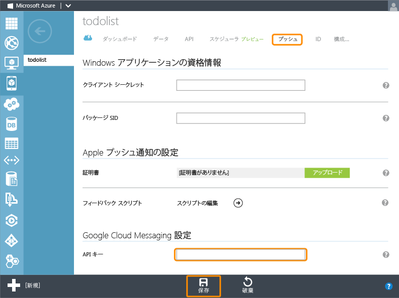
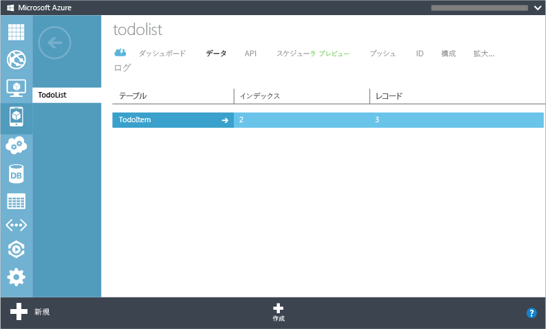

<properties linkid="develop-mobile-tutorials-get-started-with-push-js-vs2013" urlDisplayName="プッシュ通知の使用 (JS)" pageTitle="プッシュ通知の使用 (Android JavaScript) | モバイル デベロッパー センター" metaKeywords="" description="Windows Azure モバイル サービスを使用して Android JavaScript アプリケーションにプッシュ通知を送信する方法について説明します。" metaCanonical="http://www.windowsazure.com/ja-jp/develop/mobile/tutorials/get-started-with-push-dotnet/" services="" documentationCenter="Mobile" title="モバイル サービスでのプッシュ通知の使用" authors="ricksal"  solutions="" writer="ricksal" manager="" editor=""  />

# モバイル サービスでのプッシュ通知の使用

	<a href="/ja-jp/documentation/articles/mobile-services-javascript-backend-windows-store-dotnet-get-started-push" title="Windows ストア C#">Windows ストア C#</a>
	<a href="/ja-jp/documentation/articles/mobile-services-javascript-backend-windows-store-javascript-get-started-push" title="Windows ストア JavaScript">Windows ストア JavaScript</a>
	<a href="/ja-jp/documentation/articles/mobile-services-javascript-backend-windows-phone-get-started-push" title="Windows Phone" class="current">Windows Phone</a>
	<a href="/ja-jp/documentation/articles/mobile-services-ios-get-started-push" title="iOS">iOS</a>
	<a href="/ja-jp/documentation/articles/mobile-services-javascript-backend-android-get-started-push" title="Android" class="current">Android</a>

<!--

<a href="/ja-jp/documentation/articles/mobile-services-dotnet-backend-windows-store-javascript-get-started-push/" title=".NET バックエンド">.NET バックエンド</a> |  <a href="/ja-jp/documentation/articles/mobile-services-windows-store-javascript-get-started-push/"  title="JavaScript バックエンド" class="current">JavaScript バックエンド</a>
		
-->

このトピックでは、Azure モバイル サービスを使用して Android アプリにプッシュ通知を送信する方法について説明します。このチュートリアルでは、Google Cloud Messaging (GCM) を使用したプッシュ通知をクイック スタート プロジェクトに追加します。完了すると、モバイル サービスは、レコードが挿入されるたびにプッシュ通知を送信します。

[WACOM.NOTE]このチュートリアルでは、現在プレビュー段階にある、通知ハブとのモバイル サービスの統合を示します。既定では、通知ハブを使用したプッシュ通知の送信は JavaScript のバックエンドからは有効になっていません。新しい通知ハブを作成すると、統合プロセスを元に戻すことはできません。iOS 用のプッシュ通知のみが、[トピックのこのバージョン](/ja-jp/documentation/articles/mobile-services-android-get-started-push/)で説明している既定のプッシュ サポートを使用することによって現在使用可能です。

このチュートリアルでは、プッシュ通知を有効にするための、次の基本的な手順について説明します。

1. [Google Cloud Messaging を有効にする](#register)
2. [モバイル サービスを構成する](#configure)
3. [アプリケーションにプッシュ通知を追加する](#add-push)
4. [プッシュ通知を送信するようにスクリプトを更新する](#update-scripts)
5. [データを挿入して通知を受け取る](#test)

このチュートリアルは、モバイル サービスのクイック スタートに基づいています。このチュートリアルを開始する前に、「[モバイル サービスの使用]」または「[モバイル サービスでのデータの使用]」を完了してプロジェクトをモバイル サービスに接続している必要があります。

##Google Cloud Messaging を有効にする

[WACOM.INCLUDE [Enable GCM](../includes/mobile-services-enable-Google-cloud-messaging.md)]

次に、この API キー値を使用して、モバイル サービスが GCM で認証し、アプリケーションの代わりにプッシュ通知を送信できるようにします。

##プッシュ要求を送信するようにモバイル サービスを構成する

1. [Windows Azure の管理ポータル]にログオンし、**[モバイル サービス]** をクリックして、アプリケーションをクリックします。

   	

2. **[プッシュ]** タブをクリックし、**[拡張プッシュの有効化]** をクリックしてから、**[はい]** をクリックして構成の変更を受け入れます。

	

	

	この結果、モバイル サービスの構成が更新され、通知ハブによって提供される拡張プッシュ通知機能を使用するようになります。いくつかの通知ハブは、お客様の有料モバイル サービスと組み合わせた状況で、利用が無料になります。詳細については、「[モバイル サービスの料金詳細](http://go.microsoft.com/fwlink/p/?LinkID=311786)」を参照してください。

    
<b>重要</b>
	
この操作は、プッシュの資格情報をリセットし、スクリプト内にあるプッシュ メソッドの動作を変更します。これらの変更を元に戻すことはできません。運用環境のモバイル サービスに通知ハブを追加する目的で、このメソッドを使用しないでください。運用環境のモバイル サービスで拡張プッシュ通知を有効にする方法については、<a href="http://go.microsoft.com/fwlink/p/?LinkId=391951">このガイダンス</a>を参照してください。

    

3. 前の手順で GCM から取得した **API キー**値を入力して、**[保存]** をクリックします。

   	

    
<b>重要</b>
	
ポータルの [プッシュ] タブで拡張プッシュ通知に対応する GCM の資格情報を設定した場合は、アプリに対して通知ハブを構成する目的で、それらの資格情報が通知ハブと共有されます。

    

これで、GCM および通知ハブと連携するようにモバイル サービスとアプリケーションが構成されました。

##アプリケーションにプッシュ通知を追加する

###Android SDK バージョンの検証

[WACOM.INCLUDE [Verify SDK](../includes/mobile-services-verify-android-sdk-version.md)]

次の手順は、Google Play サービスをインストールすることです。Google Cloud Messaging には、マニフェストの **minSdkVersion** プロパティが準拠する必要がある、開発およびテストに関する最小 API レベル要件があります。

古いデバイスを使用している場合は、[Google Play Services SDK のセットアップに関するページ]を参考に、どれだけ小さな値を設定できるか判断し、適切に設定してください。

###プロジェクトへの Google Play Services の追加

[WACOM.INCLUDE [Add Play Services](../includes/mobile-services-add-Google-play-services.md)]

###コードの追加

1. `AndroidManifest.xml`  ファイルを開きます。続く 2 つの手順で、コード内の _`**my_app_package**`_ を、プロジェクトのアプリケーション パッケージの名前 (`manifest` タグの ``package` 属性の値) に置き換えます。

2. 既存の `uses-permission` 要素の後に次の新しいアクセス許可を追加します。

        <permission android:name="**my_app_package**.permission.C2D_MESSAGE" 
            android:protectionLevel="signature" />
        <uses-permission android:name="**my_app_package**.permission.C2D_MESSAGE" /> 
        <uses-permission android:name="com.google.android.c2dm.permission.RECEIVE" />
        <uses-permission android:name="android.permission.GET_ACCOUNTS" />
        <uses-permission android:name="android.permission.WAKE_LOCK" />

3. `application` 開始タグの後に次のコードを追加します。

        <receiver android:name="com.microsoft.windowsazure.notifications.NotificationsBroadcastReceiver"
            						 	android:permission="com.google.android.c2dm.permission.SEND">
            <intent-filter>
                <action android:name="com.google.android.c2dm.intent.RECEIVE" />
                <category android:name="**my_app_package**" />
            </intent-filter>
        </receiver>

4. [Mobile Services Android SDK] をダウンロードし、解凍します。**notifications** フォルダーを開き、**notifications-n.jar** ファイルを Eclipse プロジェクトの *libs* フォルダーにコピーした後、*libs* フォルダーを最新の情報に更新します。

    
<b>メモ</b>
	
ファイル名の末尾にある数値は、今後の SDK リリースで変更される可能性があります。

    

5. ファイル *ToDoItemActivity.java* を開き、次の import ステートメントを追加します。

		import com.microsoft.windowsazure.notifications.NotificationsManager;

6. 次のプライベート変数をクラスに追加します。ここで、_`<PROJECT_NUMBER>`_ は、最初の手順で Google によってアプリケーションに割り当てられたプロジェクト番号です。

		public static final String SENDER_ID = "<PROJECT_NUMBER>";

7. **OnCreate** メソッドで、MobileServiceClient をインスタンス化する前に、デバイスに対応する通知ハンドラーを登録する次のコードを追加します。

		NotificationsManager.handleNotifications(this, SENDER_ID, MyHandler.class);

	後で、このコード内で参照されている MyHandler.class を定義します。
	

8. Package Explorer で (`[src]` ノードの下にある) パッケージを右クリックし、**[New]**、**[Class]** の順にクリックします。

9. **[Name]** に「`MyHandler`」と入力し、**[Superclass]** に「`com.microsoft.windowsazure.notifications.NotificationsHandler`」と入力して、**[Finish]** をクリックします。

	

	これで、新しい MyHandler クラスが作成されます。

10. 次の import ステートメントを追加します。

		import android.content.Context;
		
11. その後、次のコードをクラスに追加します。

		public static final int NOTIFICATION_ID = 1;
		private NotificationManager mNotificationManager;
		NotificationCompat.Builder builder;
		Context ctx;

12. **onRegistered** メソッドをオーバーライドするために、次のコードを追加します。このコードは、デバイスをモバイル サービスの通知ハブに登録します。

		@Override
		public void onRegistered(Context context, String gcmRegistrationId) {
			super.onRegistered(context, gcmRegistrationId);
			
			ToDoActivity.mClient.getPush().register(gcmRegistrationId, null, new RegistrationCallback() {
	            @Override
	            public void onRegister(Registration registration, Exception exception) {
	                  if (exception != null) {
	                        // handle error
	                  }
	            }
	      	});
		}

13. **onReceive** をオーバーライドするために、次のコードを追加します。このコードは、通知を受信したときにその通知を表示します。

		@Override
		public void onReceive(Context context, Bundle bundle) {
		    ctx = context;
		    String nhMessage = bundle.getString("message");
	
		    sendNotification(nhMessage);
		}
	
		private void sendNotification(String msg) {
			mNotificationManager = (NotificationManager)
		              ctx.getSystemService(Context.NOTIFICATION_SERVICE);
	
		    PendingIntent contentIntent = PendingIntent.getActivity(ctx, 0,
		          new Intent(ctx, ToDoActivity.class), 0);
	
		    NotificationCompat.Builder mBuilder =
		          new NotificationCompat.Builder(ctx)
		          .setSmallIcon(R.drawable.ic_launcher)
		          .setContentTitle("Notification Hub Demo")
		          .setStyle(new NotificationCompat.BigTextStyle()
		                     .bigText(msg))
		          .setContentText(msg);
	
		     mBuilder.setContentIntent(contentIntent);
		     mNotificationManager.notify(NOTIFICATION_ID, mBuilder.build());
		}

これで、アプリケーションがプッシュ通知をサポートするように更新されました。

##管理ポータルで登録されている挿入スクリプトを更新する

1. 管理ポータルで、**[データ]** タブをクリックし、**TodoItem** テーブルをクリックします。

   	

2. **[todoitem]** で、**[スクリプト]** タブをクリックし、**[挿入]** をクリックします。
   
  	

   	**TodoItem** テーブルで挿入が発生したときに呼び出される関数が表示されます。

3. insert 関数を次のコードに置き換え、**[保存]** をクリックします。

		function insert(item, user, request) {
		// Define a payload for the Google Cloud Messaging toast notification.
		var payload = 
		    '{"data":{"message" : "Hello from Mobile Services!"}}';
		
		request.execute({
		    success: function() {
		        // If the insert succeeds, send a notification.
		        push.gcm.send(null, payload, {
		            success: function(pushResponse) {
		                console.log("Sent push:", pushResponse, payload);
		                request.respond();
		                },              
		            error: function (pushResponse) {
		                console.log("Error Sending push:", pushResponse);
		                request.respond(500, { error: pushResponse });
		                }
		            });
		        },
		    error: function(err) {
		        console.log("request.execute error", err)
		        request.respond();
		    }
		  });
		}

   	これで、新しい insert スクリプトが登録されます。このスクリプトは [gcm オブジェクト]を使用して、挿入が成功した後に、登録されているすべてのデバイスにプッシュ通知を送信します。

##アプリケーションでプッシュ通知をテストする

Android フォンを USB ケーブルで直接接続するか、エミュレーターで仮想デバイスを使用する方法により、アプリケーションをテストできます。

###テスト用のエミュレーターの設定

このアプリケーションをエミュレーターで実行する場合は、Google API をサポートしている Android Virtual Device (AVD) を使用してください。

1. Eclipse を再起動し、Package Explorer でプロジェクトを右クリックして、**[Properties]**、**[Android]** の順にクリックし、**[Google APIs]** をオンにしてから **[OK]** をクリックします。

	

  	これで、プロジェクトの対象が Google API になります。

2. **[Window]** で **[Android Virtual Device Manager]** を選択し、デバイスを選択してから **[Edit]** をクリックします。

	

3. **[Target]** で **[Google APIs]** を選択し、[OK] をクリックします。

   	

	これで、AVD が Google API を使用するようになります。

###テストの実行

1. Eclipse で **[Run]** メニューの **[Run]** をクリックして、アプリケーションを開始します。

2. アプリケーションで、わかりやすいテキスト (たとえば、「_新しいモバイル サービス タスク_」) を入力し、**[Add]** ボタンをクリックします。

  	

3. 画面の上端から下にスワイプし、通知を表示するためのデバイスの通知センターを開きます。

これで、このチュートリアルは終了です。

## 次のステップ

このチュートリアルでは、モバイル サービスに用意されている基本的なプッシュ通知機能を示します。より高度な機能 (たとえば、クロスプラットフォーム通知の送信、サブスクリプション ベースのルーティング、大ボリューム) を必要とする場合は、モバイル サービスで Windows Azure 通知ハブを使用することを検討してください。詳細については、通知ハブに関する次のトピックのいずれかを参照してください。

+ [通知ハブの使用]
   Android アプリで通知ハブを活用する方法について説明します。

+ [登録者への通知の送信]
	 ユーザーが興味のあるカテゴリに関してプッシュ通知を登録して、プッシュ通知を受信できるようにする方法について説明します。

+ [ユーザーへの通知の送信]
	 モバイル サービスから任意のデバイスの特定のユーザーにプッシュ通知を送信する方法について説明します。

+ [ユーザーへのクロスプラットフォーム通知の送信]
	 テンプレートを使用して、バックエンドでプラットフォームに固有のペイロードを作成する必要なくモバイル サービスからプッシュ通知を送信する方法について説明します。

次のモバイル サービスのトピックの詳細を確認することをお勧めします。

* [データの使用]
   モバイル サービスを使用してデータの格納およびクエリを実行する方法について説明します。

* [認証の使用]
   Windows アカウントを使用してアプリケーションのユーザーを認証する方法について説明します。

* [モバイル サービスのサーバー スクリプト リファレンス]
   サーバー スクリプトの登録および使用について説明します。

* [モバイル サービス HTML/JavaScript の使用方法の概念リファレンス]
   HTML および JavaScript でモバイル サービスを使用する方法について説明します。

<!-- Anchors. -->
[プッシュ通知用のアプリケーションを登録してモバイル サービスを構成する]: #register
[生成されたプッシュ通知コードを更新する]: #update-scripts
[データを挿入して通知を受け取る]: #test
[次のステップ]:#next-steps

<!-- Images. -->
[13]: ./media/mobile-services-windows-store-javascript-get-started-push/mobile-quickstart-push1.png
[14]: ./media/mobile-services-windows-store-javascript-get-started-push/mobile-quickstart-push2.png

<!-- URLs. -->
[アプリケーションの提出に関するページ: ]: http://go.microsoft.com/fwlink/p/?LinkID=266582
[マイ アプリケーション]: http://go.microsoft.com/fwlink/p/?LinkId=262039
[Windows 向け Live SDK]: http://go.microsoft.com/fwlink/p/?LinkId=262253
[モバイル サービスの使用]: /ja-jp/develop/mobile/tutorials/get-started/
[データの使用]: /ja-jp/develop/mobile/tutorials/get-started-with-data-js/
[認証の使用]: /ja-jp/develop/mobile/tutorials/get-started-with-users-js
[プッシュ通知の使用]: /ja-jp/develop/mobile/tutorials/get-started-with-push-js
[アプリケーション ユーザーへのプッシュ通知]: /ja-jp/develop/mobile/tutorials/push-notifications-to-users-js
[スクリプトを使用したユーザーの承認]: /ja-jp/develop/mobile/tutorials/authorize-users-in-scripts-js
[JavaScript と HTML]: /ja-jp/develop/mobile/tutorials/get-started-with-push-js
[Google Play Services SDK のセットアップに関するページ]: http://go.microsoft.com/fwlink/?LinkId=389801
[Windows Azure の管理ポータル]: https://manage.windowsazure.com/
[モバイル サービス HTML/JavaScript の使用方法の概念リファレンス]: /ja-jp/develop/mobile/how-to-guides/work-with-html-js-client/
[モバイル サービスのサーバー スクリプト リファレンス]: http://go.microsoft.com/fwlink/?LinkId=262293
[通知ハブの使用]: /ja-jp/manage/services/notification-hubs/getting-started-windows-dotnet/
[Windows Azure 通知ハブとは]: /ja-jp/develop/net/how-to-guides/service-bus-notification-hubs/
[登録者への通知の送信]: /ja-jp/manage/services/notification-hubs/breaking-news-dotnet/
[ユーザーへの通知の送信]: /ja-jp/manage/services/notification-hubs/notify-users/
[ユーザーへのクロスプラットフォーム通知の送信]: /ja-jp/manage/services/notification-hubs/notify-users-xplat-mobile-services/
[gcm オブジェクト]: http://go.microsoft.com/fwlink/p/?LinkId=282645

