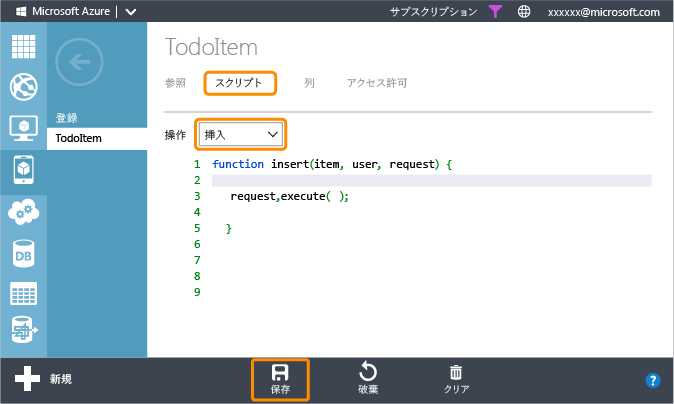

<properties 
	pageTitle="プッシュ通知の使用 (Android JavaScript) | モバイル デベロッパー センター" 
	description="Azure Mobile Services を使用して Android JavaScript アプリにプッシュ通知を送信する方法について説明します。" 
	services="mobile-services, notification-hubs" 
	documentationCenter="android" 
	authors="RickSaling" 
	Writer="ricksal" 
	manager="dwrede" 
	editor=""/>

<tags 
	ms.service="mobile-services" 
	ms.workload="mobile" 
	ms.tgt_pltfrm="Mobile-Android" 
	ms.devlang="Java" 
	ms.topic="article" 
	ms.date="10/16/2014" 
	ms.author="ricksal"/>

# Mobile Services アプリへのプッシュ通知の追加

[AZURE.INCLUDE [mobile-services-selector-get-started-push](../includes/mobile-services-selector-get-started-push.md)]

このトピックでは、Azure Mobile Services で Google Cloud Messaging (GCM) を使用して Android アプリにプッシュ通知を送信する方法について説明します。このチュートリアルでは、クイック スタート プロジェクトへの Azure 通知ハブを使用したプッシュ通知を有効にします。完了すると、モバイル サービスは、レコードが挿入されるたびにプッシュ通知を送信します。

このチュートリアルでは、プッシュ通知を有効にするための、次の基本的な手順について説明します。

1. [Google Cloud Messaging を有効にする](#register)
2. [Mobile Services を構成する](#configure)
3. [アプリケーションにプッシュ通知を追加する](#add-push)
4. [プッシュ通知を送信するようにスクリプトを更新する](#update-scripts)
5. [データを挿入して通知を受け取る](#test)

>[AZURE.NOTE] 完成したアプリケーションのソース コードは、<a href="https://github.com/RickSaling/mobile-services-samples/tree/futures/GettingStartedWithPush/Android" target="_blank">ここ</a>で確認できます。

##前提条件

[AZURE.INCLUDE [mobile-services-android-prerequisites](../includes/mobile-services-android-prerequisites.md)]

##Google Cloud Messaging を有効にする

>[AZURE.NOTE]この手順を完了するには、検証済みの電子メール アドレスを持つ Google アカウントが必要になります。新しい Google アカウントを作成するには、<a href="http://go.microsoft.com/fwlink/p/?LinkId=268302" target="_blank">accounts.google.com</a> にアクセスしてください。

[AZURE.INCLUDE [Enable GCM](../includes/mobile-services-enable-Google-cloud-messaging.md)]

次に、この API キー値を使用して、モバイル サービスが GCM で認証し、アプリケーションの代わりにプッシュ通知を送信できるようにします。

##プッシュ要求を送信するように Mobile Services を構成する

1. [Azure 管理ポータル] にログオンし、**[モバイル サービス]** をクリックして、アプリケーションをクリックします。

   	

2. **[プッシュ]** タブをクリックし、前の手順で GCM から取得した **API キー**値を入力して、**[保存]** をクリックします。

	>[AZURE.NOTE]古いモバイル サービスを使用してこのチュートリアルを実行する場合は、**[プッシュ]** タブの下に、**[拡張プッシュの有効化]** というリンクが表示される場合があります。このリンクをクリックすると、モバイル サービスが更新され、Notification Hubs と統合されます。この変更を元に戻すことはできません。運用環境のモバイル サービスで拡張プッシュ通知を有効にする方法の詳細については、<a href="http://go.microsoft.com/fwlink/p/?LinkId=391951">このガイダンス</a>を参照してください。

   	

	> [AZURE.IMPORTANT] ポータルの [プッシュ] タブで拡張プッシュ通知に対応する GCM の資格情報を設定した場合は、アプリに対して通知ハブを構成する目的で、それらの資格情報が通知ハブと共有されます。

これで、GCM および通知ハブと連携するようにモバイル サービスとアプリケーションが構成されました。

##アプリケーションにプッシュ通知を追加する

###Android SDK バージョンの検証

[AZURE.INCLUDE [Verify SDK](../includes/mobile-services-verify-android-sdk-version.md)]

次の手順は、Google Play サービスをインストールすることです。Google Cloud Messaging には、マニフェストの **minSdkVersion** プロパティが準拠する必要がある、開発およびテストに関する最小 API レベル要件があります。 

古いデバイスを使用している場合は、[Google Play Services SDK のセットアップに関するページ]を参考に、どれだけ小さな値を設定できるか判断し、適切に設定してください。

###プロジェクトへの Google Play Services の追加

[AZURE.INCLUDE [Add Play Services](../includes/mobile-services-add-Google-play-services.md)]

###コードの追加

[AZURE.INCLUDE [mobile-services-android-getting-started-with-push](../includes/mobile-services-android-getting-started-with-push.md)]

##管理ポータルで登録されている挿入スクリプトを更新する

1. 管理ポータルで、**[データ]** タブをクリックし、**TodoItem** テーブルをクリックします。 

   	

2. **[todoitem]** で、**[スクリプト]** タブをクリックし、**[挿入]** をクリックします。
   
  	

   	**TodoItem** テーブルで挿入が発生したときに呼び出される関数が表示されます。

3. insert 関数を次のコードに置き換え、**[保存]** をクリックします。

		function insert(item, user, request) {
		// Define a payload for the Google Cloud Messaging toast notification.
		var payload = {
		    data: {
		        message: item.text 
		    }
		};		
		request.execute({
		    success: function() {
		        // If the insert succeeds, send a notification.
		        push.gcm.send(null, payload, {
		            success: function(pushResponse) {
		                console.log("Sent push:", pushResponse, payload);
		                request.respond();
		                },              
		            error: function (pushResponse) {
		                console.log("Error Sending push:", pushResponse);
		                request.respond(500, { error: pushResponse });
		                }
		            });
		        },
		    error: function(err) {
		        console.log("request.execute error", err)
		        request.respond();
		    }
		  });
		}

   	これで、新しい insert スクリプトが登録されます。このスクリプトは [gcm オブジェクト]を使用して、挿入が成功した後に、登録されているすべてのデバイスにプッシュ通知を送信します。 

##アプリケーションでプッシュ通知をテストする

Android フォンを USB ケーブルで直接接続するか、エミュレーターで仮想デバイスを使用する方法により、アプリケーションをテストできます。

###テスト用のエミュレーターの設定

このアプリケーションをエミュレーターで実行する場合は、Google API をサポートしている Android Virtual Device (AVD) を使用してください。

1. Eclipse を再開し、Package Explorer でプロジェクトを右クリックします。**[Properties]**、**[Android]** の順にクリックし、**[Google APIs]** をオンにしてから **[OK]** をクリックします。

	

  	これで、プロジェクトの対象が Google API になります。

2. **[Window]** で **[Android Virtual Device Manager]** を選択し、デバイスを選択してから **[Edit]** をクリックします。

	

3. **[Target]** で **[Google APIs]** を選択し、[OK] をクリックします。

   	

	これで、AVD が Google API を使用するようになります。

###テストの実行

1. Eclipse で **[Run]** メニューの **[Run]** をクリックして、アプリケーションを開始します。

2. アプリケーションで、意味のあるテキスト (たとえば、「新しいモバイル サービス タスク」) を入力し、**[Add]** ボタンをクリックします。

  	

3. 画面の上端から下へスワイプし、通知を表示するためのデバイスの通知センターを開きます。

これで、このチュートリアルは終了です。

## 次のステップ

<!---このチュートリアルでは、Android アプリケーションで Mobile Services と Notification Hubs を使用してプッシュ通知を送信できるようにする方法の基本について説明しました。次は、タグを使用して、プッシュ通知をモバイル サービスから認証ユーザーにのみ送信する方法を説明した、次のチュートリアル「[認証されたユーザーへのプッシュ通知の送信]」を行うことをお勧めします。

+ [認証されたユーザーへのプッシュ通知の送信]
	 タグを使用してモバイル サービスから認証されたユーザーのみにプッシュ通知を送信する方法について説明します。

+ [通知ハブを使用したニュース速報の送信]
	 ユーザーが興味のあるカテゴリに関してプッシュ通知を登録して、プッシュ通知を受信できるようにする方法について説明します。

+ [通知ハブを使用したローカライズ ニュース速報の送信]
	 テンプレートを使用して、バックエンドでプラットフォームに固有のペイロードを作成する必要なくモバイル サービスからプッシュ通知を送信する方法について説明します。
-->

Mobile Services と通知ハブについては次のトピックを参照してください。

* [データの使用]
   Mobile Services を使用してデータの格納およびクエリを実行する方法について説明します。

* [認証の使用]
   Mobile Services を使用して、別のアカウントの種類のアプリケーションのユーザーを認証する方法について説明します。

* [Notification Hubs とは]
   通知ハブがすべての主要なクライアント プラットフォーム全体のアプリケーションに通知を配信するための動作を説明します。

* [Notification Hubs のデバッグ](http://go.microsoft.com/fwlink/p/?linkid=386630)
   Notification Hubs ソリューションのトラブルシューティングおよびデバッグのガイダンスについて説明します。 

* [Mobile Services 向け Android クライアント ライブラリの使用方法]
   Android で Mobile Services を使用する方法について説明します。

* [モバイル サービスのサーバー スクリプト リファレンス]
   モバイル サービスでビジネス ロジックを実装する方法を説明します。

<!-- Anchors. -->
[プッシュ通知用のアプリケーションを登録して Mobile Services を構成する]: #register
[生成されたプッシュ通知コードを更新する]: #update-scripts
[データを挿入して通知を受け取る]: #test
[次のステップ]:#next-steps

<!-- Images. -->
[13]: ./media/mobile-services-windows-store-javascript-get-started-push/mobile-quickstart-push1.png
[14]: ./media/mobile-services-windows-store-javascript-get-started-push/mobile-quickstart-push2.png

<!-- URLs. -->
[アプリケーションの提出に関するページ]: http://go.microsoft.com/fwlink/p/?LinkID=266582
[マイ アプリケーション]: http://go.microsoft.com/fwlink/p/?LinkId=262039
[Windows 向け live SDK]: http://go.microsoft.com/fwlink/p/?LinkId=262253
[モバイル サービスの使用]: /ja-jp/documentation/articles/mobile-services-android-get-started/
[データの使用]: /ja-jp/documentation/articles/mobile-services-android-get-started-data/
[認証の使用]: /ja-jp/documentation/articles/mobile-services-android-get-started-users
[プッシュ通知の使用]: /ja-jp/develop/mobile/tutorials/get-started-with-push-js
[アプリケーション ユーザーへのプッシュ通知]: /ja-jp/develop/mobile/tutorials/push-notifications-to-users-js
[スクリプトを使用したユーザーの承認]: /ja-jp/develop/mobile/tutorials/authorize-users-in-scripts-js
[JavaScript と HTML]: /ja-jp/develop/mobile/tutorials/get-started-with-push-js
[Google Play Services SDK のセットアップ]: http://go.microsoft.com/fwlink/?LinkId=389801
[Azure の管理ポータル]: https://manage.windowsazure.com/
[Mobile Services 向け Android クライアント ライブラリの使用方法]: /ja-jp/documentation/articles/mobile-services-android-how-to-use-client-library

[gcm オブジェクト]: http://go.microsoft.com/fwlink/p/?LinkId=282645

[モバイル サービスのサーバー スクリプト リファレンス]: http://go.microsoft.com/fwlink/?LinkId=262293

[認証されたユーザーへのプッシュ通知の送信]: /ja-jp/documentation/articles/mobile-services-javascript-backend-android-push-notifications-app-users/

[Notification Hubs とは]: /ja-jp/documentation/articles/notification-hubs-overview/
[通知ハブを使用したニュース速報の送信]: /ja-jp/documentation/articles/notification-hubs-android-send-breaking-news/
[通知ハブを使用したローカライズ ニュース速報の送信]: /ja-jp/documentation/articles/notification-hubs-android-send-localized-breaking-news/

<!--HONumber=42-->
