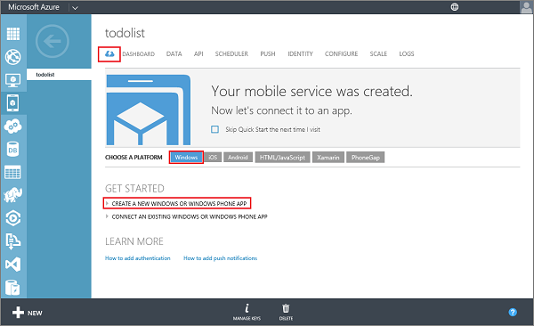

<properties pageTitle="Windows ストア アプリ向け Mobile Services の使用 | モバイル デベロッパー センター" metaKeywords="" description="このチュートリアルでは、C# または JavaScript で Windows ストア用の開発を行う場合に Azure Mobile Services を使用する方法を示します。 " metaCanonical="" services="mobile-services" documentationCenter="Mobile" title="Get started with Mobile Services" authors="glenga" solutions="" manager="dwrede" editor="" />

<tags ms.service="mobile-services" ms.workload="mobile" ms.tgt_pltfrm="mobile-windows-store" ms.devlang="javascript" ms.topic="hero-article" ms.date="08/18/2014" ms.author="glenga" />

# モバイル サービスの使用

[WACOM.INCLUDE [mobile-services-selector-get-started](../includes/mobile-services-selector-get-started.md)]

このチュートリアルでは、Azure Mobile Services を使用してユニバーサル Windows アプリにクラウドベースのバックエンド サービスを追加する方法を示します。 

このチュートリアルでは、新しいモバイル サービスと、新しいモバイル サービスにアプリケーション データを保存する簡単な *To do list* アプリケーションの両方を作成します。作成するモバイル サービスは、サーバー側ビジネス ロジックのために JavaScript を使用します。Visual Studio を使用してサポートされる .NET 言語でサーバー側ビジネス ロジックを記述できるモバイル サービスを作成する方法については、このトピックの「.NET バックエンド バージョン」を参照してください。

[WACOM.INCLUDE [mobile-services-windows-universal-get-started](../includes/mobile-services-windows-universal-get-started.md)]

このチュートリアルを完了するには、以下が必要です。

* アクティブな Azure アカウント。アカウントがない場合は、無料の試用アカウントを数分で作成することができます。詳細については、[Azure の無料評価版サイト](http://www.windowsazure.com/ja-jp/pricing/free-trial/?WT.mc_id=A0E0E5C02&returnurl=http%3A%2F%2Fazure.microsoft.com%2Fja-jp%2Fdocumentation%2Farticles%2Fmobile-services-javascript-backend-windows-store-javascript-get-started%2F)を参照してください。
* [Visual Studio 2013 Express for Windows] 

## 新しいモバイル サービスを作成する

[WACOM.INCLUDE [mobile-services-create-new-service](../includes/mobile-services-create-new-service.md)]

## 新しいユニバーサル Windows アプリを作成する

モバイル サービスを作成したら、管理ポータルの簡単なクイック スタートに従って、新しいユニバーサル Windows アプリを作成するか、既存の Windows ストアまたは Windows Phone アプリ プロジェクトを変更してモバイル サービスに接続することができます。 

ここでは、モバイル サービスに接続された新しいユニバーサル Windows アプリを作成します。

1.  管理ポータルで、**[モバイル サービス]** をクリックし、先ほど作成したモバイル サービスをクリックします。

   
2. [クイック スタート] タブの **[プラットフォームの選択]** で **[Windows]** を選択し、**[新しい Windows ストア アプリを作成する]** を展開します。

   	

   	これにより、モバイル サービスに接続された Windows ストア アプリを作成するための簡単な 3 つの手順が表示されます。

  	

3. まだ [Visual Studio 2013][Visual Studio 2013 Express for Windows] をダウンロードおよびインストールしていない場合は、これらをダウンロードしてローカル コンピューターまたは仮想マシンにインストールします。

4. **[TodoItem テーブルを作成する]** をクリックして、アプリケーション データを格納するテーブルを作成します。

5. **[アプリケーションをダウンロードして実行する]** で、アプリケーションの言語を選択し、**[ダウンロード]** をクリックします。 

  	これにより、モバイル サービスに接続されている *To do list* サンプル アプリケーションのプロジェクトがダウンロードされます。圧縮されたプロジェクト ファイルをローカル コンピューターに保存し、保存場所を書き留めておいてください。

## Windows アプリケーションを実行する

[WACOM.INCLUDE [mobile-services-javascript-backend-run-app](../includes/mobile-services-javascript-backend-run-app.md)]

>[WACOM.NOTE]モバイル サービスにアクセスして default.js ファイルにあるデータを照会および挿入するコードを確認できます。

## 次のステップ
クイック スタートはこれで完了です。モバイル サービスで重要になるこれ以外の作業については、以下のトピックを参照してください。 

* [データの使用]
   Mobile Services を使用してデータの格納およびクエリを実行する方法について説明します。

* [認証の使用]
   ID プロバイダーを使用してアプリケーションのユーザーを認証する方法について説明します。

* [プッシュ通知の使用] 
   アプリケーションにごく基本的なプッシュ通知を送信する方法について説明します。

ユニバーサル Windows アプリの詳細については、「[Supporting multiple device platforms from a single mobile service (単一のモバイル サービスから複数のデバイス プラットフォームをサポートする)](/ja-jp/documentation/articles/mobile-services-how-to-use-multiple-clients-single-service#shared-vs)」を参照してください。

<!-- Anchors. -->
[モバイル サービスの使用]:#getting-started
[新しいモバイル サービスを作成する]:#create-new-service
[モバイル サービス インスタンスの定義]:#define-mobile-service-instance
[次のステップ]:#next-steps

<!-- Images. -->

<!-- URLs. -->
[データの使用]: /ja-jp/documentation/articles/mobile-services-javascript-backend-windows-universal-javascript-get-started-data
[認証の使用]: /ja-jp/documentation/articles/mobile-services-windows-store-javascript-get-started-users
[プッシュ通知の使用]: /ja-jp/documentation/articles/mobile-services-javascript-backend-windows-store-javascript-get-started-push
[Visual Studio 2013 Express for Windows]: http://go.microsoft.com/fwlink/?LinkId=257546
[モバイル サービス SDK]: http://go.microsoft.com/fwlink/?LinkId=257545
[管理ポータル]: https://manage.windowsazure.com/
