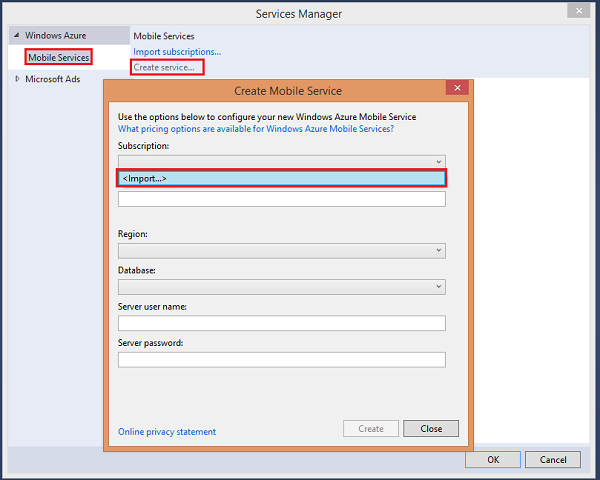

<properties urlDisplayName="Import your subscription publish settings file in Visual Studio 2013" pageTitle="発行設定ファイルを Visual Studio 2013 にインポートする | Mobile Services" metaKeywords="Azure import publishsettings, mobile services" description="Learn how to import a subscription publish settings file for your Azure Mobile Services application in Visual Studio 2013." title="Import your subscription publish settings file in Visual Studio 2013" documentationCenter="Mobile" services="mobile-services" solutions="" manager="dwrede" editor="" videoId="" scriptId="" authors="glenga" />

<tags ms.service="mobile-services" ms.workload="mobile" ms.tgt_pltfrm="mobile-multiple" ms.devlang="multiple" ms.topic="article" ms.date="11/21/2014" ms.author="glenga" />

# サブスクリプション発行設定ファイルを Visual Studio 2013 にインポートする

モバイル サービスを作成する前に、Azure サブスクリプションから Visual Studio に発行設定ファイルをインポートする必要があります。これにより、Visual Studio は Azure に自動的に接続できます。  

>[WACOM.NOTE]Visual Studio 2013 Update 2 から、発行設定ファイルを使用する必要はなくなりました。Visual Studio は、ユーザーが入力した資格情報を使用して直接 Azure 似接続できます。

1. Visual Studio 2013 で、ソリューション エクスプローラーを開き、プロジェクトを右クリックして、**[追加]**、**[接続済みサービス]** の順にクリックします。 

	

2. [サービス マネージャー] ダイアログで **[サービスの作成]** をクリックし、[モバイル サービスの作成] ダイアログの **[サブスクリプション]** で **[&lt;インポート&gt;]** をクリックします。  

	

3. [Azure サブスクリプションのインポート] で、**[サブスクリプション ファイルのダウンロード]** をクリックし、必要であれば Azure アカウントにログインします。ブラウザーがファイルの保存を要求した場合は、**[保存]** をクリックします。

	

	
<strong>注</strong> 
ログイン ウィンドウはブラウザーに表示されます。このウィンドウは、Visual Studio のウィンドウの後ろに表示されている場合があります。ダウンロードした .publishsettings ファイルの保存場所を書き留めておいてください。プロジェクトが Azure サブスクリプションに既に接続している場合は、この手順をスキップできます。

 

4. **[参照]** をクリックし、.publishsettings ファイルを保存した場所に移動して、そのファイルを選択します。次に、**[開く]** をクリックして **[インポート]** をクリックします。 

	

	Visual Studio によって、Azure サブスクリプションへの接続に必要なデータがインポートされます。サブスクリプションに 1 つ以上の既存のモバイル サービスが含まれている場合、サービス名が表示されます。 

	
<strong>セキュリティに関する注意</strong> 
発行設定をインポートした後、ダウンロードした .publishsettings ファイルには他のユーザーがアカウントにアクセスするために使用できる情報が含まれているので、削除することを検討してください。接続されている他のアプリケーション プロジェクトで使用するためにこのファイルを保持する場合は、セキュリティで保護してください。

<!-- Anchors. -->

<!-- Images. -->
[1]: ./media/mobile-services-how-to-register-microsoft-authentication/mobile-services-live-connect-add-app.png
[2]: ./media/mobile-services-how-to-register-microsoft-authentication/mobile-live-connect-app-api-settings.png
<!-- URLs. -->
[Live Connect を使用した Windows ストア アプリへのシングル サインオン]: /ja-jp/develop/mobile/how-to-guides/register-for-single-sign-on/
[アプリケーションの提出に関するページ]: http://go.microsoft.com/fwlink/p/?LinkID=266582
[マイ アプリケーション]: http://go.microsoft.com/fwlink/p/?LinkId=262039
[Mobile Services の使用]: /ja-jp/develop/mobile/tutorials/get-started/
[認証の使用]: /ja-jp/develop/mobile/tutorials/get-started-with-users-dotnet/
[プッシュ通知の使用]: /ja-jp/develop/mobile/tutorials/get-started-with-push-dotnet/
[スクリプトを使用したユーザーの承認]: /ja-jp/develop/mobile/tutorials/authorize-users-in-scripts-dotnet/
[JavaScript と HTML]: /ja-jp/develop/mobile/tutorials/get-started-with-users-js/

[Azure の管理ポータル]: https://manage.windowsazure.com/

<!--HONumber=35_1-->
