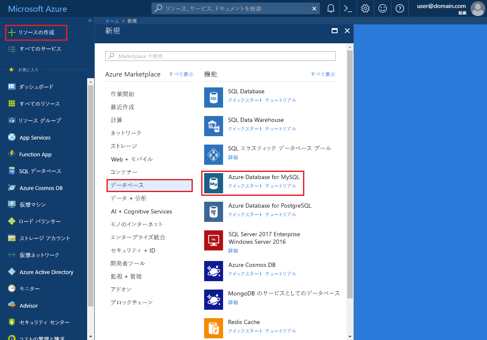

# <a name="create-an-azure-database-for-mysql-server-using-azure-portal"></a>Azure Portal を使用した Azure Database for MySQL サーバーの作成

この記事では、Azure Portal を使用して、5 分程度でサンプルの Azure Database for MySQL サーバーを作成する手順を説明します。 

Azure サブスクリプションをお持ちでない場合は、開始する前に[無料](https://azure.microsoft.com/free/)アカウントを作成してください。

## <a name="log-in-to-azure"></a>Azure へのログイン
Web ブラウザーを開いて、[Microsoft Azure Portal](https://portal.azure.com/) にアクセスします。 資格情報を入力してポータルにログインします。 既定のビューはサービス ダッシュボードです。


## <a name="create-azure-database-for-mysql-server"></a>Azure Database for MySQL サーバーの作成

1. **[データベース]** > **[MySQL]** に移動します。 **[データベース]** カテゴリ内に Azure Database for MySQL サーバーが見つからない場合は、**[すべて表示]** をクリックして、使用可能なすべてのデータベース サービスを表示します。 検索ボックスに「**MySQL**」と入力すれば、サービスをすばやく探せます。


2. **[MySQL]** アイコンをクリックし、**[作成]** をクリックします。
この例では、Azure Database for MySQL のページに次の情報を入力します。

| **フォームのフィールド** | **フィールドの説明** |
|----------------|-----------------------|
| *[サーバー名]* | mysqlserver4demo (サーバー名はグローバルに一意) |
| *サブスクリプション* | MySQLaaS (ドロップダウン リストから選択) |
| *[リソース グループ]* | myresource (リソース グループを作成するか、既存のグループを使用する) |
| *[サーバー管理者ログイン]* | myadmin (管理者アカウント名をセットアップ) |
| *パスワード* | 管理者アカウントのパスワードを設定 |
| *パスワードの確認* | 管理者アカウントのパスワードを確認 |
| *場所* | 北ヨーロッパ (**[北ヨーロッパ]** か **[米国西部]** のいずれかを選択) |
| *バージョン* | 5.6 (MySQL サーバーのバージョンを選択) |
| *[パフォーマンスの構成]* | Basic (**[価格レベル]**、**[コンピューティング ユニット]**、**[ストレージ]** を選択し、**[OK]** をクリック) |


数分間で Azure Database for MySQL サーバーがプロビジョニングされ実行します。 ツール バーの **[通知]** ボタン (ベル アイコン) をクリックすると、デプロイ プロセスを監視できます。

> [!TIP]
> Azure サービスは同じリージョン内に置き、最も近い場所を選択することをお勧めします。 また、**[ダッシュボードにピン留めする]** チェック ボックスをオンにすると、デプロイを追跡しやすくなります。

## <a name="configure-the-firewall"></a>ファイアウォールの構成
クライアントから初めて Azure Database for MySQL に接続する前に、ファイアウォールを構成し、クライアントのパブリック ネットワーク IP アドレス (または IP アドレスの範囲) をホワイト リストに追加する必要があります。

1. 新しく作成したサーバーをクリックし、**[設定]** をクリックします。
  ![Azure Portal - MySQL - [設定] ボタン](./media/quickstart-create-mysql-server-database-using-azure-portal/4_server-settings.png)

2. **[全般]** セクションの下で **[ファイアウォール設定]** をクリックします。 **[自分の IP を追加]** をクリックして、ご使用のローカル コンピューターの IP アドレスを追加したり、IP アドレスの範囲を構成したりできます。 規則を作成したら、忘れずに **[保存]** をクリックしてください。
  

## <a name="get-connection-information"></a>接続情報の取得
Azure Portal で、Azure MySQL サーバーの完全修飾ドメイン名を取得します。 この完全修飾ドメイン名は、**mysql.exe** コマンド ライン ツールでサーバーに接続する際に使用します。

1.    [Azure Portal](https://portal.azure.com/) の左側のメニューにある **[すべてのリソース]** をクリックし、Azure Database for MySQL サーバーをクリックします。

2.    **[プロパティ]**をクリックします。 **[サーバー名]** と **[サーバー管理者ログイン]** の値をメモしておきます。
この例では、サーバー名は *mysql4doc.database.windows.net*、サーバー管理者ログインは *mysqladmin@mysql4doc* です。

## <a name="connect-to-the-server-using-mysqlexe-command-line-tool"></a>mysqlexe コマンドライン ツールを使用したサーバーへの接続
MySQL サーバーに複数のデータベースを作成することができます。 作成できるデータベース数に制限はありませんが、複数のデータベースは同一のサーバー リソースを共有します。  **mysql.exe** コマンドライン ツールを使用してサーバーに接続するには、ポータルで **Azure Cloud Shell** を開いて、次のように入力します。

1. **mysql** コマンドライン ツールを使用してサーバーに接続します。
```dos
 mysql -h mysqlserver4demo.database.windows.net -u myadmin@mysqlserver4demo -p
```

2. サーバーの状態を表示します。
```dos
 mysql> status
```
  

> [!TIP]
> その他のコマンドについては、「[MySQL 5.6 Reference Manual - Chapter 4.5.1](https://dev.mysql.com/doc/refman/5.6/en/mysql.html)」(MySQL 5.6 リファレンス マニュアル- 4.5.1 章) を参照してください。

## <a name="connect-to-the-server-using-the-mysql-workbench-gui-tool"></a>MySQL Workbench GUI ツールを使用したサーバーへの接続
1.    クライアント コンピューターで MySQL Workbench アプリケーションを起動します。 MySQL Workbench は[ここ](https://dev.mysql.com/downloads/workbench/)からダウンロードしてインストールできます。

2.    **[Setup New Connection]** ダイアログ ボックスで、次の情報を **[Parameters]** タブに入力します。

| **パラメーター** | **説明** |
|----------------|-----------------|
|    *Connection Name* | この接続の名前を指定します (任意に指定できます)。 |
| *Connection Method* | Standard (TCP/IP) を選択します。 |
| *Hostname* | mycliserver.database.windows.net (前にメモしておいたサーバー名) |
| *ポート* | 3306 |
| *ユーザー名* | myadmin@mycliserver (前にメモしておいたサーバー管理者ログイン) |
| *パスワード* | 資格情報コンテナーに管理者アカウントのパスワードを格納することができます。 |


3.    **[Test Connection]** をクリックして、すべてのパラメーターが正しく構成されているかをテストします。

4.    これで、作成したばかりの接続をクリックして、サーバーに正常に接続できます。

> ご使用のサーバーには SSL が既定で適用されるため、正常に接続するために追加の構成が必要です。 「[Azure Database for MySQL に安全に接続するためにアプリケーションで SSL 接続を構成する](./howto-configure-ssl.md)」を参照してください。  このクイック スタートで SSL を無効にするのであれば、ポータルの [接続のセキュリティ] で SSL の適用を無効にすることができます。

## <a name="clean-up-resources"></a>リソースのクリーンアップ

これらのリソースが別のクイック スタート/チュートリアルで不要である場合、次のようにして削除することができます。

1. Azure Portal の左側のメニューから、**[リソース グループ]**、**[myresource]** の順にクリックします。 
2. リソース グループのページで **[削除]** をクリックし、テキスト ボックスに「**myresource**」と入力してから **[削除]** をクリックします。

## <a name="next-steps"></a>次のステップ

> [!div class="nextstepaction"]
> [最初の Azure Database for MySQL データベースを設計する](./tutorial-design-database-using-portal.md)


