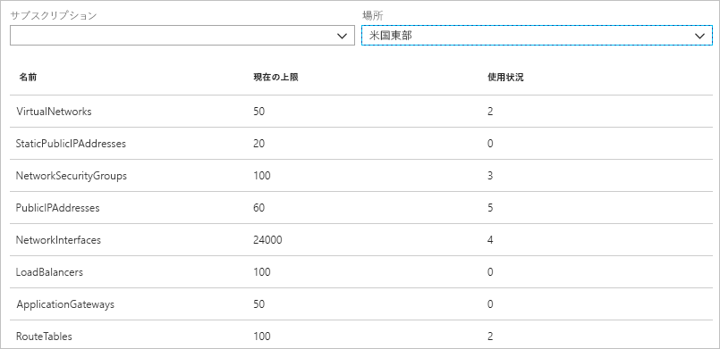
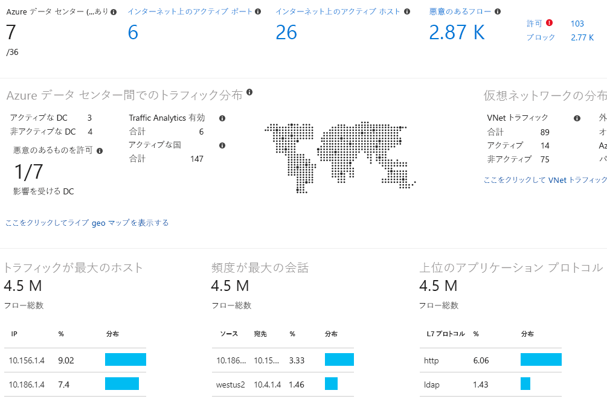

# Azure Network Watcher とは

Azure Network Watcher は、Azure 仮想ネットワーク内のリソースの監視、診断、メトリックの表示、ログの有効化または無効化を行うツールを提供します。

## 監視

### 仮想マシンとエンドポイントの間の通信を監視する

エンドポイントは、別の仮想マシン (VM)、完全修飾ドメイン名 (FQDN)、Uniform Resource Identifier (URI)、または IPv4 アドレスの場合があります。 "*接続監視*" 機能を使用すると、通信を定期的に監視できるほか、VM とエンドポイントの間の到達可能性、待ち時間、ネットワーク トポロジの変更について通知を受け取ることができます。 たとえば、データベース サーバー VM と通信する Web サーバー VM がある場合があります。 組織の他のユーザーが、自分の知らない間に Web サーバー、データベース サーバー VM またはサブネットにカスタム ルートまたはネットワーク セキュリティ規則を適用するかもしれません。

エンドポイントが到達不能になった場合、接続のトラブルシューティングによって理由が通知されます。 理由としては、DNS 名前解決の問題、VM のオペレーティング システム内の CPU、メモリ、ファイアウォール、カスタム ルートのホップの種類、VM またはサブネットの送信接続のセキュリティ規則が考えられます。 詳しくは、Azure の[セキュリティ規則](../virtual-network/security-overview.md?toc=%2fazure%2fnetwork-watcher%2ftoc.json#security-rules)に関するページと[ルートのホップの種類](../virtual-network/virtual-networks-udr-overview.md?toc=%2fazure%2fnetwork-watcher%2ftoc.json)に関するページを参照してください。

また、接続監視では、時間の経過に伴う最小、平均、最大の待ち時間を観察することもできます。 接続の待ち時間を確認すると、場合によっては Azure リソースを異なる Azure リージョンに移行して待ち時間を減らせることがわかります。 詳しくは、[Azure リージョンとインターネット サービス プロバイダーの間の相対待ち時間](#determine-relative-latencies-between-azure- regions-and-internet-service-providers)を確認する方法と、[接続監視](connection-monitor.md)で VM とエンドポイントの間の通信を監視する方法を参照してください。 接続監視で行うような経時的な接続の監視を行うのではなく、ある時点の接続をテストしたい場合、[接続のトラブルシューティング](#connection-troubleshoot)機能を使用します。

### 仮想ネットワーク内のリソースとそれらの関係を表示する

リソースが仮想ネットワークに追加されると、仮想ネットワーク内にあるリソースの内容とそれらのリソースどうしの関係を把握するのが困難になる場合があります。 "*トポロジ*" 機能を使用すると、仮想ネットワーク内のリソースとリソース間の関係を示す図を生成できます。 次の画像は、3 つのサブネット、2 つの VM、ネットワーク インターフェイス、パブリック IP アドレス、ネットワーク セキュリティ グループ、ルート テーブル、およびリソース間の関係が含まれた仮想ネットワークのサンプル トポロジ図を示します。

編集可能なバージョンの画像を SVG 形式でダウンロードできます。 トポロジ ビューの詳細については、[こちら](view-network-topology.md)を参照してください。

## 診断

### VM との間で発生するネットワーク トラフィック フィルターの問題を診断する

VM をデプロイすると、VM との間のトラフィックを許可または拒否するいくつかのセキュリティ規則が既定で VM に適用されます。 Azure の既定の規則を上書きしたり、追加の規則を作成したりできます。 ある時点で、セキュリティ規則が原因となって VM が他のリソースと通信できなくなる場合があります。 "*IP フロー検証*" 機能を使用すると、送信元および宛先 IPv4 アドレス、ポート、プロトコル (TCP または UDP)、トラフィックの方向 (受信または送信) を指定できます。 その後 IP フロー検証によって通信のテストが行われ、接続の成否が通知されます。 接続が失敗した場合、接続を許可または拒否したセキュリティ規則が IP フロー検証によって示されます。これにより、問題を解決できます。 IP フロー検証の詳細については、[こちら](network-watcher-ip-flow-verify-overview.md)を参照してください。

### VM からのネットワーク ルーティングに関する問題を診断する

仮想ネットワークを作成すると、ネットワーク トラフィックの送信ルートが既定でいくつか作成されます。 仮想ネットワーク内にデプロイされたすべてのリソース (VM など) からの送信トラフィックは、Azure の既定のルートに基づいてルーティングされます。 Azure の既定のルートを上書きしたり、追加のルートを作成したりできます。 特定のルートが原因となって VM が他のリソースと通信できなくなる場合があります。 "*次ホップ*" 機能を使用すると、送信元および宛先 IPv4 アドレスを指定できます。 その後、次ホップによって通信のテストが行われ、トラフィックのルーティングに使用される次ホップの種類が通知されます。 ルートを削除、変更、または追加して、ルーティングの問題を解決できます。 次ホップ機能の詳細については、[こちら](network-watcher-next-hop-overview.md?)を参照してください。

### VM からの送信接続を診断する

"*接続のトラブルシューティング*" 機能を使用すると、ある VM と別の VM、FQDN、URI、または IPv4 アドレスとの間の接続をテストできます。 テストは、[接続監視](#connection-monitor)機能を使用した場合に返されるのと同様の情報を返します。しかし、接続監視による経時的な監視とは異なり、テストされるのはある時点の接続です。 接続のトラブルシューティングを使用して接続のトラブルシューティングを行う方法については、[こちら](network-watcher-connectivity-overview.md)を参照してください。

### VM との間のパケットをキャプチャする

時間やサイズの制限を設定する機能など、詳細なフィルター オプションときめ細やかなコントロールにより、多様なキャプチャを行えます。 キャプチャは、Azure Storage、VM のディスク、またはその両方に格納できます。 その後、いくつかの標準的なネットワーク キャプチャ分析ツールを使用して、キャプチャ ファイルを分析できます。 パケット キャプチャの詳細については、[こちら](network-watcher-packet-capture-overview.md)を参照してください。

### Azure 仮想ネットワーク ゲートウェイと接続に関する問題を診断する

仮想ネットワーク ゲートウェイにより、オンプレミスのリソースと Azure 仮想ネットワークを接続できます。 ゲートウェイやその接続の監視は、通信が切断されていないことを確認するために重要です。 "*VPN 診断*" 機能を使用すると、ゲートウェイと接続を診断できます。 VPN 診断では、ゲートウェイまたはゲートウェイ接続の正常性が診断され、ゲートウェイおよびゲートウェイ接続の使用の可否が通知されます。 ゲートウェイまたは接続が使用できない場合、VPN 診断によって原因が示されます。これにより、問題を解決できます。 VPN 診断の詳細については、[こちら](network-watcher-troubleshoot-overview.md)を参照してください。

### Azure リージョンとインターネット サービス プロバイダーの間の相対待ち時間を確認する

Azure リージョン間およびインターネット サービス プロバイダーとの間の待ち時間に関する情報を Network Watcher に照会できます。 Azure リージョン間およびインターネット サービス プロバイダーとの間の待ち時間を確認したら、ネットワーク応答時間が最適化されるよう Azure リソースをデプロイできます。 相対待ち時間の詳細については、[こちら](view-relative-latencies.md)を参照してください。

### ネットワーク インターフェイスのセキュリティ規則を表示する

ネットワーク インターフェイスに効果的なセキュリティ規則は、ネットワーク インターフェイスとそのネットワーク インターフェイスが存在するサブネットに適用されるすべてのセキュリティ規則を組み合わせたものです。  "*セキュリティ グループ ビュー*" 機能では、ネットワーク インターフェイスに適用されたすべてのセキュリティ規則、そのネットワーク インターフェイスが存在するサブネット、それら両方の合計が表示されます。 ネットワーク インターフェイスに適用された規則を理解すれば、変更したいトラフィックが規則によって許可または拒否されている場合に、それらの規則を追加、削除、または変更できます。 セキュリティ グループ ビューの詳細については、[こちら](network-watcher-security-group-view-overview.md)を参照してください。

## メトリック

Azure のサブスクリプションおよびリージョン内で作成できるネットワーク リソースの数には[制限](../azure-subscription-service-limits.md?toc=%2fazure%2fnetwork-watcher%2ftoc.json#azure-resource-manager-virtual-networking-limits)があります。 制限に達すると、サブスクリプション内またはリージョン内でそれ以上リソースを作成できません。 "*ネットワーク サブスクリプションの制限*" 機能を使用すると、サブスクリプションおよびリージョンでデプロイした各ネットワーク リソースの数の概要のほか、リソースに関する制限がわかります。 次の図は、サンプルのサブスクリプションで米国東部リージョンにデプロイされたネットワーク リソースに関する出力を部分的に示しています。

情報は将来のリソース デプロイを計画する際に役立ちます。

## ログ

### ネットワーク セキュリティ グループとの間のトラフィックを分析する

ネットワーク セキュリティ グループ (NSG) を使用すると、VM のネットワーク インターフェイスへの受信トラフィックまたは送信トラフィックを許可または拒否できます。 "*NSG フロー ログ*" 機能では、送信元および宛先 IP アドレス、ポート、プロトコルのほか、トラフィックが NSG によって許可または拒否されたかどうかをログに記録できます。 PowerBI や "*トラフィック分析*" 機能など、さまざまなツールを使用してログを分析できます。 トラフィック分析では、NSG フロー ログに書き込まれたデータを高度に視覚化できます。 次の図には、NSG フロー ログ データに基づいてトラフィック分析が提示した情報と視覚化の一部が示されています。

詳しくは、[NSG フロー ログ](network-watcher-nsg-flow-logging-overview.md)に関するページと[トラフィック分析](traffic-analytics.md)に関するページを参照してください。

### ネットワーク リソースの診断ログを表示する

ネットワーク セキュリティ グループやパブリック IP アドレス、ロード バランサー、仮想ネットワーク ゲートウェイ、アプリケーション ゲートウェイなど、Azure ネットワーク リソースの診断ログを有効にできます。 "*診断ログ*" 機能では、単一のインターフェイスを使用して、診断ログを生成する既存のネットワーク リソースに関するネットワーク リソース診断ログを有効および無効にできます。 診断ログは、Microsoft Power BI や Azure Log Analytics などのツールを使用して表示できます。 Azure ネットワーク診断ログの分析について詳しくは、[Log Analytics の Azure ネットワーク ソリューション](../log-analytics/log-analytics-azure-networking-analytics.md?toc=%2fazure%2fnetwork-watcher%2ftoc.json)に関するページを参照してください。

## 次の手順

Azure Network Watcher の概要については以上です。 Network Watcher の使用を開始するには、IP フロー検証を使用して仮想マシンとの間の通信に関する一般的な問題を診断します。 方法については、[仮想マシン ネットワーク トラフィック フィルターの問題の診断](diagnose-vm-network-traffic-filtering-problem.md)に関するクイック スタートを参照してください。