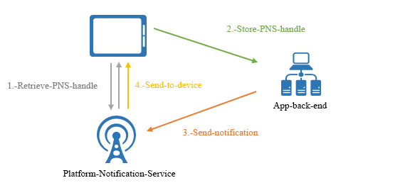
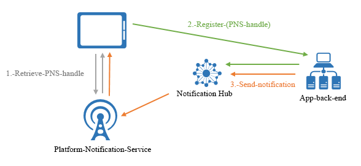

# Azure Notification Hubs とは
Azure Notification Hubs は、任意のバックエンド (クラウドまたはオンプレミス) から任意のプラットフォーム (iOS、Android、Windows、Kindle、Baidu など) に通知を送信できる、使いやすく、かつスケールアウトされたプッシュ エンジンを提供します。 Notification Hubs は、エンタープライズ向けとコンシューマー向けのどちらのシナリオにも適しています。 いくつかのシナリオの例を次に示します。

- ニュース速報の通知を数百万台のデバイスに速やかに送信する。
- 場所に基づいたクーポンを対象のユーザー セグメントに送信する。
- イベント関連の通知を、メディア/スポーツ/金融/ゲーム アプリケーションのユーザーまたはグループに送信する。
- 注意を引いて顧客に販売するために、プロモーション コンテンツをアプリケーションにプッシュする。
- 新着メッセージや作業項目などのエンタープライズ イベントをユーザーに通知する。
- 多要素認証のコードを送信する。

## プッシュ通知とは
プッシュ通知は、アプリからユーザーへの通信手段の 1 つで、モバイル アプリのユーザーが関心を持っている情報について、ポップアップやダイアログ ボックスなどで通知を受け取ることができる機能です。 ユーザーは一般に、メッセージの表示または無視を選択できます。 前者を選択すると、その通知を伝えたモバイル アプリケーションが開きます。

プッシュ通知は、コンシューマー アプリにとってはアプリの関与や使用率を向上させるために、またエンタープライズ アプリにとっては最新のビジネス情報を通信するために不可欠です。 モバイル デバイスにとってはエネルギー効率が良く、通知の送信者にとっては柔軟であり、対応するアプリケーションがアクティブでない場合にも使用できるため、これはアプリからユーザーへの最適な通信方法です。

いくつかの一般的なプラットフォームでのプッシュ通知の詳細については、次のトピックを参照してください。 
* [iOS](https://developer.apple.com/notifications/)
* [Android](https://developer.android.com/guide/topics/ui/notifiers/notifications.html)
* [Windows](http://msdn.microsoft.com/library/windows/apps/hh779725.aspx)

## プッシュ通知のしくみ
プッシュ通知は、"*プラットフォーム通知システム*" (PNS: Platform Notification System) と呼ばれるプラットフォーム独自のインフラストラクチャを利用して配信されます。 これらは、用意されたハンドルを使用してデバイスにメッセージを配信する最小限のプッシュ機能を提供しており、共通のインターフェイスは備えていません。 アプリの iOS、Android、および Windows バージョンにまたがるすべての顧客に通知を送信するには、開発者は Apple Push Notification Service (APNS)、Firebase Cloud Messaging (FCM)、および Windows 通知サービス (WNS) を操作する必要があります。

次の図に、プッシュ機能の概要を示します。

1. クライアント アプリは、通知を受信することを決定します。 そのため、対応する PNS に接続して一意であり、かつ一時的なプッシュ ハンドルを取得します。 ハンドルの種類は、システムによって異なります (たとえば、WNS には URI があるのに対して、APNS にはトークンがあります)。
2. クライアント アプリは、このハンドルをアプリのバックエンドまたはプロバイダーに格納します。
3. プッシュ通知を送信する際には、アプリのバックエンドがハンドルを使用して PNS にアクセスし、特定のクライアント アプリを対象として指定します。
4. PNS はハンドルで指定されたデバイスに通知を転送します。

## プッシュ通知の課題
PNS は強力です。 ただし、一般的なプッシュ通知シナリオ (セグメント化されたユーザーへのプッシュ通知のブロードキャストなど) を実装するためでさえ、多くの作業がアプリ開発者に残されます。

プッシュ通知を送信するには、アプリケーションのメインのビジネス ロジックには関連のない複雑なインフラストラクチャが必要です。 インフラストラクチャの課題には、次のようなものがあります。

- **プラットフォームへの依存**
    - PNS が統一されていないので、さまざまなプラットフォームのデバイスに通知を送信するためには、複雑で保守が難しい、プラットフォームに依存するロジックをバックエンドで用意する必要があります。
- **スケール**
    - PNS のガイドラインに従って、アプリが起動するたびにデバイス トークンを更新する必要があります。 バックエンドは、トークンを最新の状態に維持するためにのみ、大量のトラフィックやデータベース アクセスを処理しています。 デバイスの数が数億台から数十億台にまで増加すると、このインフラストラクチャの作成と保守にかかるコストも膨大になります。
    - ほとんどの PNS は、複数のデバイスに対するブロードキャストをサポートしていません。 100 万台のデバイスへの単純なブロードキャストによって、PNS の 100 万回の呼び出しが発生します。 この量のトラフィックを最小限の遅延でスケーリングするのは簡単なことではありません。
- **ルーティング** 
    - PNS はデバイスにメッセージを送信する機能を備えていますが、ほとんどのアプリの通知はユーザーや特定のグループを対象としています。 バックエンドは、デバイスを対象のグループ、ユーザー、プロパティなどに関連付けるためのレジストリを保持する必要があります。この対策を行うことで、市場投入までの開発期間が長引き、アプリケーションの保守コストも増大します。

## Azure Notification Hubs を使用する理由
Notification Hubs により、アプリ バックエンドから独自にプッシュ通知を送信することに関連した複雑さがすべて排除されます。 そのマルチプラットフォーム対応の、スケールアウトされたプッシュ通知インフラストラクチャによって、プッシュ関連のコーディングが削減され、バックエンドが簡略化されます。 Notification Hubs では、次の図に示すように、デバイス側の処理は PNS ハンドルをハブに登録するだけであり、バックエンドによってメッセージがユーザーまたは対象グループに送信されます。

Notification Hubs はすぐに利用できるプッシュ エンジンであり、次のメリットがあります。

- **クロス プラットフォーム**
    - iOS、Android、Windows のほか、Kindle や Baidu を含むすべての主要なプッシュ プラットフォームをサポートします。
    - すべてのプラットフォームに通知を送信する共通のインターフェイスを備えており、通知をプラットフォームの独自形式で送信することも、プラットフォームに依存しない形式で送信することもできます。プラットフォーム固有の対応は必要ありません。
    - デバイス ハンドルの管理は 1 か所で行えます。
- **クロス バックエンド**
    - クラウドまたはオンプレミスの
    - .NET、Node.js、Java などに対応しています。
- **豊富な一連の配信パターン**
    - 1 つまたは複数のプラットフォームへのブロードキャスト: プラットフォームにまたがる数百万台のデバイスに 1 回の API 呼び出しで直ちにブロードキャストできます。
    - デバイスへのプッシュ: 通知を個々のデバイスに送信できます。
    - ユーザーへのプッシュ: タグおよびテンプレート機能は、ユーザーのすべてのクロスプラットフォーム デバイスに到達するのに役立ちます。
    - 動的タグを使用したセグメントへのプッシュ: タグ機能は、デバイスをセグメント化し、1 つのセグメントまたはセグメントの式 (たとえば、アクティブ AND シアトルに在住 NOT 新規ユーザー) のどちらに送信しているかにかかわらず、ニーズに応じてそれらのデバイスにプッシュするのに役立ちます。 パブリッシャー/サブスクライバー間に制限されず、デバイス タグはいつでもどこでも更新することができます。
    - ローカライズされたプッシュ: テンプレート機能は、バックエンド コードに影響を与えることなくローカライズを実現するのに役立ちます。
    - サイレント プッシュ: デバイスにサイレント通知を送信し、それらをトリガーして特定のプルまたはアクションを完了することによって、push-to-pull パターンを有効にできます。
    - スケジュールされたプッシュ: いつでも通知の送信をスケジュールできます。
    - ダイレクト プッシュ: Notification Hubs サービスへのデバイスの登録を省略し、デバイス ハンドルの一覧に直接バッチでプッシュできます。
    - 個人用に設定されたプッシュ: デバイスのプッシュ変数は、カスタマイズされたキーと値のペアを使用して、デバイス固有の個人用に設定されたプッシュ通知を送信するのに役立ちます。
- **豊富なテレメトリ**
    - 一般的なプッシュ、デバイス、エラー、および操作テレメトリは、Azure Portal とプログラムで使用できます。
    - メッセージごとのテレメトリは、最初の要求呼び出しから Notification Hubs サービスがプッシュの送信を正常にバッチ処理するまで各プッシュを追跡します。
    - プラットフォーム通知システムのフィードバックは、デバッグを支援するために、プラットフォーム通知システムからのすべてのフィードバックを通信します。
- **拡張性** 
    - 再設計やデバイス シャーディングなしで、数百万台のデバイスに高速なメッセージを送信します。
- **セキュリティ**
    - 共有アクセス シークレット (SAS) またはフェデレーション認証。

## App Service Mobile Apps との統合
Azure のサービス間でシームレスかつ同一のエクスペリエンスを実現するために、 [App Service Mobile Apps](../app-service-mobile/app-service-mobile-value-prop.md) には Notification Hubs を使用したプッシュ通知のサポートが組み込まれています。 [App Service Mobile Apps](../app-service-mobile/app-service-mobile-value-prop.md) は、拡張性が高くグローバルに使用可能な、企業の開発者やシステム インテグレーター向けのモバイル アプリ開発プラットフォームで、モバイル開発者に豊富な機能のセットを提供します。

Mobile Apps の開発者は、次のワークフローで Notification Hubs を使用します。

1. デバイスの PNS ハンドルを取得する
2. 便利な Mobile Apps クライアント SDK 登録 API を介して Notification Hubs でデバイスを登録する

    > [!NOTE]
    > Mobile Apps ではセキュリティの目的で登録時にすべてのタグを除去することに注意してください。 タグをデバイスに関連付けるには、Notification Hubs をバックエンドから直接操作します。
1. Notification Hubs を使用してアプリのバックエンドから通知を送信する

この統合は、開発者にいくつかの便利な機能を提供します。

- **Mobile Apps クライアント SDK**: これらのマルチプラットフォーム SDK は登録用のシンプルな API を提供し、モバイル アプリにリンクされている通知ハブと自動的に対話します。 開発者は Notification Hubs の資格情報を掘り下げて追加のサービスを操作する必要はありません。
    - *ユーザーへのプッシュ*: SDK が自動的に指定のデバイスを Mobile Apps の認証済みユーザー ID にタグ付けして、ユーザーへのプッシュ シナリオを有効にします。
    - *デバイスへのプッシュ*: SDK が自動的に Mobile Apps のインストール ID を Notification Hubs に登録する GUID として使用するので、開発者が複数サービスの GUID を維持する手間が省けます。
- **インストール モデル**: Mobile Apps は Notification Hubs の最新のプッシュ モデルと簡単に連携し、プッシュ通知サービスと連携する JSON インストール内のデバイスに関連付けられたすべてのプッシュ プロパティを表します。
- **柔軟性**: 開発者は統合中でも常に Notification Hubs を直接操作することを選択できます。
- **[Azure Portal](https://portal.azure.com) の統合されたエクスペリエンス**: 機能としてのプッシュが Mobile Apps に視覚的に表示され、開発者は Mobile Apps を通じて関連付けられた通知ハブを簡単に操作できます。

## 次の手順
「[チュートリアル: モバイル アプリケーションにプッシュ通知を送信する](notification-hubs-android-push-notification-google-fcm-get-started.md)」に従うことによって、通知ハブの作成および使用を開始してください。 [0]: ./media/notification-hubs-overview/registration-diagram.png [1]: ./media/notification-hubs-overview/notification-hub-diagram.png [How customers are using Notification Hubs]: http://azure.microsoft.com/services/notification-hubs [Notification Hubs tutorials and guides]: http://azure.microsoft.com/documentation/services/notification-hubs [iOS]: http://azure.microsoft.com/documentation/articles/notification-hubs-ios-get-started [Android]: http://azure.microsoft.com/documentation/articles/notification-hubs-android-get-started [Windows Universal]: http://azure.microsoft.com/documentation/articles/notification-hubs-windows-store-dotnet-get-started [Windows Phone]: http://azure.microsoft.com/documentation/articles/notification-hubs-windows-phone-get-started [Kindle]: http://azure.microsoft.com/documentation/articles/notification-hubs-kindle-get-started [Xamarin.iOS]: http://azure.microsoft.com/documentation/articles/partner-xamarin-notification-hubs-ios-get-started [Xamarin.Android]: http://azure.microsoft.com/documentation/articles/partner-xamarin-notification-hubs-android-get-started [Microsoft.WindowsAzure.Messaging.NotificationHub]: http://msdn.microsoft.com/library/microsoft.windowsazure.messaging.notificationhub.aspx [Microsoft.ServiceBus.Notifications]: http://msdn.microsoft.com/library/microsoft.servicebus.notifications.aspx [App Service Mobile Apps]: https://azure.microsoft.com/documentation/articles/app-service-mobile-value-prop/ [templates]: notification-hubs-templates-cross-platform-push-messages.md [Azure portal]: https://portal.azure.com [tags]: (http://msdn.microsoft.com/library/azure/dn530749.aspx)
