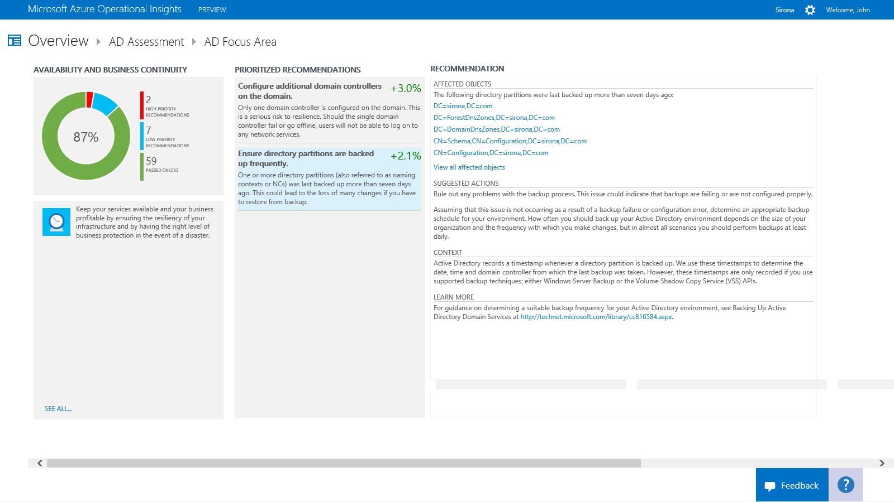

<properties 
   pageTitle="評価インテリジェンス パックによる環境の最適化"
   description="評価インテリジェンス パックを使用して、定期的にサーバー環境のリスクと正常性を評価します"
   services="operational-insights"
   documentationCenter=""
   authors="bandersmsft"
   manager="jwhit"
   editor="tysonn" />
<tags 
   ms.service="operational-insights"
   ms.devlang="na"
   ms.topic="article"
   ms.tgt_pltfrm="na"
   ms.workload="na"
   ms.date="03/20/2015"
   ms.author="banders" />

# 評価インテリジェンス パックによる環境の最適化

評価インテリジェンス パックを使用して、定期的にサーバー環境のリスクと正常性を評価します。デプロイされているサーバー インフラストラクチャに固有の優先順位付けされた推奨事項の一覧を提供します。推奨事項は 6 つの対象領域に分類されているので、インフラストラクチャのリスクと正常性をすばやく把握し、リスク軽減および正常性向上のアクションを簡単に実行できます。

現時点では、次の評価インテリジェンス パックを使用できます。

- Active Directory

- SQL Server

示される推奨事項は、マイクロソフトのエンジニアによる数多くの顧客訪問によって得られた知識と経験に基づいています。各推奨事項では、個々の問題が重要である理由と推奨される変更を実装する方法に関するガイダンスが提供されます。

組織にとって最も重要な対象領域を選択し、リスクのない正常な環境の実行に向けた進行状況を追跡できます。

インテリジェンス パックをインストールして Operations Manager エージェントおよびオペレーション インサイトの基本構成モジュールを更新し、AdvisorAssessment.exe ファイルを監視対象サーバーに追加します。構成データが読み取られ、処理のためにクラウドのオペレーション インサイト サービスに送信されます。受信したデータにロジックが適用され、クラウド サービスによってそのデータが記録されます。評価が完了すると、環境のインフラストラクチャの **[評価]** ダッシュボードに対象領域の概要情報が表示されます。**[評価]** ダッシュボードの情報を使用することにより、サーバー インフラストラクチャを確認し、推奨された解決方法を実行できます。

![[SQL 評価] タイルの画像](./media/operational-insights-assessment/overview-sql-assess.png)

![[SQL 評価] ダッシュボードの画像](./media/operational-insights-assessment/gallery-ad-01.png)

## 評価インテリジェンス パックに関する FAQ

*評価はどのくらいの頻度で実行されますか?* 
評価は 7 日おきに実行されます。

*評価の実行頻度を構成する方法がありますか?* 
現時点ではありません。

*評価インテリジェンス パックを追加後、別のサーバーが検出された場合、それは評価されますか?* 
はい。検出されると、それ以降 7 日おきに評価されます。

*サーバーを使用停止にした場合、それはいつ評価対象から除外されますか?* 
サーバーは、3 週間にわたりデータを送信しない場合、除外されます。

*データ収集を行うプロセスの名前は何ですか?* 
AdvisorAssessment.exe です。

*データの収集にはどれくらいの時間がかかりますか?* 
サーバー上での実際のデータ収集には約 1 時間かかります。Active Directory サーバー、SQL インスタンス、またはデータベースの数が多いサーバーでは、もっと長くなる可能性があります。

*どのような種類のデータが収集されますか?* 
次の種類のデータが収集されます。

- WMI
- レジストリ
- パフォーマンス カウンター
- SQL の動的管理ビュー (DMV)

*データが収集されるタイミングを構成する方法はありますか?* 
現時点ではありません。

*実行アカウントを構成しなければならないのはなぜですか?* 
SQL Server の場合、少数の SQL クエリが実行されます。これらのクエリが動作するためには、SQL に対する VIEW SERVER STATE 権限を持つ実行アカウントを使用する必要があります。さらに、WMI を照会するには、ローカル管理者の資格情報が必要です。

*上位 10 個の推奨事項しか表示されないのはなぜですか?* 
タスクの一覧を余すことなく完全に提供するのでなく、まず優先的な推奨事項への対処に重点を置くことをお勧めしています。優先的な推奨事項に対処すると、追加の推奨事項が表示されます。詳細な一覧を確認する場合は、オペレーション インサイト検索を使用してすべての推奨事項を表示することができます。

*推奨事項を無視する方法はありますか?* 
現時点ではありません。

## 推奨事項の優先順位設定方法について

提供されるすべての推奨事項には、推奨事項の相対的な重要度を示す重み付け値が与えられます。最も重要な 10 個の推奨事項のみが表示されます。

### 重み付けの計算方法

重み付けは、次の 3 つの重要な要因に基づく集計値です。

- 識別された注意点によって問題が発生する*確率*。確率が高いほど、推奨事項に割り当てられる総合スコアが大きくなります。

- 問題が発生する原因となった場合の注意点の組織への*影響度*。影響度が高いほど、推奨事項に割り当てられる総合スコアが大きくなります。

- 推奨実行を実装するために必要な*作業量* 。作業量が多いほど、推奨事項に割り当てられる総合スコアが小さくなります。

各推奨事項に対する重み付けは、各対象領域で使用可能な合計スコアの割合として表されます。たとえば、セキュリティとコンプライアンス対象領域の推奨事項のスコアが 5% である場合、その推奨事項を実装するとセキュリティとコンプライアンスの総合スコアが 5% 上昇します。

### 対象領域

**セキュリティとコンプライアンス** - セキュリティの脅威と侵害から防御し、企業のポリシーを適用して、技術、法律、規制のコンプライアンス要件を満たすことによって、組織の評判を保護します。

**可用性とビジネス継続性** - インフラストラクチャの回復性を確保し、災害時における適切なレベルのビジネス保護を用意することによって、サービスの可用性とビジネスの収益性を維持します。

**パフォーマンスとスケーラビリティ** - IT 環境が現在のパフォーマンス要件を満たし、ビジネス ニーズの変化にすばやく対応できるようにすることによって、組織の成長と革新を支援します。

**アップグレード、移行、デプロイメント** - 最新の実現化技術を最大限に活用して、組織単位、労働力、顧客のより大きいビジネス価値を実現することによって、IT 部門を変革と革新の重要な推進者として位置付けます。

**運用と監視** - IT の運用を合理化し、包括的な予防保守プログラムを実装してビジネス パフォーマンスを最大化することにより、IT 保守予算を削減します。

**変更管理と構成管理** - 変更管理手順を確立し、システムの構成を追跡および監査することにより、組織の日常業務を保護し、変更がビジネスに悪影響を及ぼさないことを保証します。

### すべての対象領域で 100% のスコアを目指す必要がありますか?

必ずしもその必要はありません。示される推奨事項は、マイクロソフトのエンジニアによる数多くの顧客訪問によって得られた知識と経験に基づいています。ただし、まったく同じサーバー インフラストラクチャは存在せず、関連性の高い、または低い推奨事項が存在する可能性があります。たとえば、仮想マシンがインターネットに対して公開されていない場合、セキュリティに関する一部の推奨事項は関連性が低い場合があります。優先度の低いアドホックなデータ収集とレポート作成を提供するサービスの場合、可用性に関する一部の推奨事項は関連性が低い可能性があります。成熟したビジネスにとって重要な問題は、起業したばかりの会社には重要性が低い場合があります。ユーザーが優先度の高い対象領域を識別して、スコアの経時変化を監視できます。

提供されるすべての推奨事項には、その推奨事項が重要である理由についてのガイダンスが含まれます。ユーザーはこのガイダンスを使用し、IT サービスの性質と組織のビジネス ニーズに基づいて、推奨事項を実装することが会社にとって適切かどうかを評価する必要があります。

## 評価の関心領域に関する推奨事項の使用

Microsoft Azure オペレーション インサイトで評価インテリジェンス パックを使用するには、インテリジェンス パックをインストールしておく必要があります。インテリジェンス パックのインストールの詳細については、「[ギャラリーを使用し、インテリジェンス パックを追加または削除する](operational-insights-add-intelligence-pack.md)」を参照してください。インストール後は、オペレーション インサイトの [概要] ページの [評価] タイルを使用して、推奨事項の概要を表示できます。

インフラストラクチャの準拠に関する評価の概要を表示してから、推奨事項を確認できます。

### 対象領域の推奨事項を表示して修正措置を行うには

1. **[概要]** ページで、サーバー インフラストラクチャの **[評価]** タイルをクリックします。

2. **[評価]** ページの対象領域のいずれかのブレードで概要情報を確認し、いずれかの情報をクリックして、その対象領域の推奨事項を表示します。

3. いずれの対象領域ページでも、ユーザーの環境を対象とした、優先順位が付けられた推奨事項を表示できます。推奨事項の理由の詳細を確認するには、その推奨事項をクリックします。**[影響を受けるオブジェクト]** に詳細が表示されます。

4. **[推奨する解決方法]** で推奨された修正措置を行います。項目に対応すると、それ以降の評価では、推奨されたアクションが行われたと記録され、準拠のスコアが上がります。修正された項目は **[合格したオブジェクト]** として表示されます。

<!--HONumber=52-->