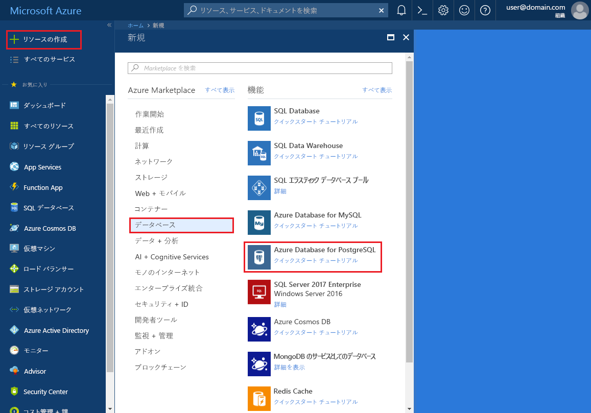

# <a name="create-an-azure-database-for-postgresql-in-the-azure-portal"></a>Azure ポータルで Azure Database for PostgreSQL を作成する

Azure Database for PostgreSQL は、高可用性 PostgreSQL データベースをクラウドで実行、管理、および拡張することができる、管理されたサービスです。 このクイック スタートでは、Azure ポータルを使用して Azure Database for PostgreSQL サーバーを作成する方法を説明します。

Azure サブスクリプションをお持ちでない場合は、開始する前に[無料](https://azure.microsoft.com/free/)アカウントを作成してください。

## <a name="log-in-to-the-azure-portal"></a>Azure ポータルにログインする

[Azure ポータル](https://portal.azure.com)にログインします。

## <a name="create-an-azure-database-for-postgresql"></a>Azure Database for PostgreSQL の作成

Azure Database for PostgreSQL サーバーは、定義済みの一連の[コンピューティング リソースとストレージ リソース](./concepts-compute-unit-and-storage.md)を使って作成されます。 サーバーは、[Azure リソース グループ](../azure-resource-manager/resource-group-overview.md)内に作成されます。

Azure Database for PostgreSQL サーバーを作成するには、次の手順に従います。
1.  Azure ポータルの左上隅にある **[新規]** ボタンをクリックします。
2.  **[新規]** ページで **[データベース]** を選択し、**[データベース]** ページで **[Azure Database for PostgreSQL]** を選択します。
 

3.  前の画像で示されているように、新規サーバーの詳細フォームに次の情報を入力します。
    - サーバー名: **mypgserver-20170401** (サーバーの名前は DNS 名にマップするため、Azure でグローバルに一意である必要があります) 
    - サブスクリプション: 複数のサブスクリプションをお持ちの場合は、リソースが存在するか、課金の対象となっている適切なサブスクリプションを選択してください。
    - リソース グループ: **myresourcegroup**
    - サーバー管理者のログインとパスワード
    - 場所
    - PostgreSQL のバージョン

  > [!IMPORTANT]
  > ここで指定するサーバー管理者ログインとパスワードは、このクイック スタートの後の方でサーバーとそのデータベースにログインするために必要です。 後で使用するために、この情報を覚えておくか、記録しておきます。

4.  **[価格レベル]** をクリックして、新しいデータベースのサービス レベルとパフォーマンス レベルを指定します。 このクイック スタートでは、**Basic** レベル、**50 個のコンピューティング ユニット**、および **50 GB** のストレージを選択します。
 
5.  **[OK]**をクリックします。
6.  **[作成]** をクリックしてサーバーをプロビジョニングします。 プロビジョニングには数分かかります。

  > [!TIP]
  > **[ダッシュボードにピン留めする]** チェック ボックスをオンにすると、デプロイを追跡しやすくなります。

7.  ツール バーの **[通知]** をクリックして、デプロイ プロセスを監視します。
 
   
  既定では、**postgres** データベースがサーバーに作成されます。 [postgres](https://www.postgresql.org/docs/9.6/static/app-initdb.html) は既定のデータベースで、ユーザー、ユーティリティ、およびサード パーティ製のアプリケーションが使用するためのものです。 

## <a name="configure-a-server-level-firewall-rule"></a>サーバーレベルのファイアウォール規則の構成

Azure Database for PostgreSQL サービスは、サーバーレベルでファイアウォールを作成します。 このフィアイアウォールにより、外部のアプリケーションやツールから、サーバーまたはサーバー上のすべてのデータベースへの接続が禁止されます。接続を許可するためには、特定の IP アドレスに対して、ファイアウォールを開放するファイアウォール規則を作成する必要があります。 

1.  デプロイが完了したら、左側のメニューの **[すべてのリソース]** をクリックし、サーバー名「**mypgserver 20170401**」を入力して、新しく作成したサーバーを検索します。 検索結果に示されたサーバー名をクリックします。 サーバーの **[概要]** ページが開き、さらに多くの構成オプションが表示されます。
 
 

2.  サーバーのブレードで、**[接続のセキュリティ]** を選択します。 
3.  **[規則名]** の下のテキスト ボックス内をクリックし、接続を許可する IP の範囲をホワイトリストに追加する新しいファイアウォール規則を追加します。 このクイック スタートではすべての IP を許可するため、「**規則名 = AllowAllIps**」、「**開始 IP = 0.0.0.0**」、「**終了 IP = 255.255.255.255**」と入力し、**[保存]** をクリックします。 ネットワークからの接続が可能な IP 範囲を指定するファイアウォール規則を設定することができます。

 

4.  **[保存]** をクリックしてから **[X]** をクリックして、**[接続のセキュリティ]** ページを閉じます。

  > [!NOTE]
  > Azure PostgreSQL サーバーはポート 5432 を介して通信します。 企業ネットワーク内から接続しようとしても、ポート 5432 での送信トラフィックがネットワークのファイアウォールで禁止されている場合があります。 その場合、会社の IT 部門によってポート 5432 が開放されない限り、Azure SQL Database サーバーに接続することはできません。
  >

## <a name="get-the-connection-information"></a>接続情報の取得

Azure Database for PostgreSQL サーバーを作成したときに、既定の **postgres** データベースも作成されています。 データベース サーバーに接続するには、ホスト情報とアクセス資格情報を提供する必要があります。

1. Azure ポータルの左側のメニューにある **[すべてのリソース]** をクリックし、作成したばかりのサーバー「**mypgserver-20170401**」を検索します。

  

2. サーバー名 **[mypgserver-20170401]** をクリックします。
3. サーバーの **[概要]** ページを選択します。 **[サーバー名]** と **[サーバー管理者ログイン名]** の値を書き留めておきます。

 

## <a name="connect-to-postgresql-database-using-psql-in-cloud-shell"></a>Cloud Shell で psql を使用して PostgreSQL データベースに接続する

ここでは psql コマンド ライン ユーティリティを使用して、Azure Database for PostgreSQL サーバーに接続しましょう。 
1. 上部のナビゲーション ウィンドウで、ターミナルのアイコンをクリックして Azure Cloud Shell を起動します。

   

2. Azure Cloud Shell がブラウザで開き、bash コマンドを入力できます。

   

3. Cloud Shell プロンプトで、psql コマンドを使用して Azure Database for PostgreSQL サーバーに接続します。 [psql](https://www.postgresql.org/docs/9.6/static/app-psql.html) ユーティリティで Azure Database for PostgreSQL サーバーに接続するには、次の形式を使用します。
   ```bash
   psql --host=<myserver> --port=<port> --username=<server admin login> --dbname=<database name>
   ```

   たとえば次のコマンドは、アクセス資格情報を使用して、PostgreSQL サーバー **mypgserver 20170401.postgres.database.azure.com** にある既定のデータベース **postgres** に接続します。 サーバー管理者のパスワードを求められたら、入力します。

   ```bash
   psql --host=mypgserver-20170401.postgres.database.azure.com --port=5432 --username=mylogin@mypgserver-20170401 --dbname=postgres
   ```
4.  サーバーに接続したら、プロンプトで空のデータベースを作成します。
```bash
CREATE DATABASE mypgsqldb;
```

5.  プロンプトで次のコマンドを実行し、新しく作成したデータベース **mypgsqldb** に接続を切り替えます。
```bash
\c mypgsqldb
```

## <a name="connect-to-postgresql-database-using-pgadmin"></a>pgAdmin を使用した PostgreSQL データベースへの接続

GUI ツール _pgAdmin_ を使用して Azure PostgreSQL に接続する手順は次のとおりです。
1.  クライアント コンピューターで _pgAdmin_ アプリケーションを起動します。 _pgAdmin_ は http://www.pgadmin.org/ からインストールできます。
2.  **[Quick Links (クイック リンク)]** メニューの **[Add New Server (新しいサーバーの追加)]** を選択します。
3.  **[Create - Server (作成 - サーバー)]** ダイアログ ボックスの **[General (全般)]** タブに、サーバーの一意のフレンドリ名を入力します (**Azure PostgreSQL Server** など)。

4.  **[Create - Server (作成 - サーバー)]** ダイアログ ボックスの **[Connection (接続)]** タブで、指定された設定を使用し、**[Save (保存)]** をクリックします。
   
    - **Host Name/Address (ホスト名/アドレス)**: mypgserver-20170401.postgres.database.azure.com 
        - 完全修飾サーバー名です。
    - **Port (ポート):** 5432
        - このデータベース サーバーで使用されるポート番号は 5432 です。
    - **Maintenance Database (メンテナンス データベース):** postgres 
        - システムによって生成される既定のデータベース名です。
    - **User Name (ユーザー名):** mylogin@mypgserver-20170401 
        - このクイック スタートの前の手順で取得したサーバー管理者ログイン (user@mypgserver) です。
    - **Password (パスワード)**: このクイック スタートでサーバーを作成するときに選択したパスワードです。
    - **SSL Mode (SSL モード):** 必須
        - 既定では、すべての Azure PostgreSQL サーバーは SSL 適用が有効化された状態で作成されます。 SSL 適用を無効にするには、[SSL の適用](./concepts-ssl-connection-security.md)に関する記事を参照してください。
5.  **[Save (保存)]** をクリックします。
6.  左側の [Browser (ブラウザー)] ウィンドウで **[Servers Groups (サーバー グループ)]** を展開します。 サーバー **Azure PostgreSQL Server** を選択します。
7.  接続した**サーバー**を選択してから、その下の **[Databases (データベース)]** を選択します。 
8.  **[Databases (データベース)]** を右クリックしてデータベースを作成します。
9.  データベース名 **mypgsqldb** と、その所有者としてサーバー管理者ログイン **mylogin** を選択します。
10. **[Save (保存)]** をクリックして、空のデータベースを作成します。
11. **[Browser (ブラウザー)]** で **[Servers (サーバー)]**を展開します。 作成したサーバーを展開すると、その下にデータベース **mypgsqldb** が表示されます。
 


## <a name="clean-up-resources"></a>リソースのクリーンアップ
[Azure リソース グループ](../azure-resource-manager/resource-group-overview.md)を削除して、クイックスタートで作成したすべてのリソースをクリーンアップします。

> [!TIP]
> このコレクションの他のクイック スタートは、このクイック スタートに基づいています。 引き続きクイック スタートの作業を行う場合は、このクイック スタートで作成したリソースをクリーンアップしないでください。 これ以上作業を行わない場合は、次の手順に従って、このクイック スタートで作成したすべてのリソースを Azure ポータルで削除してください。

1.  Azure ポータルの左側のメニューから、**[リソース グループ]**、**[myResourceGroup]** の順にクリックします。
2.  リソース グループのページで **[削除]** をクリックし、テキスト ボックスに「**myResourceGroup**」と入力してから [削除] をクリックします。

新しく作成したサーバーのみを削除する場合は次のようにします。
1.  Azure ポータルの左側のメニューにある PostgreSQL サーバーをクリックし、作成したばかりのサーバーを検索します。
2.  [概要] ページで、上部のウィンドウの [削除] ボタンをクリックします。
3.  削除するサーバーの名前を確認し、影響を受けるデータベースをその下に表示します。 テキスト ボックスに「**mypgserver-20170401**」と入力し、[削除] をクリックします。

## <a name="next-steps"></a>次のステップ
> [!div class="nextstepaction"]
> [エクスポートとインポートを使用したデータベースの移行](./howto-migrate-using-export-and-import.md)

