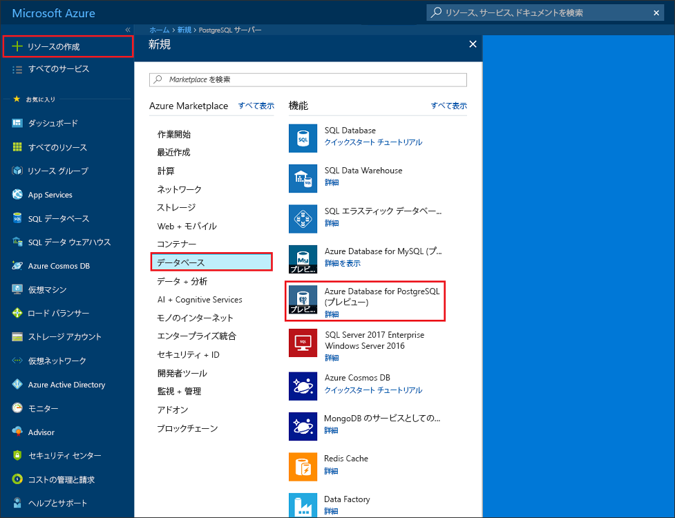
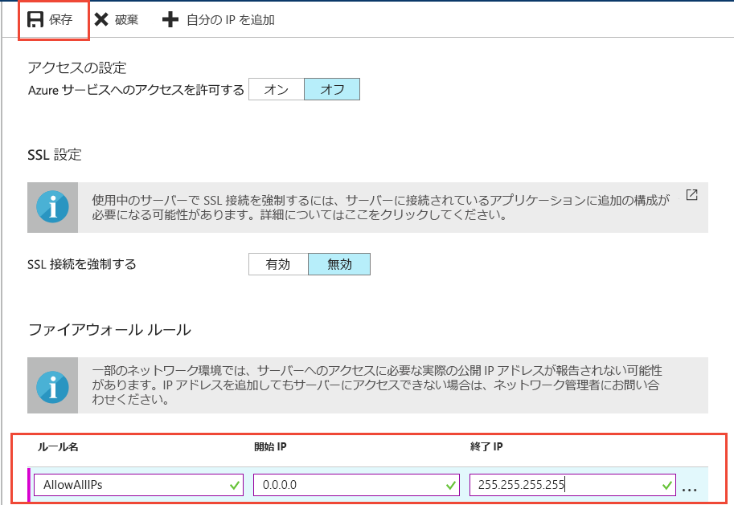

# <a name="tutorial-design-an-azure-database-for-postgresql-using-the-azure-portal"></a>チュートリアル: Azure Portal を使用して Azure Database for PostgreSQL を設計する

Azure Database for PostgreSQL は、高可用性 PostgreSQL データベースをクラウドで実行、管理、および拡張することができる、管理されたサービスです。 Azure Portal を使用して、簡単にサーバーを管理し、データベースを設計することができます。

このチュートリアルでは、Azure Portal を使用して次のことを行う方法を説明します。
> [!div class="checklist"]
> * Azure Database for PostgreSQL サーバーの作成
> * サーバーのファイアウォールの構成
> * [**psql**](https://www.postgresql.org/docs/9.6/static/app-psql.html) ユーティリティを使用したデータベースの作成
> * サンプル データの読み込み
> * データのクエリを実行する
> * データの更新
> * データの復元

## <a name="prerequisites"></a>前提条件
Azure サブスクリプションをお持ちでない場合は、開始する前に[無料](https://azure.microsoft.com/free/)アカウントを作成してください。

## <a name="log-in-to-the-azure-portal"></a>Azure Portal にログインする
[Azure Portal](https://portal.azure.com) にログインします。

## <a name="create-an-azure-database-for-postgresql"></a>Azure Database for PostgreSQL の作成

Azure Database for PostgreSQL サーバーは、定義済みの一連の[コンピューティング リソースとストレージ リソース](./concepts-compute-unit-and-storage.md)を使って作成されます。 サーバーは、[Azure リソース グループ](../azure-resource-manager/resource-group-overview.md)内に作成されます。

Azure Database for PostgreSQL サーバーを作成するには、次の手順に従います。
1.  Azure Portal の左上隅にある **[リソースの作成]** をクリックします。
2.  **[新規]** ページで **[データベース]** を選択し、**[データベース]** ページで **[Azure Database for PostgreSQL]** を選択します。
  

3.  新しいサーバーの詳細フォームには次の情報を入力してください。

    

    - サーバー名: **mydemoserver** (サーバーの名前は DNS 名にマップするため、Azure でグローバルに一意である必要があります) 
    - サブスクリプション: 複数のサブスクリプションをお持ちの場合は、リソースが存在するか、課金の対象となっている適切なサブスクリプションを選択してください。
    - リソース グループ: **myresourcegroup**
    - サーバー管理者のログインとパスワード
    - 場所
    - PostgreSQL のバージョン

   > [!IMPORTANT]
   > ここで指定するサーバー管理者のログイン名とパスワードは、このチュートリアルの後半でサーバーとそのデータベースにログインするために必要です。 後で使用するために、この情報を覚えておくか、記録しておきます。

4.  **[価格レベル]** をクリックして、新しいサーバーの価格レベルを指定します。 このチュートリアルでは、**汎用**、**Gen 4** コンピューティング世代、2 **仮想コア**、5 GB の**ストレージ**を選択します。また、**バックアップの保有期間**は 7 日に設定します。 **[地理冗長]** バックアップ冗長オプションを選択して、サーバーの自動バックアップを geo 冗長ストレージに保存します。
 

5.  **[OK]**をクリックします。

6.  **[作成]** をクリックしてサーバーをプロビジョニングします。 プロビジョニングには数分かかります。

7.  ツール バーの **[通知]** をクリックして、デプロイ プロセスを監視します。
 

   > [!TIP]
   > **[ダッシュボードにピン留めする]** チェック ボックスをオンにすると、デプロイを追跡しやすくなります。

   既定では、**postgres** データベースがサーバーに作成されます。 [postgres](https://www.postgresql.org/docs/9.6/static/app-initdb.html) は既定のデータベースで、ユーザー、ユーティリティ、およびサード パーティ製のアプリケーションが使用するためのものです。 

## <a name="configure-a-server-level-firewall-rule"></a>サーバーレベルのファイアウォール規則の構成

Azure Database for PostgreSQL サービスは、サーバーレベルでファイアウォールを使用します。 既定では、このファイアウォールにより、外部のすべてのアプリケーションやツールから、サーバーまたはサーバー上のすべてのデータベースへの接続が禁止されます。接続を許可するためには、特定の IP アドレス範囲に対して、ファイアウォールを開放するファイアウォール規則を作成する必要があります。 

1.  デプロイが完了したら、左側のメニューの **[すべてのリソース]** をクリックし、サーバー名「**mydemoserver**」を入力して、ご利用の新しく作成したサーバーを検索します。 検索結果に示されたサーバー名をクリックします。 サーバーの **[概要]** ページが開き、さらに多くの構成オプションが表示されます。

   

2.  サーバーのページで、**[接続のセキュリティ]** を選択します。 

3.  **[規則名]** の下のテキスト ボックス内をクリックし、接続を許可する IP の範囲をホワイトリストに追加する新しいファイアウォール規則を追加します。 このチュートリアルではすべての IP を許可するため、「**規則名 = AllowAllIps**」、「**開始 IP = 0.0.0.0**」、「**終了 IP = 255.255.255.255**」と入力し、**[保存]** をクリックします。 ネットワークからの接続が可能な IP 範囲をより小さく指定する明示的なファイアウォール規則を設定することができます。

   

4.  **[保存]** をクリックしてから **[X]** をクリックして、**[接続のセキュリティ]** ページを閉じます。

   > [!NOTE]
   > Azure PostgreSQL サーバーはポート 5432 を介して通信します。 企業ネットワーク内から接続しようとしても、ポート 5432 での送信トラフィックがネットワークのファイアウォールで禁止されている場合があります。 その場合、会社の IT 部門によってポート 5432 が開放されない限り、Azure SQL Database サーバーに接続することはできません。
   >

## <a name="get-the-connection-information"></a>接続情報の取得

Azure Database for PostgreSQL サーバーを作成したときに、既定の **postgres** データベースも作成されています。 データベース サーバーに接続するには、ホスト情報とアクセス資格情報を提供する必要があります。

1. Azure Portal の左側のメニューにある **[すべてのリソース]** をクリックし、作成したばかりのサーバーを検索します。

   

2. サーバー名 **[mydemoserver]** をクリックします。

3. サーバーの **[概要]** ページを選択します。 **[サーバー名]** と **[サーバー管理者ログイン名]** の値を書き留めておきます。

   


## <a name="connect-to-postgresql-database-using-psql-in-cloud-shell"></a>Cloud Shell で psql を使用して PostgreSQL データベースに接続する

ここでは [psql](https://www.postgresql.org/docs/9.6/static/app-psql.html) コマンド ライン ユーティリティを使用して、Azure Database for PostgreSQL サーバーに接続しましょう。 
1. 上部のナビゲーション ウィンドウで、ターミナルのアイコンをクリックして Azure Cloud Shell を起動します。

   

2. Azure Cloud Shell がブラウザで開き、bash コマンドを入力できます。

   

3. Cloud Shell プロンプトで、psql コマンドを使用して Azure Database for PostgreSQL サーバーに接続します。 [psql](https://www.postgresql.org/docs/9.6/static/app-psql.html) ユーティリティで Azure Database for PostgreSQL サーバーに接続するには、次の形式を使用します。
   ```bash
   psql --host=<myserver> --port=<port> --username=<server admin login> --dbname=<database name>
   ```

   たとえば次のコマンドは、アクセス資格情報を使用して、PostgreSQL サーバー **mydemoserver.postgres.database.azure.com** にある既定のデータベース **postgres** に接続します。 サーバー管理者のパスワードを求められたら、入力します。

   ```bash
   psql --host=mydemoserver.postgres.database.azure.com --port=5432 --username=myadmin@mydemoserver --dbname=postgres
   ```

## <a name="create-a-new-database"></a>新しいデータベースの作成
サーバーに接続したら、プロンプトで空のデータベースを作成します。
```bash
CREATE DATABASE mypgsqldb;
```

プロンプトで次のコマンドを実行し、新しく作成したデータベース **mypgsqldb** に接続を切り替えます。
```bash
\c mypgsqldb
```
## <a name="create-tables-in-the-database"></a>データベースのテーブルを作成する
Azure Database for PostgreSQL に接続する方法を説明したので、次はいくつかの基本的なタスクを実行します。

最初に、テーブルを作成してデータを読み込みます。 次の SQL コードを使用して、インベントリ情報を追跡するテーブルを作成しましょう。
```sql
CREATE TABLE inventory (
    id serial PRIMARY KEY, 
    name VARCHAR(50), 
    quantity INTEGER
);
```

次のように入力すると、新しく作成されたテーブルが一覧に表示されます。
```sql
\dt
```

## <a name="load-data-into-the-tables"></a>テーブルにデータを読み込む
テーブルを作成したので、次はデータを挿入します。 開いているコマンド プロンプト ウィンドウで、次のクエリを実行してデータ行を挿入します。
```sql
INSERT INTO inventory (id, name, quantity) VALUES (1, 'banana', 150); 
INSERT INTO inventory (id, name, quantity) VALUES (2, 'orange', 154);
```

これで、先ほど作成したインベントリ テーブルにサンプル データが 2 行挿入されました。

## <a name="query-and-update-the-data-in-the-tables"></a>クエリを実行し、テーブル内のデータを更新する
次のクエリを実行して、インベントリ データベース テーブルから情報を取得します。 
```sql
SELECT * FROM inventory;
```

さらに、テーブル内のデータを更新することもできます。
```sql
UPDATE inventory SET quantity = 200 WHERE name = 'banana';
```

データを取得すると、更新された値を見ることができます。
```sql
SELECT * FROM inventory;
```

## <a name="restore-data-to-a-previous-point-in-time"></a>以前の特定の時点にデータを復元する
テーブルを誤って削除した場合を想定してください。 データの復元は容易なことではありません。 Azure Database for PostgreSQL では、サーバーのバックアップがある任意の時点 (設定したバックアップ リテンション期間によって決まります) に遡って、新しいデータベースに過去のデータを復元できます。 この新しいサーバーを使用して、削除されたデータを復元することができます。 次の手順を実行して、インベントリ テーブルを追加する前の状態に **mydemoserver** サーバーを復元します。

1.  サーバーの Azure Database for PostgreSQL の **[概要]** ページで、ツール バーの **[復元]** をクリックします。 **[復元]** ページが開きます。

   ![Azure portal - [復元] フォームのオプション](./media/tutorial-design-database-using-azure-portal/9-azure-portal-restore.png)

2.  **[復元]** フォームに必要な情報を入力します。

   ![Azure portal - [復元] フォームのオプション](./media/tutorial-design-database-using-azure-portal/10-azure-portal-restore.png)

   - **復元ポイント**: サーバーが変更される前の日時を選択します。
   - **対象サーバー:** 復元先の新しいサーバー名を指定します
   - **場所:** リージョンを選択することはできません。既定では、ソース サーバーと同じ場所になります
   - **価格レベル:** サーバーを復元するときは、この値を変更することはできません。 ソース サーバーと同じレベルになります。 
3.  **[OK]** をクリックして、テーブルが削除される前の[状態にサーバーを復元](./howto-restore-server-portal.md)します。 異なる時点にサーバーを復元すると、[価格レベル](./concepts-pricing-tiers.md)のリテンション期間内であれば、指定した時点の元サーバーと同じサーバー内に、新しいサーバーが複製されます。

## <a name="next-steps"></a>次の手順
このチュートリアルでは、Azure Portal とその他のユーティリティを使用して、次のことを行う方法を説明しました。
> [!div class="checklist"]
> * Azure Database for PostgreSQL サーバーの作成
> * サーバーのファイアウォールの構成
> * [**psql**](https://www.postgresql.org/docs/9.6/static/app-psql.html) ユーティリティを使用したデータベースの作成
> * サンプル データの読み込み
> * データのクエリを実行する
> * データの更新
> * データの復元

次は、チュートリアル「[Azure CLI を使用して最初の Azure Database for PostgreSQL を設計する](tutorial-design-database-using-azure-cli.md)」に進んで、Azure CLI を使って同様のタスクを行う方法を学習してください
