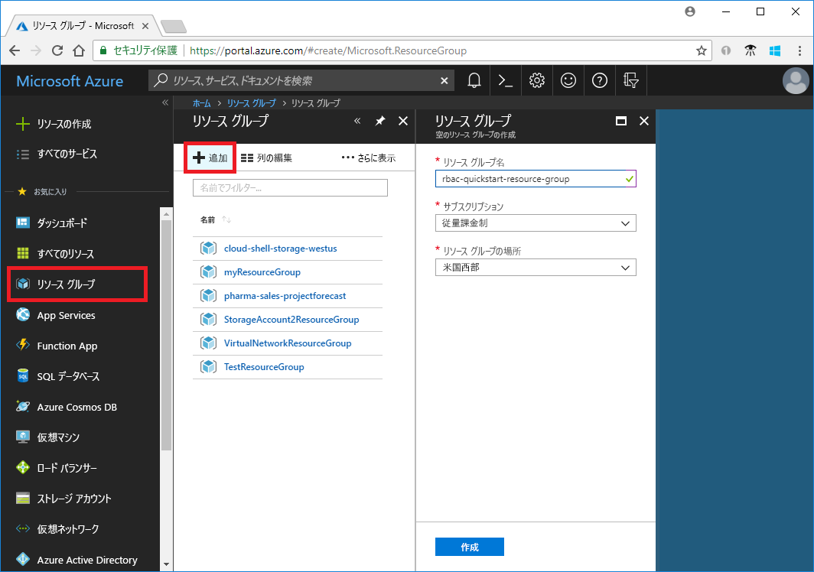
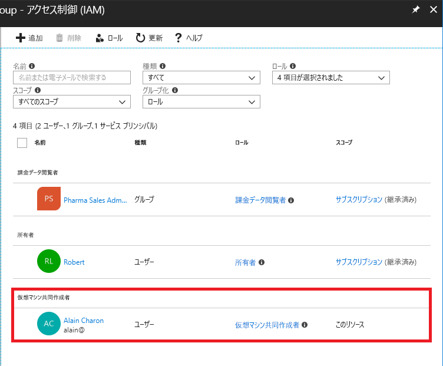

# クイック スタート: RBAC と Azure portal を使用してユーザーにアクセス権を付与する

ロールベースのアクセス制御 (RBAC) は、Azure に存在するリソースに対するアクセス権を管理するための手法です。 このクイック スタートでは、ユーザーに対してリソース グループ内で仮想マシンを作成および管理するアクセス許可を付与します。

Azure サブスクリプションをお持ちでない場合は、開始する前に [無料アカウント](https://azure.microsoft.com/free/?WT.mc_id=A261C142F) を作成してください。

## Azure へのサインイン

Azure Portal ( http://portal.azure.com ) にサインインします。

## リソース グループの作成

1. ナビゲーション リストで、**[リソース グループ]** を選択します。

1. **[Add]\(追加)** を選択し、**[リソース グループ]** ブレードを開きます。

   

1. **[リソース グループ名]** に **rbac-quickstart-resource-group** と入力します。

1. サブスクリプションと場所を選択します。

1. **[作成]** を選択してリソース グループを作成します。

1. **[更新]** を選択してリソース グループの一覧を更新します。

   新しいリソース グループがリソース グループの一覧に表示されます。

   

## アクセス権の付与

RBAC でアクセス権を付与するには、ロールの割り当てを作成します。

1. **[リソース グループ]** の一覧で、新しい **rbac-quickstart-resource-group** リソース グループを選択します。

1. **[アクセス制御 (IAM)]** を選択すると、ロールの割り当ての現在の一覧が表示されます。

   ![リソース グループの [アクセス制御 (IAM)] ブレード](./media/quickstart-assign-role-user-portal/access-control.png)

1. **[追加]** を選択して **[アクセス許可の追加]** ウィンドウを開きます。

   ロールを割り当てるためのアクセス許可がない場合には、**[追加]** オプションが表示されません。

   ![[アクセス許可の追加] ウィンドウ](./media/quickstart-assign-role-user-portal/add-permissions.png)

1. **[ロール]** ドロップダウン リストで、**[仮想マシン共同作成者]** を選択します。

1. **[選択]** 一覧で、自分または別のユーザーを選択します。

1. **[保存]** を選択して、ロールの割り当てを作成します。

   しばらくすると、rbac-quickstart-resource-group リソース グループ スコープにおける仮想マシン共同作成者ロールがユーザーに割り当てられます。

   

## アクセス権の削除

RBAC では、アクセス権を削除するにはロールの割り当てを削除する必要があります。

1. ロールの割り当ての一覧で、仮想マシン共同作成者ロールを持つユーザーの横にチェック マークを追加します。

1. **[削除]** を選択します。

   

1. ロールの割り当ての削除メッセージが表示されたら、**[はい]** をクリックします。

## クリーンアップ

1. ナビゲーション リストで、**[リソース グループ]** を選択します。

1. **rbac-quickstart-resource-group** を選択してリソース グループを開きます。

1. **[リソース グループの削除]** を選択してリソース グループを削除します。

   

1. **[削除しますか]** ブレードにリソース グループ名 **rbac-quickstart-resource-group** を入力します。

1. **[削除する]** を選択してリソース グループを削除します。

## 次の手順

> [!div class="nextstepaction"]
> [チュートリアル: RBAC と PowerShell を使用してユーザーにアクセス権を付与する](tutorial-role-assignments-user-powershell.md)

