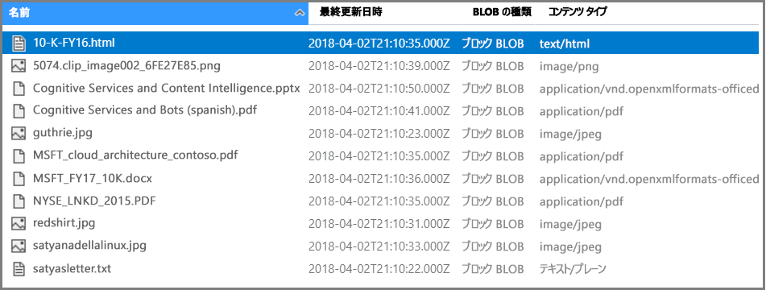
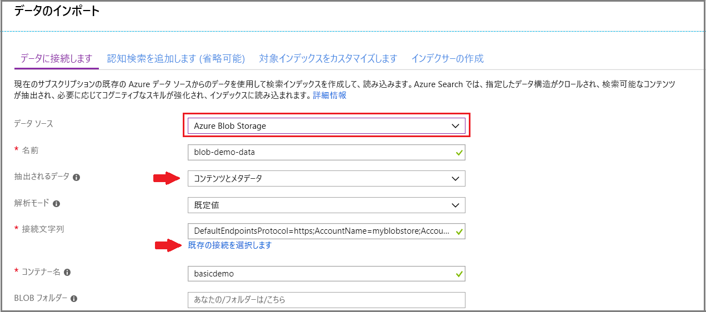
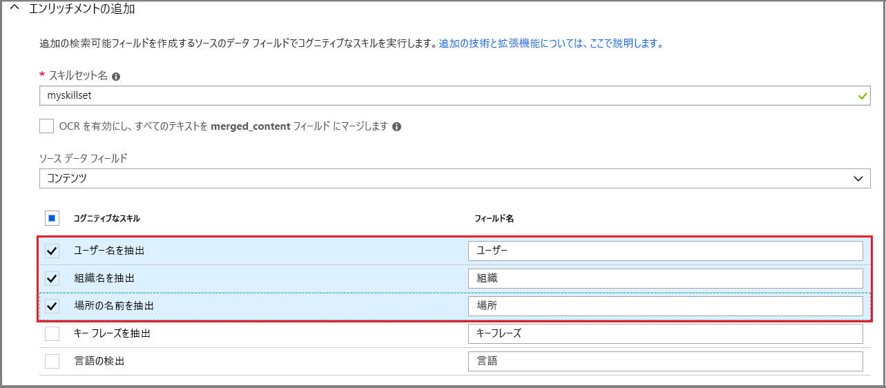

# クイック スタート: スキルとサンプル データを使用したコグニティブ検索パイプラインの作成

コグニティブ検索 (プレビュー) は、データの抽出、自然言語処理 (NLP)、画像処理のスキルを Azure Search インデックス作成パイプラインに追加して、検索できないコンテンツや非構造化コンテンツを検索可能にします。 エンティティの認識または画像分析などのスキルによって作成された情報は、Azure Search のインデックスに追加されます。

このクイックスタートでは、1 行のコードを記述する前に、[Azure Portal](https://portal.azure.com) でのエンリッチメント パイプラインを試してみます。

* Azure Blob Storage のサンプル データから始める
* [データのインポート ウィザード](search-import-data-portal.md)をインデックス作成とエンリッチメント用に構成する 
* ウィザードを実行する (エンティティ スキルで人、場所、および組織を検出する)
* [Search エクスプローラー](search-explorer.md)を使って、エンリッチされたデータのクエリを実行する。

コグニティブ検索は、次の地域で作成された Azure Search サービスで試してみることができます。

* 米国中南部
* 西ヨーロッパ

Azure サブスクリプションをお持ちでない場合は、開始する前に [無料アカウント](https://azure.microsoft.com/free/?WT.mc_id=A261C142F) を作成してください。

## 前提条件

[「コグニティブ検索とは」](cognitive-search-concept-intro.md) では、エンリッチメントのアーキテクチャとコンポーネントについて説明しています。 

Azure サービスはこのシナリオでのみ使用されます。 必要なサービスの作成は、準備の一環です。

+ Azure Blob Storage はソース データを提供します。
+ Azure Search は、データ インジェストとインデックス作成、コグニティブ検索のエンリッチメント、およびフルテキスト検索クエリを処理します。

### Azure Search を設定する

最初に、Azure Search サービスにサインアップします。 

1. [Azure Portal](https://portal.azure.com) に移動し、Azure アカウントを使用してサインインします。

1. **[リソースの作成]** をクリックし、Azure Search を検索して、**[作成]** をクリックします。 Search サービスを設定するのが初めてのために、さらにサポートが必要な場合は、「[ポータルでの Azure Search サービスの作成](search-create-service-portal.md)」をご覧ください。

  

1. [リソース グループ] では、このクイックスタートで作成するすべてのリソースを含めるリソース グループを作成します。 これにより、クイックスタートが完了した後で、リソースをクリーンアップしやすくなります。

1. [場所] では、**[米国中南部]** または **[西ヨーロッパ]** のいずれかを選択します。 現在のところ、プレビューはこれらの領域でのみ使用可能です。

1. [価格レベル] では、チュートリアルとクイックスタートを完了するために、**Free** のサービスを作成することができます。 独自のデータを使用して詳しく調査する場合は、**Basic** や **Standard** などの[有料のサービス](https://azure.microsoft.com/pricing/details/search/)を作成します。 

  Free サービスは、3 つのインデックス、16 MB の最大 BLOB サイズ、および 2 分のインデックス作成に制限されていて、コグニティブ検索の全機能をテストするには不十分です。 さまざまなレベルの制限を確認するには、「[サービスの制限](search-limits-quotas-capacity.md)」をご覧ください。

  > [!NOTE]
  > コグニティブ検索はパブリック プレビュー段階です。 スキルセットの実行は、現時点では無料を含むすべてのレベルで使用可能です。 この機能の価格は後日発表される予定です。

1. サービス情報にすばやくアクセスするために、サービスをダッシュボードにピン留めします。

  

### Azure BLOB サービスを設定し、サンプル データを読み込む

エンリッチメント パイプラインは、[Azure Search インデクサー](search-indexer-overview.md)でサポートされる Azure データ ソースから取得されます。 この演習では、BLOB ストレージを使用して複数のコンテンツ タイプを示します。

1. さまざまなタイプの小さいファイル セットで構成されている[サンプル データをダウンロード](https://1drv.ms/f/s!As7Oy81M_gVPa-LCb5lC_3hbS-4)します。 

1. Azure Blob Storage にサインアップし、ストレージ アカウントを作成し、Storage Explorer にログインし、コンテナーを作成します。 すべての手順の説明については、[Azure Storage Explorer のクイック スタート](../storage/blobs/storage-quickstart-blobs-storage-explorer.md)をご覧ください。

1. Azure Storage Explorer を使用して、作成したコンテナーで、**[アップロード]** をクリックしてサンプル ファイルをアップロードします。

  

## エンリッチメント パイプラインを作成する

Azure Search サービスのダッシュボード ページに戻り、コマンド バーの **[データのインポート]** をクリックして、4 つの手順でエンリッチメントを設定します。

### 手順 1: データ ソースを作成する

**[データへの接続]** > **[Azure Blob Storage]** で、作成したアカウントとコンテナーを選択します。 データ ソースの名前を指定し、残りの部分には既定値を使用します。 

   

**[OK]** をクリックしてデータ ソースを作成します。

**データのインポート** ウィザードを使用する利点の 1 つは、インデックスも作成できることです。 データ ソースが作成されると、ウィザードによりインデックス スキーマが同時に構築されます。 インデックスの作成には数秒かかる場合があります。

### 手順 2: コグニティブ スキルを追加する

次に、エンリッチメント ステップをインデックス作成パイプラインに追加します。 Portal には、画像分析とテキスト分析用の定義済みのコグニティブ スキルが表示されます。 Portal では、スキルセットは 1 つのソース フィールドで動作します。 それは小さいターゲットのように見えることもありますが、Azure BLOB の場合は `content` フィールドにほとんどの BLOB ドキュメント (たとえば、Word 文書または PowerPoint デッキ) が含まれています。 そのため、BLOB のすべてのコンテンツがここにあるため、このフィールドは理想的な入力です。

**[Add cognitive skills (コグニティブ スキルの追加)]** で、自然言語処理を実行するスキルを選択します。 このクイックスタートでは、人、組織、および場所のエンティティの認識を選択します。

**[OK]** をクリックして、定義を受け入れます。
   
  

自然言語処理スキルは、サンプルのデータ セット内のテキスト コンテンツで動作します。 画像処理のオプションは選択していないため、サンプルのデータ セット内にある JPEG ファイルはこのクイックスタートでは処理されません。 

### 手順 3: インデックスを構成する

データ ソースを使用して作成したインデックスを覚えていますか。 この手順では、そのスキーマを表示し、可能性のあるすべての設定を変更できます。 

このクイックスタートでは、ウィザードによって妥当な既定値が適切に設定されます。 

+ 各インデックスには 1 つの名前が必要です。 このデータ ソースの種類の場合、既定の名前は *azureblob-index* です。

+ 各ドキュメントには 1 つのキーが必要です。 ウィザードにより、一意の値を持つフィールドが選択されます。 このクイックスタートでは、キーは *metadata_storage_path* です。

+ すべてのフィールド コレクションには、その値を記述するデータ型のフィールドが必要であり、各フィールドには検索のシナリオでの使用方法を記述するインデックス属性が必要です。 

スキルセットを定義したため、ウィザードは、ソース データ フィールドに加えて、スキルによって作成される出力フィールドが必要であると想定します。 このため、Portal で `content`、`people`、`organizations`、および `locations` のインデックス フィールドが追加されます。 ウィザードがこれらのフィールドの [取得可能] と [検索可能] を自動的に有効にすることに注意してください。

**[Customize index (インデックスのカスタマイズ)]** で、フィールドの属性を確認して、インデックスでの使い方を確認します。 [検索可能] は、フィールドが検索可能であることを示します。 [取得可能] は、結果で返すことができることを意味します。 

`content` フィールドの [取得可能] を消去することを検討してください。 BLOB では、このフィールドが数千行に達して、**Search エクスプローラー**のようなツールでは読みにくくなる可能性があります。

**[OK]** をクリックして、インデックス定義を受け入れます。

  

> [!NOTE]
> 使用されていないフィールドは、簡略化のためにスクリーンショットから削除されています。 Portal で実行している場合は、リストに追加のフィールドが表示されます。

### 手順 4: インデクサーを構成する

インデクサーは、インデックス作成プロセスを開始する高度なリソースです。 これは、データ ソース名、インデックス、および実行の頻度を指定します。 **データのインポート** ウィザードの最終的な結果は常に、繰り返し実行できるインデクサーです。

**[インデクサー]** ページで、インデクサーの名前を指定し、既定の "1 回実行" を使用してすぐに実行します。 

  

**[OK]** をクリックして、データのインポート、エンリッチ、およびインデックス作成を行います。

  

インデックス作成とエンリッチメントには時間がかかることがあるため、初期の探索には小さいデータ セットが推奨されます。 インデックス作成は Azure Portal の [通知] ページで監視することができます。 

## Search エクスプローラーでクエリを実行する

インデックスを作成した後は、クエリを送信して、インデックスからドキュメントを返すことができます。 Portal で、**Search エクスプローラー**を使用してクエリを実行し、結果を表示します。 

1. Search サービスのダッシュボード ページで、コマンド バーの **[Search エクスプローラー]** をクリックします。

1. 一番上にある **[インデックスの変更]** を選択して、作成したインデックスを選択します。

1. インデックスのクエリを実行する検索文字列 ("John F. Kennedy" など) を入力します。

結果は JSON で返されます。これは、Azure BLOB から送信された大きいドキュメントでは特に、詳細で読み取りにくい場合があります。 

簡単に結果に目を通すことができない場合は、CTRL + F キーを使用してドキュメント内で検索します。 このクエリでは、JSON 内で "John F. Kennedy" を検索して、その検索用語のインスタンスを表示できます。 

CTRL + F キーでは、特定の結果セット内のドキュメントの数を確認することもできます。 Azure BLOB の場合は、各値がドキュメントごとに一意であるため、Portal でキーとして "metadata_storage_path" が選択されます。 ドキュメントの数を取得するには、CTRL + F キーを使用して "metadata_storage_path" を検索します。 このクエリでは、結果セット内の 2 つのドキュメントに "John F. Kennedy" という語句が含まれています。

  

## ここまでのポイント

これで、最初のエンリッチされたインデックス作成の演習が完了しました。 このクイックスタートの目的は、重要な概念について紹介し、ウィザードについて説明して、独自のデータを使用したコグニティブ検索ソリューションのプロトタイプを短時間で作成できるようにすることでした。

習得していただきたい主な概念には、Azure データ ソースの依存関係が含まれます。 コグニティブ検索エンリッチメントは、インデクサーにバインドされ、インデクサーに Azure とソースに固有です。 このクイックスタートでは Azure Blob Storage を使用していますが、他の Azure データ ソースも使用可能です。 詳細については、「[Azure Search のインデクサー](search-indexer-overview.md)」をご覧ください。

もう 1 つの重要な概念は、スキルが入力フィールドで動作することです。 Portal では、すべてのスキル用に 1 つのソース フィールドを選択する必要があります。 コードでは、入力は、その他のフィールドであることも、アップストリーム スキルの出力であることもあります。

 スキルへの入力は、インデックス内の出力フィールドにマップされます。 内部的には、Portal が[注釈](cognitive-search-concept-annotations-syntax.md)を設定し、[スキルセット](cognitive-search-defining-skillset.md)を定義して、操作と一般的なフローの順序を確立します。 これらの手順は Portal には表示されませんが、コードの記述を開始するときは、これらの概念が重要になります。

最後に、結果はインデックスのクエリを実行することで表示されることを学習しました。 最終的に、Azure Search が提供するものは、[単純](https://docs.microsoft.com/rest/api/searchservice/simple-query-syntax-in-azure-search)または[完全に拡張されたクエリ構文](https://docs.microsoft.com/rest/api/searchservice/lucene-query-syntax-in-azure-search)のいずれかを使用してクエリを実行できる、検索可能なインデックスです。 エンリッチされたフィールドを含むインデックスは、他のフィールドと同様です。 標準または[カスタム アナライザー](search-analyzers.md)、[スコアリング プロファイル](https://docs.microsoft.com/rest/api/searchservice/add-scoring-profiles-to-a-search-index)、[シノニム](search-synonyms.md)、[ファセット フィルター](search-filters-facets.md)、地理空間検索、またはその他の Azure Search 機能を組み込みたい場合は、確実に実行できます。

## リソースのクリーンアップ

探索が終了している場合に、最も速くクリーンアップする方法は、Azure Search サービスと Azure BLOB サービスが含まれているリソース グループを削除することです。  

両方のサービスを同じグループに配置すると仮定した場合は、ここでリソース グループを削除すると、この演習用に作成したサービスと保存したコンテンツを含み、そのリソース グループ内のすべてのものが完全に削除されます。 Portal では、リソース グループ名は各サービスの [概要] ページに表示されます。

## 次の手順

別のスキルとソース データ フィールドを使ってウィザードを再実行して、インデックス作成とエンリッチメントを試してみることができます。 この手順を繰り返すには、インデックスとインデクサーを削除してから、選択項目の新しい組み合わせでインデクサーを再作成します。

+ **[概要]** > **[インデックス]** で、作成したインデックスを選択し、**[削除]** をクリックします。

+ **[概要]** で、**[インデクサー]** タイルをダブルクリックします。 作成したインデクサーを見つけて、削除します。

または、サンプル データと作成したサービスを再利用し、次のチュートリアルで、同じタスクをプログラムで実行する方法について学習します。 

> [!div class="nextstepaction"]
> [チュートリアル: コグニティブ検索 REST API について学習する](cognitive-search-tutorial-blob.md)